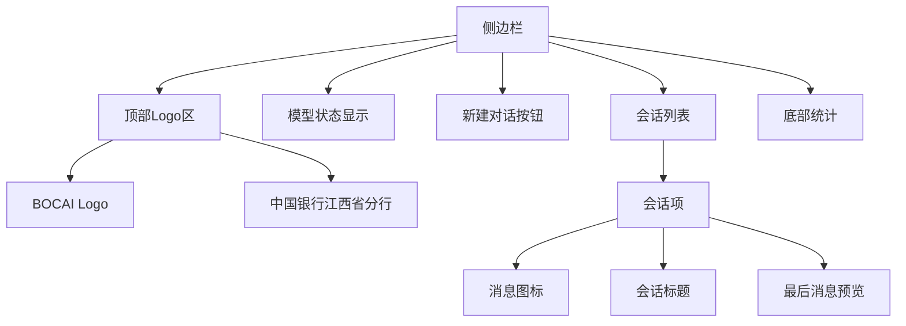
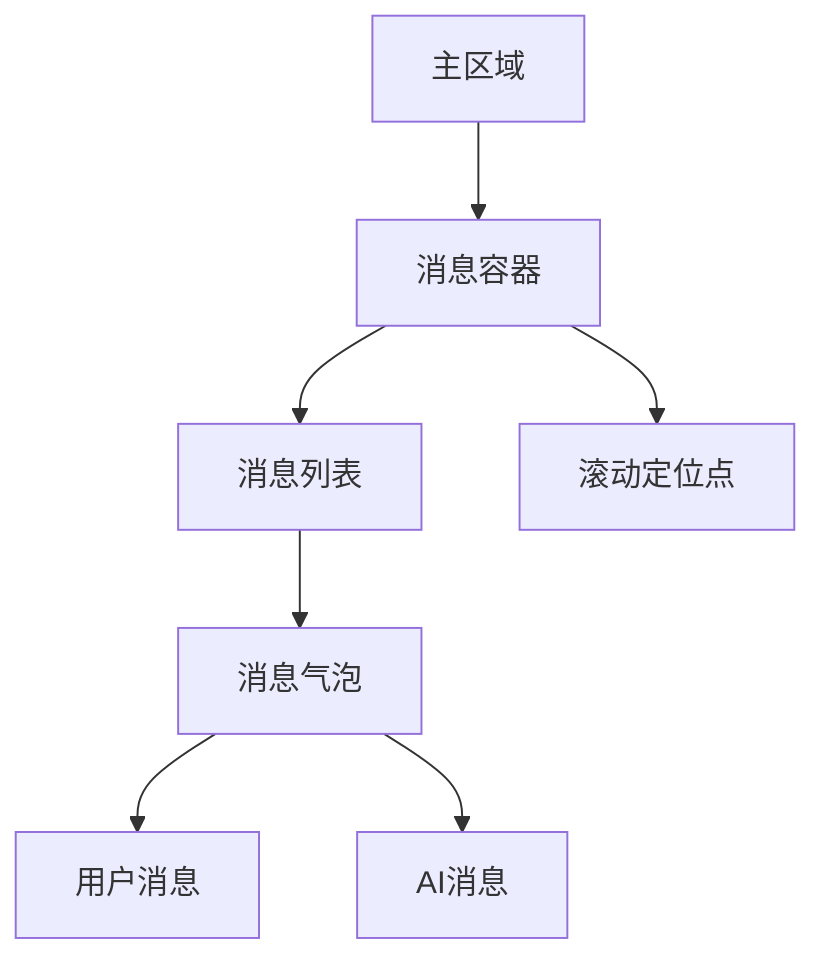
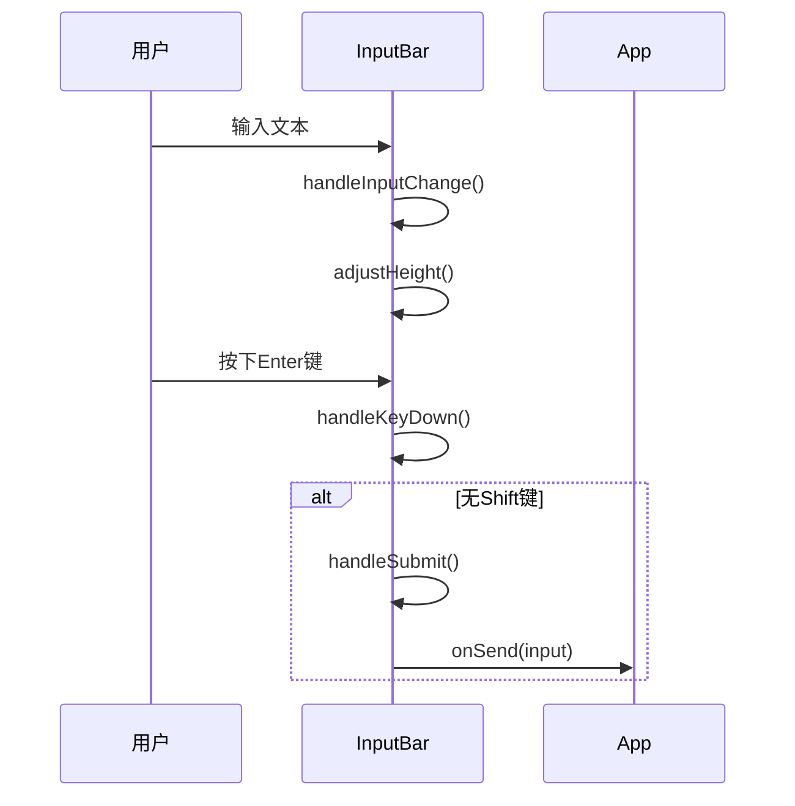
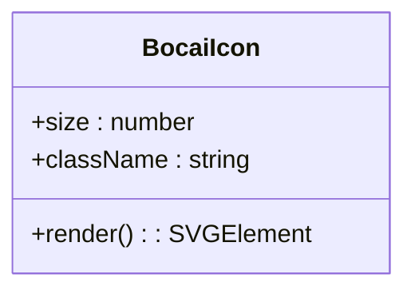
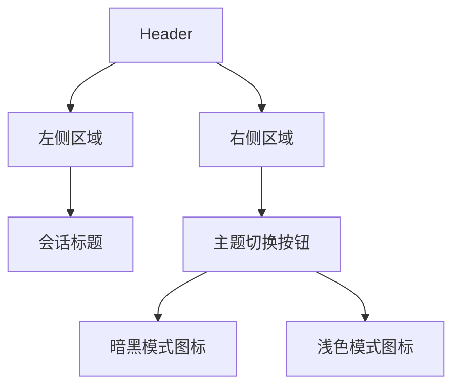
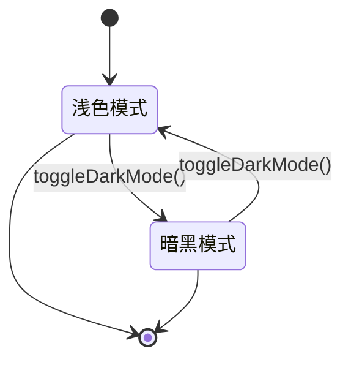
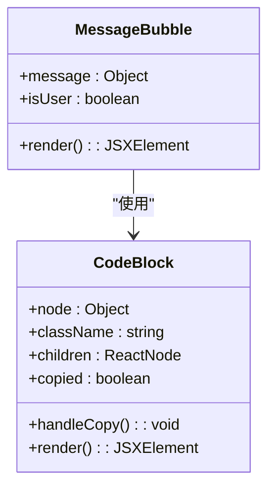

# UI设计规范

<cite>
**本文档中引用的文件**   
- [ui_design.md](file://ui_design.md)
- [Header.jsx](file://frontend/src/components/Header.jsx)
- [Sidebar.jsx](file://frontend/src/components/Sidebar.jsx)
- [ChatBox.jsx](file://frontend/src/components/ChatBox.jsx)
- [InputBar.jsx](file://frontend/src/components/InputBar.jsx)
- [MessageBubble.jsx](file://frontend/src/components/MessageBubble.jsx)
- [BocaiIcon.jsx](file://frontend/src/components/BocaiIcon.jsx)
- [useTheme.js](file://frontend/src/hooks/useTheme.js)
- [tailwind.config.js](file://frontend/tailwind.config.js)
- [App.jsx](file://frontend/src/App.jsx)
</cite>

## 目录
1. [整体布局](#整体布局)
2. [视觉元素设计](#视觉元素设计)
3. [主题设计](#主题设计)
4. [消息气泡规范](#消息气泡规范)
5. [可访问性要求](#可访问性要求)

## 整体布局

本项目采用三栏式布局结构，包含左侧侧边栏、主聊天区域和底部输入区域，整体布局响应式设计，适配不同屏幕尺寸。

### 侧边栏 (Sidebar)
侧边栏位于页面左侧，用于管理会话列表，其宽度根据折叠状态动态调整：
- **展开状态**: 宽度为 `w-72` (18rem)，显示完整的会话列表、标题和操作按钮
- **折叠状态**: 宽度为 `w-16` (4rem)，仅显示图标和最小化功能

侧边栏使用 `flex-shrink-0` 防止在容器缩小时被压缩，并通过 `transition-all duration-300 ease-in-out` 实现平滑的展开/折叠动画。

**Diagram sources**
- [Sidebar.jsx](file://frontend/src/components/Sidebar.jsx)

**Section sources**
- [Sidebar.jsx](file://frontend/src/components/Sidebar.jsx)

### 主区域 (ChatBox)
主区域占据页面剩余空间，采用 `flex-1` 布局实现自适应填充，包含：
- **消息容器**: 使用 `overflow-y-auto` 实现垂直滚动
- **内容宽度限制**: 通过 `max-w-5xl mx-auto` 将内容居中并限制最大宽度
- **消息间距**: 使用 `space-y-6` 设置消息间的垂直间距

消息容器在渲染新消息时会自动滚动到底部，通过 `useEffect` 监听 `messages` 变化并调用 `scrollIntoView` 实现平滑滚动。

**Diagram sources**
- [ChatBox.jsx](file://frontend/src/components/ChatBox.jsx)

**Section sources**
- [ChatBox.jsx](file://frontend/src/components/ChatBox.jsx)

### 底部输入栏 (InputBar)
输入栏固定在页面底部，包含多行文本输入框和发送按钮：
- **输入框**: 使用 `textarea` 实现多行输入，支持自动高度调整
- **最大高度**: 限制为 200px，防止输入过多内容时占据过多空间
- **发送按钮**: 位于输入框右侧，使用蓝色渐变背景

输入框通过 `ref` 引用实现高度动态调整，当输入内容增加时自动扩展高度，但不超过最大限制。

**Diagram sources**
- [InputBar.jsx](file://frontend/src/components/InputBar.jsx)

**Section sources**
- [InputBar.jsx](file://frontend/src/components/InputBar.jsx)

## 视觉元素设计

### BocaiIcon品牌标识
BocaiIcon组件采用SVG实现品牌标识，包含以下设计元素：
- **外圈**: 圆形轮廓，代表银行的稳定性和可靠性
- **内部B字母**: 代表"Bank"和"BOCAI"，是品牌的核心标识
- **装饰性元素**: 两个小圆点，分别代表智能和创新

图标使用 `currentColor` 作为颜色，使其能够继承父元素的文本颜色，便于在不同背景下使用。

**Diagram sources**
- [BocaiIcon.jsx](file://frontend/src/components/BocaiIcon.jsx)

**Section sources**
- [BocaiIcon.jsx](file://frontend/src/components/BocaiIcon.jsx)

### 头部组件 (Header)
头部组件位于页面顶部，包含会话标题和主题切换按钮：
- **布局**: 使用 `flex justify-between` 实现左右布局
- **标题**: 显示当前会话名称，若无标题则显示"新对话"
- **主题切换**: 右侧按钮用于切换浅色/暗黑模式

主题切换按钮使用 `lucide-react` 图标库中的 `Moon` 和 `Sun` 图标，通过 `darkMode` 状态决定显示哪个图标。

**Diagram sources**
- [Header.jsx](file://frontend/src/components/Header.jsx)

**Section sources**
- [Header.jsx](file://frontend/src/components/Header.jsx)

### 连接状态组件 (ConnectionStatus)
连接状态组件显示WebSocket连接状态，包含：
- **连接状态指示**: 通过颜色和文本显示连接状态
- **重连功能**: 提供手动重连按钮
- **加载状态**: 显示连接中的加载动画

该组件与WebSocket连接状态联动，实时反映连接质量。

## 主题设计

### 主题管理机制
项目采用基于CSS类的暗黑模式切换机制，通过 `useTheme` Hook 管理主题状态：
- **初始化**: 检查本地存储和系统偏好设置来确定初始主题
- **切换**: 切换时在 `document.documentElement` 上添加或移除 `dark` 类
- **持久化**: 将用户偏好保存到 `localStorage`

**Diagram sources**
- [useTheme.js](file://frontend/src/hooks/useTheme.js)

**Section sources**
- [useTheme.js](file://frontend/src/hooks/useTheme.js)

### 颜色变量定义
项目使用Tailwind CSS的暗黑模式支持，通过 `dark:` 前缀定义暗黑模式下的样式：
- **启用模式**: 在 `tailwind.config.js` 中设置 `darkMode: 'class'`
- **颜色映射**: 每个浅色模式颜色都有对应的暗黑模式版本

| 元素 | 浅色模式 | 暗黑模式 |
|------|----------|----------|
| 背景 | `bg-white` | `dark:bg-gray-900` |
| 文字 | `text-gray-900` | `dark:text-white` |
| 边框 | `border-gray-200` | `dark:border-gray-700` |
| 悬停背景 | `hover:bg-gray-100` | `dark:hover:bg-gray-800` |

**Section sources**
- [tailwind.config.js](file://frontend/tailwind.config.js)
- [ui_design.md](file://ui_design.md)

## 消息气泡规范

### 视觉样式
消息气泡根据发送者不同采用不同的视觉样式：
- **用户消息**: 右对齐，蓝色渐变背景，白色文字
- **AI消息**: 左对齐，半透明白色/深色背景，深色/浅色文字

气泡使用 `rounded-3xl` 实现圆角效果，并通过 `backdrop-blur-sm` 添加毛玻璃效果。

**Diagram sources**
- [MessageBubble.jsx](file://frontend/src/components/MessageBubble.jsx)

**Section sources**
- [MessageBubble.jsx](file://frontend/src/components/MessageBubble.jsx)

### Markdown渲染
消息内容支持完整的Markdown渲染，通过 `react-markdown` 和 `remark-gfm` 实现：
- **代码块**: 使用 `react-syntax-highlighter` 实现语法高亮
- **内联代码**: 使用浅色背景突出显示
- **标题**: 添加适当的字号和间距
- **列表**: 添加项目符号和缩进

代码块组件包含复制功能，用户点击"复制"按钮可将代码复制到剪贴板，并显示"已复制"状态2秒。

### 组件间距标准
- **消息间距**: `mb-6` (1.5rem)
- **气泡内边距**: `px-6 py-4` (水平1.5rem，垂直1rem)
- **代码块边距**: `my-4` (1rem)
- **代码块内边距**: `px-4 py-3` (水平1rem，垂直0.75rem)

### 动画效果
- **悬停效果**: 消息气泡在悬停时显示更明显的阴影 (`hover:shadow-lg`)
- **虹化边缘**: 悬停时显示渐变边缘效果，增加视觉层次
- **复制状态**: 复制按钮点击后显示"已复制!"文本2秒

## 可访问性要求

### 键盘导航
- **输入框**: 支持Tab键导航到输入框
- **发送按钮**: 可通过Tab键聚焦，并支持Enter键激活
- **会话列表**: 支持键盘导航选择不同会话
- **主题切换**: 支持键盘操作切换主题

### 屏幕阅读器兼容性
- **ARIA标签**: 所有交互元素都包含适当的 `aria-label`
- **语义化HTML**: 使用正确的HTML元素（如 `header`, `main` 等）
- **焦点管理**: 确保焦点顺序合理，用户能通过键盘完成所有操作
- **状态通知**: 重要的状态变化（如复制成功）会通过ARIA属性通知屏幕阅读器

### 其他可访问性特性
- **对比度**: 确保文字与背景有足够的对比度，满足WCAG标准
- **字体大小**: 使用相对单位，允许用户调整浏览器字体大小
- **动画偏好**: 尊重用户的 `prefers-reduced-motion` 系统设置

**Section sources**
- [App.jsx](file://frontend/src/App.jsx)
- [Header.jsx](file://frontend/src/components/Header.jsx)
- [InputBar.jsx](file://frontend/src/components/InputBar.jsx)