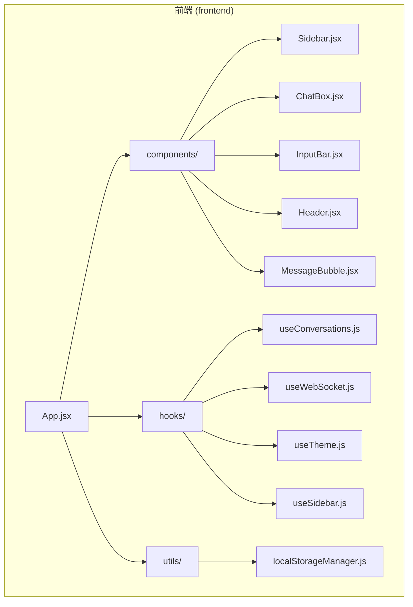
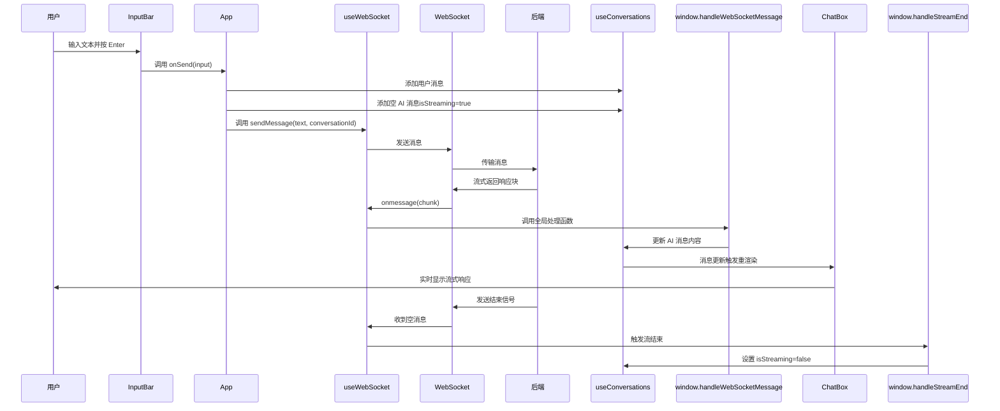
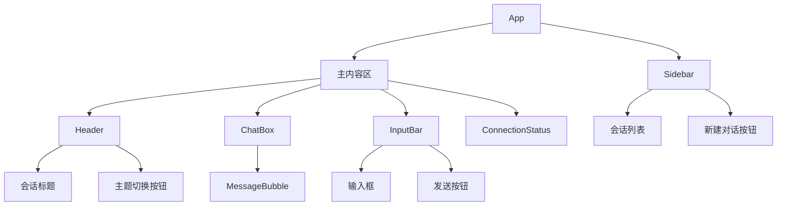

# 前端架构

<cite>
**本文档引用的文件**  
- [App.jsx](file://frontend/src/App.jsx)
- [useConversations.js](file://frontend/src/hooks/useConversations.js)
- [useWebSocket.js](file://frontend/src/hooks/useWebSocket.js)
- [useTheme.js](file://frontend/src/hooks/useTheme.js)
- [useSidebar.js](file://frontend/src/hooks/useSidebar.js)
- [ChatBox.jsx](file://frontend/src/components/ChatBox.jsx)
- [MessageBubble.jsx](file://frontend/src/components/MessageBubble.jsx)
- [InputBar.jsx](file://frontend/src/components/InputBar.jsx)
- [Sidebar.jsx](file://frontend/src/components/Sidebar.jsx)
- [Header.jsx](file://frontend/src/components/Header.jsx)
- [localStorageManager.js](file://frontend/src/utils/localStorageManager.js)
</cite>

## 目录
1. [项目结构](#项目结构)  
2. [核心组件分析](#核心组件分析)  
3. [状态管理策略](#状态管理策略)  
4. [数据流与交互流程](#数据流与交互流程)  
5. [组件层次结构与UI布局](#组件层次结构与ui布局)  
6. [响应式设计与主题系统](#响应式设计与主题系统)  
7. [性能优化建议](#性能优化建议)

## 项目结构

`chat-mvp` 项目的前端部分采用标准的 React + Vite 架构，结合 Tailwind CSS 实现现代化 UI 样式。整体结构清晰，遵循功能模块化组织原则。



**图示来源**  
- [App.jsx](file://frontend/src/App.jsx)
- [project_structure](file://README.md)

## 核心组件分析

### App.jsx：根组件与组件集成

`App.jsx` 是整个应用的根组件，负责协调所有子组件和自定义 Hook 的集成。它通过组合模式将 UI 拆分为独立、可复用的部分。

**主要职责**：
- 初始化所有自定义 Hook（主题、会话、WebSocket、侧边栏）
- 组织主界面布局（侧边栏 + 主内容区）
- 管理全局状态并向下传递 props
- 处理消息发送逻辑与 WebSocket 消息回调绑定

```jsx
const App = () => {
  const { darkMode, toggleDarkMode } = useTheme();
  const { conversations, currentConversation, handleNewConversation, ... } = useConversations();
  const { isConnecting, sendMessage, setMessageHandlers } = useWebSocket();

  // 设置 WebSocket 消息处理函数
  useEffect(() => {
    const handleWebSocketMessage = (chunk, activeConversationId) => {
      updateConversationMessages(activeConversationId, (conv) => { ... });
    };
    setMessageHandlers(handleWebSocketMessage, handleStreamEnd);
  }, [updateConversationMessages]);

  return (
    <div className="flex h-screen bg-white dark:bg-gray-900">
      <Sidebar conversations={conversations} onSelectConversation={handleSelectConversation} />
      <div className="flex flex-col flex-1">
        <Header darkMode={darkMode} onToggleDarkMode={toggleDarkMode} />
        <main>
          <ChatBox messages={currentConversation.messages} />
          <InputBar onSend={handleSendMessage} disabled={isConnecting} />
        </main>
      </div>
    </div>
  );
};
```

**组件间通信机制**：
- **props 传递**：父组件向子组件传递数据和回调函数
- **事件回调**：子组件通过 `onSend`、`onSelectConversation` 等回调通知父组件
- **ref 传递**：`messagesEndRef` 用于滚动到底部

**本节来源**  
- [App.jsx](file://frontend/src/App.jsx#L1-L172)

### ChatBox.jsx 与 MessageBubble.jsx：消息渲染系统

`ChatBox` 负责渲染消息列表，并在消息更新时自动滚动到底部。

```mermaid
flowchart TD
A[ChatBox] --> B[监听 messages 变化]
B --> C{是否需要滚动?}
C --> |是| D[scrollToBottom()]
C --> |否| E[保持当前位置]
D --> F[使用 ref 定位到 messagesEndRef]
```

`MessageBubble` 是消息气泡组件，支持 Markdown 渲染、代码高亮和复制功能。

**关键特性**：
- 使用 `ReactMarkdown` 和 `remarkGfm` 解析 Markdown 语法
- 支持代码块高亮（`react-syntax-highlighter`）
- 提供“复制代码”按钮，点击后显示“已复制”状态
- 用户消息右对齐，AI 消息左对齐
- 虹彩背景与悬停动效增强视觉体验

**本节来源**  
- [ChatBox.jsx](file://frontend/src/components/ChatBox.jsx#L1-L30)
- [MessageBubble.jsx](file://frontend/src/components/MessageBubble.jsx#L1-L94)

### InputBar.jsx：输入处理组件

`InputBar` 是用户输入区域，包含一个可自动调整高度的 `textarea` 和发送按钮。

**功能细节**：
- Enter 键发送消息，Shift+Enter 换行
- 输入框高度随内容动态调整（最大 200px）
- 禁用状态下防止发送
- 提交后清空输入框并重置高度

```jsx
const handleKeyDown = (e) => {
  if (e.key === 'Enter' && !e.shiftKey) {
    e.preventDefault();
    handleSubmit(e);
  }
};
```

**本节来源**  
- [InputBar.jsx](file://frontend/src/components/InputBar.jsx#L1-L87)

### Sidebar.jsx：会话管理面板

`Sidebar` 显示会话列表，支持新建、选择和折叠功能。

**交互逻辑**：
- 点击会话项切换当前会话
- 点击“新建对话”创建新会话
- 折叠/展开侧边栏以节省空间
- 当前选中的会话有高亮样式

**响应式设计**：
- 展开状态：宽度 288px，显示完整信息
- 折叠状态：宽度 64px，仅显示图标

**本节来源**  
- [Sidebar.jsx](file://frontend/src/components/Sidebar.jsx#L1-L147)

### Header.jsx：顶部导航栏

`Header` 显示当前会话标题和主题切换按钮。

**功能**：
- 动态显示 `currentConversationTitle`
- 点击图标切换暗黑/浅色模式
- 使用 `Sun`/`Moon` 图标表示当前主题状态

**本节来源**  
- [Header.jsx](file://frontend/src/components/Header.jsx#L1-L31)

## 状态管理策略

### useConversations.js：会话状态管理

该 Hook 管理多会话的生命周期，包括创建、切换、更新和持久化。

**核心功能**：
- `handleNewConversation()`：创建新会话并设为当前会话
- `handleSelectConversation(id)`：切换当前会话
- `updateConversationMessages(id, updater)`：使用函数式更新修改消息
- `updateConversationTitle()`：根据首条用户消息自动生成标题

**持久化机制**：
- 使用 `localStorage` 存储会话数据
- 初始加载时尝试从 `localStorage` 恢复
- 每次会话变化后自动保存

```js
useEffect(() => {
  localStorage.setItem('chatConversations', JSON.stringify(conversations));
}, [conversations]);
```

**本节来源**  
- [useConversations.js](file://frontend/src/hooks/useConversations.js#L1-L119)

### useWebSocket.js：WebSocket 连接管理

封装 WebSocket 连接、消息收发、自动重连等复杂逻辑。

**关键特性**：
- 自动连接与断线重连（每 2 秒检测）
- 页面可见性变化时重新连接
- 使用 `ref` 跟踪当前活跃会话 ID
- 支持流式响应（`isStreaming`）

**连接状态管理**：
```js
const getConnectionStatus = () => {
  switch (websocketRef.current?.readyState) {
    case WebSocket.CONNECTING: return 'connecting';
    case WebSocket.OPEN: return 'connected';
    case WebSocket.CLOSED: return 'disconnected';
    default: return 'unknown';
  }
};
```

**消息处理机制**：
- 通过 `setMessageHandlers()` 注册外部处理函数
- 使用 `window.handleWebSocketMessage` 全局函数桥接
- 收到空消息时表示流式响应结束

**本节来源**  
- [useWebSocket.js](file://frontend/src/hooks/useWebSocket.js#L1-L193)

### useTheme.js：主题切换管理

实现暗黑/浅色主题的动态切换。

**实现逻辑**：
- 初始从 `localStorage` 或系统偏好读取主题
- 切换时修改 `document.documentElement.classList`
- 保存用户选择到 `localStorage`

```js
useEffect(() => {
  if (darkMode) {
    document.documentElement.classList.add('dark');
  } else {
    document.documentElement.classList.remove('dark');
  }
  localStorage.setItem('darkMode', darkMode);
}, [darkMode]);
```

**本节来源**  
- [useTheme.js](file://frontend/src/hooks/useTheme.js#L1-L41)

### useSidebar.js：侧边栏状态管理

管理侧边栏的折叠/展开状态。

```js
const [isSidebarCollapsed, setIsSidebarCollapsed] = useState(false);
```

提供 `toggleSidebarCollapse`、`expandSidebar`、`collapseSidebar` 三个操作函数。

**本节来源**  
- [useSidebar.js](file://frontend/src/hooks/useSidebar.js#L1-L33)

## 数据流与交互流程

### 用户发送消息的完整流程



**本节来源**  
- [App.jsx](file://frontend/src/App.jsx#L100-L150)
- [useWebSocket.js](file://frontend/src/hooks/useWebSocket.js#L100-L150)
- [useConversations.js](file://frontend/src/hooks/useConversations.js#L70-L90)

## 组件层次结构与UI布局



**布局特点**：
- 使用 Flexbox 实现自适应布局
- 主内容区 `flex-1` 占满剩余空间
- `backdrop-blur-sm` 实现毛玻璃效果
- `dark:` 前缀类实现暗黑模式

**本节来源**  
- [App.jsx](file://frontend/src/App.jsx#L50-L170)

## 响应式设计与主题系统

### Tailwind CSS 实现响应式

- 使用 `h-screen`、`flex-1` 实现全屏自适应
- `max-w-5xl mx-auto` 限制最大宽度并居中
- `overflow-y-auto` 确保内容可滚动
- `resize-none` 和动态高度实现智能输入框

### 主题系统实现

- 基于 `dark:` 类前缀的条件样式
- `useTheme` Hook 统一管理主题状态
- `localStorage` 持久化用户偏好
- 支持系统级暗黑模式自动适配

```js
const isDark = localStorage.getItem('darkMode') === 'true' ||
  (window.matchMedia('(prefers-color-scheme: dark)').matches && 
   localStorage.getItem('darkMode') !== 'false');
```

**本节来源**  
- [useTheme.js](file://frontend/src/hooks/useTheme.js#L8-L12)
- [tailwind.config.js](file://frontend/tailwind.config.js)

## 性能优化建议

### 避免不必要的重新渲染

1. **使用 `useCallback` 包装回调函数**：
   ```js
   const handleSendMessage = useCallback((text) => {
     // ...
   }, [currentConversationId, sendMessage]);
   ```

2. **优化 `useEffect` 依赖数组**：确保只监听必要状态

3. **组件拆分**：将 `Header`、`Sidebar` 等独立组件拆分为 `React.memo`

### 优化 localStorage 操作

- 避免频繁写入：使用防抖（debounce）批量保存
- 错误处理：`try-catch` 包裹 `JSON.parse` 和 `setItem`

### WebSocket 连接优化

- 增加重连退避策略（指数退避）
- 限制最大重连次数
- 添加连接状态指示器

### 内存管理

- 在 `useEffect` 清理函数中关闭 WebSocket 连接
- 清理定时器和事件监听器

```js
return () => {
  clearInterval(connectionChecker);
  document.removeEventListener('visibilitychange', handleVisibilityChange);
  if (websocketRef.current) {
    websocketRef.current.close();
  }
};
```

**本节来源**  
- [useWebSocket.js](file://frontend/src/hooks/useWebSocket.js#L170-L190)
- [useConversations.js](file://frontend/src/hooks/useConversations.js#L20-L30)