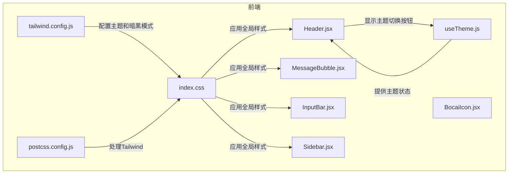
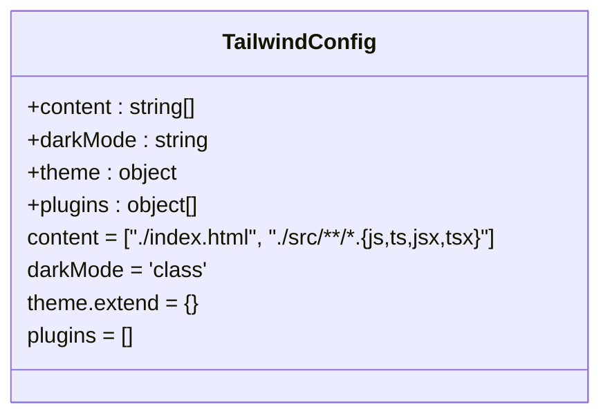
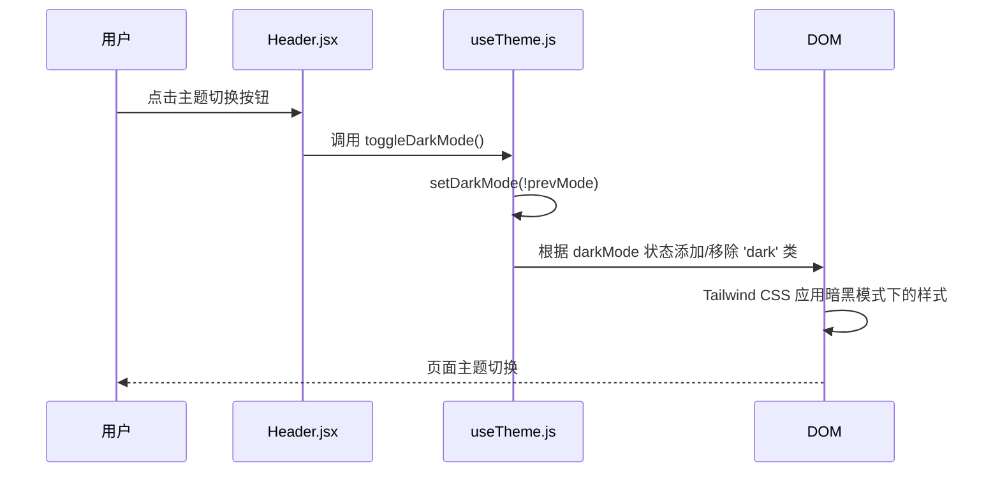
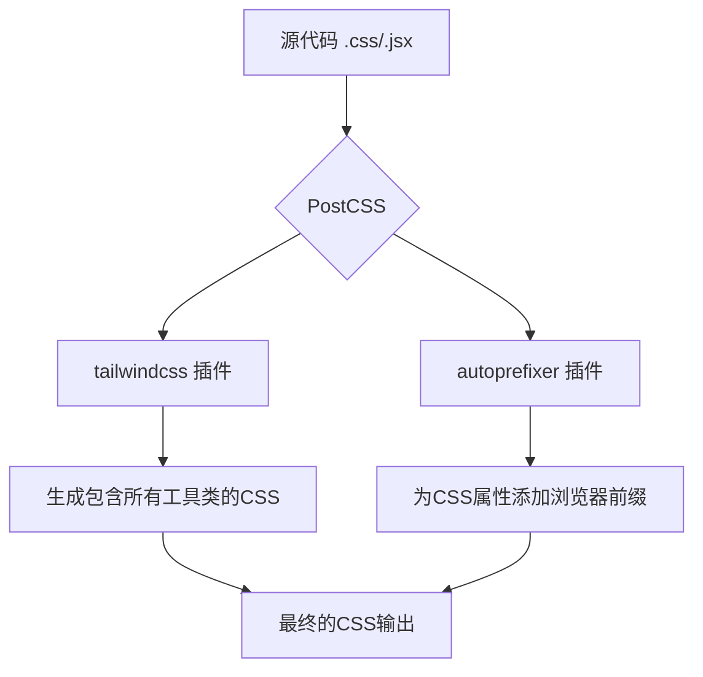
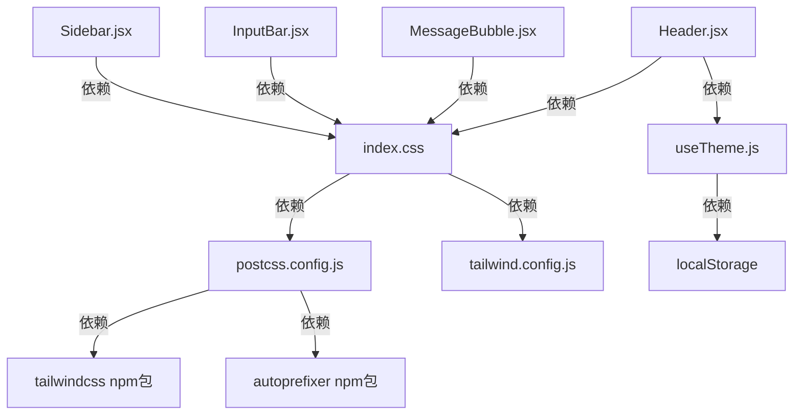

# 前端样式策略

<cite>
**本文档中引用的文件**   
- [tailwind.config.js](file://frontend/tailwind.config.js)
- [postcss.config.js](file://frontend/postcss.config.js)
- [index.css](file://frontend/src/index.css)
- [useTheme.js](file://frontend/src/hooks/useTheme.js)
- [Header.jsx](file://frontend/src/components/Header.jsx)
- [MessageBubble.jsx](file://frontend/src/components/MessageBubble.jsx)
- [InputBar.jsx](file://frontend/src/components/InputBar.jsx)
- [Sidebar.jsx](file://frontend/src/components/Sidebar.jsx)
- [BocaiIcon.jsx](file://frontend/src/components/BocaiIcon.jsx)
- [ui_design.md](file://ui_design.md)
</cite>

## 目录
1. [项目结构](#项目结构)
2. [核心组件](#核心组件)
3. [架构概述](#架构概述)
4. [详细组件分析](#详细组件分析)
5. [依赖分析](#依赖分析)
6. [性能考虑](#性能考虑)
7. [故障排除指南](#故障排除指南)
8. [结论](#结论)

## 项目结构

前端样式架构基于 **Tailwind CSS** 框架构建，采用原子化CSS方法论，通过配置文件和全局样式文件实现统一的设计系统。项目结构清晰，样式相关的配置和实现分散在特定文件中。



**图示来源**
- [tailwind.config.js](file://frontend/tailwind.config.js)
- [postcss.config.js](file://frontend/postcss.config.js)
- [index.css](file://frontend/src/index.css)
- [useTheme.js](file://frontend/src/hooks/useTheme.js)

**本节来源**
- [tailwind.config.js](file://frontend/tailwind.config.js)
- [postcss.config.js](file://frontend/postcss.config.js)
- [index.css](file://frontend/src/index.css)

## 核心组件

本项目的核心样式组件围绕 **Tailwind CSS** 的集成与应用展开。`tailwind.config.js` 定义了框架的核心配置，`postcss.config.js` 确保了PostCSS流程的正确执行，`index.css` 则作为全局样式的入口点，集成了Tailwind的基类、组件类和工具类，并添加了项目特定的自定义样式。`useTheme.js` 是一个自定义Hook，它管理着应用的暗黑模式状态，实现了用户偏好存储和主题切换逻辑。

**本节来源**
- [tailwind.config.js](file://frontend/tailwind.config.js#L0-L11)
- [postcss.config.js](file://frontend/postcss.config.js#L0-L5)
- [index.css](file://frontend/src/index.css#L0-L27)
- [useTheme.js](file://frontend/src/hooks/useTheme.js#L0-L40)

## 架构概述

项目的前端样式架构遵循现代CSS最佳实践，采用 **配置驱动** 的方式。Tailwind CSS作为核心样式引擎，其行为由 `tailwind.config.js` 文件精确控制。PostCSS作为构建流程的一部分，通过 `postcss.config.js` 加载Tailwind插件，将开发时的原子化类名编译成最终的CSS。全局样式在 `index.css` 中定义，它不仅引入了Tailwind的三个层级（base, components, utilities），还通过 `@apply` 指令和自定义规则扩展了框架的功能。组件的样式完全通过在JSX的 `className` 属性中组合Tailwind类名来实现，确保了样式的可维护性和一致性。

```mermaid
graph TD
A[Tailwind CSS] --> B[tailwind.config.js]
A --> C[postcss.config.js]
C --> D[PostCSS]
D --> E[index.css]
E --> F[编译后的CSS]
F --> G[浏览器渲染]
B --> |darkMode: 'class'| E
B --> |content: 扫描路径| E
E --> |@tailwind base| F
E --> |@tailwind components| F
E --> |@tailwind utilities| F
E --> |@apply| F
```

**图示来源**
- [tailwind.config.js](file://frontend/tailwind.config.js#L0-L11)
- [postcss.config.js](file://frontend/postcss.config.js#L0-L5)
- [index.css](file://frontend/src/index.css#L0-L27)

## 详细组件分析

### Tailwind 配置分析

`tailwind.config.js` 文件是整个样式系统的配置中心。它定义了Tailwind扫描哪些文件以生成最终的CSS（`content` 字段），并配置了暗黑模式的切换机制。



**图示来源**
- [tailwind.config.js](file://frontend/tailwind.config.js#L0-L11)

#### 主题与暗黑模式配置

`tailwind.config.js` 中的 `darkMode` 选项被设置为 `'class'`，这意味着暗黑模式的激活依赖于在HTML根元素（`<html>`）上添加或移除 `dark` 类。这与 `useTheme.js` Hook 的实现完美配合。



**图示来源**
- [tailwind.config.js](file://frontend/tailwind.config.js#L5-L6)
- [useTheme.js](file://frontend/src/hooks/useTheme.js#L20-L30)
- [Header.jsx](file://frontend/src/components/Header.jsx#L18-L22)

**本节来源**
- [tailwind.config.js](file://frontend/tailwind.config.js#L5-L6)
- [useTheme.js](file://frontend/src/hooks/useTheme.js#L0-L40)

#### PostCSS 配置分析

`postcss.config.js` 文件配置了PostCSS在构建过程中需要使用的插件。它明确指定了 `tailwindcss` 和 `autoprefixer` 插件，确保了Tailwind的CSS被正确生成，并且生成的CSS具有必要的浏览器前缀。



**图示来源**
- [postcss.config.js](file://frontend/postcss.config.js#L0-L5)

**本节来源**
- [postcss.config.js](file://frontend/postcss.config.js#L0-L5)

#### 全局样式与自定义类分析

`index.css` 文件是全局样式的入口。它通过三行 `@tailwind` 指令引入了Tailwind的全部功能。在此基础上，项目定义了自定义的全局样式。

```mermaid
flowchart TD
A[index.css] --> B[@tailwind base]
A --> C[@tailwind components]
A --> D[@tailwind utilities]
A --> E[自定义 body 样式]
A --> F[自定义滚动条样式]
E --> G[@apply bg-gray-100 text-gray-900 dark:bg-slate-900 dark:text-gray-100]
E --> H[设置字体族]
E --> I[设置 overflow: hidden]
F --> J[定义 ::-webkit-scrollbar 外观]
F --> K[使用 @apply 设置滚动条颜色]
```

**图示来源**
- [index.css](file://frontend/src/index.css#L0-L27)

**本节来源**
- [index.css](file://frontend/src/index.css#L0-L27)

### 组件样式实现分析

#### 响应式布局与间距控制

项目中的组件广泛使用了Tailwind的响应式和间距工具类。例如，在 `MessageBubble.jsx` 中，通过 `flex mb-6` 实现了消息气泡的弹性布局和底部间距；通过 `max-w-[70%]` 限制用户消息的最大宽度，确保在小屏幕上不会溢出。

```jsx
// MessageBubble.jsx 中的示例
<div className={`flex mb-6 ${isUser ? 'justify-end' : 'justify-start'}`}>
  <div className={`group relative ${isUser ? 'ml-8 max-w-[70%]' : 'mr-8 max-w-full w-full'}`}>
    {/* ... */}
  </div>
</div>
```

在 `InputBar.jsx` 中，`px-6 py-3` 和 `p-4` 分别设置了内边距，`gap-3` 设置了子元素间的间距，这些都是Tailwind间距系统（spacing scale）的直接应用。

**本节来源**
- [MessageBubble.jsx](file://frontend/src/components/MessageBubble.jsx#L53-L55)
- [InputBar.jsx](file://frontend/src/components/InputBar.jsx#L48-L50)

#### 颜色主题与圆角大小

颜色主题通过 `@apply` 指令和 `dark:` 变体在 `index.css` 和组件中实现。`ui_design.md` 文件定义了中国银行的品牌色，如顶部导航栏的蓝紫渐变 `#6366f1` 到 `#8b5cf6`，以及用户消息气泡的蓝色渐变 `#3b82f6` 到 `#60a5fa`。

圆角大小在项目中保持一致，主要使用了 `rounded-3xl` 类。这个类在 `MessageBubble.jsx` 的消息气泡、`InputBar.jsx` 的输入框容器以及 `Sidebar.jsx` 的Logo区域都有应用，体现了设计系统的一致性。

```jsx
// MessageBubble.jsx 中的圆角应用
<div className="relative w-full rounded-3xl px-6 py-4 ...">
// InputBar.jsx 中的圆角应用
<div className="flex items-end ... rounded-3xl ... p-4 ...">
// Sidebar.jsx 中的圆角应用
<div className="w-10 h-10 ... rounded-xl ...">
```

**本节来源**
- [index.css](file://frontend/src/index.css#L5-L6)
- [MessageBubble.jsx](file://frontend/src/components/MessageBubble.jsx#L62-L63)
- [InputBar.jsx](file://frontend/src/components/InputBar.jsx#L50-L51)
- [Sidebar.jsx](file://frontend/src/components/Sidebar.jsx#L14-L15)
- [ui_design.md](file://ui_design.md#L50-L52)

#### 阴影样式与动画效果

阴影样式通过 `shadow-sm` 和 `hover:shadow-lg` 类实现，为组件提供了层次感。例如，消息气泡在默认状态下有轻微阴影，在悬停时阴影会变大，增强了交互反馈。

动画效果主要通过 `transition-all duration-200` 和 `hover:` 变体来实现。`MessageBubble.jsx` 中的虹化边缘效果就是一个典型例子：一个绝对定位的渐变层，默认 `opacity-0`，在 `group-hover` 时变为 `opacity-100`，配合 `transition-all duration-300` 实现平滑的淡入淡出动画。

```jsx
// MessageBubble.jsx 中的动画实现
<div className="absolute ... opacity-0 group-hover:opacity-100 transition-all duration-300 ..."></div>
```

**本节来源**
- [MessageBubble.jsx](file://frontend/src/components/MessageBubble.jsx#L58-L63)
- [InputBar.jsx](file://frontend/src/components/InputBar.jsx#L50-L51)

### 设计系统规范

项目遵循了一套明确的设计系统规范，确保了UI的一致性：

- **字体层级**: 全局字体族在 `index.css` 中定义，使用了系统默认的无衬线字体栈。组件中通过 `text-sm`, `text-base`, `text-xl`, `text-2xl` 等类控制字体大小。
- **间距系统**: 严格使用Tailwind的间距缩放（如 `p-4`, `m-6`, `gap-3`），避免了魔法数字。
- **圆角大小**: 主要使用 `rounded-3xl` 和 `rounded-xl`，保持了圆角风格的统一。
- **阴影样式**: 使用 `shadow-sm` 和 `hover:shadow-lg` 的组合，为交互元素提供视觉反馈。

**本节来源**
- [index.css](file://frontend/src/index.css#L5-L6)
- [MessageBubble.jsx](file://frontend/src/components/MessageBubble.jsx)
- [InputBar.jsx](file://frontend/src/components/InputBar.jsx)
- [Sidebar.jsx](file://frontend/src/components/Sidebar.jsx)

### 样式开发指南

为开发者提供了以下最佳实践：

1.  **避免内联样式**: 所有样式都应通过 `className` 使用Tailwind类名或自定义CSS类。
2.  **合理组织类名顺序**: 建议按功能分组，例如先布局（`flex`, `justify-end`），再尺寸（`w-full`, `max-w-[70%]`），然后是间距（`p-4`, `m-6`），接着是视觉（`bg-`, `text-`, `rounded-`），最后是交互（`hover:`, `group-hover:`）。
3.  **使用 `@apply` 提取重复样式**: 对于在多个地方重复出现的复杂样式组合，可以在CSS文件中使用 `@apply` 创建自定义类，但应谨慎使用，避免过度抽象。
4.  **扩展Tailwind配置**: 当前 `tailwind.config.js` 的 `theme.extend` 为空，但它是扩展项目特定设计需求（如自定义颜色、间距）的入口。例如，可以在此处添加中国银行的品牌色。

```js
// tailwind.config.js 扩展示例 (当前未实现，但为未来提供指引)
theme: {
  extend: {
    colors: {
      'boc-blue': '#0066cc', // 中国银行标准蓝色
    },
    spacing: {
      'chat-gap': '2rem', // 自定义聊天组件间距
    }
  },
},
```

**本节来源**
- [tailwind.config.js](file://frontend/tailwind.config.js#L7-L9)

## 依赖分析

前端样式的依赖关系清晰且直接。`postcss.config.js` 依赖于 `tailwindcss` 和 `autoprefixer` 这两个npm包。`index.css` 依赖于 `tailwind.config.js` 的配置来生成正确的CSS，并依赖于 `postcss.config.js` 的插件流程。所有React组件都直接依赖于 `index.css` 提供的全局样式和Tailwind工具类。`useTheme.js` 作为状态管理的中心，被 `Header.jsx` 等组件所依赖，以实现主题切换功能。



**图示来源**
- [postcss.config.js](file://frontend/postcss.config.js#L0-L5)
- [tailwind.config.js](file://frontend/tailwind.config.js#L0-L11)
- [index.css](file://frontend/src/index.css#L0-L27)
- [Header.jsx](file://frontend/src/components/Header.jsx#L1-L4)
- [useTheme.js](file://frontend/src/hooks/useTheme.js#L1-L4)

**本节来源**
- [postcss.config.js](file://frontend/postcss.config.js#L0-L5)
- [tailwind.config.js](file://frontend/tailwind.config.js#L0-L11)
- [index.css](file://frontend/src/index.css#L0-L27)

## 性能考虑

该样式策略在性能方面表现良好：
- **原子化CSS**: Tailwind的原子化方法生成的CSS文件体积小，且高度可复用。
- **按需生成**: `content` 配置确保只生成项目中实际使用的类，避免了未使用CSS的膨胀。
- **高效的类名组合**: 在JSX中组合类名是运行时的轻量级操作。
- **硬件加速**: `backdrop-blur-sm` 和 `transition-all` 等属性可以利用GPU进行渲染，提升动画流畅度。

## 故障排除指南

- **样式未生效**: 检查 `tailwind.config.js` 中的 `content` 路径是否正确包含了所有JSX文件。
- **暗黑模式不切换**: 确认 `useTheme.js` 是否正确地将 `dark` 类添加到了 `document.documentElement`，并检查 `tailwind.config.js` 的 `darkMode` 是否为 `'class'`。
- **滚动条样式不显示**: 确认浏览器是否支持 `::-webkit-scrollbar`，此样式主要针对WebKit内核浏览器。
- **字体未正确加载**: 检查 `index.css` 中的 `font-family` 是否被正确应用，或网络字体是否加载失败。

**本节来源**
- [tailwind.config.js](file://frontend/tailwind.config.js#L3-L4)
- [useTheme.js](file://frontend/src/hooks/useTheme.js#L20-L30)
- [index.css](file://frontend/src/index.css#L5-L6)

## 结论

`chat-mvp` 前端的样式架构是一个现代化、可维护的典范。它通过 **Tailwind CSS** 实现了高效的UI开发，结合 `postcss.config.js` 和 `index.css` 完成了框架的集成与扩展。`useTheme.js` Hook 优雅地解决了暗黑模式的状态管理问题。整个项目遵循了设计系统规范，在颜色、间距、圆角和阴影上保持了一致性。为开发者提供了清晰的指南，推荐使用原子化类名、避免内联样式，并通过 `theme.extend` 来满足未来的定制化需求。该架构不仅提升了开发效率，也保证了最终产品的视觉质量和用户体验。