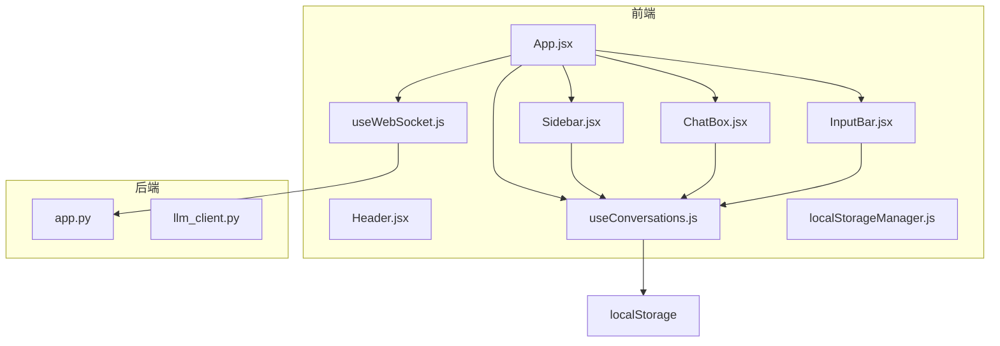
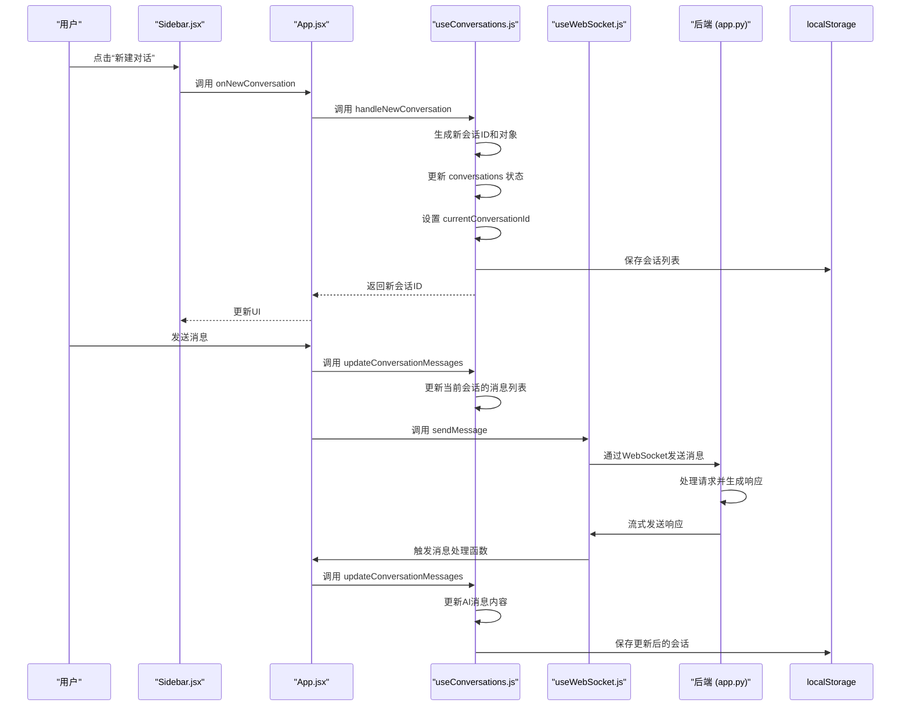
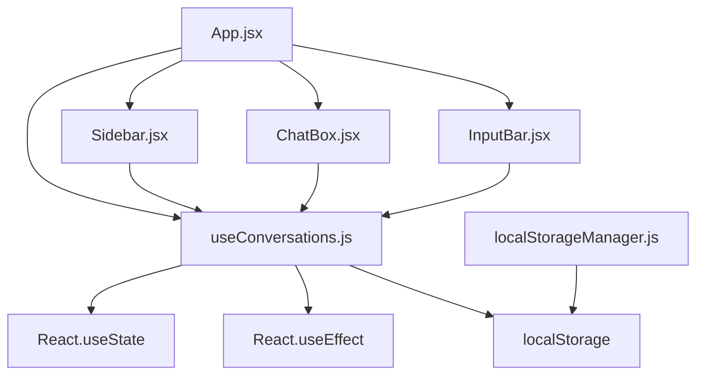

# useConversations Hook 详解

<cite>
**本文档引用的文件**   
- [useConversations.js](file://frontend/src/hooks/useConversations.js)
- [Sidebar.jsx](file://frontend/src/components/Sidebar.jsx)
- [App.jsx](file://frontend/src/App.jsx)
- [localStorageManager.js](file://frontend/src/utils/localStorageManager.js)
</cite>

## 目录
1. [简介](#简介)
2. [项目结构](#项目结构)
3. [核心组件](#核心组件)
4. [架构概览](#架构概览)
5. [详细组件分析](#详细组件分析)
6. [依赖分析](#依赖分析)
7. [性能考量](#性能考量)
8. [故障排除指南](#故障排除指南)
9. [结论](#结论)

## 简介
`useConversations` 是一个自定义 React Hook，用于管理聊天应用中的多会话状态。它负责会话的创建、切换、消息更新和持久化存储。该 Hook 使用 `useState` 和 `useEffect` 来维护响应式状态，并通过 `localStorage` 实现数据的本地持久化。尽管代码中存在一个名为 `localStorageManager.js` 的工具文件，但 `useConversations` 并未使用它，而是直接操作 `localStorage`。此外，当前实现支持新建和切换会话，但缺少删除会话的功能。

## 项目结构
该项目采用典型的前后端分离架构，前端使用 React 构建，后端使用 Python (Flask) 提供 API 服务。前端代码组织清晰，遵循功能模块化原则，将组件、Hook 和工具函数分别存放在 `components`、`hooks` 和 `utils` 目录中。`useConversations` Hook 位于 `frontend/src/hooks` 目录下，是管理聊天会话状态的核心模块。



**图示来源**
- [useConversations.js](file://frontend/src/hooks/useConversations.js)
- [App.jsx](file://frontend/src/App.jsx)
- [Sidebar.jsx](file://frontend/src/components/Sidebar.jsx)

**本节来源**
- [useConversations.js](file://frontend/src/hooks/useConversations.js)
- [App.jsx](file://frontend/src/App.jsx)

## 核心组件
`useConversations` Hook 是聊天应用状态管理的核心。它封装了所有与会话相关的逻辑，包括状态初始化、本地存储同步、会话创建、切换和消息更新。该 Hook 向外暴露了一系列函数和状态变量，供上层组件（如 `Sidebar` 和 `App`）调用，实现了关注点分离和逻辑复用。

**本节来源**
- [useConversations.js](file://frontend/src/hooks/useConversations.js)

## 架构概览
整个应用的架构围绕 WebSocket 通信和本地状态管理构建。前端通过 `useWebSocket` Hook 与后端建立长连接，处理实时消息流。`useConversations` Hook 则负责管理这些消息的本地存储和会话上下文。当用户发送消息时，`App` 组件调用 `useConversations` 提供的函数来更新当前会话，并通过 `useWebSocket` 发送消息。后端处理请求后，通过 WebSocket 将响应流式传输回前端，`useConversations` 再次被调用来更新消息内容。



**图示来源**
- [useConversations.js](file://frontend/src/hooks/useConversations.js)
- [App.jsx](file://frontend/src/App.jsx)
- [useWebSocket.js](file://frontend/src/hooks/useWebSocket.js)

## 详细组件分析
### useConversations Hook 分析
`useConversations` Hook 的实现遵循了 React 的最佳实践，利用 `useState` 管理会话列表和当前会话ID，并通过 `useEffect` 实现与 `localStorage` 的同步。

#### 状态初始化与持久化
Hook 在初始化时定义了两个状态：`conversations` 存储所有会话的数组，`currentConversationId` 存储当前激活会话的ID。它使用两个 `useEffect` 副作用来处理持久化：
1.  **加载持久化数据**：在组件挂载时，从 `localStorage` 中读取键为 `chatConversations` 的数据。如果存在，则解析 JSON 并更新 `conversations` 状态。
2.  **保存数据**：每当 `conversations` 状态发生变化时，立即将其序列化为 JSON 并写回 `localStorage`。

```javascript
// 从本地存储加载会话历史
useEffect(() => {
  const savedConversations = localStorage.getItem('chatConversations');
  if (savedConversations) {
    try {
      const parsedConversations = JSON.parse(savedConversations);
      setConversations(parsedConversations);
    } catch (e) {
      console.error("Failed to parse saved conversations", e);
    }
  }
}, []);

// 保存会话历史到本地存储
useEffect(() => {
  localStorage.setItem('chatConversations', JSON.stringify(conversations));
}, [conversations]);
```

**本节来源**
- [useConversations.js](file://frontend/src/hooks/useConversations.js#L30-L46)

#### 会话创建逻辑
`handleNewConversation` 函数负责创建新的会话。其核心逻辑如下：
1.  **ID生成**：使用 `Date.now().toString()` 生成一个基于当前时间戳的唯一字符串ID。这是一种简单有效的方法，能保证在短时间内创建的会话ID的唯一性。
2.  **会话对象构建**：创建一个新的会话对象，其 `title` 初始化为“新对话”，并包含一条来自AI的欢迎消息。
3.  **状态更新**：使用函数式更新 (`setConversations(prev => [newConversation, ...prev])`) 将新会话添加到会话列表的开头。这确保了最新创建的会话总是显示在列表顶部。
4.  **上下文切换**：调用 `setCurrentConversationId(newId)` 将新创建的会话设置为当前会话。

```javascript
const handleNewConversation = () => {
  const newId = Date.now().toString();
  const newConversation = {
    id: newId,
    title: '新对话',
    messages: [{ 
      id: 1, 
      text: "您好！我是中国银行江西省分行的大语言模型BOCAI，很高兴为您服务！有什么可以帮助您的吗？", 
      sender: 'ai', 
      timestamp: new Date().toISOString() 
    }]
  };
  setConversations(prev => [newConversation, ...prev]);
  setCurrentConversationId(newId);
  return newId;
};
```

**本节来源**
- [useConversations.js](file://frontend/src/hooks/useConversations.js#L51-L66)

#### 会话切换与当前会话获取
会话切换通过 `handleSelectConversation(id)` 函数实现，其逻辑极为简单，仅仅是调用 `setCurrentConversationId(id)` 来更新状态。当前会话的获取则通过一个计算属性 `currentConversation` 完成，它使用 `find` 方法根据 `currentConversationId` 从 `conversations` 数组中查找对应的会话对象。如果找不到（例如会话被删除），则返回数组中的第一个会话作为默认值。

```javascript
const handleSelectConversation = (id) => {
  setCurrentConversationId(id);
};

const currentConversation = conversations.find(c => c.id === currentConversationId) || conversations[0];
```

**本节来源**
- [useConversations.js](file://frontend/src/hooks/useConversations.js#L69-L71)
- [useConversations.js](file://frontend/src/hooks/useConversations.js#L49)

#### 会话消息更新与标题动态生成
`updateConversationMessages` 是一个通用的更新函数，它接受一个会话ID和一个更新器函数。它通过 `map` 遍历会话列表，对匹配ID的会话应用更新器函数，从而实现对特定会话的不可变更新。

`updateConversationTitle` 函数利用 `updateConversationMessages` 来更新会话标题。其逻辑是：只有当会话的标题为默认的“新对话”且消息列表中只有一条消息（即AI的欢迎消息）时，才会根据传入的用户消息内容生成新标题。新标题取用户消息的前15个字符，如果超过15个字符则添加省略号。

```javascript
const updateConversationTitle = (conversationId, userMessage) => {
  updateConversationMessages(conversationId, (conv) => {
    let newTitle = conv.title;
    if (conv.title === '新对话' && conv.messages.length === 1) {
      newTitle = userMessage.length > 15 ? userMessage.substring(0, 15) + '...' : userMessage;
    }
    return { ...conv, title: newTitle };
  });
};
```

**本节来源**
- [useConversations.js](file://frontend/src/hooks/useConversations.js#L74-L83)
- [useConversations.js](file://frontend/src/hooks/useConversations.js#L94-L103)

### 组件集成分析
`useConversations` Hook 在 `App.jsx` 中被实例化，并将其返回的状态和函数作为 props 传递给 `Sidebar` 组件。`Sidebar` 组件负责渲染会话列表，并在用户点击某个会话时调用 `onSelectConversation` 函数来切换会话。

```mermaid
flowchart TD
A[App.jsx] --> B[实例化 useConversations]
B --> C[获取 conversations, currentConversationId]
B --> D[获取 handleNewConversation, handleSelectConversation]
C --> E[Sidebar.jsx]
D --> E
E --> F[渲染会话列表]
F --> G{用户点击会话?}
G --> |是| H[调用 handleSelectConversation(id)]
H --> D
D --> B
B --> C
C --> E
```

**图示来源**
- [App.jsx](file://frontend/src/App.jsx)
- [Sidebar.jsx](file://frontend/src/components/Sidebar.jsx)

**本节来源**
- [App.jsx](file://frontend/src/App.jsx)
- [Sidebar.jsx](file://frontend/src/components/Sidebar.jsx)

## 依赖分析
`useConversations` Hook 的依赖关系相对简单。它直接依赖于 React 的 `useState` 和 `useEffect`。在项目内部，它被 `App.jsx` 组件所依赖，并间接被 `Sidebar`、`ChatBox` 和 `InputBar` 等组件使用。值得注意的是，虽然存在 `localStorageManager.js` 文件，但 `useConversations` 并未使用它，而是直接操作 `localStorage`，这导致了代码的重复和潜在的维护问题。



**图示来源**
- [useConversations.js](file://frontend/src/hooks/useConversations.js)
- [App.jsx](file://frontend/src/App.jsx)
- [localStorageManager.js](file://frontend/src/utils/localStorageManager.js)

**本节来源**
- [useConversations.js](file://frontend/src/hooks/useConversations.js)
- [App.jsx](file://frontend/src/App.jsx)

## 性能考量
`useConversations` 的实现存在一些潜在的性能优化点：
1.  **频繁的 localStorage 写入**：`useEffect` 监听 `conversations` 状态的变化，这意味着每次会话消息更新时都会触发一次 `localStorage.setItem` 操作。对于频繁的聊天场景，这可能会成为性能瓶颈。优化建议是使用防抖（debounce）技术，将多次更新合并为一次写入。
2.  **不必要的重渲染**：`addMessageToCurrentConversation` 等函数会创建新的消息数组和会话对象，这会触发 React 的重渲染。虽然这是 React 的正常行为，但在消息量巨大时，应考虑虚拟滚动等技术来优化 `ChatBox` 的渲染性能。
3.  **内存占用**：所有会话数据都存储在内存和 `localStorage` 中。对于长期使用且会话数量庞大的用户，可能会占用较多内存。可以考虑实现会话的懒加载或归档功能。

## 故障排除指南
### 会话数据未持久化
**问题**：刷新页面后，新建的会话丢失。
**原因**：`localStorage` 写入失败，或 `useEffect` 加载逻辑未正确执行。
**排查步骤**：
1.  检查浏览器控制台是否有 `localStorage` 相关的错误（如配额超限）。
2.  确认 `useEffect` 的依赖项 `[conversations]` 是否正确，确保状态更新后能触发保存。
3.  检查 `localStorage` 中的键名是否为 `chatConversations`，与代码一致。

### 会话标题未更新
**问题**：发送第一条消息后，会话标题仍然是“新对话”。
**原因**：`updateConversationTitle` 函数的调用条件不满足。
**排查步骤**：
1.  确认 `currentConversation.title` 的值确实是“新对话”。
2.  确认 `currentConversation.messages.length` 是否等于1（即只有AI的欢迎消息）。
3.  检查 `App.jsx` 中是否在发送消息后正确调用了 `updateConversationTitle`。

### 无法创建新会话
**问题**：点击“新建对话”按钮无反应。
**原因**：`handleNewConversation` 函数未被正确调用或执行出错。
**排查步骤**：
1.  检查 `Sidebar` 组件的 `onNewConversation` prop 是否正确传递。
2.  在 `handleNewConversation` 函数内添加 `console.log`，确认函数是否被执行。
3.  检查 `Date.now()` 是否返回了有效的数字。

**本节来源**
- [useConversations.js](file://frontend/src/hooks/useConversations.js)
- [App.jsx](file://frontend/src/App.jsx)

## 结论
`useConversations` Hook 是一个设计良好、功能完整的会话管理模块。它成功地将复杂的会话状态逻辑从组件中抽离出来，提高了代码的可维护性和复用性。其基于时间戳的ID生成策略和动态标题生成逻辑为用户提供了良好的体验。然而，该实现也存在改进空间，例如直接操作 `localStorage` 而忽略了已有的 `localStorageManager` 工具，以及缺少删除会话的功能。未来的优化方向应集中在性能提升（如防抖持久化）和功能扩展（如会话删除、搜索和标签）上。