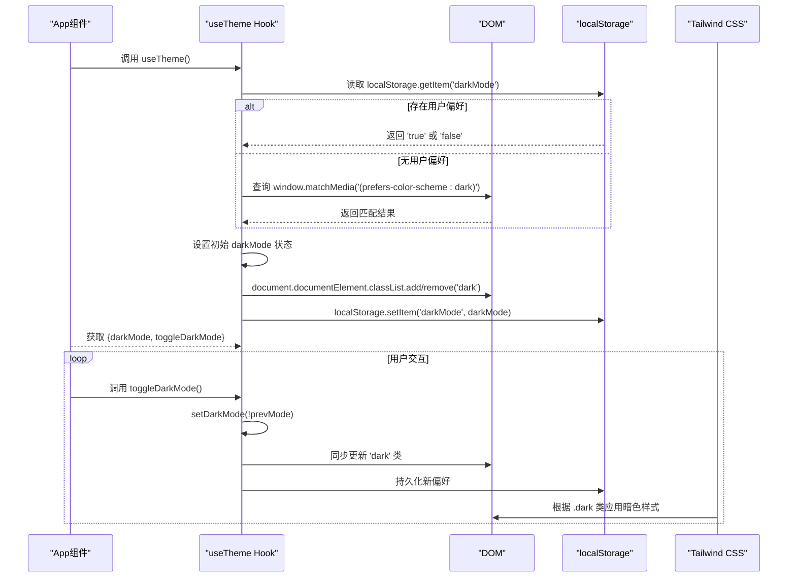
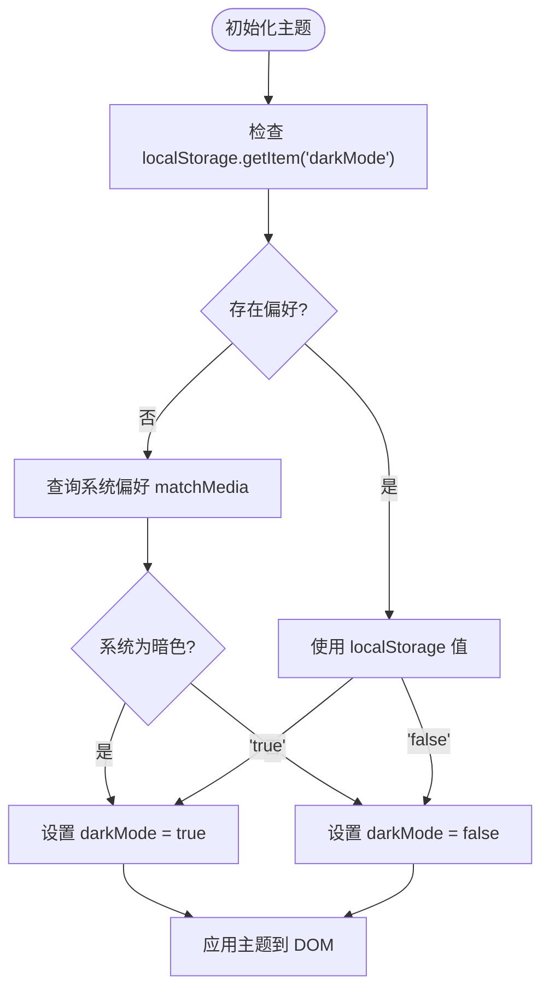
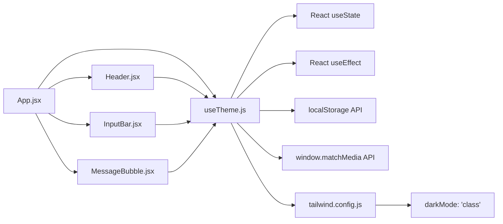

# useTheme Hook 详解

<cite>
**本文档引用的文件**  
- [useTheme.js](file://frontend/src/hooks/useTheme.js#L1-L41)
- [tailwind.config.js](file://frontend/tailwind.config.js#L1-L12)
- [App.jsx](file://frontend/src/App.jsx#L1-L172)
- [Header.jsx](file://frontend/src/components/Header.jsx#L1-L30)
- [InputBar.jsx](file://frontend/src/components/InputBar.jsx#L1-L87)
- [MessageBubble.jsx](file://frontend/src/components/MessageBubble.jsx#L1-L21)
- [ui_design.md](file://ui_design.md#L50-L61)
</cite>

## 目录
1. [简介](#简介)
2. [项目结构](#项目结构)
3. [核心组件](#核心组件)
4. [架构概览](#架构概览)
5. [详细组件分析](#详细组件分析)
6. [依赖分析](#依赖分析)
7. [性能考虑](#性能考虑)
8. [故障排除指南](#故障排除指南)
9. [结论](#结论)

## 简介
`useTheme` 是一个自定义 React Hook，用于管理前端应用中的主题切换功能，支持浅色与暗黑模式的动态切换。该 Hook 通过 `useState` 管理当前主题状态，利用 `useEffect` 在组件挂载时读取用户偏好（优先本地存储，其次系统偏好），并在主题变化时动态向 `document.documentElement` 添加或移除 `dark` 类名，从而触发 Tailwind CSS 的条件样式渲染。本文档将深入剖析其实现机制、状态管理逻辑、UI 集成方式及边界情况处理。

## 项目结构
项目采用典型的前后端分离架构，前端位于 `frontend` 目录，使用 Vite 构建，React 作为 UI 框架，Tailwind CSS 实现响应式样式。`useTheme` Hook 位于 `src/hooks/useTheme.js`，被主应用组件 `App.jsx` 调用，并通过 props 传递给需要响应主题变化的 UI 组件（如 `Header`、`InputBar` 等）。

```mermaid
graph TB
subgraph "前端 (frontend)"
App[App.jsx]
Hooks[hooks/]
Components[components/]
Config[tailwind.config.js]
App --> useTheme[useTheme.js]
App --> Header[Header.jsx]
App --> InputBar[InputBar.jsx]
App --> MessageBubble[MessageBubble.jsx]
useTheme --> Config
end
subgraph "后端 (backend)"
AppPy[app.py]
LLMClient[llm_client.py]
end
App < --> AppPy
```

**图示来源**  
- [App.jsx](file://frontend/src/App.jsx#L1-L172)
- [useTheme.js](file://frontend/src/hooks/useTheme.js#L1-L41)
- [tailwind.config.js](file://frontend/tailwind.config.js#L1-L12)

**本节来源**  
- [App.jsx](file://frontend/src/App.jsx#L1-L172)
- [project_structure](file://#L1-L20)

## 核心组件
`useTheme` 是前端主题管理的核心组件。它封装了主题状态的初始化、切换逻辑和持久化存储，对外暴露 `darkMode`（布尔值，表示当前是否为暗黑模式）和 `toggleDarkMode`（切换主题的函数）。该 Hook 的设计遵循 React Hooks 的最佳实践，确保了状态逻辑的可复用性和组件的解耦。

**本节来源**  
- [useTheme.js](file://frontend/src/hooks/useTheme.js#L1-L41)

## 架构概览
主题切换的整体流程如下：应用启动时，`useTheme` Hook 通过 `useEffect` 初始化主题状态，优先检查 `localStorage` 中是否有用户明确设置的偏好（`darkMode` 键），若无则回退至系统级的 `prefers-color-scheme` 媒体查询。一旦确定初始状态，便通过 `document.documentElement.classList` 动态添加或移除 `dark` 类。当用户点击切换按钮时，`toggleDarkMode` 函数被调用，更新 `darkMode` 状态，触发 `useEffect` 副作用，同步更新 DOM 类名和 `localStorage`。



**图示来源**  
- [useTheme.js](file://frontend/src/hooks/useTheme.js#L1-L41)
- [tailwind.config.js](file://frontend/tailwind.config.js#L1-L12)

## 详细组件分析

### useTheme Hook 实现分析
`useTheme` Hook 的实现精巧且健壮，主要包含三个部分：状态定义、初始化逻辑和状态同步。

#### 状态定义
使用 `useState` 定义 `darkMode` 状态，默认值为 `false`（浅色模式）。
```javascript
const [darkMode, setDarkMode] = useState(false);
```

#### 初始化逻辑
通过一个空依赖数组的 `useEffect` 在组件挂载时执行一次。它通过逻辑或（`||`）操作符组合两个条件：
1.  **本地存储优先**：`localStorage.getItem('darkMode') === 'true'`，检查用户是否明确选择过暗黑模式。
2.  **系统偏好回退**：`(window.matchMedia('(prefers-color-scheme: dark)').matches && localStorage.getItem('darkMode') !== 'false')`，仅当用户未明确关闭暗黑模式（即 `localStorage` 中不是 `'false'`）时，才采用系统偏好。
这种设计确保了用户的选择始终优先于系统设置。



**图示来源**  
- [useTheme.js](file://frontend/src/hooks/useTheme.js#L9-L15)

#### 状态同步与持久化
另一个 `useEffect` 监听 `darkMode` 状态的变化。每当 `darkMode` 更新，此副作用就会执行：
1.  **更新 DOM**：根据 `darkMode` 的值，向 `document.documentElement`（即 `<html>` 标签）添加或移除 `dark` 类。
2.  **持久化存储**：将最新的 `darkMode` 值（布尔值，会被自动转换为字符串 `'true'` 或 `'false'`）保存到 `localStorage`，确保刷新后偏好得以保留。

```javascript
useEffect(() => {
  if (darkMode) {
    document.documentElement.classList.add('dark');
  } else {
    document.documentElement.classList.remove('dark');
  }
  localStorage.setItem('darkMode', darkMode);
}, [darkMode]);
```

#### 主题切换函数
`toggleDarkMode` 是一个简单的状态切换函数，使用函数式更新确保基于最新状态进行切换。
```javascript
const toggleDarkMode = () => {
  setDarkMode(prevMode => !prevMode);
};
```

**本节来源**  
- [useTheme.js](file://frontend/src/hooks/useTheme.js#L1-L41)

### UI 组件集成分析
`useTheme` 的状态和函数通过 `App.jsx` 组件传递给具体的 UI 组件，实现主题的全局响应。

#### 主应用组件 (App.jsx)
`App` 组件是主题状态的“分发中心”。它导入并调用 `useTheme`，获取 `darkMode` 和 `toggleDarkMode`，然后将它们作为 props 传递给 `Header` 组件。

```javascript
const App = () => {
  const { darkMode, toggleDarkMode } = useTheme();
  // ... 其他逻辑
  return (
    <div className="flex h-screen bg-white dark:bg-gray-900">
      <Sidebar ... />
      <div className="flex flex-col flex-1 min-w-0">
        <Header 
          currentConversationTitle={currentConversation?.title}
          darkMode={darkMode}
          onToggleDarkMode={toggleDarkMode}
        />
        {/* ... */}
      </div>
    </div>
  );
};
```
同时，`App` 组件自身的根 `div` 也使用了 `bg-white dark:bg-gray-900` 类，使其背景色能随主题自动切换。

**本节来源**  
- [App.jsx](file://frontend/src/App.jsx#L1-L172)

#### 顶部导航栏 (Header.jsx)
`Header` 组件接收 `darkMode` 和 `onToggleDarkMode` 作为 props。它利用 `darkMode` 来动态设置按钮的 `aria-label`，并根据其值决定渲染太阳（浅色）还是月亮（暗黑）图标。

```javascript
const Header = ({ currentConversationTitle, darkMode, onToggleDarkMode }) => {
  return (
    <header className="bg-white dark:bg-gray-900 px-6 py-4 flex justify-between items-center">
      <h1 className="text-xl font-semibold text-gray-900 dark:text-white">
        {currentConversationTitle || '新对话'}
      </h1>
      <button onClick={onToggleDarkMode} aria-label={darkMode ? "切换到浅色模式" : "切换到暗黑模式"}>
        {darkMode ? <Sun /> : <Moon />}
      </button>
    </header>
  );
};
```

**本节来源**  
- [Header.jsx](file://frontend/src/components/Header.jsx#L1-L30)

#### 其他 UI 组件
主题样式通过 Tailwind 的 `dark:` 前缀类在多个组件中应用：
-   **输入栏 (InputBar.jsx)**: 背景 (`bg-gray-50 dark:bg-gray-800`)、文本颜色 (`text-gray-900 dark:text-white`)、边框、悬停和聚焦状态均定义了暗色变体。
-   **消息气泡 (MessageBubble.jsx)**: 内联代码块的背景 (`bg-gray-100 dark:bg-gray-700`) 和边框使用了 `dark:` 类。
-   **侧边栏 (Sidebar.jsx)**: 背景、文本、图标颜色等均配置了暗色主题。

这些样式定义与 `ui_design.md` 文件中的设计规范一致，确保了视觉的一致性。

**本节来源**  
- [InputBar.jsx](file://frontend/src/components/InputBar.jsx#L1-L87)
- [MessageBubble.jsx](file://frontend/src/components/MessageBubble.jsx#L1-L21)
- [Sidebar.jsx](file://frontend/src/components/Sidebar.jsx#L1-L30)
- [ui_design.md](file://ui_design.md#L50-L61)

## 依赖分析
`useTheme` Hook 的实现依赖于浏览器的 Web API（`localStorage` 和 `window.matchMedia`）以及 React 的核心 Hooks（`useState` 和 `useEffect`）。在项目内部，它被 `App.jsx` 直接依赖，并通过 `App` 间接影响所有使用 `dark:` 类的 UI 组件。Tailwind CSS 的配置 `darkMode: 'class'` 是整个主题切换机制的基础，它告诉 Tailwind 只有当父元素（此处为 `html`）拥有 `dark` 类时，才应用 `dark:` 前缀的样式。



**图示来源**  
- [useTheme.js](file://frontend/src/hooks/useTheme.js#L1-L41)
- [tailwind.config.js](file://frontend/tailwind.config.js#L1-L12)
- [App.jsx](file://frontend/src/App.jsx#L1-L172)

**本节来源**  
- [useTheme.js](file://frontend/src/hooks/useTheme.js#L1-L41)
- [tailwind.config.js](file://frontend/tailwind.config.js#L1-L12)

## 性能考虑
`useTheme` Hook 的性能表现良好：
-   **初始化开销小**：`useEffect` 仅在挂载时执行一次，读取 `localStorage` 和 `matchMedia` 是同步且快速的操作。
-   **更新高效**：`useEffect` 仅在 `darkMode` 变化时执行，直接操作 DOM 类名是轻量级的，且 Tailwind 的 JIT 模式能高效处理样式切换。
-   **无过度渲染**：`useTheme` 返回的状态和函数是稳定的，不会导致不必要的组件重新渲染。
-   **持久化无负担**：`localStorage.setItem` 是同步操作，但写入的数据量极小，对性能影响可忽略。

## 故障排除指南
-   **问题：主题切换后样式未生效**
    -   **检查点 1**：确认 `tailwind.config.js` 中 `darkMode` 设置为 `'class'`，而非 `'media'`。
    -   **检查点 2**：检查 `useTheme.js` 中是否正确地向 `document.documentElement` 添加/移除了 `dark` 类（可通过浏览器开发者工具的 Elements 面板查看 `<html>` 标签的 class 属性）。
    -   **检查点 3**：确保 UI 组件中使用了正确的 `dark:` 前缀类，例如 `dark:bg-gray-900`。

-   **问题：刷新页面后主题偏好未保存**
    -   **检查点**：确认 `useEffect` 在 `darkMode` 变化时正确执行了 `localStorage.setItem('darkMode', darkMode)`。检查浏览器的 Application/Storage 面板，查看 `localStorage` 中是否存在 `darkMode` 键及其值。

-   **问题：首次加载时主题与系统偏好不符**
    -   **检查点**：检查 `useTheme.js` 的初始化逻辑，特别是 `window.matchMedia('(prefers-color-scheme: dark)').matches` 是否能正确返回系统偏好。确保 `localStorage` 中没有残留的 `darkMode` 键干扰判断。

**本节来源**  
- [useTheme.js](file://frontend/src/hooks/useTheme.js#L1-L41)
- [tailwind.config.js](file://frontend/tailwind.config.js#L1-L12)

## 结论
`useTheme` Hook 是一个设计精良、功能完整的主题管理解决方案。它巧妙地结合了 React Hooks、浏览器 API 和 Tailwind CSS 的特性，实现了用户偏好持久化、系统偏好回退和无缝的 UI 主题切换。其代码简洁、逻辑清晰，易于集成和维护。通过分析其在 `App`、`Header` 等组件中的应用，可以看出该 Hook 成功地将主题状态从逻辑层传递到了视图层，确保了整个应用主题的一致性。对于未来扩展，可以考虑增加“自动”模式（完全跟随系统）或更多自定义主题选项，其现有架构为此类扩展提供了良好的基础。