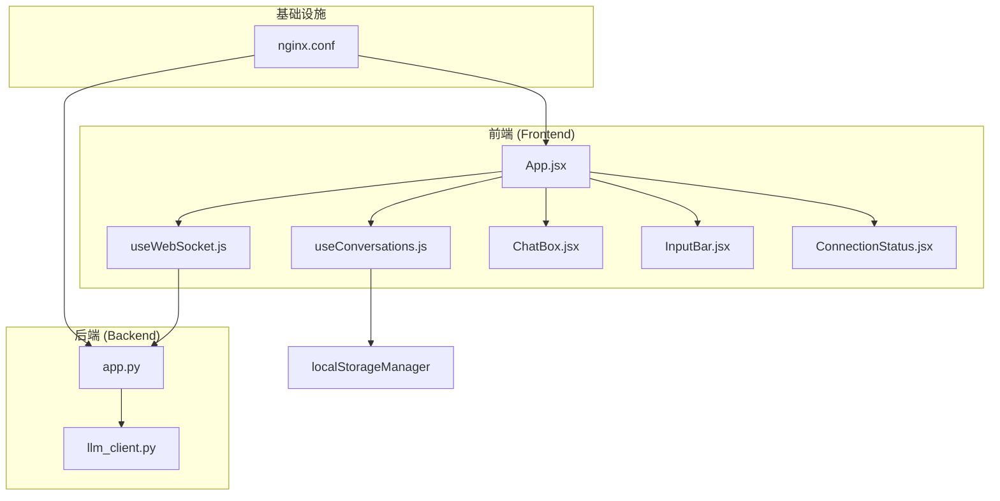
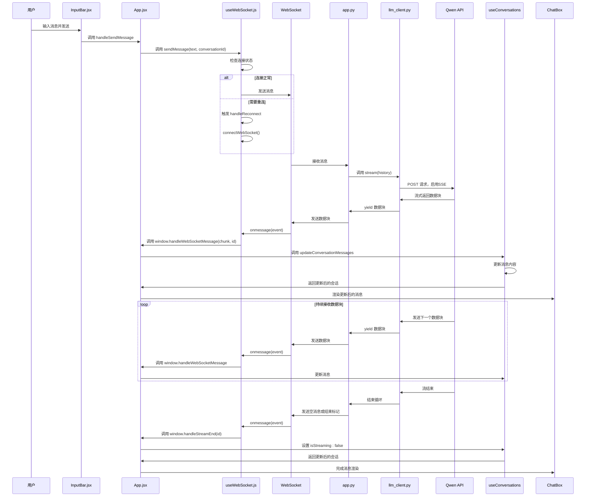
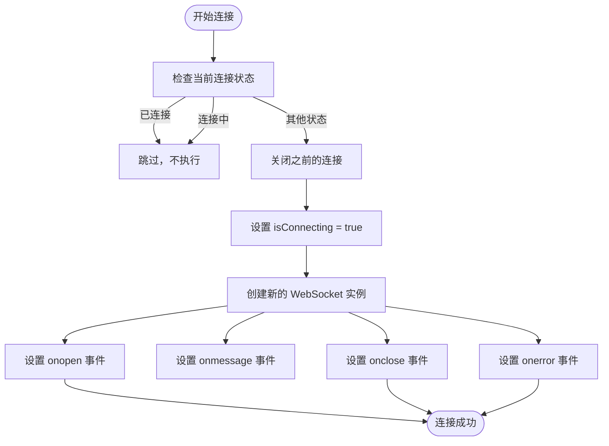
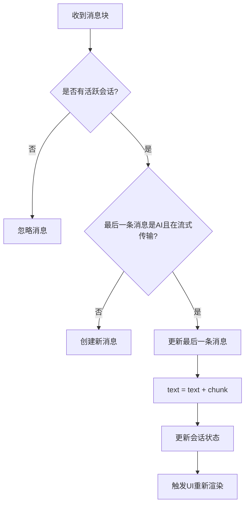
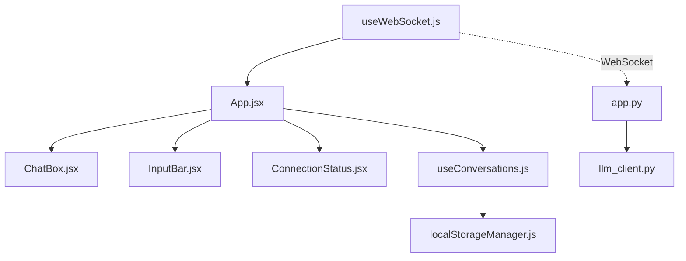

# useWebSocket Hook 详解

<cite>
**本文档引用的文件**   
- [useWebSocket.js](file://frontend/src/hooks/useWebSocket.js#L1-L192)
- [App.jsx](file://frontend/src/App.jsx#L1-L171)
- [app.py](file://backend/app.py#L1-L106)
- [llm_client.py](file://backend/llm_client.py#L1-L86)
- [ConnectionStatus.jsx](file://frontend/src/components/ConnectionStatus.jsx#L1-L34)
- [InputBar.jsx](file://frontend/src/components/InputBar.jsx#L1-L84)
- [ChatBox.jsx](file://frontend/src/components/ChatBox.jsx#L1-L27)
- [MessageBubble.jsx](file://frontend/src/components/MessageBubble.jsx#L1-L91)
- [useConversations.js](file://frontend/src/hooks/useConversations.js#L1-L116)
- [localStorageManager.js](file://frontend/src/utils/localStorageManager.js#L1-L25)
- [test-websocket.html](file://frontend/public/test-websocket.html#L1-L188)
- [nginx.conf](file://nginx/nginx.conf#L1-L26)
</cite>

## 目录
1. [引言](#引言)
2. [项目结构](#项目结构)
3. [核心组件](#核心组件)
4. [架构概览](#架构概览)
5. [详细组件分析](#详细组件分析)
6. [依赖分析](#依赖分析)
7. [性能考量](#性能考量)
8. [故障排除指南](#故障排除指南)
9. [结论](#结论)

## 引言
本文档全面解析 `useWebSocket.js` 文件中实现的 WebSocket 连接管理机制。该 Hook 是聊天应用的核心，负责管理与后端 AI 服务的实时双向通信。文档将深入探讨其连接建立、消息收发、心跳维持、自动重连策略以及与前端其他组件的集成方式，为开发者提供一份详尽的技术参考。

## 项目结构
项目采用典型的前后端分离架构，前端使用 React 构建，后端使用 FastAPI 框架。WebSocket 通信是前后端交互的关键通道，用于实现 AI 响应的流式传输。

**图示来源**
- [useWebSocket.js](file://frontend/src/hooks/useWebSocket.js#L1-L192)
- [App.jsx](file://frontend/src/App.jsx#L1-L171)
- [app.py](file://backend/app.py#L1-L106)
- [nginx.conf](file://nginx/nginx.conf#L1-L26)

**本节来源**
- [useWebSocket.js](file://frontend/src/hooks/useWebSocket.js#L1-L192)
- [App.jsx](file://frontend/src/App.jsx#L1-L171)
- [app.py](file://backend/app.py#L1-L106)
- [nginx.conf](file://nginx/nginx.conf#L1-L26)

## 核心组件
`useWebSocket` Hook 是前端与后端进行实时通信的核心。它封装了 WebSocket 的复杂性，提供了简洁的 API 供上层组件调用，如 `App.jsx`。其主要职责包括：
- **连接管理**：初始化、建立、关闭和自动重连 WebSocket 连接。
- **状态监控**：提供 `isConnecting` 和 `getConnectionStatus` 来反映当前连接状态。
- **消息处理**：通过 `sendMessage` 发送消息，并通过全局函数 `window.handleWebSocketMessage` 和 `window.handleStreamEnd` 处理接收到的流式响应。
- **会话跟踪**：使用 `activeConversationRef` 确保消息被正确地路由到当前活跃的会话。

**本节来源**
- [useWebSocket.js](file://frontend/src/hooks/useWebSocket.js#L1-L192)
- [App.jsx](file://frontend/src/App.jsx#L1-L171)

## 架构概览
整个系统的通信流程始于用户在 `InputBar` 中输入消息并点击发送。`App` 组件调用 `useWebSocket` 的 `sendMessage` 方法。该方法检查连接状态，若未连接则触发重连，并将消息通过 WebSocket 发送到后端 `/chat` 端点。后端 `app.py` 接收消息，调用 `llm_client.py` 与阿里云的 Qwen 模型进行交互，并以流式（SSE）方式将响应通过同一个 WebSocket 连接返回给前端。前端的 `onmessage` 事件处理器接收到数据块后，通过预设的全局函数更新 `useConversations` 中的会话消息内容，最终在 `ChatBox` 中实时渲染。

**图示来源**
- [useWebSocket.js](file://frontend/src/hooks/useWebSocket.js#L1-L192)
- [App.jsx](file://frontend/src/App.jsx#L1-L171)
- [app.py](file://backend/app.py#L1-L106)
- [llm_client.py](file://backend/llm_client.py#L1-L86)

## 详细组件分析
### useWebSocket Hook 分析
`useWebSocket` 是一个自定义的 React Hook，利用 `useState`、`useRef` 和 `useCallback` 等 Hook 来管理 WebSocket 的状态和逻辑。

#### 连接建立与自动重连机制
`connectWebSocket` 函数是连接管理的核心。它首先检查当前连接状态，防止重复连接。如果已有连接，则先将其关闭。然后创建一个新的 `WebSocket` 实例，连接到 `ws://localhost:8000/chat`。

自动重连通过 `useEffect` 中的 `setInterval` 实现，每 2 秒检查一次连接状态。如果连接已关闭，则自动调用 `connectWebSocket`。此外，还监听了 `visibilitychange` 事件，当页面从后台切回前台时，也会检查并尝试重连，确保用户体验的连续性。

**图示来源**
- [useWebSocket.js](file://frontend/src/hooks/useWebSocket.js#L15-L78)

**本节来源**
- [useWebSocket.js](file://frontend/src/hooks/useWebSocket.js#L1-L192)

#### 消息收发与流式处理
`sendMessage` 函数负责发送消息。它首先检查消息内容和连接状态，只有在连接成功时才允许发送。发送前，它会将当前会话 ID 设置到 `activeConversationRef` 中，以便后续接收的消息能正确匹配。

`onmessage` 事件处理器是流式响应的关键。它接收到的 `event.data` 是一个文本块（chunk）。处理器首先检查 `activeConversationRef` 以确定目标会话。然后，它通过调用全局函数 `window.handleWebSocketMessage(chunk, currentActiveId)` 将数据块和会话 ID 传递给上层逻辑。当收到空消息或特定结束标记时，它会调用 `window.handleStreamEnd(currentActiveId)`，通知上层流式传输结束。

#### 心跳与连接状态
该实现中，心跳机制是通过定时检查连接状态来实现的，而非发送 ping/pong 帧。`useEffect` 中的 `connectionChecker` 定时器扮演了心跳检测的角色。`getConnectionStatus` 函数则根据 `WebSocket` 实例的 `readyState` 属性返回当前的连接状态（'connecting', 'connected', 'closing', 'disconnected'）。

### App 组件集成分析
`App` 组件是 `useWebSocket` 的主要使用者。它通过 `setMessageHandlers` 设置了两个关键的全局函数：`handleWebSocketMessage` 和 `handleStreamEnd`。

`handleWebSocketMessage` 的实现逻辑是：它会查找目标会话中的最后一条消息，如果该消息是来自 AI 且处于流式传输状态（`isStreaming: true`），则将接收到的数据块追加到该消息的 `text` 字段中，并更新会话状态。这实现了 AI 响应的逐字显示效果。

`handleStreamEnd` 的实现逻辑是：同样找到最后一条 AI 消息，并将其 `isStreaming` 标志设置为 `false`，表示流式传输完成。

**图示来源**
- [App.jsx](file://frontend/src/App.jsx#L36-L73)

**本节来源**
- [App.jsx](file://frontend/src/App.jsx#L1-L171)
- [useWebSocket.js](file://frontend/src/hooks/useWebSocket.js#L1-L192)

### 后端 WebSocket 服务分析
后端 `app.py` 中的 `websocket_endpoint` 函数处理 `/chat` 路径的 WebSocket 连接。当连接建立后，它会进入一个无限循环，持续接收客户端消息。收到消息后，它会将其添加到 `history` 列表中，并调用 `llm_client` 的 `stream` 方法。

`llm_client.py` 中的 `stream` 方法向阿里云的 Qwen API 发起一个启用 SSE（Server-Sent Events）的 POST 请求。它使用 `httpx.AsyncClient().stream()` 来异步地、流式地读取 API 的响应。对于每一个接收到的数据行，它会解析并提取出文本内容，然后通过 `yield` 将其逐块返回给 `app.py`。`app.py` 随即通过 `websocket.send_text(delta_content)` 将这些增量内容发送回前端。

**本节来源**
- [app.py](file://backend/app.py#L1-L106)
- [llm_client.py](file://backend/llm_client.py#L1-L86)

## 依赖分析
`useWebSocket` Hook 与多个组件和文件存在紧密的依赖关系。

**图示来源**
- [useWebSocket.js](file://frontend/src/hooks/useWebSocket.js#L1-L192)
- [App.jsx](file://frontend/src/App.jsx#L1-L171)
- [useConversations.js](file://frontend/src/hooks/useConversations.js#L1-L116)
- [app.py](file://backend/app.py#L1-L106)
- [llm_client.py](file://backend/llm_client.py#L1-L86)

**本节来源**
- [useWebSocket.js](file://frontend/src/hooks/useWebSocket.js#L1-L192)
- [App.jsx](file://frontend/src/App.jsx#L1-L171)
- [useConversations.js](file://frontend/src/hooks/useConversations.js#L1-L116)
- [app.py](file://backend/app.py#L1-L106)
- [llm_client.py](file://backend/llm_client.py#L1-L86)

## 性能考量
- **连接复用**：`useWebSocket` 在整个应用生命周期内维护单个 WebSocket 连接，避免了频繁创建和销毁连接的开销。
- **消息队列**：当前实现中，如果在连接未建立时调用 `sendMessage`，会尝试重连但不会将消息加入队列。优化方案是引入一个消息队列，将待发送的消息暂存，待连接成功后按序发送。
- **错误日志上报**：前端和后端都使用了 `console.log` 和 `logger` 进行日志记录，这对于调试非常有用。在生产环境中，可以考虑将关键错误日志上报到集中式监控系统。
- **资源清理**：`useEffect` 的清理函数中正确地清除了定时器和事件监听器，并关闭了 WebSocket 连接，防止了内存泄漏。

## 故障排除指南
- **跨域问题**：后端 `app.py` 已通过 `CORSMiddleware` 允许所有来源（`allow_origins=["*"]`），通常不会出现跨域问题。如果部署环境有特殊要求，需调整此配置。
- **连接超时**：如果 `ws://localhost:8000/chat` 无法访问，请检查后端服务是否已启动。Nginx 配置文件 `nginx.conf` 中的 `location /chat` 块已正确配置反向代理，确保 WebSocket 升级请求被正确转发。
- **服务端关闭连接**：服务端在 `finally` 块中会尝试关闭连接。前端的 `onclose` 和 `onerror` 事件处理器会处理此情况，并将状态重置，自动重连机制会尝试恢复连接。
- **消息未显示**：首先检查浏览器控制台是否有错误。确认 `setMessageHandlers` 是否已在 `App.jsx` 中正确设置。检查 `activeConversationRef` 是否在发送消息前被正确设置。

**本节来源**
- [useWebSocket.js](file://frontend/src/hooks/useWebSocket.js#L1-L192)
- [app.py](file://backend/app.py#L1-L106)
- [nginx.conf](file://nginx/nginx.conf#L1-L26)

## 结论
`useWebSocket` Hook 实现了一个健壮且功能完整的 WebSocket 客户端管理机制。它通过自动重连和状态监控确保了连接的可靠性，并通过流式消息处理实现了 AI 响应的实时渲染。其与 `App` 组件的集成清晰，通过全局函数解耦了消息处理逻辑。后端服务正确地实现了流式 API 调用和 WebSocket 通信。整体架构设计合理，为用户提供了一个流畅的聊天体验。未来的优化方向可以包括实现消息队列、更精细的错误处理和生产环境的日志监控。