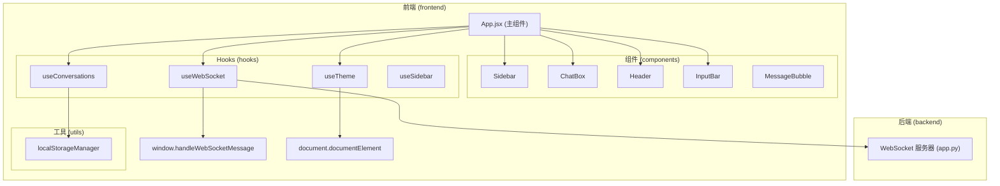
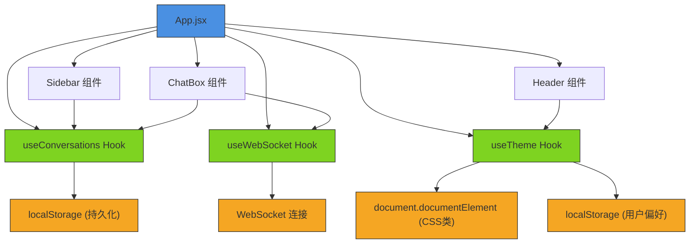
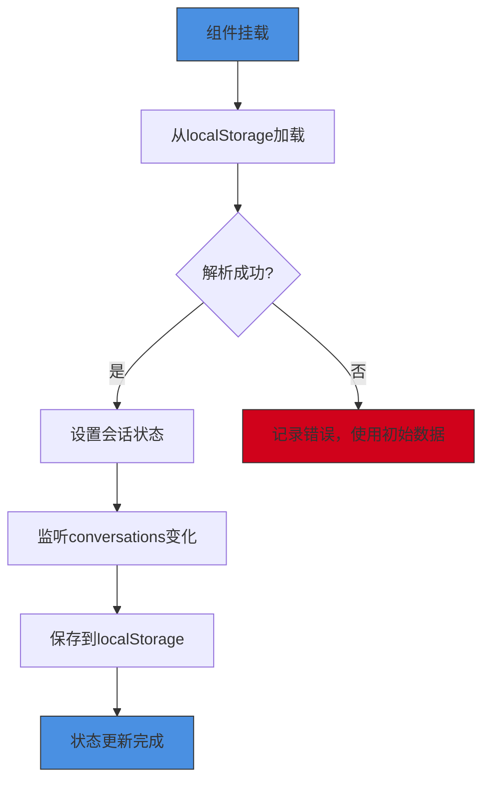
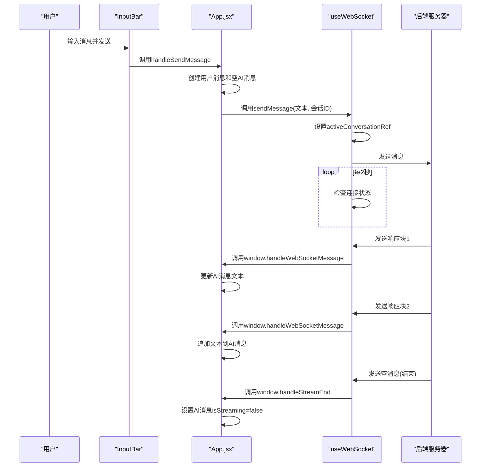
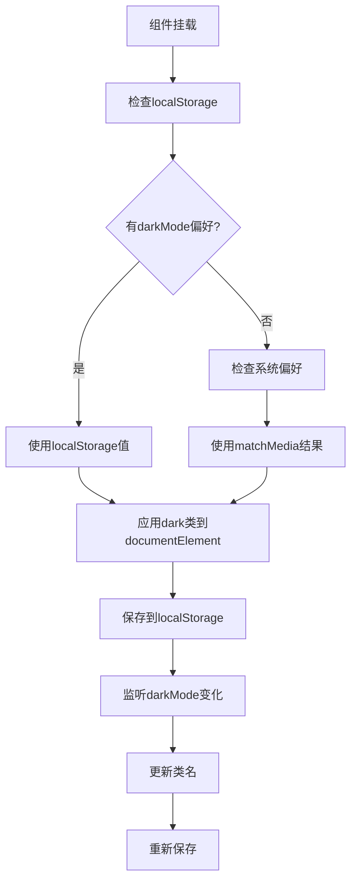
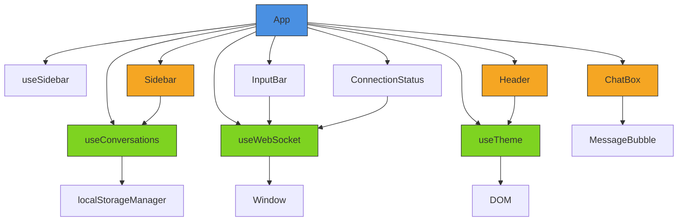

# 前端状态管理

<cite>
**本文档引用的文件**  
- [useConversations.js](file://frontend/src/hooks/useConversations.js)
- [useWebSocket.js](file://frontend/src/hooks/useWebSocket.js)
- [useTheme.js](file://frontend/src/hooks/useTheme.js)
- [App.jsx](file://frontend/src/App.jsx)
- [localStorageManager.js](file://frontend/src/utils/localStorageManager.js)
- [ChatBox.jsx](file://frontend/src/components/ChatBox.jsx)
- [MessageBubble.jsx](file://frontend/src/components/MessageBubble.jsx)
- [tailwind.config.js](file://frontend/tailwind.config.js)
</cite>

## 目录
1. [简介](#简介)
2. [项目结构](#项目结构)
3. [核心组件](#核心组件)
4. [架构概览](#架构概览)
5. [详细组件分析](#详细组件分析)
6. [依赖分析](#依赖分析)
7. [性能考虑](#性能考虑)
8. [故障排除指南](#故障排除指南)
9. [结论](#结论)

## 简介
本文档深入解析chat-mvp项目的前端状态管理机制，重点分析三个核心自定义Hook：`useConversations`、`useWebSocket`和`useTheme`的实现原理与使用场景。通过代码级分析，揭示会话管理、WebSocket通信和主题切换的完整状态流转过程，并提供错误处理策略与性能优化建议。

## 项目结构
chat-mvp项目采用典型的前后端分离架构，前端位于`frontend`目录，使用React + Vite技术栈。状态管理逻辑集中在`src/hooks`目录下，通过自定义Hook封装会话、WebSocket连接和主题偏好等核心功能。UI组件位于`src/components`，通过`App.jsx`主组件进行组合。

**图示来源**  
- [App.jsx](file://frontend/src/App.jsx)
- [useConversations.js](file://frontend/src/hooks/useConversations.js)
- [useWebSocket.js](file://frontend/src/hooks/useWebSocket.js)
- [useTheme.js](file://frontend/src/hooks/useTheme.js)

**本节来源**  
- [App.jsx](file://frontend/src/App.jsx)
- [project_structure](file://project_structure)

## 核心组件
本项目前端状态管理由三个核心自定义Hook驱动：
- **`useConversations`**: 管理会话的创建、切换、消息更新及localStorage持久化。
- **`useWebSocket`**: 封装WebSocket连接的建立、消息收发、心跳检测与自动重连。
- **`useTheme`**: 基于用户偏好或系统设置动态切换暗黑/浅色主题。

这些Hook在`App.jsx`中被组合使用，形成统一的状态管理中枢，为UI组件提供数据和行为。

**本节来源**  
- [useConversations.js](file://frontend/src/hooks/useConversations.js)
- [useWebSocket.js](file://frontend/src/hooks/useWebSocket.js)
- [useTheme.js](file://frontend/src/hooks/useTheme.js)

## 架构概览
系统采用React函数式组件+Hooks的现代前端架构。状态管理遵循单一数据源原则，会话数据、连接状态和主题偏好均通过自定义Hook集中管理。UI组件为纯展示层，通过props接收数据和回调函数，实现关注点分离。

**图示来源**  
- [App.jsx](file://frontend/src/App.jsx)
- [useConversations.js](file://frontend/src/hooks/useConversations.js)
- [useWebSocket.js](file://frontend/src/hooks/useWebSocket.js)
- [useTheme.js](file://frontend/src/hooks/useTheme.js)

## 详细组件分析

### useConversations 分析
`useConversations` Hook负责管理所有会话的生命周期，包括创建、删除、切换和持久化。

#### 会话ID生成与默认命名
- **ID生成策略**: 使用`Date.now().toString()`生成基于时间戳的唯一ID，确保全局唯一性。
- **默认会话命名**: 新建会话标题为“新对话”，当用户发送第一条消息且会话为空时，自动将消息前15个字符作为会话标题（过长则截断并添加省略号）。

#### localStorage 持久化
- **序列化/反序列化**: 使用`JSON.stringify()`和`JSON.parse()`在内存对象与localStorage字符串之间转换。
- **自动同步**: 通过`useEffect`监听`conversations`状态变化，每次更新后自动保存到`localStorage`的`chatConversations`键中。
- **错误处理**: 反序列化失败时捕获`SyntaxError`并记录错误日志，降级使用初始会话数据。

**图示来源**  
- [useConversations.js](file://frontend/src/hooks/useConversations.js#L25-L45)

**本节来源**  
- [useConversations.js](file://frontend/src/hooks/useConversations.js)

### useWebSocket 分析
`useWebSocket` Hook封装了WebSocket连接的复杂性，提供简洁的API供上层调用。

#### 连接管理与自动重连
- **防重复连接**: 在`connectWebSocket`函数中检查`readyState`，避免重复创建连接。
- **自动重连机制**: 
  - **定时检查**: 每2秒检查连接状态，断开时自动重连。
  - **页面可见性检测**: 当页面从后台切回前台时，立即检查并重连。
- **手动重连**: 提供`handleReconnect`函数，供用户点击重试按钮时调用。

#### 消息收发与流式响应
- **消息发送**: `sendMessage`函数检查连接状态，未连接时自动触发重连。
- **流式响应处理**: 
  - **onmessage事件**: 将收到的文本块（chunk）通过`window.handleWebSocketMessage`全局函数传递给上层。
  - **活跃会话跟踪**: 使用`activeConversationRef` ref记录当前正在接收响应的会话ID。
  - **结束标记**: 收到空消息时，通过`window.handleStreamEnd`通知上层流式传输结束。

**图示来源**  
- [useWebSocket.js](file://frontend/src/hooks/useWebSocket.js#L75-L117)
- [App.jsx](file://frontend/src/App.jsx#L120-L150)

**本节来源**  
- [useWebSocket.js](file://frontend/src/hooks/useWebSocket.js)
- [App.jsx](file://frontend/src/App.jsx)

### useTheme 分析
`useTheme` Hook实现暗黑/浅色主题的动态切换。

#### 主题初始化
- **优先级**: 用户本地存储偏好 > 系统偏好 > 默认浅色。
- **逻辑**: 若`localStorage`中`darkMode`为`true`，则启用暗黑模式；若为`false`，则禁用；若未设置，则跟随系统偏好`prefers-color-scheme`。

#### CSS 类名注入
- **实现**: 通过`document.documentElement.classList.add('dark')`或`.remove('dark')`操作根元素的类名。
- **Tailwind 配置**: `tailwind.config.js`中`darkMode: 'class'`配置，使Tailwind CSS根据`.dark`类名切换样式。

**图示来源**  
- [useTheme.js](file://frontend/src/hooks/useTheme.js#L10-L30)
- [tailwind.config.js](file://frontend/tailwind.config.js#L4-L6)

**本节来源**  
- [useTheme.js](file://frontend/src/hooks/useTheme.js)
- [tailwind.config.js](file://frontend/tailwind.config.js)

## 依赖分析
各组件间依赖关系清晰，耦合度低。

**图示来源**  
- [App.jsx](file://frontend/src/App.jsx)
- [useConversations.js](file://frontend/src/hooks/useConversations.js)
- [useWebSocket.js](file://frontend/src/hooks/useWebSocket.js)
- [useTheme.js](file://frontend/src/hooks/useTheme.js)

**本节来源**  
- [App.jsx](file://frontend/src/App.jsx)
- [useConversations.js](file://frontend/src/hooks/useConversations.js)
- [useWebSocket.js](file://frontend/src/hooks/useWebSocket.js)
- [useTheme.js](file://frontend/src/hooks/useTheme.js)

## 性能考虑
- **避免重复连接**: `useWebSocket`中通过检查`readyState`防止重复创建WebSocket实例。
- **减少状态更新**: `useConversations`中`updateConversationMessages`使用函数式更新，避免不必要的渲染。
- **ref优化**: `useWebSocket`使用`activeConversationRef`而非状态，避免因活跃会话ID变化触发组件重渲染。
- **事件清理**: `useWebSocket`在`useEffect`清理函数中移除`visibilitychange`监听器并关闭WebSocket，防止内存泄漏。

## 故障排除指南
- **localStorage写入失败**: `useConversations`和`useTheme`中均使用`try-catch`捕获异常，记录错误日志但不中断应用，降级为内存状态管理。
- **WebSocket连接中断**: 自动重连机制（定时检查+页面可见性检测）确保网络恢复后能自动重连。
- **消息不同步**: `useWebSocket`通过`activeConversationRef`确保消息只更新到正确的会话，避免跨会话污染。
- **主题切换不生效**: 检查`tailwind.config.js`中`darkMode`是否为`'class'`，确保CSS框架正确配置。

**本节来源**  
- [useConversations.js](file://frontend/src/hooks/useConversations.js)
- [useWebSocket.js](file://frontend/src/hooks/useWebSocket.js)
- [useTheme.js](file://frontend/src/hooks/useTheme.js)
- [tailwind.config.js](file://frontend/tailwind.config.js)

## 结论
chat-mvp前端状态管理设计精良，通过三个职责单一的自定义Hook（`useConversations`、`useWebSocket`、`useTheme`）有效解耦了会话、通信和UI主题逻辑。`App.jsx`作为中心枢纽，协调各Hook并为UI组件提供数据和行为。整个系统具备良好的错误处理、持久化和用户体验（如自动重连、流式响应）。建议未来可将`localStorageManager`模块与`useConversations`深度集成，并为WebSocket添加指数退避重连算法以进一步提升健壮性。