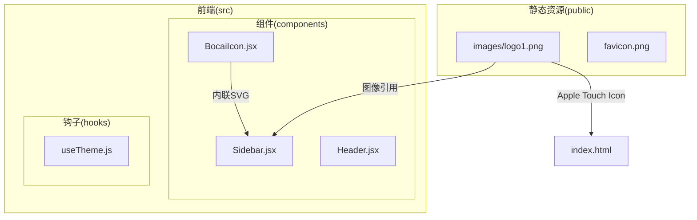
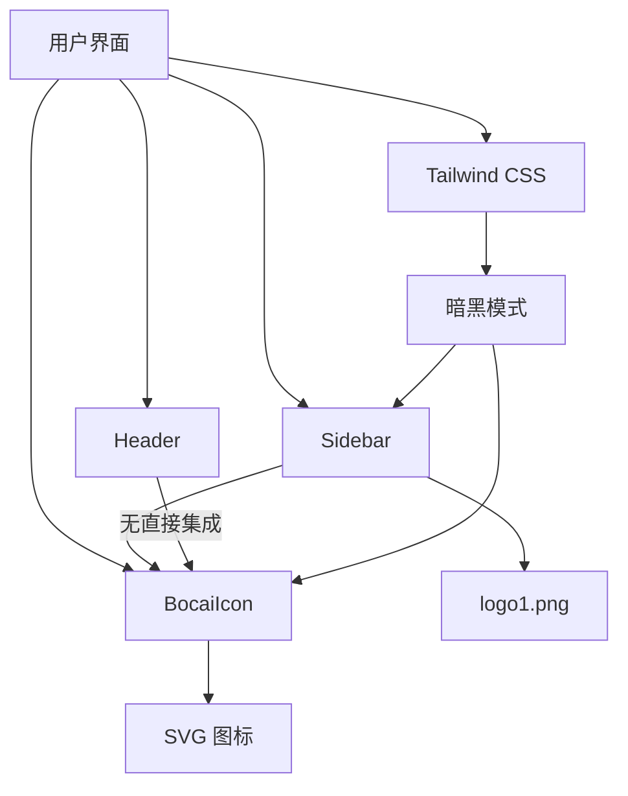
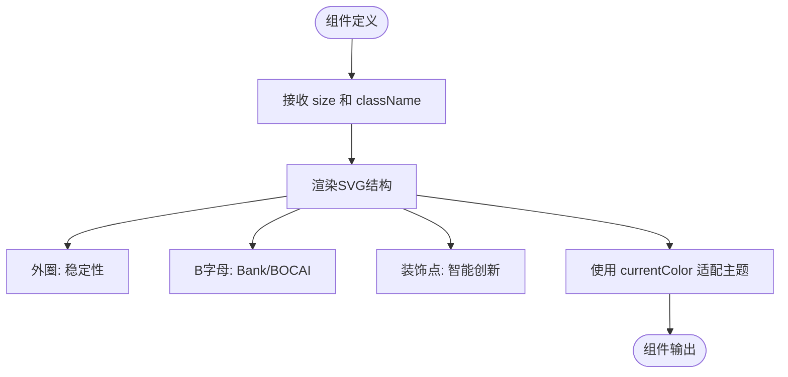
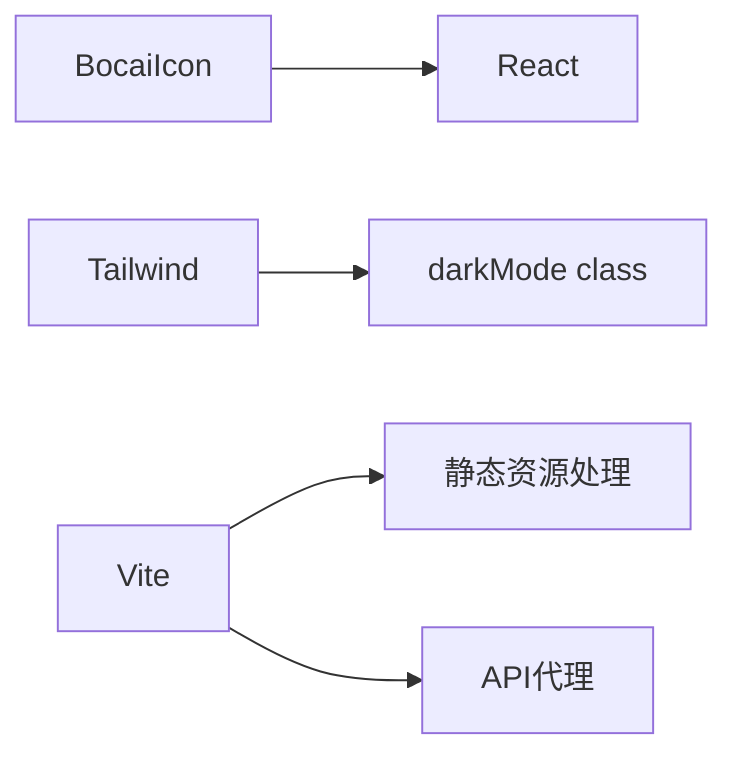

# BocaiIcon 组件

<cite>
**本文档引用的文件**  
- [BocaiIcon.jsx](file://frontend/src/components/BocaiIcon.jsx#L1-L35)
- [Sidebar.jsx](file://frontend/src/components/Sidebar.jsx#L1-L21)
- [index.html](file://frontend/index.html#L1-L14)
- [tailwind.config.js](file://frontend/tailwind.config.js#L1-L12)
- [vite.config.js](file://frontend/vite.config.js#L1-L17)
</cite>

## 目录
1. [简介](#简介)
2. [项目结构](#项目结构)
3. [核心组件](#核心组件)
4. [架构概览](#架构概览)
5. [详细组件分析](#详细组件分析)
6. [依赖分析](#依赖分析)
7. [性能考量](#性能考量)
8. [可访问性改进](#可访问性改进)
9. [结论](#结论)

## 简介
BocaiIcon 组件是中国银行江西省分行“博才”AI助手的品牌标识实现，采用内联SVG方式封装视觉元素。该组件作为品牌识别的核心元素，确保在不同上下文和主题模式下的一致性展示。通过轻量化设计，避免了外部图像资源依赖，提升了加载性能与可维护性。

## 项目结构
前端项目采用标准React架构，组件集中存放于`src/components`目录。BocaiIcon作为独立UI组件，与其他功能组件（如Header、Sidebar等）并列组织，体现了模块化设计原则。



**图示来源**  
- [BocaiIcon.jsx](file://frontend/src/components/BocaiIcon.jsx#L1-L35)
- [Sidebar.jsx](file://frontend/src/components/Sidebar.jsx#L1-L21)
- [index.html](file://frontend/index.html#L1-L14)

**本节来源**  
- [BocaiIcon.jsx](file://frontend/src/components/BocaiIcon.jsx#L1-L35)
- [Sidebar.jsx](file://frontend/src/components/Sidebar.jsx#L1-L21)

## 核心组件
BocaiIcon 组件通过React函数式组件实现，封装了代表“博才”AI助手的SVG图形。其设计融合了银行稳定性（外圈）与智能创新（内部B字母及装饰点）的视觉隐喻，强化品牌识别。

**本节来源**  
- [BocaiIcon.jsx](file://frontend/src/components/BocaiIcon.jsx#L1-L35)

## 架构概览
系统采用前后端分离架构，前端基于Vite构建，集成Tailwind CSS进行样式管理。BocaiIcon组件作为UI层品牌元素，通过组件化方式在Sidebar等容器中复用，实现一致的品牌展示。



**图示来源**  
- [BocaiIcon.jsx](file://frontend/src/components/BocaiIcon.jsx#L1-L35)
- [Sidebar.jsx](file://frontend/src/components/Sidebar.jsx#L1-L21)
- [tailwind.config.js](file://frontend/tailwind.config.js#L1-L12)

## 详细组件分析

### BocaiIcon 组件实现
BocaiIcon 是一个轻量级的React函数式组件，使用内联SVG渲染品牌图标。其核心实现如下：

```jsx
const BocaiIcon = ({ size = 18, className = "" }) => {
  return (
    <svg 
      width={size} 
      height={size} 
      viewBox="0 0 24 24" 
      fill="none" 
      xmlns="http://www.w3.org/2000/svg"
      className={className}
    >
      {/* 外圈 - 代表银行的稳定性 */}
      <circle 
        cx="12" 
        cy="12" 
        r="10" 
        stroke="currentColor" 
        strokeWidth="2" 
        fill="none"
      />
      
      {/* 内部B字母设计 - 代表Bank和BOCAI */}
      <path 
        d="M8 7h4c1.5 0 2.5 1 2.5 2.2c0 0.8-0.4 1.5-1 1.8c0.8 0.3 1.5 1.1 1.5 2c0 1.5-1.2 2.5-2.8 2.5H8V7z M10 9v2h2c0.6 0 1-0.4 1-1s-0.4-1-1-1h-2z M10 13v2h2.2c0.7 0 1.3-0.6 1.3-1.3s-0.6-1.2-1.3-1.2H10z" 
        fill="currentColor"
      />
      
      {/* 装饰性元素 - 代表智能和创新 */}
      <circle cx="17" cy="7" r="1.5" fill="currentColor" opacity="0.6" />
      <circle cx="7" cy="17" r="1" fill="currentColor" opacity="0.4" />
    </svg>
  );
};
```

#### 可配置性
组件通过props支持灵活配置：
- **size**: 控制图标的宽高（默认18px）
- **className**: 允许传入Tailwind CSS类名以覆盖样式

通过`currentColor`属性，图标颜色自动继承父元素文本颜色，实现与主题（浅色/暗黑）的无缝适配。

#### 轻量化设计
组件采用内联SVG而非外部图像文件，优势包括：
- 无需网络请求，提升加载速度
- 可通过CSS精确控制颜色与大小
- 避免图像失真，保证在高DPI屏幕上的清晰度
- 减少对静态资源目录的依赖

**本节来源**  
- [BocaiIcon.jsx](file://frontend/src/components/BocaiIcon.jsx#L1-L35)

### 集成方式分析
尽管BocaiIcon组件已实现，但在当前代码库中并未在任何JSX文件中被导入或使用。相反，品牌标识主要通过以下方式实现：
1. **Sidebar组件**：使用``加载PNG格式的logo1.png
2. **index.html**：通过`<link rel="apple-touch-icon" href="/images/logo1.png" />`设置苹果设备图标

这表明BocaiIcon组件可能为新设计的替代方案，尚未完成全面集成。



**图示来源**  
- [BocaiIcon.jsx](file://frontend/src/components/BocaiIcon.jsx#L1-L35)

**本节来源**  
- [BocaiIcon.jsx](file://frontend/src/components/BocaiIcon.jsx#L1-L35)
- [Sidebar.jsx](file://frontend/src/components/Sidebar.jsx#L1-L21)

## 依赖分析
BocaiIcon组件具有极低的依赖性，仅依赖React核心库，符合轻量化设计原则。项目整体使用Tailwind CSS进行样式管理，通过`dark:`前缀类实现暗黑模式切换。



**图示来源**  
- [BocaiIcon.jsx](file://frontend/src/components/BocaiIcon.jsx#L1-L35)
- [tailwind.config.js](file://frontend/tailwind.config.js#L1-L12)
- [vite.config.js](file://frontend/vite.config.js#L1-L17)

**本节来源**  
- [tailwind.config.js](file://frontend/tailwind.config.js#L1-L12)
- [vite.config.js](file://frontend/vite.config.js#L1-L17)

## 性能考量
BocaiIcon组件的设计充分考虑性能：
- **零外部依赖**：内联SVG避免HTTP请求
- **体积小**：SVG代码仅约500字符
- **渲染高效**：现代浏览器对SVG有良好优化
- **缓存友好**：作为JSX代码随组件打包，利用浏览器JS缓存

相比之下，当前使用的logo1.png虽可通过CDN缓存，但存在固定尺寸、可能模糊、额外请求等问题。

**本节来源**  
- [BocaiIcon.jsx](file://frontend/src/components/BocaiIcon.jsx#L1-L35)

## 可访问性改进
虽然BocaiIcon组件本身未包含可访问性属性，但可轻松扩展以提升屏幕阅读器体验：

```jsx
const BocaiIcon = ({ size = 18, className = "", ariaLabel = "博才AI助手" }) => {
  return (
    <svg 
      width={size} 
      height={size} 
      viewBox="0 0 24 24" 
      fill="none" 
      xmlns="http://www.w3.org/2000/svg"
      className={className}
      aria-label={ariaLabel}
      role="img"
    >
      {/* SVG 内容 */}
    </svg>
  );
};
```

建议添加`role="img"`和可配置的`aria-label`，确保视觉障碍用户能理解图标含义。

**本节来源**  
- [BocaiIcon.jsx](file://frontend/src/components/BocaiIcon.jsx#L1-L35)

## 结论
BocaiIcon组件是一个设计良好、轻量高效的SVG品牌图标实现，具备良好的可配置性和主题适配能力。尽管当前未在应用中集成，但其设计优于现有的PNG图像方案。建议：
1. 在Sidebar等组件中替换``为`<BocaiIcon />`
2. 扩展组件以支持`aria-label`等可访问性属性
3. 统一品牌标识的使用方式，提升维护性与一致性