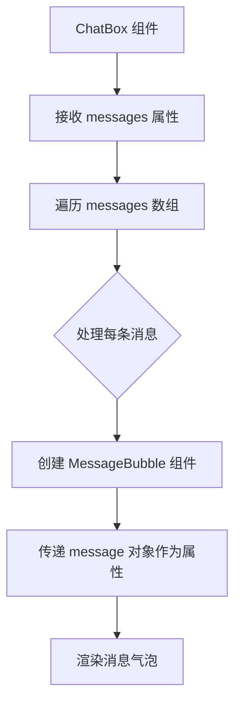
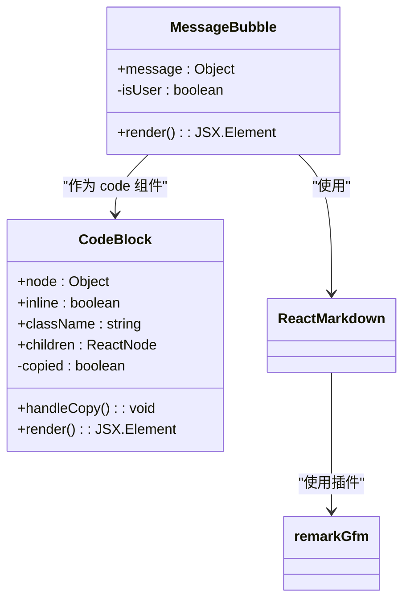
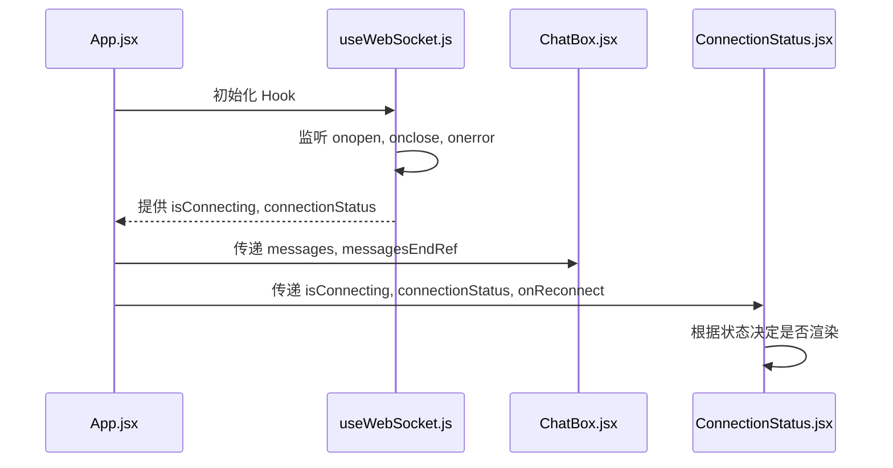
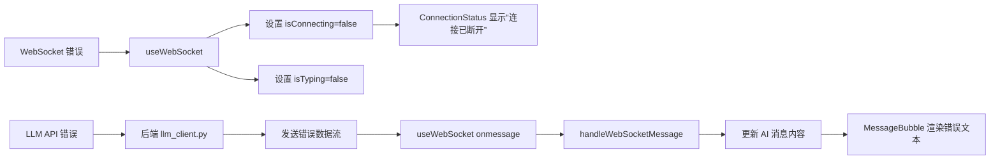
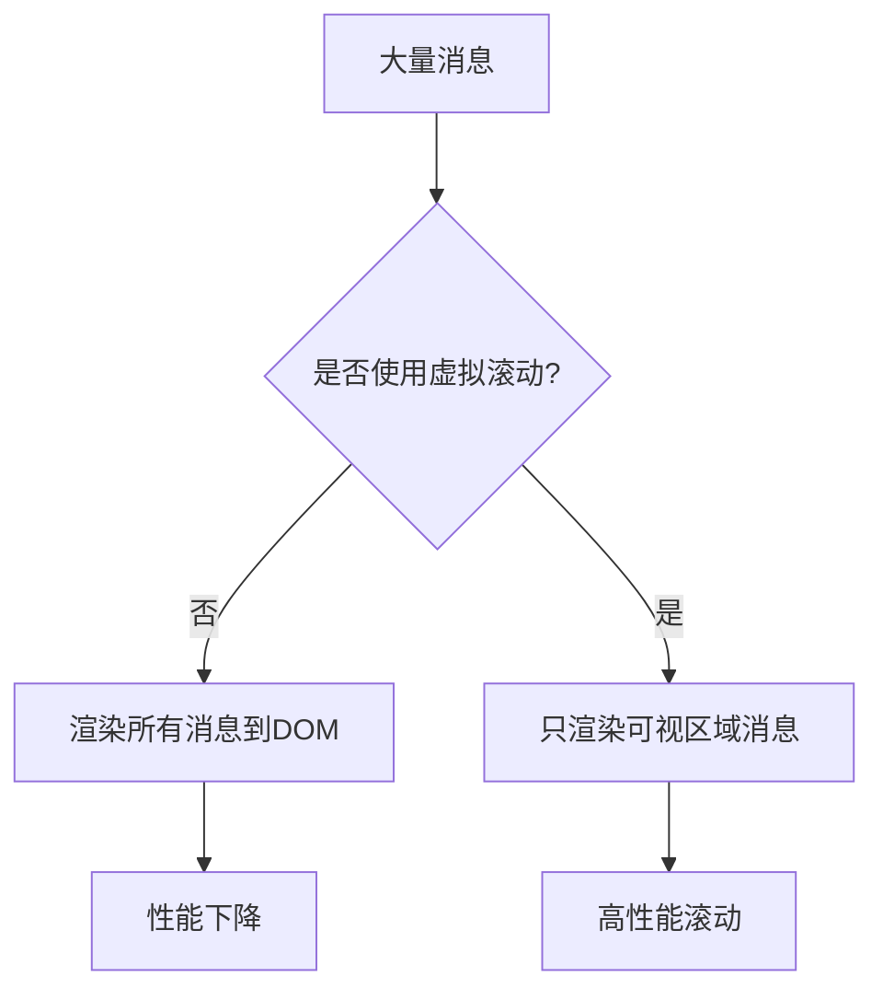

# ChatBox 组件

<cite>
**本文档中引用的文件**   
- [ChatBox.jsx](file://frontend/src/components/ChatBox.jsx)
- [MessageBubble.jsx](file://frontend/src/components/MessageBubble.jsx)
- [useWebSocket.js](file://frontend/src/hooks/useWebSocket.js)
- [useConversations.js](file://frontend/src/hooks/useConversations.js)
- [ConnectionStatus.jsx](file://frontend/src/components/ConnectionStatus.jsx)
- [App.jsx](file://frontend/src/App.jsx)
</cite>

## 目录
1. [ChatBox 组件](#chatbox-组件)
2. [核心协调作用](#核心协调作用)
3. [消息渲染机制](#消息渲染机制)
4. [自动滚动功能实现](#自动滚动功能实现)
5. [加载状态与连接指示器](#加载状态与连接指示器)
6. [空消息列表处理](#空消息列表处理)
7. [错误消息处理](#错误消息处理)
8. [性能优化建议](#性能优化建议)
9. [新功能开发指导](#新功能开发指导)

## 核心协调作用

ChatBox 组件是聊天界面的核心协调者，负责整合来自 `useConversations` 和 `useWebSocket` 等多个状态管理 Hook 的数据，并将其渲染为用户可见的聊天界面。该组件本身不直接管理复杂的状态，而是作为一个“展示组件”（Presentational Component），接收由父组件（如 App.jsx）传递下来的消息列表和引用，专注于 UI 的渲染和交互逻辑。

其主要职责包括：
- **消息列表接收**：通过 `messages` 属性接收当前会话的所有消息。
- **UI 结构构建**：构建聊天区域的容器结构，确保消息区域可滚动。
- **子组件协调**：遍历消息列表，为每条消息创建并传递数据给 `MessageBubble` 组件。
- **滚动行为管理**：利用 `useEffect` 和 `useRef` 实现消息更新后的自动滚动到底部。
- **占位符管理**：在消息列表为空时，通过 `MessageBubble` 的渲染逻辑展示初始欢迎消息。

**Section sources**
- [ChatBox.jsx](file://frontend/src/components/ChatBox.jsx#L1-L29)
- [App.jsx](file://frontend/src/App.jsx#L153-L155)

## 消息渲染机制

ChatBox 组件通过 `map` 函数遍历其接收到的 `messages` 数组，为每条消息创建一个 `MessageBubble` 组件实例。



**Diagram sources**
- [ChatBox.jsx](file://frontend/src/components/ChatBox.jsx#L15-L17)

**Section sources**
- [ChatBox.jsx](file://frontend/src/components/ChatBox.jsx#L15-L17)
- [MessageBubble.jsx](file://frontend/src/components/MessageBubble.jsx#L53-L93)

### MessageBubble 组件分析

`MessageBubble` 组件负责渲染单条消息的视觉样式。它根据消息的 `sender` 字段（'user' 或 'ai'）来决定消息气泡的对齐方式和样式。



**Diagram sources**
- [MessageBubble.jsx](file://frontend/src/components/MessageBubble.jsx#L53-L93)
- [MessageBubble.jsx](file://frontend/src/components/MessageBubble.jsx#L1-L51)

**Section sources**
- [MessageBubble.jsx](file://frontend/src/components/MessageBubble.jsx#L1-L93)

## 自动滚动功能实现

ChatBox 组件实现了消息更新后自动滚动到底部的功能，这对于提供流畅的聊天体验至关重要。

### 实现原理

该功能依赖于 React 的 `useRef` 和 `useEffect` 两个 Hook：
1.  **创建引用**：在父组件（App.jsx）中，创建一个 `messagesEndRef` 引用。
2.  **传递引用**：将此引用作为 `messagesEndRef` 属性传递给 ChatBox 组件。
3.  **定位元素**：在 ChatBox 组件的 JSX 中，创建一个空的 `<div>` 元素，并将其 `ref` 属性设置为 `messagesEndRef`。这个元素位于所有消息的末尾。
4.  **定义滚动函数**：在 ChatBox 组件内部定义 `scrollToBottom` 函数，该函数调用 `ref.current.scrollIntoView()` 方法。
5.  **触发滚动**：使用 `useEffect` Hook，监听 `messages` 数组的变化。每当 `messages` 更新时，`useEffect` 的回调函数就会执行 `scrollToBottom`，从而将视图滚动到末尾的 `<div>` 元素处。

```javascript
const ChatBox = ({ messages, messagesEndRef }) => {
  const scrollToBottom = () => {
    messagesEndRef.current?.scrollIntoView({ behavior: "smooth" });
  };

  useEffect(() => {
    scrollToBottom();
  }, [messages]);

  return (
    <div className="h-full flex flex-col">
      <div className="flex-1 overflow-y-auto px-4 py-6">
        <div className="max-w-5xl mx-auto space-y-6">
          {messages.map((message) => (
            <MessageBubble key={message.id} message={message} />
          ))}
          <div ref={messagesEndRef} /> {/* 滚动定位点 */}
        </div>
      </div>
    </div>
  );
};
```

**Section sources**
- [ChatBox.jsx](file://frontend/src/components/ChatBox.jsx#L5-L29)
- [App.jsx](file://frontend/src/App.jsx#L153-L155)

## 加载状态与连接指示器

ChatBox 组件本身不直接显示加载状态，但其所在的聊天区域集成了连接状态指示器，该指示器与 WebSocket 的连接状态紧密关联。

### 显示条件与关联

- **加载状态**：当用户发送消息后，`useWebSocket` Hook 会将 `isTyping` 状态设置为 `true`，并在收到 AI 的流式响应时保持此状态。虽然 ChatBox 不直接显示 `...` 动画，但 `MessageBubble` 会为正在流式接收的 AI 消息持续更新内容，这本身就是一种加载指示。
- **连接状态指示器**：`ConnectionStatus` 组件被放置在 `InputBar` 下方，它接收来自 `useWebSocket` 的 `isConnecting` 和 `connectionStatus` 状态。
  - **正在连接**：当 `isConnecting` 为 `true` 时，显示“正在连接服务器...”。
  - **连接断开**：当 `connectionStatus` 不为 `'connected'` 且 `isConnecting` 为 `false` 时，显示“连接已断开，请点击重试”。
  - **正常连接**：当连接正常时，`ConnectionStatus` 返回 `null`，不显示任何内容。



**Diagram sources**
- [App.jsx](file://frontend/src/App.jsx#L153-L198)
- [useWebSocket.js](file://frontend/src/hooks/useWebSocket.js#L38-L78)
- [ConnectionStatus.jsx](file://frontend/src/components/ConnectionStatus.jsx#L1-L34)

**Section sources**
- [App.jsx](file://frontend/src/App.jsx#L153-L198)
- [useWebSocket.js](file://frontend/src/hooks/useWebSocket.js#L38-L78)
- [ConnectionStatus.jsx](file://frontend/src/components/ConnectionStatus.jsx#L1-L34)

## 空消息列表处理

当一个新会话被创建时，其消息列表可能为空。ChatBox 组件通过其父组件和 `useConversations` Hook 的配合来处理这种情况。

### 展示逻辑

1.  **初始消息注入**：`useConversations` Hook 在创建新会话时，会自动向 `messages` 数组中注入一条来自 AI 的欢迎消息。
    ```javascript
    const initialConversations = [
      { 
        id: '1', 
        title: '新对话 1', 
        messages: [{ 
          id: 1, 
          text: "您好！我是中国银行江西省分行的大语言模型BOCAI，很高兴为您服务！有什么可以帮助您的吗？", 
          sender: 'ai', 
          timestamp: new Date().toISOString() 
        }] 
      },
    ];
    ```
2.  **渲染空列表**：如果一个会话的消息列表确实为空（例如，用户手动清除了所有消息），ChatBox 组件的 `map` 函数将不会渲染任何 `MessageBubble`。此时，聊天区域将只显示末尾的 `<div ref={messagesEndRef} />`，导致界面为空白。
3.  **占位符展示**：项目当前的逻辑依赖于 `useConversations` 始终为新会话提供初始消息，因此 ChatBox 组件本身没有实现专门的“空状态”占位符（如“暂无消息”）。空状态的处理是在业务逻辑层（`useConversations`）完成的。

**Section sources**
- [useConversations.js](file://frontend/src/hooks/useConversations.js#L3-L22)
- [ChatBox.jsx](file://frontend/src/components/ChatBox.jsx#L15-L17)

## 错误消息处理

错误消息的处理主要由 `useWebSocket` Hook 负责，ChatBox 组件通过其父组件间接地呈现这些错误。

### 传递与呈现方式

1.  **错误捕获**：`useWebSocket` Hook 监听 WebSocket 的 `onerror` 和 `onclose` 事件。
2.  **状态更新**：当发生错误时，Hook 会将 `isConnecting` 和 `isTyping` 状态设置为 `false`，并清空活跃会话 ID。
3.  **错误呈现**：错误的呈现并非通过在聊天区域插入一条红色的错误消息，而是通过 `ConnectionStatus` 组件来提示用户连接已断开。用户可以通过点击“点击重试”按钮来手动重连。
4.  **流式传输错误**：对于后端 LLM API 的错误，后端 `llm_client.py` 会将错误信息作为流式响应的一部分发送。`useWebSocket` 的 `onmessage` 事件会接收到这些数据块，并通过 `window.handleWebSocketMessage` 回调函数将其添加到当前 AI 消息的内容中，最终由 `MessageBubble` 组件渲染出来。



**Diagram sources**
- [useWebSocket.js](file://frontend/src/hooks/useWebSocket.js#L75-L78)
- [llm_client.py](file://backend/llm_client.py#L78-L86)
- [ConnectionStatus.jsx](file://frontend/src/components/ConnectionStatus.jsx#L1-L34)

**Section sources**
- [useWebSocket.js](file://frontend/src/hooks/useWebSocket.js#L75-L78)
- [llm_client.py](file://backend/llm_client.py#L78-L86)
- [ConnectionStatus.jsx](file://frontend/src/components/ConnectionStatus.jsx#L1-L34)

## 性能优化建议

对于包含大量历史消息的聊天应用，当前的实现方式可能会导致性能问题，因为所有消息都会被一次性渲染到 DOM 中。

### 虚拟滚动应用

**建议**：引入虚拟滚动（Virtual Scrolling）技术来优化性能。

- **原理**：虚拟滚动只渲染当前可见区域内的消息，以及少量缓冲区域的消息。当用户滚动时，动态地更新渲染的列表项，从而极大地减少 DOM 节点的数量。
- **实现路径**：
  1.  **选择库**：可以使用成熟的 React 虚拟滚动库，如 `react-window` 或 `virtuoso`。
  2.  **重构 ChatBox**：将 `messages.map()` 替换为一个虚拟滚动列表组件（如 `FixedSizeList`）。
  3.  **计算高度**：由于消息气泡的高度是动态的（取决于文本长度），需要使用 `VariableSizeList` 并实现一个函数来估算或精确计算每条消息的高度。
  4.  **集成自动滚动**：需要调整 `scrollToBottom` 逻辑，使其与虚拟滚动列表的 API（如 `scrollToItem`）配合工作。



**Section sources**
- [ChatBox.jsx](file://frontend/src/components/ChatBox.jsx#L15-L17)

## 新功能开发指导

### 添加消息搜索高亮功能

**集成路径**：

1.  **状态管理**：在 `App.jsx` 或一个新的 `useSearch` Hook 中，添加一个 `searchTerm` 状态来存储用户的搜索关键词。
2.  **搜索逻辑**：创建一个函数，遍历当前会话的 `messages`，检查每条消息的 `text` 是否包含 `searchTerm`。
3.  **高亮渲染**：修改 `MessageBubble` 组件，使其接收一个 `searchTerm` 属性。在渲染 `message.text` 时，使用一个辅助函数将 `searchTerm` 包裹在 `<mark>` 标签中以实现高亮。
    ```javascript
    const highlightText = (text, searchTerm) => {
      if (!searchTerm) return text;
      const regex = new RegExp(`(${searchTerm})`, 'gi');
      return text.split(regex).map((part, i) => 
        regex.test(part) ? <mark key={i}>{part}</mark> : part
      );
    };
    ```
4.  **UI 集成**：在 `Header` 组件中添加一个搜索输入框，用于更新 `searchTerm` 状态。
5.  **样式**：为 `<mark>` 标签添加 CSS 样式，例如黄色背景。

此功能的实现将主要涉及 `MessageBubble.jsx` 和 `App.jsx` 文件的修改。

**Section sources**
- [MessageBubble.jsx](file://frontend/src/components/MessageBubble.jsx#L73-L93)
- [App.jsx](file://frontend/src/App.jsx)