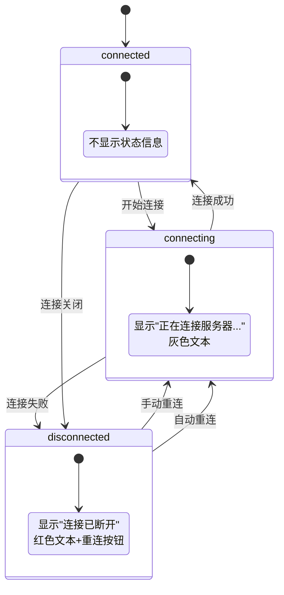
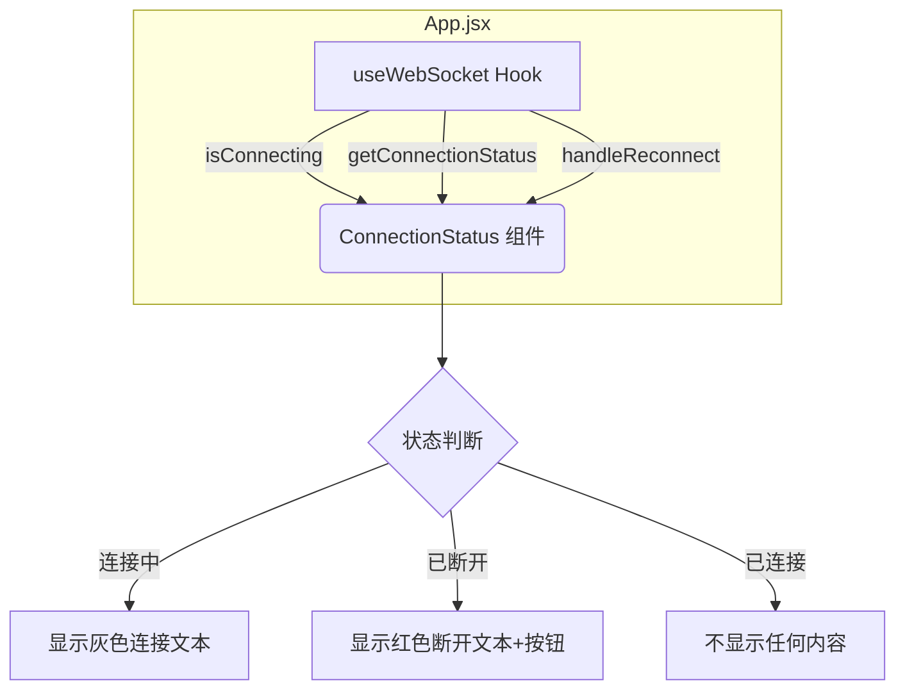
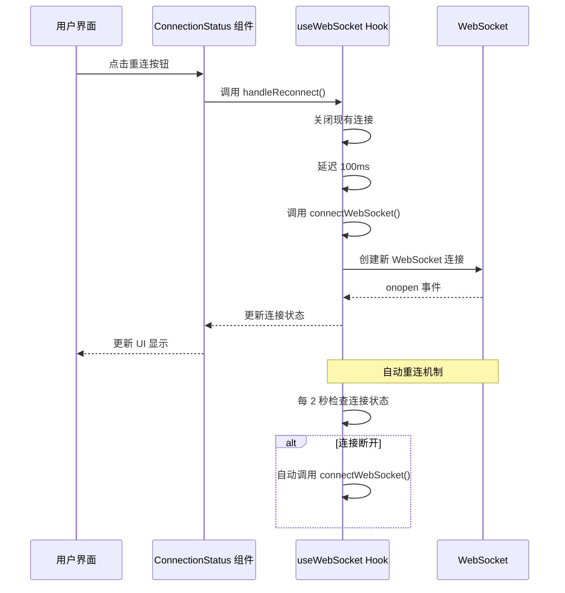

# ConnectionStatus 组件

<cite>
**本文档中引用的文件**   
- [ConnectionStatus.jsx](file://frontend/src/components/ConnectionStatus.jsx)
- [useWebSocket.js](file://frontend/src/hooks/useWebSocket.js)
- [App.jsx](file://frontend/src/App.jsx)
- [ui_design.md](file://ui_design.md)
</cite>

## 目录
1. [ConnectionStatus 组件](#connectionstatus-组件)
2. [状态可视化机制](#状态可视化机制)
3. [组件集成与数据流](#组件集成与数据流)
4. [重连机制设计](#重连机制设计)
5. [国际化扩展潜力分析](#国际化扩展潜力分析)
6. [用户体验优化建议](#用户体验优化建议)

## 状态可视化机制

ConnectionStatus 组件负责可视化呈现 WebSocket 连接状态，通过接收来自 useWebSocket Hook 的连接状态（connected, connecting, disconnected）并映射为相应的视觉反馈。

组件根据连接状态和连接中标志来决定显示内容：
- 当连接状态为 'connected' 且不在连接中时，组件返回 null，不显示任何状态信息
- 当处于连接中状态（isConnecting 为 true）时，显示灰色文本 "正在连接服务器..."
- 当连接断开且不在连接中时，显示红色文本提示连接已断开，并提供重连按钮



**Diagram sources**
- [ConnectionStatus.jsx](file://frontend/src/components/ConnectionStatus.jsx#L8-L19)
- [useWebSocket.js](file://frontend/src/hooks/useWebSocket.js#L114-L135)

**Section sources**
- [ConnectionStatus.jsx](file://frontend/src/components/ConnectionStatus.jsx#L6-L34)

## 组件集成与数据流

ConnectionStatus 组件在 App.jsx 中被集成使用，通过 props 接收来自 useWebSocket Hook 的状态信息。

数据流如下：
1. useWebSocket Hook 管理 WebSocket 连接状态
2. App 组件调用 useWebSocket Hook 获取状态和方法
3. App 组件将状态和方法作为 props 传递给 ConnectionStatus 组件
4. ConnectionStatus 组件根据接收到的状态渲染相应的 UI



**Diagram sources**
- [App.jsx](file://frontend/src/App.jsx#L153-L161)
- [ConnectionStatus.jsx](file://frontend/src/components/ConnectionStatus.jsx#L6-L34)

**Section sources**
- [App.jsx](file://frontend/src/App.jsx#L153-L161)

## 重连机制设计

ConnectionStatus 组件的重连机制设计包含用户交互和自动重连两个层面：

### 用户交互设计
- 在连接断开状态下，显示红色提示文本和蓝色重连按钮
- 重连按钮的 onClick 事件绑定到 useWebSocket 的 handleReconnect 函数
- 按钮样式为蓝色可点击文本，悬停时颜色加深并显示下划线

### 自动重连机制
useWebSocket Hook 实现了自动重连功能：
- 每 2 秒定时检查连接状态
- 当检测到连接断开时自动尝试重连
- 页面从隐藏状态变为可见时检查连接状态并重连（如果需要）
- 发送消息时如果连接未建立，自动触发重连



**Diagram sources**
- [useWebSocket.js](file://frontend/src/hooks/useWebSocket.js#L75-L117)
- [ConnectionStatus.jsx](file://frontend/src/components/ConnectionStatus.jsx#L19-L27)

**Section sources**
- [useWebSocket.js](file://frontend/src/hooks/useWebSocket.js#L137-L156)

## 国际化扩展潜力分析

当前 ConnectionStatus 组件的文本内容为硬编码的中文，但具备良好的国际化扩展潜力。

### 当前状态
- 组件中使用了两处中文文本："正在连接服务器..." 和 "连接已断开，点击重试"
- 文本直接写在 JSX 中，未使用任何国际化框架
- 项目中未发现专门的国际化配置文件或库

### 国际化实现建议
1. **创建语言包**：定义多语言资源文件
```javascript
// i18n/zh-CN.js
export default {
  connecting: "正在连接服务器...",
  disconnected: "连接已断开，",
  retry: "点击重试"
}

// i18n/en-US.js
export default {
  connecting: "Connecting to server...",
  disconnected: "Connection lost, ",
  retry: "click to retry"
}
```

2. **创建国际化 Hook**：
```javascript
const useI18n = () => {
  const [locale, setLocale] = useState('zh-CN');
  const translations = useMemo(() => {
    return locale === 'zh-CN' ? zhCN : enUS;
  }, [locale]);
  
  return { t: translations, setLocale, locale };
}
```

3. **重构 ConnectionStatus 组件**：
```javascript
const ConnectionStatus = ({ isConnecting, connectionStatus, onReconnect }) => {
  const { t } = useI18n();
  
  if (connectionStatus === 'connected' && !isConnecting) {
    return null;
  }

  return (
    <div className="text-center text-sm pb-4">
      {isConnecting && (
        <div className="text-gray-500">
          {t.connecting}
        </div>
      )}
      {connectionStatus !== 'connected' && !isConnecting && (
        <div className="text-red-500">
          {t.disconnected}
          <button 
            onClick={onReconnect}
            className="text-blue-600 hover:text-blue-800 underline ml-1"
          >
            {t.retry}
          </button>
        </div>
      )}
    </div>
  );
};
```

**Section sources**
- [ConnectionStatus.jsx](file://frontend/src/components/ConnectionStatus.jsx#L12-L27)

## 用户体验优化建议

### 添加连接延迟显示
当前组件在连接成功后立即隐藏，但用户可能希望了解连接质量。建议添加连接延迟显示功能：

```javascript
// 在 useWebSocket 中添加延迟测量
const [connectionLatency, setConnectionLatency] = useState(null);

const connectWebSocket = useCallback(() => {
  const startTime = Date.now();
  
  // ... 连接逻辑
  
  ws.onopen = () => {
    const latency = Date.now() - startTime;
    setConnectionLatency(latency);
    setIsConnecting(false);
  };
}, []);

// 在 ConnectionStatus 中显示延迟
const ConnectionStatus = ({ isConnecting, connectionStatus, onReconnect, connectionLatency }) => {
  // ... 现有逻辑
  
  return (
    <div className="text-center text-sm pb-4">
      {connectionStatus === 'connected' && connectionLatency && (
        <div className="text-green-500 text-xs">
          连接延迟: {connectionLatency}ms
        </div>
      )}
      {/* 其他状态显示 */}
    </div>
  );
};
```

### 历史状态记录功能
实现连接状态历史记录，帮助用户了解连接稳定性：

```javascript
// 在 useWebSocket 中添加状态历史
const [connectionHistory, setConnectionHistory] = useState([]);

const logConnectionEvent = useCallback((status, timestamp = Date.now()) => {
  setConnectionHistory(prev => [
    ...prev.slice(-9), // 保留最近10条记录
    { status, timestamp }
  ]);
}, []);

// 在 ConnectionStatus 中显示历史
const ConnectionStatus = ({ /* props */, connectionHistory }) => {
  const recentDisconnections = connectionHistory
    .filter(event => event.status === 'disconnected')
    .slice(-3); // 最近3次断开
  
  return (
    <div className="text-center text-sm pb-4">
      {/* 现有状态显示 */}
      
      {recentDisconnections.length > 0 && (
        <div className="text-orange-500 text-xs mt-1">
          近期断开: {recentDisconnections.length} 次
        </div>
      )}
    </div>
  );
};
```

### 视觉反馈增强
根据 UI 设计文档中的颜色规范，可以增强视觉反馈：

```javascript
// 根据 ui_design.md 中的颜色规范
// 断开状态使用红色 #f8d7da 背景
// 连接中状态使用黄色 #fff3cd 背景
// 已连接状态使用绿色 #d4edda 背景

const getStatusStyle = (status) => {
  switch(status) {
    case 'connecting':
      return 'bg-yellow-100 text-yellow-800 border-yellow-200';
    case 'disconnected':
      return 'bg-red-100 text-red-800 border-red-200';
    case 'connected':
      return 'bg-green-100 text-green-800 border-green-200';
    default:
      return '';
  }
};
```

**Section sources**
- [ConnectionStatus.jsx](file://frontend/src/components/ConnectionStatus.jsx)
- [useWebSocket.js](file://frontend/src/hooks/useWebSocket.js)
- [ui_design.md](file://ui_design.md#L50-L61)