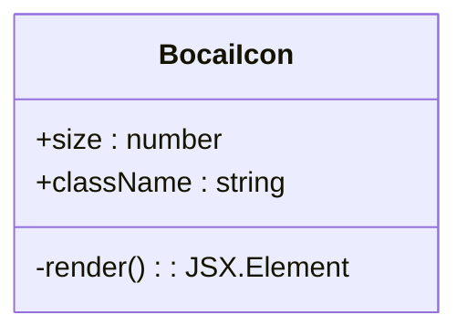
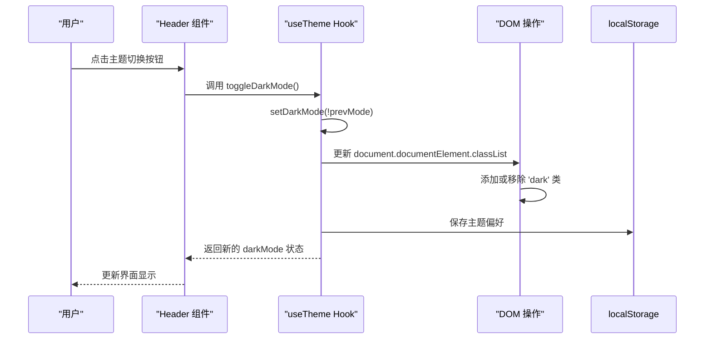
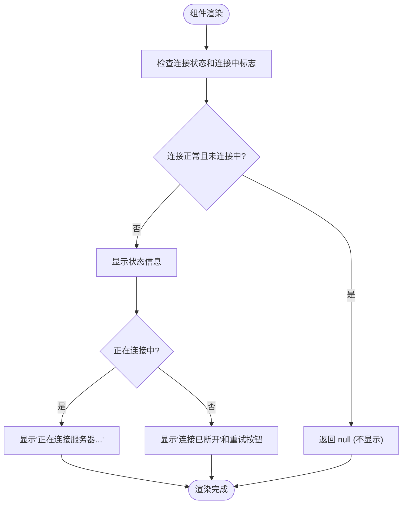
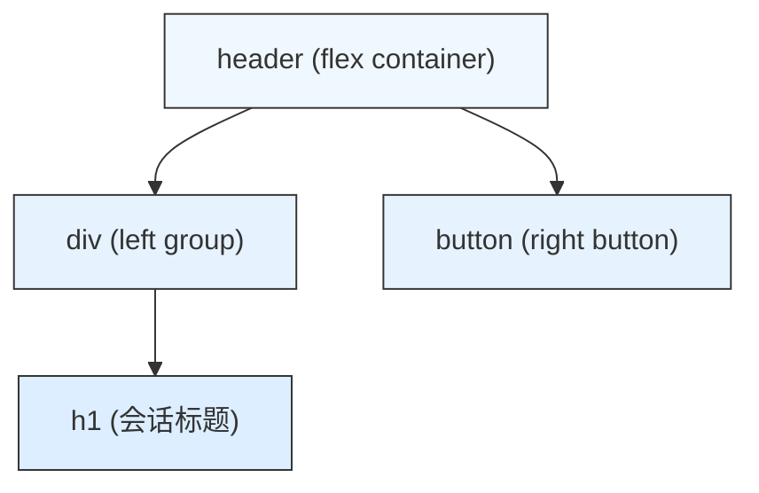

# Header 组件

<cite>
**本文档中引用的文件**   
- [Header.jsx](file://frontend/src/components/Header.jsx)
- [BocaiIcon.jsx](file://frontend/src/components/BocaiIcon.jsx)
- [ConnectionStatus.jsx](file://frontend/src/components/ConnectionStatus.jsx)
- [useTheme.js](file://frontend/src/hooks/useTheme.js)
- [App.jsx](file://frontend/src/App.jsx)
- [tailwind.config.js](file://frontend/tailwind.config.js)
</cite>

## 目录
1. [组件概述](#组件概述)
2. [核心功能集成](#核心功能集成)
3. [主题切换逻辑分析](#主题切换逻辑分析)
4. [连接状态集成](#连接状态集成)
5. [布局结构与响应式设计](#布局结构与响应式设计)
6. [定制化扩展建议](#定制化扩展建议)

## 组件概述

Header 组件是聊天应用的顶部导航栏，负责展示当前会话标题、品牌标识、连接状态和主题切换功能。该组件通过组合多个子组件和自定义 Hook，实现了简洁且功能完整的用户界面。

**Section sources**
- [Header.jsx](file://frontend/src/components/Header.jsx)

## 核心功能集成

### 品牌标识集成

Header 组件通过集成 `BocaiIcon` 组件来展示品牌标识。`BocaiIcon` 是一个可复用的 SVG 图标组件，其设计包含以下元素：
- **外圈圆形**：代表银行的稳定性
- **内部B字母**：代表 Bank 和 BOCAI
- **装饰性圆点**：代表智能和创新

该图标使用 `currentColor` 属性，使其颜色能够继承父元素的文本颜色，便于在不同主题下自动适配。



**Diagram sources**
- [BocaiIcon.jsx](file://frontend/src/components/BocaiIcon.jsx)

### 主题切换控件

Header 组件集成了主题切换按钮，允许用户在浅色模式和暗黑模式之间切换。按钮使用 `lucide-react` 库中的 `Sun` 和 `Moon` 图标，根据当前主题状态动态显示相应的图标。

**Section sources**
- [Header.jsx](file://frontend/src/components/Header.jsx)

## 主题切换逻辑分析

### useTheme Hook 实现

主题切换功能依赖于 `useTheme` 自定义 Hook，该 Hook 管理暗黑模式状态、切换功能和本地存储。

```javascript
const useTheme = () => {
  const [darkMode, setDarkMode] = useState(false);

  // 初始化主题设置
  useEffect(() => {
    const isDark = localStorage.getItem('darkMode') === 'true' ||
      (window.matchMedia('(prefers-color-scheme: dark)').matches && localStorage.getItem('darkMode') !== 'false');
    setDarkMode(isDark);
  }, []);

  // 应用主题变化
  useEffect(() => {
    if (darkMode) {
      document.documentElement.classList.add('dark');
    } else {
      document.documentElement.classList.remove('dark');
    }
    localStorage.setItem('darkMode', darkMode);
  }, [darkMode]);

  // 切换主题函数
  const toggleDarkMode = () => {
    setDarkMode(prevMode => !prevMode);
  };

  return {
    darkMode,
    toggleDarkMode
  };
};
```



**Diagram sources**
- [useTheme.js](file://frontend/src/hooks/useTheme.js)

### 图标状态切换

主题切换按钮的图标状态根据 `darkMode` 布尔值进行切换：
- 当 `darkMode` 为 `true` 时，显示 `Sun` 图标（表示可切换到浅色模式）
- 当 `darkMode` 为 `false` 时，显示 `Moon` 图标（表示可切换到暗黑模式）

按钮的 `aria-label` 属性也会相应更新，以提供无障碍访问支持。

**Section sources**
- [Header.jsx](file://frontend/src/components/Header.jsx)

## 连接状态集成

### ConnectionStatus 组件分析

虽然 `ConnectionStatus` 组件未直接在 Header 中使用，但它是应用状态可视化的重要组成部分。该组件根据 WebSocket 连接状态决定是否显示状态信息。

```javascript
const ConnectionStatus = ({ isConnecting, connectionStatus, onReconnect }) => {
  if (connectionStatus === 'connected' && !isConnecting) {
    return null;
  }

  return (
    <div className="text-center text-sm pb-4">
      {isConnecting && (
        <div className="text-gray-500">
          正在连接服务器...
        </div>
      )}
      {connectionStatus !== 'connected' && !isConnecting && (
        <div className="text-red-500">
          连接已断开，
          <button 
            onClick={onReconnect}
            className="text-blue-600 hover:text-blue-800 underline ml-1"
          >
            点击重试
          </button>
        </div>
      )}
    </div>
  );
};
```



**Diagram sources**
- [ConnectionStatus.jsx](file://frontend/src/components/ConnectionStatus.jsx)

### 集成上下文

`ConnectionStatus` 组件在 `App.jsx` 中被集成，位于输入框区域下方，与 Header 组件共同构成完整的状态展示体系。

**Section sources**
- [App.jsx](file://frontend/src/App.jsx)

## 布局结构与响应式设计

### Flexbox 布局实现

Header 组件使用 Flexbox 实现水平分布与垂直居中布局。主要通过以下 Tailwind CSS 类实现：

- `flex`: 启用 Flexbox 布局
- `justify-between`: 在主轴上两端对齐
- `items-center`: 在交叉轴上居中对齐
- `space-x-3`: 在子元素之间创建水平间距



**Diagram sources**
- [Header.jsx](file://frontend/src/components/Header.jsx)

### 响应式设计考虑

项目使用 Tailwind CSS 作为样式框架，其默认配置包含标准的响应式断点：
- `sm`: 640px
- `md`: 768px
- `lg`: 1024px
- `xl`: 1280px

虽然 Header 组件本身没有特定的响应式调整，但整个应用的布局会根据屏幕尺寸进行优化。例如，侧边栏在小屏幕设备上可以折叠以节省空间。

**Section sources**
- [tailwind.config.js](file://frontend/tailwind.config.js)

## 定制化扩展建议

### 添加用户头像

开发者可以通过在 Header 组件的右侧添加用户头像组件来增强个性化体验：

```jsx
<header className="bg-white dark:bg-gray-900 px-6 py-4 flex justify-between items-center">
  <div className="flex items-center space-x-3">
    <h1 className="text-xl font-semibold text-gray-900 dark:text-white">
      {currentConversationTitle || '新对话'}
    </h1>
  </div>
  <div className="flex items-center space-x-4">
    <button onClick={onToggleDarkMode} className="p-2 rounded-xl hover:bg-gray-100 dark:hover:bg-gray-800 transition-colors">
      {darkMode ? <Sun size={20} className="text-gray-600 dark:text-gray-400" /> : <Moon size={20} className="text-gray-600 dark:text-gray-400" />}
    </button>
    
  </div>
</header>
```

### 添加通知图标

可以集成通知图标以显示未读消息或系统通知：

```jsx
<header className="bg-white dark:bg-gray-900 px-6 py-4 flex justify-between items-center">
  <div className="flex items-center space-x-3">
    <h1 className="text-xl font-semibold text-gray-900 dark:text-white">
      {currentConversationTitle || '新对话'}
    </h1>
  </div>
  <div className="flex items-center space-x-4">
    <button onClick={onToggleDarkMode} className="p-2 rounded-xl hover:bg-gray-100 dark:hover:bg-gray-800 transition-colors">
      {darkMode ? <Sun size={20} className="text-gray-600 dark:text-gray-400" /> : <Moon size={20} className="text-gray-600 dark:text-gray-400" />}
    </button>
    <button className="relative p-2">
      <Bell size={20} className="text-gray-600 dark:text-gray-400" />
      <span className="absolute top-1 right-1 w-2 h-2 bg-red-500 rounded-full"></span>
    </button>
  </div>
</header>
```

**Section sources**
- [Header.jsx](file://frontend/src/components/Header.jsx)