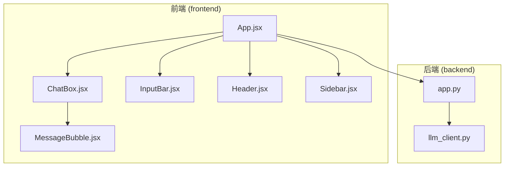
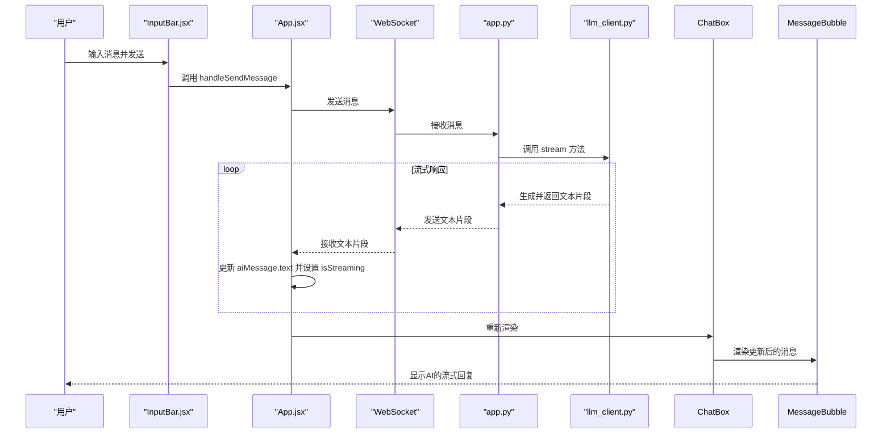
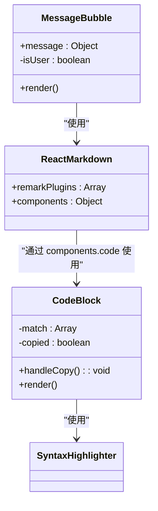
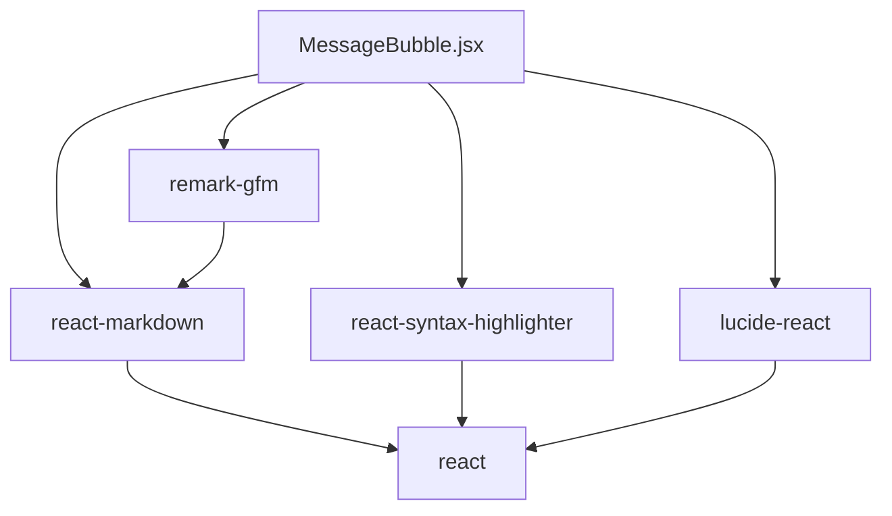

# MessageBubble 组件

<cite>
**本文档中引用的文件**   
- [MessageBubble.jsx](file://frontend/src/components/MessageBubble.jsx)
- [package.json](file://frontend/package.json)
- [ChatBox.jsx](file://frontend/src/components/ChatBox.jsx)
- [App.jsx](file://frontend/src/App.jsx)
- [ui_design.md](file://ui_design.md)
</cite>

## 目录
1. [简介](#简介)
2. [项目结构](#项目结构)
3. [核心组件](#核心组件)
4. [架构概述](#架构概述)
5. [详细组件分析](#详细组件分析)
6. [依赖分析](#依赖分析)
7. [性能考虑](#性能考虑)
8. [故障排除指南](#故障排除指南)
9. [结论](#结论)

## 简介
本文件深入剖析了 `MessageBubble` 组件，该组件是聊天应用前端的核心部分，负责渲染用户与AI助手之间的消息。文档重点分析了其对Markdown和代码块的富文本渲染能力，通过 `react-markdown` 和 `react-syntax-highlighter` 库实现。同时，文档详细解释了组件如何通过Tailwind CSS区分不同消息角色的样式，并探讨了AI流式响应时的加载状态处理机制。

## 项目结构
项目采用前后端分离的架构，前端位于 `frontend` 目录，后端位于 `backend` 目录。前端使用Vite构建，React作为UI框架，并通过WebSocket与后端进行实时通信。



**图示来源**
- [App.jsx](file://frontend/src/App.jsx)
- [ChatBox.jsx](file://frontend/src/components/ChatBox.jsx)
- [MessageBubble.jsx](file://frontend/src/components/MessageBubble.jsx)
- [app.py](file://backend/app.py)

## 核心组件
`MessageBubble` 组件是消息展示的核心，它接收一个 `message` 对象作为属性，根据消息的发送者（用户或AI）应用不同的样式，并利用 `react-markdown` 将消息文本中的Markdown语法解析为富文本。

**组件来源**
- [MessageBubble.jsx](file://frontend/src/components/MessageBubble.jsx)

## 架构概述
整个聊天应用的架构围绕WebSocket通信展开。用户在 `InputBar` 中输入消息后，`App` 组件通过WebSocket将消息发送给后端 `app.py`。后端调用 `llm_client.py` 与大语言模型交互，并将流式响应通过WebSocket逐段返回给前端。前端的 `App` 组件接收到数据后，更新状态，`ChatBox` 组件重新渲染，最终由 `MessageBubble` 组件将内容展示给用户。



**图示来源**
- [App.jsx](file://frontend/src/App.jsx#L72-L123)
- [ChatBox.jsx](file://frontend/src/components/ChatBox.jsx)
- [MessageBubble.jsx](file://frontend/src/components/MessageBubble.jsx)
- [app.py](file://backend/app.py#L44-L68)
- [llm_client.py](file://backend/llm_client.py)

## 详细组件分析

### MessageBubble 组件分析
`MessageBubble` 组件的核心功能是将纯文本或Markdown格式的消息安全地渲染为富文本，并提供良好的视觉体验。

#### Markdown 与代码块渲染
组件通过 `react-markdown` 库解析 `message.text`。它使用 `remarkGfm` 插件来支持GitHub风格的Markdown，如表格、任务列表等。对于代码块，组件定义了一个名为 `CodeBlock` 的自定义渲染器。



**图示来源**
- [MessageBubble.jsx](file://frontend/src/components/MessageBubble.jsx#L1-L93)

`CodeBlock` 组件首先通过正则表达式 `/language-(\w+)/` 从 `className` 中提取代码的语言类型。如果匹配成功，则使用 `react-syntax-highlighter` 进行高亮显示；否则，将其作为内联代码处理。高亮主题使用了 `oneDark` 暗色主题，提供了良好的可读性。

#### 自定义渲染器配置
`ReactMarkdown` 的 `components` 属性允许对不同的Markdown元素进行深度定制。例如：
- `a` 标签被配置为在新窗口打开。
- `h1`, `h2`, `h3` 标签被赋予了特定的字体大小和边距。
- `p` 标签的边距会根据内容是否为纯文本进行动态调整，避免了不必要的垂直间距。
- `ul` 和 `ol` 列表被赋予了缩进和适当的边距。

这种配置确保了渲染出的富文本既美观又符合设计规范。

#### 消息角色样式区分
组件通过 `message.sender` 属性判断消息的发送者。当 `sender` 为 `'user'` 时，消息气泡右对齐，背景为蓝色渐变；当 `sender` 为 `'ai'` 时，消息气泡左对齐，背景为浅灰色（暗黑模式下为深灰色）。这种视觉差异通过Tailwind CSS的条件类名实现，代码如下：
```jsx
<div className={`flex mb-6 ${isUser ? 'justify-end' : 'justify-start'}`}>
  <div className={`... ${isUser ? 'ml-8 max-w-[70%]' : 'mr-8 max-w-full w-full'}`}>
    <div className={`... ${isUser ? 'bg-gradient-to-br from-blue-500 to-blue-600 text-white ...' : 'bg-white/80 dark:bg-gray-800/80 text-gray-800 dark:text-gray-100 ...'}`}>
      ...
    </div>
  </div>
</div>
```

#### 加载中状态处理
虽然 `MessageBubble` 组件本身不直接处理加载动画，但其渲染的数据源 `message` 对象包含一个 `isStreaming` 字段，用于标识AI消息是否正在流式生成。当 `isStreaming` 为 `true` 时，`message.text` 是一个逐步增长的字符串。`ui_design.md` 文件中明确指出，AI回复时会显示三点加载动画 `...`。这种效果是通过在 `App.jsx` 中创建一个 `isStreaming: true` 的AI消息对象，并随着WebSocket接收到的数据不断更新其 `text` 字段来实现的。`MessageBubble` 组件会实时渲染这个不断变化的 `text`，从而呈现出文本逐字出现的动画效果。

**组件来源**
- [MessageBubble.jsx](file://frontend/src/components/MessageBubble.jsx#L73-L93)
- [App.jsx](file://frontend/src/App.jsx#L100-L123)
- [ui_design.md](file://ui_design.md#L63-L94)

## 依赖分析
`MessageBubble` 组件的正常运行依赖于多个第三方库，这些依赖在 `package.json` 文件中明确定义。



**图示来源**
- [package.json](file://frontend/package.json)
- [MessageBubble.jsx](file://frontend/src/components/MessageBubble.jsx)

- **react-markdown**: 版本 `^8.0.7`，是核心的Markdown解析库。任何升级都可能带来API变更，需要仔细测试。
- **react-syntax-highlighter**: 版本 `^15.5.0`，负责代码高亮。其 `oneDark` 主题提供了优秀的视觉效果。
- **remark-gfm**: 版本 `^3.0.1`，为 `react-markdown` 提供了对表格、删除线等扩展语法的支持。
- **lucide-react**: 版本 `^0.263.1`，提供了“复制”按钮的图标。

## 性能考虑
`MessageBubble` 组件的性能主要受 `react-markdown` 解析复杂Markdown内容的影响。对于包含大量代码块或复杂格式的长消息，解析过程可能会导致短暂的渲染延迟。建议在后端对过长的响应进行分段处理，或在前端实现虚拟滚动以优化长对话的性能。

## 故障排除指南
- **问题：代码块未高亮显示**
  - **检查点**：确认 `message.text` 中的代码块语法是否正确，例如 ```javascript ... ```。确保 `className` 包含 `language-javascript` 类。
- **问题：Markdown语法未被解析**
  - **检查点**：检查 `react-markdown` 是否正确安装，`remarkGfm` 插件是否已正确传入 `remarkPlugins` 数组。
- **问题：复制按钮无效**
  - **检查点**：检查浏览器是否支持 `navigator.clipboard.writeText` API，通常需要在HTTPS环境下运行。
- **问题：AI消息无流式效果**
  - **检查点**：检查 `App.jsx` 中是否正确创建了 `isStreaming: true` 的AI消息，并且WebSocket连接是否正常工作，数据是否能正确接收并更新状态。

**组件来源**
- [MessageBubble.jsx](file://frontend/src/components/MessageBubble.jsx)
- [App.jsx](file://frontend/src/App.jsx)

## 结论
`MessageBubble` 组件是一个功能强大且设计精良的UI组件，它成功地将Markdown和代码块渲染、角色样式区分以及流式响应处理等复杂功能集成在一起。通过合理利用第三方库和Tailwind CSS，该组件为用户提供了现代化、美观且交互性强的聊天体验。其与 `App` 和 `ChatBox` 组件的清晰职责划分，也体现了良好的前端架构设计。