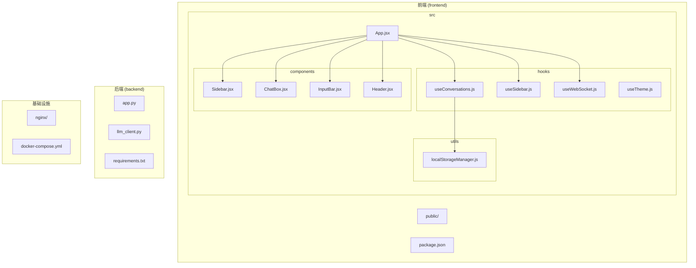
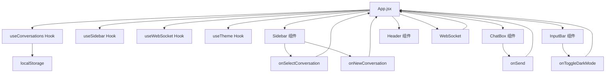
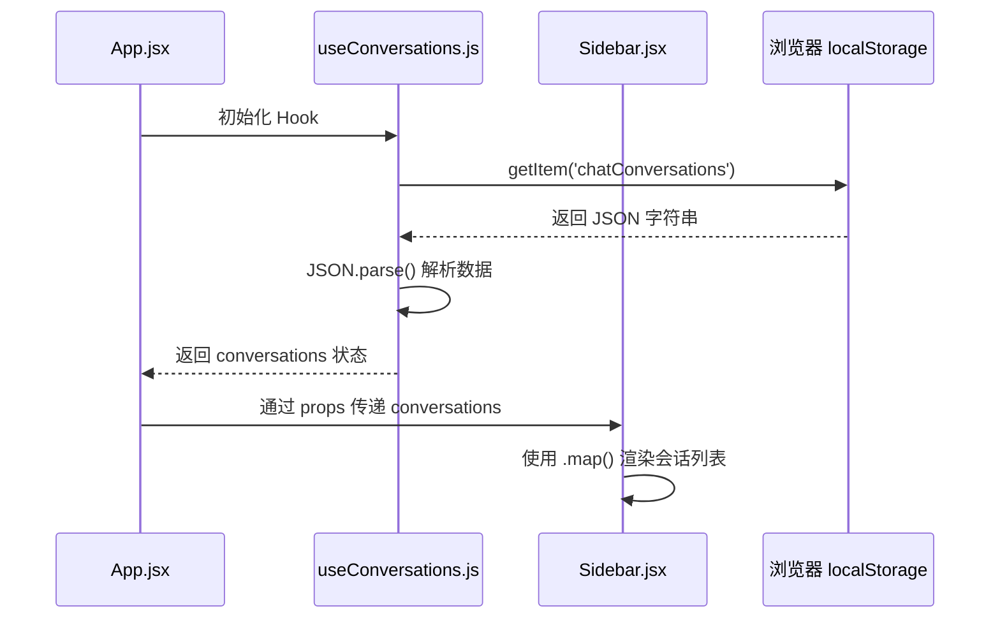
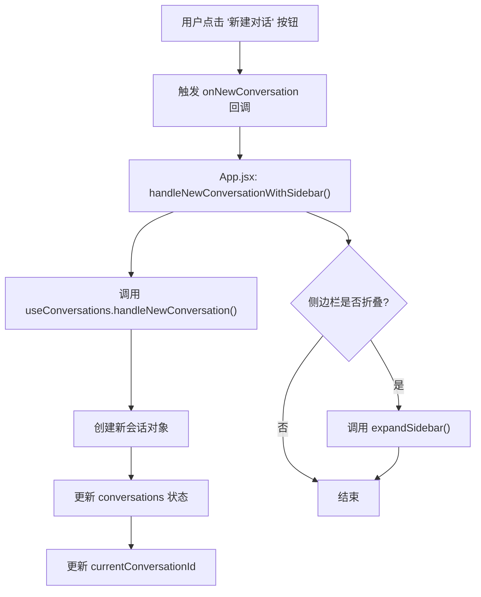
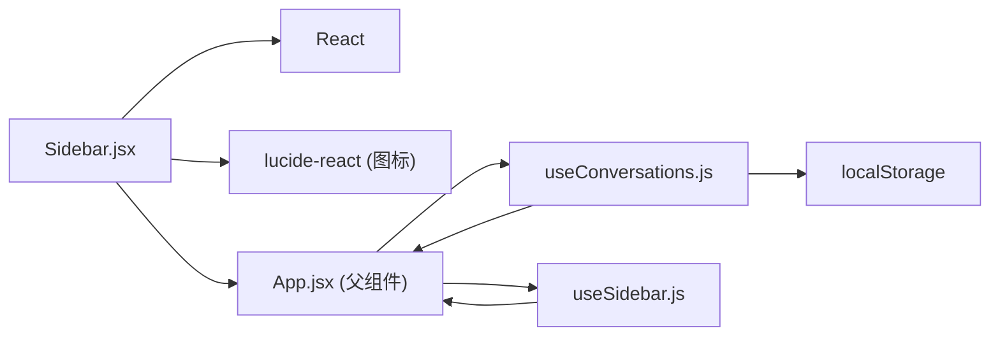

# Sidebar 组件

<cite>
**本文档中引用的文件**   
- [Sidebar.jsx](file://frontend/src/components/Sidebar.jsx)
- [App.jsx](file://frontend/src/App.jsx)
- [useConversations.js](file://frontend/src/hooks/useConversations.js)
- [useSidebar.js](file://frontend/src/hooks/useSidebar.js)
- [localStorageManager.js](file://frontend/src/utils/localStorageManager.js)
</cite>

## 目录
1. [简介](#简介)
2. [项目结构](#项目结构)
3. [核心组件](#核心组件)
4. [架构概览](#架构概览)
5. [详细组件分析](#详细组件分析)
6. [依赖分析](#依赖分析)
7. [性能考虑](#性能考虑)
8. [故障排除指南](#故障排除指南)
9. [结论](#结论)

## 简介
本文件深入解析了 `Sidebar` 组件的实现机制，该组件作为聊天应用中的会话列表容器，承担着管理用户会话、提供导航和交互的核心功能。文档详细阐述了组件如何通过自定义 Hook 获取和渲染会话数据，其与父组件的通信方式，以及关键的交互逻辑如新建会话和会话切换。同时，文档也分析了组件的视觉反馈、可访问性设计和状态管理策略，为开发者提供了全面的理解和扩展建议。

## 项目结构
该项目采用典型的前后端分离架构，前端使用 React 框架构建，后端使用 Python (Flask) 提供 API 服务。前端代码组织清晰，遵循功能模块化原则。



**图示来源**
- [Sidebar.jsx](file://frontend/src/components/Sidebar.jsx)
- [App.jsx](file://frontend/src/App.jsx)
- [useConversations.js](file://frontend/src/hooks/useConversations.js)
- [useSidebar.js](file://frontend/src/hooks/useSidebar.js)
- [localStorageManager.js](file://frontend/src/utils/localStorageManager.js)

**本节来源**
- [Sidebar.jsx](file://frontend/src/components/Sidebar.jsx)
- [App.jsx](file://frontend/src/App.jsx)

## 核心组件
`Sidebar` 组件是用户与会话历史进行交互的主要界面。它通过 `useConversations` Hook 获取会话数据，并渲染一个可滚动的会话列表。每个会话项都是一个可点击的按钮，点击后会触发 `onSelectConversation` 回调，实现会话切换。组件还包含一个“新建对话”按钮，用于创建新的聊天会话。侧边栏支持折叠/展开状态，通过 `isCollapsed` prop 和 `onToggleCollapse` 回调来控制，以适应不同的屏幕空间。

**本节来源**
- [Sidebar.jsx](file://frontend/src/components/Sidebar.jsx)
- [useConversations.js](file://frontend/src/hooks/useConversations.js)

## 架构概览
整个应用的架构围绕 React 的组件化和 Hook 状态管理展开。`App` 组件作为根组件，负责协调全局状态。它通过多个自定义 Hook (`useConversations`, `useSidebar`, `useWebSocket`) 来管理会话、UI 状态和网络连接。`Sidebar` 组件作为子组件，接收来自 `App` 的数据和回调函数，实现特定的 UI 功能。数据流是单向的，从父组件流向子组件，而用户交互则通过回调函数将事件和数据传回父组件，形成一个清晰的控制流。



**图示来源**
- [App.jsx](file://frontend/src/App.jsx)
- [useConversations.js](file://frontend/src/hooks/useConversations.js)
- [useSidebar.js](file://frontend/src/hooks/useSidebar.js)
- [Sidebar.jsx](file://frontend/src/components/Sidebar.jsx)

## 详细组件分析
本节将对 `Sidebar` 组件进行深入剖析，涵盖其数据获取、渲染逻辑、交互机制和状态管理。

### Sidebar 组件分析
`Sidebar` 组件是一个功能丰富的 UI 容器，其核心职责是展示会话列表并提供用户交互入口。

#### 数据获取与渲染
组件通过 `conversations` prop 接收来自父组件的会话数据数组。这些数据由 `useConversations` Hook 管理，该 Hook 负责初始化会话、从 `localStorage` 加载历史记录，并在会话更新时将其持久化。



**图示来源**
- [App.jsx](file://frontend/src/App.jsx#L10-L25)
- [useConversations.js](file://frontend/src/hooks/useConversations.js#L15-L45)
- [Sidebar.jsx](file://frontend/src/components/Sidebar.jsx#L3-L146)

**本节来源**
- [Sidebar.jsx](file://frontend/src/components/Sidebar.jsx)
- [useConversations.js](file://frontend/src/hooks/useConversations.js)

#### 会话切换与选中状态
当用户点击某个会话项时，会触发 `onClick` 事件处理器，该处理器调用 `onSelectConversation(conversation.id)` 回调函数。这个函数最终会更新 `App` 组件中的 `currentConversationId` 状态，从而触发整个应用的重新渲染，使 `ChatBox` 组件显示选中会话的内容。

选中状态的视觉反馈通过条件渲染的 CSS 类实现。当 `conversation.id === currentConversationId` 时，会话项会应用一个高亮样式，包括蓝色背景、边框和特定的文本颜色。

```javascript
// 选中状态的 CSS 类逻辑
className={`... ${
  conversation.id === currentConversationId
    ? 'bg-blue-50/80 dark:bg-blue-900/30 border border-blue-200/60 dark:border-blue-800/60 shadow-sm'
    : 'hover:bg-white/50 dark:hover:bg-gray-800/50 hover:shadow-sm'
}`}
```

**本节来源**
- [Sidebar.jsx](file://frontend/src/components/Sidebar.jsx#L79-L85)
- [App.jsx](file://frontend/src/App.jsx#L132)

#### 新建会话交互流程
“新建对话”按钮的交互逻辑是 `Sidebar` 组件的关键功能。其流程如下：
1.  用户点击“新建对话”按钮。
2.  按钮的 `onClick` 事件触发 `onNewConversation` 回调。
3.  该回调在 `App` 组件中被定义为 `handleNewConversationWithSidebar` 函数。
4.  `handleNewConversationWithSidebar` 首先调用 `useConversations` Hook 中的 `handleNewConversation` 函数。
5.  `handleNewConversation` 创建一个带有唯一 ID 和初始 AI 消息的新会话对象，并将其添加到会话列表的开头，同时更新当前会话 ID。
6.  如果侧边栏当前处于折叠状态，`handleNewConversationWithSidebar` 还会调用 `expandSidebar()` 函数将其展开，确保用户能看到新创建的会话。



**图示来源**
- [Sidebar.jsx](file://frontend/src/components/Sidebar.jsx#L57-L62)
- [App.jsx](file://frontend/src/App.jsx#L72-L88)
- [useConversations.js](file://frontend/src/hooks/useConversations.js#L65-L85)

**本节来源**
- [Sidebar.jsx](file://frontend/src/components/Sidebar.jsx)
- [App.jsx](file://frontend/src/App.jsx)
- [useConversations.js](file://frontend/src/hooks/useConversations.js)

#### 文本截断处理
为了在有限的空间内优雅地显示长文本，`Sidebar` 组件使用了 CSS 的 `truncate` 类和 JavaScript 的 `substring` 方法。
*   **会话标题**: 使用 `truncate` CSS 类，该类通常由 Tailwind CSS 提供，通过 `text-overflow: ellipsis` 实现文本溢出时的省略号效果。
*   **最后一条消息预览**: 使用 JavaScript 的 `substring(0, 40)` 方法截取最后一条消息的前 40 个字符，并手动添加 `...` 后缀。

```javascript
// 消息预览的文本截断
{conversation.messages[conversation.messages.length - 1]?.text.substring(0, 40)}...
```

**本节来源**
- [Sidebar.jsx](file://frontend/src/components/Sidebar.jsx#L111)

#### 父子通信机制
`Sidebar` 组件与 `App` 组件之间的通信完全通过 props 实现，遵循 React 的单向数据流原则。
*   **数据流 (父 -> 子)**: `App` 组件将 `conversations`、`currentConversationId`、`isCollapsed` 等状态作为 props 传递给 `Sidebar`。
*   **事件流 (子 -> 父)**: `Sidebar` 组件通过调用 `onSelectConversation`、`onNewConversation`、`onToggleCollapse` 等回调函数，将用户的操作事件和相关数据（如会话 ID）传递回 `App` 组件。

这种模式确保了状态的集中管理，使得 `App` 组件能够协调整个应用的状态变化。

**本节来源**
- [App.jsx](file://frontend/src/App.jsx#L129-L134)
- [Sidebar.jsx](file://frontend/src/components/Sidebar.jsx#L3)

#### 空状态渲染
当没有会话时，`Sidebar` 组件本身不直接处理空状态。空状态的处理逻辑内置于 `useConversations` Hook 中。该 Hook 维护一个 `initialConversations` 数组，其中包含两个默认会话。因此，应用启动时，`conversations` 数组永远不会为空，从而避免了需要在 `Sidebar` 中专门渲染“暂无会话”提示的情况。底部的会话计数信息 `共 {conversations.length} 个对话` 在会话为空时会显示“共 0 个对话”。

**本节来源**
- [useConversations.js](file://frontend/src/hooks/useConversations.js#L6-L20)
- [Sidebar.jsx](file://frontend/src/components/Sidebar.jsx#L135-L138)

#### 可访问性设计
`Sidebar` 组件在可访问性方面有基本的考虑，主要体现在以下几个方面：
*   **语义化按钮**: 所有可点击的元素（会话项、新建按钮、折叠按钮）都使用了 `<button>` 元素，具有正确的键盘交互行为。
*   **ARIA 标签**: 关键按钮配备了 `aria-label` 属性，为屏幕阅读器用户提供清晰的说明。例如，折叠按钮的标签会根据当前状态动态变化为“展开侧边栏”或“折叠侧边栏”。
*   **键盘导航**: 由于使用了标准的 `<button>` 元素，用户可以通过 `Tab` 键在会话列表和按钮之间进行导航，并通过 `Enter` 或 `Space` 键触发点击事件。

```javascript
// 折叠按钮的 ARIA 标签
aria-label={isCollapsed ? "展开侧边栏" : "折叠侧边栏"}
```

**本节来源**
- [Sidebar.jsx](file://frontend/src/components/Sidebar.jsx#L26)
- [Sidebar.jsx](file://frontend/src/components/Sidebar.jsx#L61)

### 扩展建议
为 `Sidebar` 组件添加会话重命名或删除功能，需要在现有代码基础上进行修改：

1.  **添加功能按钮**: 在每个会话项的右侧（非折叠状态下）添加“重命名”和“删除”图标按钮。
2.  **实现删除功能**:
    *   在 `useConversations.js` 中添加 `deleteConversation(conversationId)` 函数，该函数使用 `setConversations` 过滤掉指定 ID 的会话。
    *   将此函数通过 props 传递给 `Sidebar`。
    *   在 `Sidebar` 中为“删除”按钮绑定 `onClick` 事件，调用 `deleteConversation(id)`。
3.  **实现重命名功能**:
    *   在 `useConversations.js` 中完善 `updateConversationTitle` 函数，使其能接受任意标题。
    *   在 `Sidebar` 中，当用户点击“重命名”按钮时，可以将当前会话项的文本替换为一个 `<input>` 输入框，并将当前标题作为 `value`。
    *   监听输入框的 `onBlur` 或 `onKeyDown` (Enter) 事件，获取新标题并调用 `updateConversationTitle(id, newTitle)`。
    *   更新完成后，将输入框切换回文本显示。

这些修改将显著增强用户对会话的管理能力。

## 依赖分析
`Sidebar` 组件的依赖关系清晰且松耦合。



**图示来源**
- [Sidebar.jsx](file://frontend/src/components/Sidebar.jsx#L1)
- [App.jsx](file://frontend/src/App.jsx#L1-L2)
- [useConversations.js](file://frontend/src/hooks/useConversations.js#L1)
- [useSidebar.js](file://frontend/src/hooks/useSidebar.js#L1)

**本节来源**
- [Sidebar.jsx](file://frontend/src/components/Sidebar.jsx)
- [App.jsx](file://frontend/src/App.jsx)
- [useConversations.js](file://frontend/src/hooks/useConversations.js)
- [useSidebar.js](file://frontend/src/hooks/useSidebar.js)

## 性能考虑
`Sidebar` 组件的性能表现良好，主要得益于 React 的虚拟 DOM 和高效的更新机制。
*   **列表渲染**: 使用 `conversations.map()` 渲染列表时，为每个 `<div>` 元素提供了唯一的 `key={conversation.id}`，这有助于 React 高效地识别和更新列表项，避免不必要的重渲染。
*   **状态更新**: 会话数据的更新由 `useConversations` Hook 统一管理，通过 `setConversations` 进行批量状态更新，减少了不必要的中间状态。
*   **副作用优化**: `useConversations` Hook 中的 `useEffect` 依赖于 `[conversations]`，确保只有在会话列表真正发生变化时才执行 `localStorage` 的写入操作，避免了频繁的磁盘 I/O。

## 故障排除指南
*   **问题**: 会话列表为空或未加载历史记录。
  *   **检查**: 确认 `useConversations.js` 中的 `localStorage` 键名 `chatConversations` 是否正确，检查浏览器开发者工具的 Application/Storage 选项卡中是否存在该数据。
*   **问题**: 点击会话无法切换。
  *   **检查**: 确认 `App.jsx` 中传递给 `Sidebar` 的 `onSelectConversation` prop 是否正确绑定到 `handleSelectConversation` 函数。
*   **问题**: 新建会话后侧边栏未自动展开。
  *   **检查**: 确认 `App.jsx` 中 `onNewConversation` 传递的是 `handleNewConversationWithSidebar` 而非直接的 `handleNewConversation`。
*   **问题**: 侧边栏折叠/展开无反应。
  *   **检查**: 确认 `useSidebar.js` 中的 `toggleSidebarCollapse` 函数是否正确更新了 `isSidebarCollapsed` 状态，并且该状态已正确传递给 `Sidebar` 组件。

**本节来源**
- [useConversations.js](file://frontend/src/hooks/useConversations.js#L30-L45)
- [App.jsx](file://frontend/src/App.jsx#L133-L134)
- [useSidebar.js](file://frontend/src/hooks/useSidebar.js#L7-L10)

## 结论
`Sidebar` 组件是一个设计良好、功能完整的 React 组件，它有效地实现了会话列表的展示和管理。通过与 `useConversations` 和 `useSidebar` 等自定义 Hook 的协作，它实现了数据与 UI 的分离，保证了代码的可维护性和可扩展性。组件在视觉反馈、可访问性和性能方面都表现出色。理解其工作原理为开发者提供了坚实的基础，以便在此之上进行功能扩展和优化。