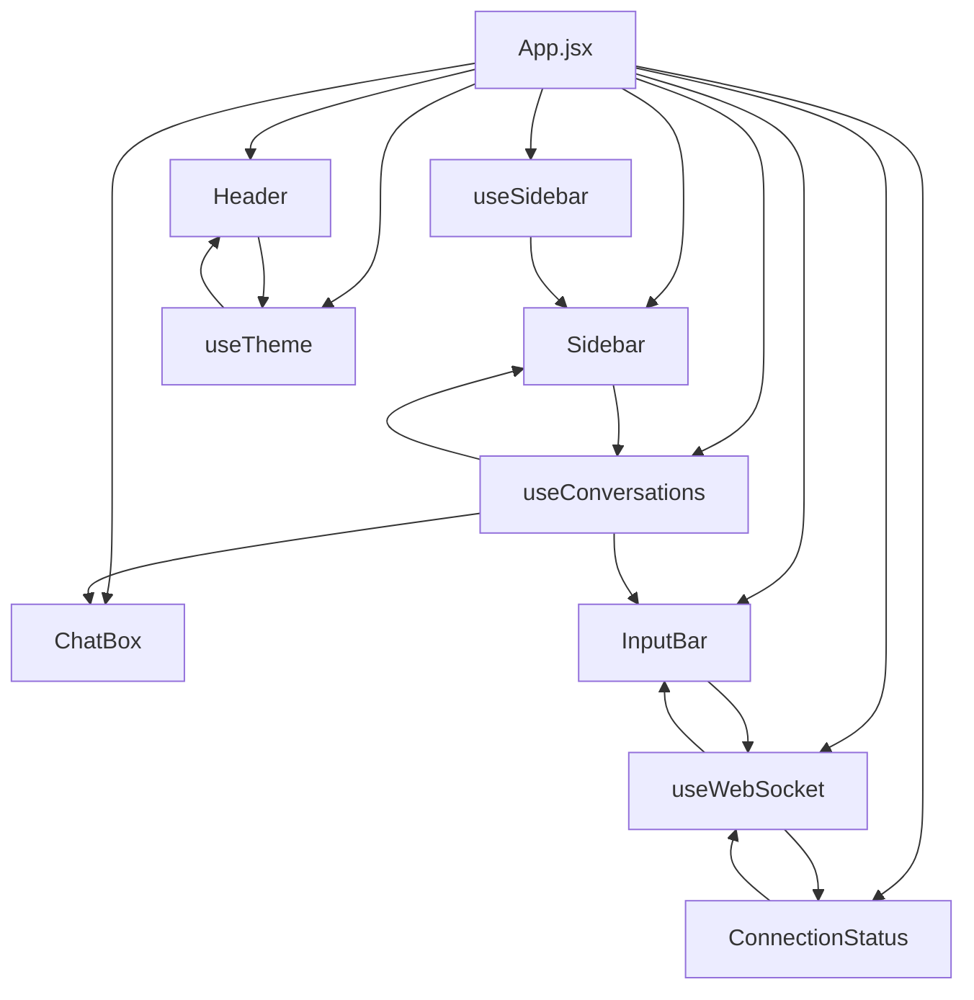
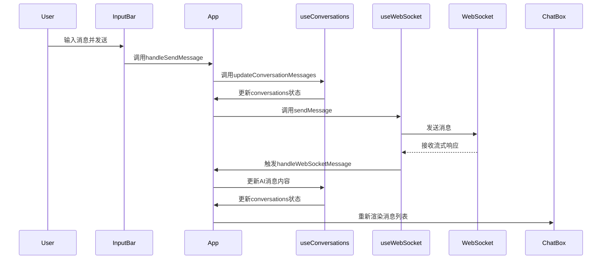
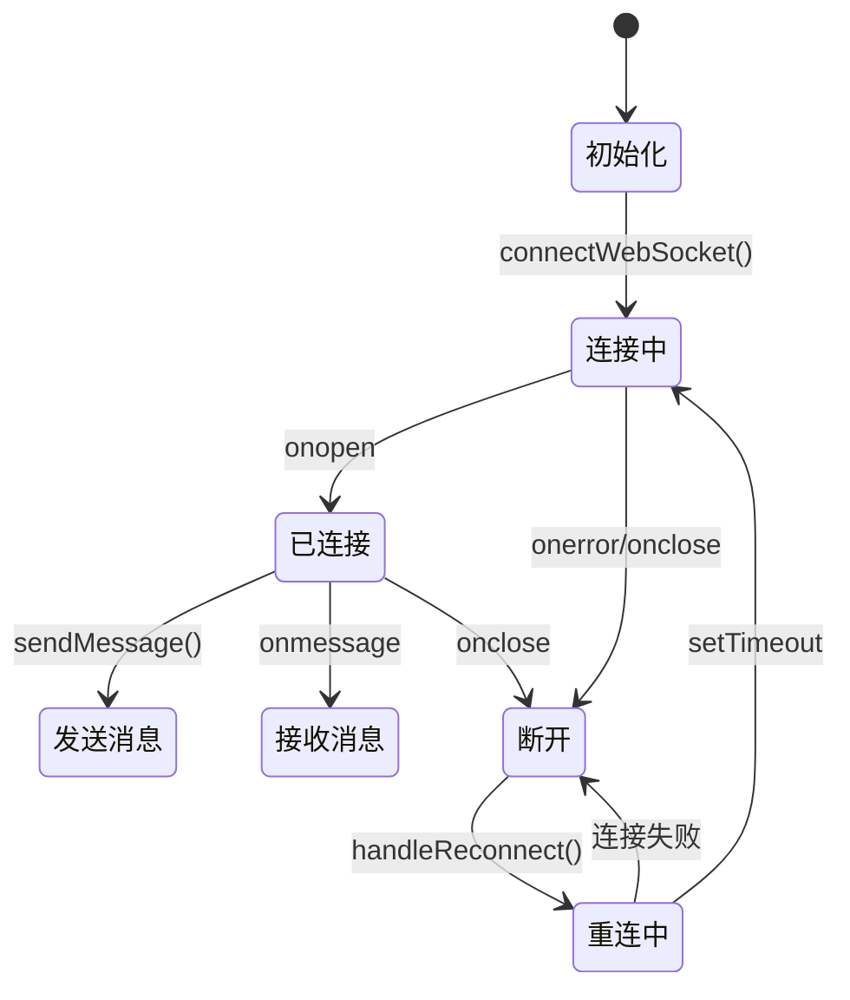
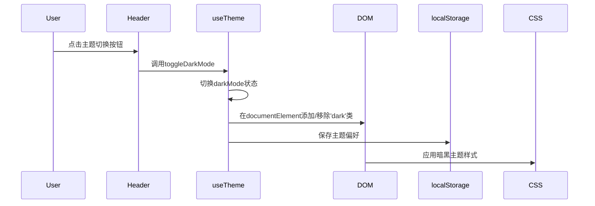

# 前端组件架构

<cite>
**本文档引用的文件**   
- [App.jsx](file://frontend/src/App.jsx)
- [Sidebar.jsx](file://frontend/src/components/Sidebar.jsx)
- [ChatBox.jsx](file://frontend/src/components/ChatBox.jsx)
- [InputBar.jsx](file://frontend/src/components/InputBar.jsx)
- [MessageBubble.jsx](file://frontend/src/components/MessageBubble.jsx)
- [Header.jsx](file://frontend/src/components/Header.jsx)
- [ConnectionStatus.jsx](file://frontend/src/components/ConnectionStatus.jsx)
- [BocaiIcon.jsx](file://frontend/src/components/BocaiIcon.jsx)
- [useConversations.js](file://frontend/src/hooks/useConversations.js)
- [useWebSocket.js](file://frontend/src/hooks/useWebSocket.js)
- [useTheme.js](file://frontend/src/hooks/useTheme.js)
- [useSidebar.js](file://frontend/src/hooks/useSidebar.js)
- [tailwind.config.js](file://frontend/tailwind.config.js)
- [index.css](file://frontend/src/index.css)
</cite>

## 目录
1. [前端组件架构](#前端组件架构)
2. [核心组件分析](#核心组件分析)
3. [组件组合与数据流](#组件组合与数据流)
4. [状态管理机制](#状态管理机制)
5. [UI组件详细设计](#ui组件详细设计)
6. [样式与主题系统](#样式与主题系统)
7. [可复用性与开发规范](#可复用性与开发规范)

## 核心组件分析

本文档深入分析chat-mvp项目的前端组件架构，涵盖UI组件的设计、实现、交互逻辑及组件间的协作模式。项目采用React函数式组件与自定义Hook的架构模式，实现了高内聚、低耦合的组件化设计。

**组件分析范围**
- **UI组件**: Sidebar, ChatBox, InputBar, MessageBubble, Header, ConnectionStatus, BocaiIcon
- **自定义Hook**: useConversations, useWebSocket, useTheme, useSidebar
- **样式系统**: Tailwind CSS 配置与应用

**架构特点**
- 采用组件化设计，每个UI组件职责单一
- 使用自定义Hook分离状态逻辑与UI渲染
- 基于props的单向数据流实现组件通信
- 利用Tailwind CSS实现原子化样式管理
- 支持暗黑主题切换与WebSocket实时通信

**Section sources**
- [App.jsx](file://frontend/src/App.jsx#L1-L172)
- [Sidebar.jsx](file://frontend/src/components/Sidebar.jsx#L1-L147)

## 组件组合与数据流



**Diagram sources**
- [App.jsx](file://frontend/src/App.jsx#L1-L172)

**Section sources**
- [App.jsx](file://frontend/src/App.jsx#L1-L172)

## 状态管理机制

### 会话状态管理


**Diagram sources**
- [App.jsx](file://frontend/src/App.jsx#L1-L172)
- [useConversations.js](file://frontend/src/hooks/useConversations.js#L1-L119)
- [useWebSocket.js](file://frontend/src/hooks/useWebSocket.js#L1-L193)

### WebSocket连接管理


**Diagram sources**
- [useWebSocket.js](file://frontend/src/hooks/useWebSocket.js#L1-L193)

## UI组件详细设计

### Sidebar组件分析
**职责**: 管理会话列表的展示、会话切换和侧边栏折叠状态

**功能特性**:
- 展示会话列表，支持点击切换当前会话
- 支持侧边栏折叠/展开，优化空间利用
- 显示会话标题、最后一条消息预览和消息数量
- 提供"新建对话"按钮，支持折叠状态下的快捷创建

**交互逻辑**:
- 通过`onSelectConversation`回调通知父组件会话切换
- 通过`onNewConversation`回调触发新建会话流程
- 通过`onToggleCollapse`回调处理折叠状态切换
- 当前选中的会话有特殊视觉样式标识

**代码实现要点**:
```jsx
// 会话列表渲染
{conversations.map((conversation) => (
  <div
    key={conversation.id}
    onClick={() => onSelectConversation(conversation.id)}
    className={`... ${
      conversation.id === currentConversationId
        ? 'bg-blue-50/80 dark:bg-blue-900/30 border border-blue-200/60 dark:border-blue-800/60 shadow-sm'
        : 'hover:bg-white/50 dark:hover:bg-gray-800/50 hover:shadow-sm'
    }`}
  >
    ...
  </div>
))}
```

**Section sources**
- [Sidebar.jsx](file://frontend/src/components/Sidebar.jsx#L1-L147)
- [App.jsx](file://frontend/src/App.jsx#L1-L172)

### ChatBox组件分析
**职责**: 协调消息渲染与自动滚动行为

**功能特性**:
- 渲染消息列表，使用MessageBubble组件展示每条消息
- 实现消息区域自动滚动到底部
- 通过`messagesEndRef`实现滚动定位

**交互逻辑**:
- 当`messages`状态更新时，自动滚动到底部
- 使用`useEffect`监听`messages`变化，触发滚动

**代码实现要点**:
```jsx
const ChatBox = ({ messages, messagesEndRef }) => {
  const scrollToBottom = () => {
    messagesEndRef.current?.scrollIntoView({ behavior: "smooth" });
  };

  useEffect(() => {
    scrollToBottom();
  }, [messages]);

  return (
    <div className="h-full flex flex-col">
      <div className="flex-1 overflow-y-auto px-4 py-6">
        <div className="max-w-5xl mx-auto space-y-6">
          {messages.map((message) => (
            <MessageBubble key={message.id} message={message} />
          ))}
          <div ref={messagesEndRef} />
        </div>
      </div>
    </div>
  );
};
```

**Section sources**
- [ChatBox.jsx](file://frontend/src/components/ChatBox.jsx#L1-L30)
- [App.jsx](file://frontend/src/App.jsx#L1-L172)

### InputBar组件分析
**职责**: 处理用户输入，支持Shift+Enter换行和Enter发送消息

**功能特性**:
- 支持多行输入，自动调整文本框高度
- 支持Shift+Enter换行，Enter直接发送消息
- 发送按钮禁用状态管理（连接断开或无输入内容时）
- 响应式设计，适配不同屏幕尺寸

**交互逻辑**:
- `handleKeyDown`: 拦截Enter键事件，Shift+Enter换行，单独Enter发送
- `adjustHeight`: 动态调整文本框高度，最大限制200px
- `handleSubmit`: 处理表单提交，调用`onSend`回调

**代码实现要点**:
```jsx
const handleKeyDown = (e) => {
  if (e.key === 'Enter' && !e.shiftKey) {
    e.preventDefault();
    handleSubmit(e);
  }
};

const adjustHeight = () => {
  const textarea = textareaRef.current;
  if (textarea) {
    textarea.style.height = 'auto';
    const scrollHeight = Math.min(textarea.scrollHeight, 200);
    textarea.style.height = scrollHeight + 'px';
  }
};
```

**Section sources**
- [InputBar.jsx](file://frontend/src/components/InputBar.jsx#L1-L87)
- [App.jsx](file://frontend/src/App.jsx#L1-L172)

### MessageBubble组件分析
**职责**: 解析Markdown内容并高亮代码块

**功能特性**:
- 使用`react-markdown`解析Markdown语法
- 使用`remark-gfm`支持GitHub Flavored Markdown
- 代码块高亮显示，支持多种编程语言
- 代码块复制功能，点击复制按钮可复制代码
- 响应式消息气泡设计，区分用户和AI消息

**交互逻辑**:
- `CodeBlock`组件处理代码块渲染，提取语言类型
- 复制按钮状态管理（"复制" -> "已复制!" -> "复制"）
- 自定义Markdown组件渲染器，统一样式

**代码实现要点**:
```jsx
const CodeBlock = ({ node, inline, className, children, ...props }) => {
  const match = /language-(\w+)/.exec(className || '');
  const [copied, setCopied] = useState(false);

  const handleCopy = () => {
    navigator.clipboard.writeText(children);
    setCopied(true);
    setTimeout(() => setCopied(false), 2000);
  };

  if (inline || !match) {
    return <code className="...">{children}</code>;
  }

  return (
    <div className="relative...">
      <div className="flex justify-between...">
        <span>{match[1]}</span>
        <button onClick={handleCopy}>
          <Copy size={14} className="mr-1" />
          {copied ? '已复制!' : '复制'}
        </button>
      </div>
      <SyntaxHighlighter style={oneDark} language={match[1]} {...props}>
        {String(children).replace(/\n$/, '')}
      </SyntaxHighlighter>
    </div>
  );
};
```

**Section sources**
- [MessageBubble.jsx](file://frontend/src/components/MessageBubble.jsx#L1-L94)
- [App.jsx](file://frontend/src/App.jsx#L1-L172)

### Header组件分析
**职责**: 集成主题切换与显示当前会话标题

**功能特性**:
- 显示当前会话标题
- 提供主题切换按钮（日间/夜间模式）
- 响应式设计，适配移动设备

**交互逻辑**:
- 点击主题切换按钮，调用`onToggleDarkMode`回调
- 根据`darkMode`状态显示相应图标（Sun/Moon）

**代码实现要点**:
```jsx
<button
  onClick={onToggleDarkMode}
  className="p-2 rounded-xl hover:bg-gray-100 dark:hover:bg-gray-800 transition-colors"
  aria-label={darkMode ? "切换到浅色模式" : "切换到暗黑模式"}
>
  {darkMode ? (
    <Sun size={20} className="text-gray-600 dark:text-gray-400" />
  ) : (
    <Moon size={20} className="text-gray-600 dark:text-gray-400" />
  )}
</button>
```

**Section sources**
- [Header.jsx](file://frontend/src/components/Header.jsx#L1-L31)
- [App.jsx](file://frontend/src/App.jsx#L1-L172)

### ConnectionStatus组件分析
**职责**: 可视化WebSocket连接状态

**功能特性**:
- 连接正常时隐藏状态信息
- 连接中显示"正在连接服务器..."
- 连接断开时显示"连接已断开"和重试按钮
- 重试按钮触发`onReconnect`回调

**交互逻辑**:
- 根据`connectionStatus`和`isConnecting`状态决定渲染内容
- 断开连接时显示可点击的重试链接

**代码实现要点**:
```jsx
if (connectionStatus === 'connected' && !isConnecting) {
  return null;
}

return (
  <div className="text-center text-sm pb-4">
    {isConnecting && (
      <div className="text-gray-500">
        正在连接服务器...
      </div>
    )}
    {connectionStatus !== 'connected' && !isConnecting && (
      <div className="text-red-500">
        连接已断开，
        <button 
          onClick={onReconnect}
          className="text-blue-600 hover:text-blue-800 underline ml-1"
        >
          点击重试
        </button>
      </div>
    )}
  </div>
);
```

**Section sources**
- [ConnectionStatus.jsx](file://frontend/src/components/ConnectionStatus.jsx#L1-L35)
- [App.jsx](file://frontend/src/App.jsx#L1-L172)

### BocaiIcon组件分析
**职责**: 作为品牌标识组件，提供统一的BOCAI图标

**功能特性**:
- SVG矢量图标，支持任意尺寸缩放
- 支持通过`size`属性控制图标大小
- 支持通过`className`属性扩展样式
- 图标设计包含银行稳定性（外圈）、品牌标识（B字母）和创新元素（装饰点）

**使用方式**:
```jsx
// 基本使用
<BocaiIcon />

// 自定义大小
<BocaiIcon size={24} />

// 自定义样式
<BocaiIcon className="text-blue-500" />

// 组合使用
<BocaiIcon size={18} className="mr-2" />
```

**代码实现要点**:
```jsx
const BocaiIcon = ({ size = 18, className = "" }) => {
  return (
    <svg 
      width={size} 
      height={size} 
      viewBox="0 0 24 24" 
      fill="none" 
      xmlns="http://www.w3.org/2000/svg"
      className={className}
    >
      <circle cx="12" cy="12" r="10" stroke="currentColor" strokeWidth="2" fill="none" />
      <path d="M8 7h4c1.5 0 2.5 1 2.5 2.2c0 0.8-0.4 1.5-1 1.8c0.8 0.3 1.5 1.1 1.5 2c0 1.5-1.2 2.5-2.8 2.5H8V7z..." fill="currentColor" />
      <circle cx="17" cy="7" r="1.5" fill="currentColor" opacity="0.6" />
      <circle cx="7" cy="17" r="1" fill="currentColor" opacity="0.4" />
    </svg>
  );
};
```

**Section sources**
- [BocaiIcon.jsx](file://frontend/src/components/BocaiIcon.jsx#L1-L36)

## 样式与主题系统

### Tailwind CSS配置
```mermaid
graph TD
A[tailwind.config.js] --> B[content配置]
A --> C[darkMode配置]
A --> D[theme配置]
B --> E["./src/**/*.{js,ts,jsx,tsx}"]
C --> F["class模式"]
D --> G[extend扩展]
H[index.css] --> I[@tailwind base]
H --> J[@tailwind components]
H --> K[@tailwind utilities]
H --> L[自定义滚动条样式]
H --> M[全局字体设置]
```

**配置要点**:
- `content`: 指定需要扫描的文件路径，确保生成正确的CSS类
- `darkMode`: 设置为'class'模式，通过在html元素上添加'dark'类切换主题
- `theme.extend`: 可扩展默认主题配置
- `@tailwind`指令: 在CSS文件中引入Tailwind的base、components和utilities

**Section sources**
- [tailwind.config.js](file://frontend/tailwind.config.js#L1-L11)
- [index.css](file://frontend/src/index.css#L1-L27)

### 主题切换实现


**实现代码**:
```jsx
// useTheme.js
useEffect(() => {
  if (darkMode) {
    document.documentElement.classList.add('dark');
  } else {
    document.documentElement.classList.remove('dark');
  }
  localStorage.setItem('darkMode', darkMode);
}, [darkMode]);
```

**Section sources**
- [useTheme.js](file://frontend/src/hooks/useTheme.js#L1-L41)
- [tailwind.config.js](file://frontend/tailwind.config.js#L1-L11)

## 可复用性与开发规范

### 组件可复用性设计
**设计原则**:
- **单一职责**: 每个组件只负责一个特定功能
- **无状态化**: 尽量使用函数式组件，状态由父组件或Hook管理
- **props驱动**: 通过props接收数据和回调函数，提高灵活性
- **样式隔离**: 使用Tailwind CSS类名，避免全局样式污染

**可复用组件示例**:
- `BocaiIcon`: 可在任何需要品牌标识的地方使用
- `ConnectionStatus`: 可用于任何需要显示WebSocket状态的场景
- `InputBar`: 可配置`onSend`和`disabled`属性，适用于不同表单场景

### 样式隔离策略
**Tailwind CSS应用规范**:
- 使用原子化类名，避免创建自定义CSS类
- 类名按功能分组：布局、颜色、间距、边框、阴影等
- 使用`dark:`前缀支持暗黑主题
- 限制最大宽度(`max-w-*`)确保响应式设计
- 使用`backdrop-blur-sm`实现毛玻璃效果

**示例**:
```jsx
// 良好的类名组织
<div className="flex h-screen bg-white dark:bg-gray-900">
  <Sidebar 
    className={`${isCollapsed ? 'w-16' : 'w-72'} bg-gray-50/80 dark:bg-gray-900/95 backdrop-blur-sm`}
  />
  <main className="flex-1 overflow-hidden bg-gray-50/50 dark:bg-gray-900/50 backdrop-blur-sm">
    ...
  </main>
</div>
```

**Section sources**
- [tailwind.config.js](file://frontend/tailwind.config.js#L1-L11)
- [index.css](file://frontend/src/index.css#L1-L27)

### 新开发者指南

#### 命名约定
- **组件文件**: PascalCase，如`ChatBox.jsx`
- **Hook文件**: use前缀+PascalCase，如`useConversations.js`
- **变量命名**: camelCase
- **常量命名**: UPPER_CASE
- **事件处理函数**: handle前缀，如`handleSendMessage`

#### Props类型定义
虽然项目未使用TypeScript，但建议添加PropTypes注解：
```jsx
// 推荐的Props定义方式
import PropTypes from 'prop-types';

const InputBar = ({ onSend, disabled }) => {
  // 组件实现
};

InputBar.propTypes = {
  onSend: PropTypes.func.isRequired,
  disabled: PropTypes.bool
};

InputBar.defaultProps = {
  disabled: false
};
```

#### 事件处理最佳实践
- **避免内联函数**: 在组件外部定义事件处理函数
- **使用useCallback**: 对传递给子组件的回调函数使用useCallback记忆化
- **清理副作用**: 在useEffect中返回清理函数
- **错误处理**: 为异步操作添加错误边界和错误处理

```jsx
// 事件处理最佳实践示例
const handleSubmit = useCallback((e) => {
  e.preventDefault();
  if (input.trim()) {
    onSend(input);
    setInput('');
    resetTextareaHeight();
  }
}, [input, onSend]);

useEffect(() => {
  const handleVisibilityChange = () => {
    if (document.visibilityState === 'visible') {
      if (!websocketRef.current || websocketRef.current.readyState === WebSocket.CLOSED) {
        connectWebSocket();
      }
    }
  };
  
  document.addEventListener('visibilitychange', handleVisibilityChange);
  
  return () => {
    document.removeEventListener('visibilitychange', handleVisibilityChange);
  };
}, [connectWebSocket]);
```

#### 组件使用示例
**加载指示器**:
```jsx
// 在连接过程中显示
{isConnecting && (
  <div className="text-center text-sm pb-4 text-gray-500">
    正在连接服务器...
  </div>
)}
```

**错误提示**:
```jsx
// 连接断开时显示
{connectionStatus !== 'connected' && !isConnecting && (
  <div className="text-center text-sm pb-4 text-red-500">
    连接已断开，
    <button 
      onClick={onReconnect}
      className="text-blue-600 hover:text-blue-800 underline ml-1"
    >
      点击重试
    </button>
  </div>
)}
```

**空状态处理**:
```jsx
// 当没有会话时显示
{conversations.length === 0 && (
  <div className="text-center text-gray-500 py-8">
    暂无对话记录
  </div>
)}
```

**Section sources**
- [App.jsx](file://frontend/src/App.jsx#L1-L172)
- [InputBar.jsx](file://frontend/src/components/InputBar.jsx#L1-L87)
- [ConnectionStatus.jsx](file://frontend/src/components/ConnectionStatus.jsx#L1-L35)