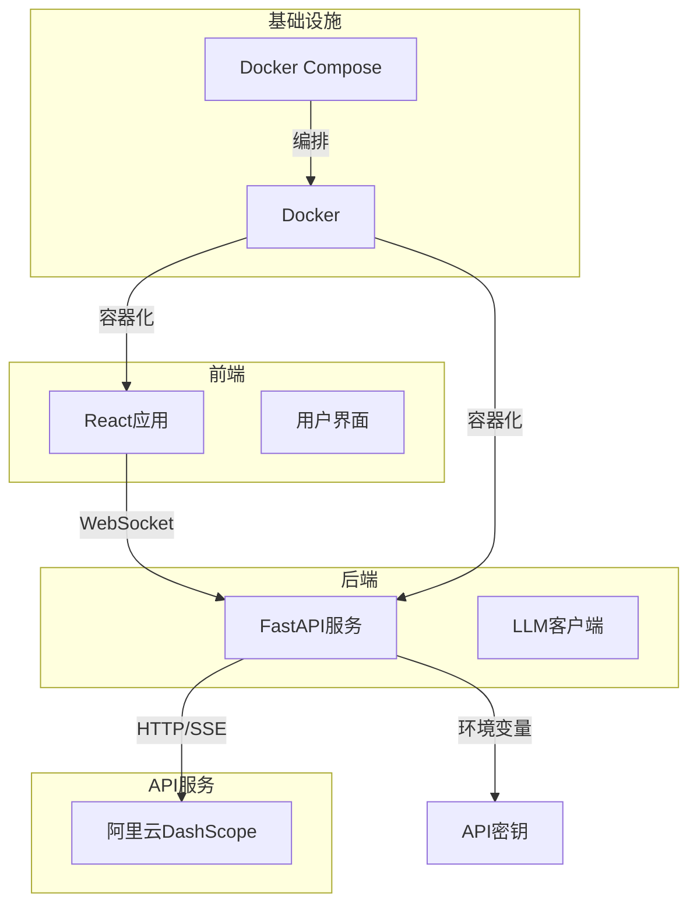
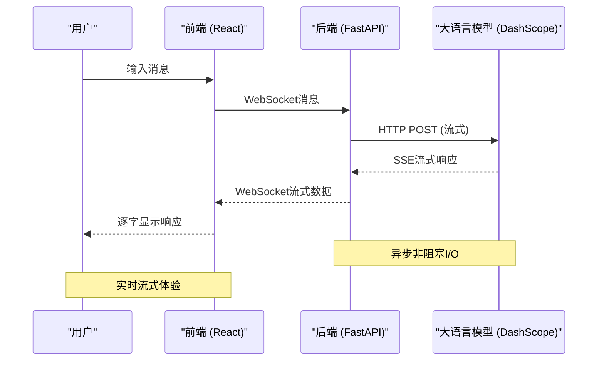
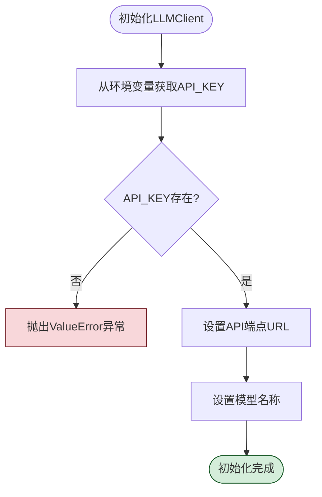
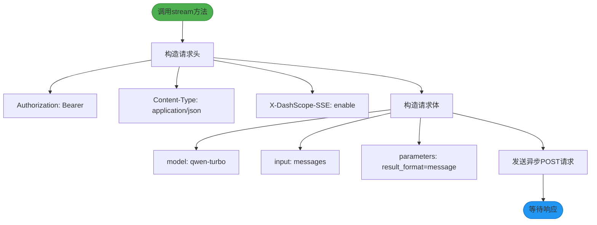
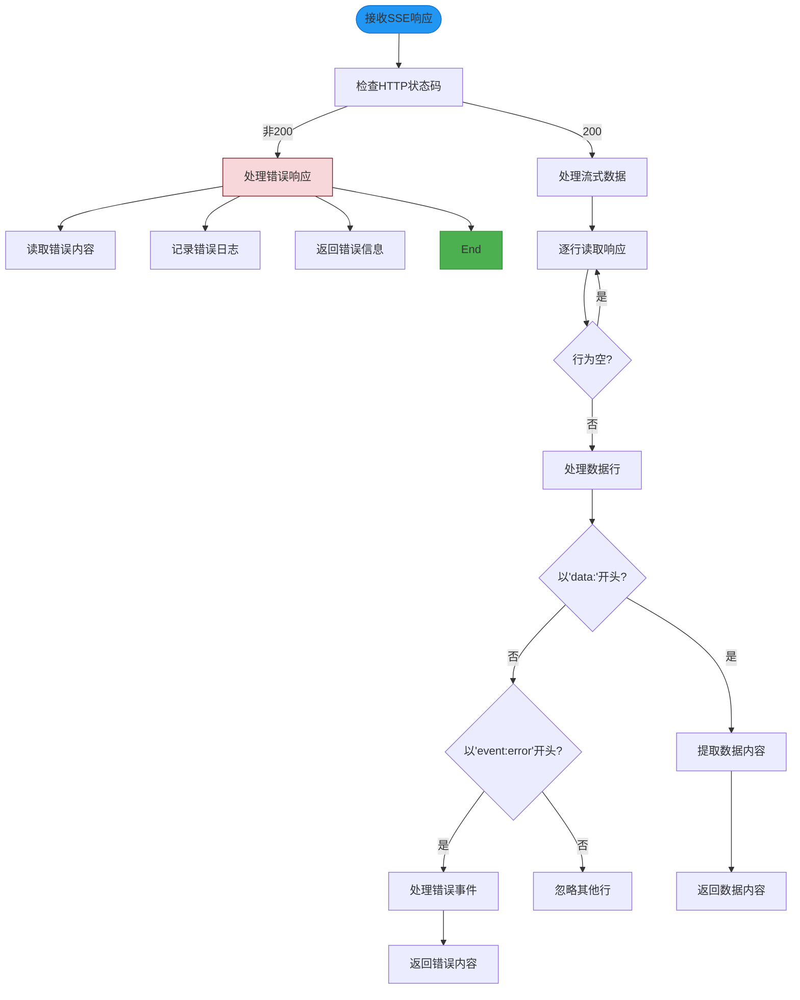
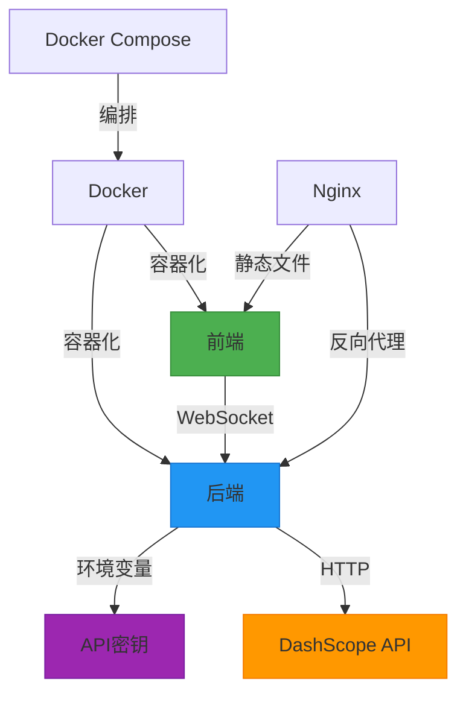
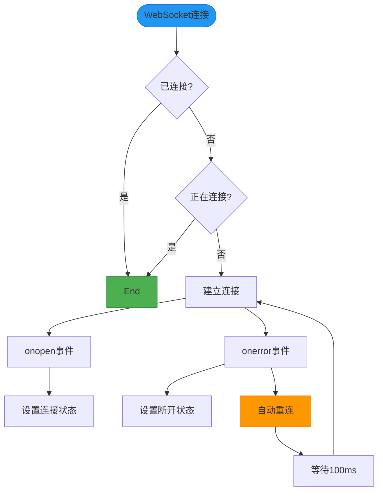

# LLM客户端集成

<cite>
**本文档中引用的文件**   
- [llm_client.py](file://backend/llm_client.py)
- [app.py](file://backend/app.py)
- [API_SECURITY_GUIDE.md](file://API_SECURITY_GUIDE.md)
- [README.md](file://README.md)
- [docker-compose.yml](file://docker-compose.yml)
</cite>

## 目录
1. [项目结构](#项目结构)
2. [核心组件](#核心组件)
3. [架构概述](#架构概述)
4. [详细组件分析](#详细组件分析)
5. [依赖分析](#依赖分析)
6. [性能考虑](#性能考虑)
7. [故障排除指南](#故障排除指南)
8. [结论](#结论)

## 项目结构
本项目采用分层架构，将前端、后端和基础设施配置清晰分离。后端服务负责与大语言模型API通信，前端提供用户交互界面，Nginx作为反向代理服务器，Docker Compose用于容器化部署。



**Diagram sources**
- [docker-compose.yml](file://docker-compose.yml#L1-L27)
- [project_structure](file://#L1-L20)

**Section sources**
- [project_structure](file://#L1-L20)
- [README.md](file://README.md#L1-L62)

## 核心组件
`backend/llm_client.py`模块是本项目的核心，作为阿里云DashScope API的封装层，为上层应用提供简洁的流式对话接口。该模块通过`LLMClient`类实现，封装了API密钥管理、请求构造、流式响应处理和错误处理等关键功能。

**Section sources**
- [llm_client.py](file://backend/llm_client.py#L1-L86)

## 架构概述
系统采用客户端-服务器架构，前端通过WebSocket与后端通信，后端通过HTTP协议与大语言模型API交互。这种架构实现了前后端的解耦，提高了系统的可维护性和可扩展性。



**Diagram sources**
- [app.py](file://backend/app.py#L1-L107)
- [llm_client.py](file://backend/llm_client.py#L1-L86)

## 详细组件分析

### LLM客户端分析
`LLMClient`类是与大语言模型API交互的核心组件，其设计遵循了安全、可靠和易用的原则。

#### 类结构分析
```mermaid
classDiagram
class LLMClient {
+string api_key
+string url
+string model_name
+string qwen_model
+__init__()
+get_model_info() ModelInfo
+stream(messages) AsyncGenerator
}
class ModelInfo {
+string name
+string description
+string version
+string status
}
note right of LLMClient : 负责与DashScope API交互
note right of ModelInfo : 模型元数据信息
```

**Diagram sources**
- [llm_client.py](file://backend/llm_client.py#L1-L86)

#### 初始化过程
`LLMClient`的初始化过程严格遵循安全最佳实践，确保API密钥的安全加载。



**Diagram sources**
- [llm_client.py](file://backend/llm_client.py#L15-L25)

**Section sources**
- [llm_client.py](file://backend/llm_client.py#L15-L25)
- [API_SECURITY_GUIDE.md](file://API_SECURITY_GUIDE.md#L1-L131)

### 流式响应处理分析
`stream`方法是`LLMClient`类的核心功能，实现了与大语言模型的流式对话。

#### 请求构造流程


**Diagram sources**
- [llm_client.py](file://backend/llm_client.py#L33-L52)

#### 响应处理流程


**Diagram sources**
- [llm_client.py](file://backend/llm_client.py#L54-L86)

**Section sources**
- [llm_client.py](file://backend/llm_client.py#L33-L86)

## 依赖分析
系统依赖关系清晰，各组件职责分明，通过标准接口进行通信。



**Diagram sources**
- [docker-compose.yml](file://docker-compose.yml#L1-L27)
- [app.py](file://backend/app.py#L1-L107)

**Section sources**
- [docker-compose.yml](file://docker-compose.yml#L1-L27)
- [app.py](file://backend/app.py#L1-L107)

## 性能考虑
系统在性能方面进行了多项优化，确保了良好的用户体验。

- **异步非阻塞I/O**: 使用`httpx.AsyncClient`和FastAPI的异步特性，提高了并发处理能力。
- **流式传输**: 采用SSE(Server-Sent Events)技术，实现逐字输出，减少用户等待时间。
- **连接复用**: HTTP客户端使用上下文管理器，实现连接复用，减少连接建立开销。
- **日志级别控制**: 通过日志级别控制，避免生产环境产生过多日志，影响性能。

## 故障排除指南
本节提供常见问题的解决方案和调试建议。

**Section sources**
- [llm_client.py](file://backend/llm_client.py#L54-L86)
- [app.py](file://backend/app.py#L45-L107)
- [API_SECURITY_GUIDE.md](file://API_SECURITY_GUIDE.md#L1-L131)

### API密钥未设置
当API密钥未正确设置时，系统会抛出明确的错误信息。

```python
if not self.api_key:
    raise ValueError(
        "API_KEY environment variable is required. "
        "Please set your API key in environment variables or .env file. "
        "Example: export API_KEY=your_actual_api_key_here"
    )
```

**解决方案**:
1. 创建`.env`文件并设置`API_KEY`
2. 或在系统环境中设置`API_KEY`环境变量
3. 确保`.env`文件未被提交到版本控制

### WebSocket连接问题
前端通过`useWebSocket` Hook管理WebSocket连接，具有自动重连机制。



**解决方案**:
1. 检查后端服务是否正常运行
2. 确认WebSocket端口(8000)未被占用
3. 检查防火墙设置

### 流式响应解析错误
当响应数据无法解析为JSON时，系统会直接转发原始数据。

```python
except json.JSONDecodeError:
    # 如果不是JSON格式，直接发送
    if chunk.strip():
        full_response += chunk
        await websocket.send_text(chunk)
```

**解决方案**:
1. 检查DashScope API的响应格式
2. 确认`result_format`参数设置正确
3. 查看服务端日志获取详细信息

## 结论
`LLMClient`模块成功实现了对阿里云DashScope API的安全、可靠封装，为上层应用提供了简洁的流式对话接口。通过严格的环境变量管理和详细的错误处理，确保了系统的安全性和稳定性。系统的架构设计合理，前后端分离，易于维护和扩展。建议在生产环境中使用密钥管理服务进一步提升安全性，并考虑实现更精细的速率限制和缓存机制以优化性能。