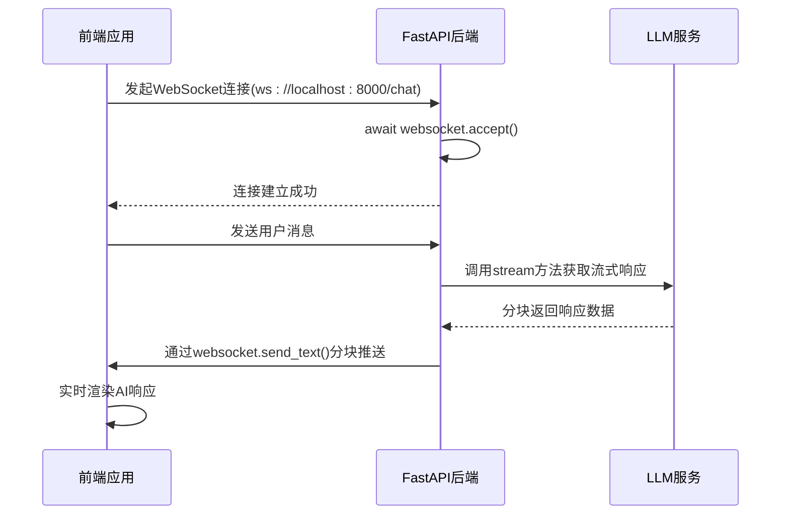
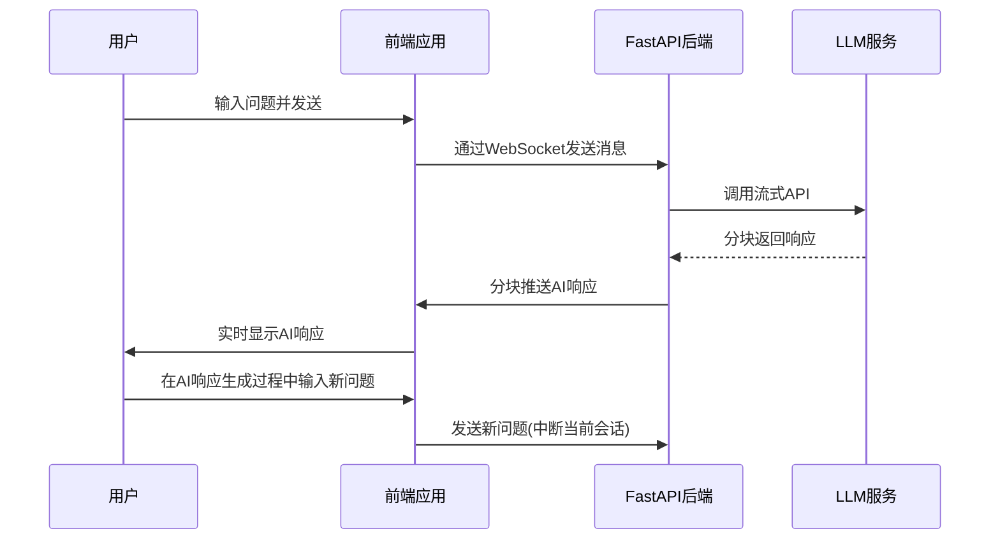

# WebSocket端点实现

<cite>
**本文档中引用的文件**
- [app.py](file://backend/app.py#L1-L107)
- [llm_client.py](file://backend/llm_client.py#L1-L87)
- [useWebSocket.js](file://frontend/src/hooks/useWebSocket.js#L1-L193)
- [App.jsx](file://frontend/src/App.jsx#L1-L172)
- [MessageBubble.jsx](file://frontend/src/components/MessageBubble.jsx#L1-L94)
</cite>

## 目录
1. [项目结构分析](#项目结构分析)
2. [WebSocket端点核心实现](#websocket端点核心实现)
3. [后端WebSocket生命周期管理](#后端websocket生命周期管理)
4. [LLM流式推理集成](#llm流式推理集成)
5. [前端WebSocket集成与状态管理](#前端websocket集成与状态管理)
6. [全双工通信机制](#全双工通信机制)
7. [错误处理与异常恢复](#错误处理与异常恢复)
8. [性能优化建议](#性能优化建议)

## 项目结构分析

项目采用前后端分离架构，后端使用FastAPI框架，前端使用React技术栈。

```mermaid
graph TB
subgraph "后端"
A[app.py] --> B[llm_client.py]
B --> C[Qwen API]
end
subgraph "前端"
D[App.jsx] --> E[useWebSocket.js]
E --> F[WebSocket]
D --> G[ChatBox.jsx]
G --> H[MessageBubble.jsx]
end
A < --> F
```

**图示来源**
- [app.py](file://backend/app.py#L1-L107)
- [useWebSocket.js](file://frontend/src/hooks/useWebSocket.js#L1-L193)

## WebSocket端点核心实现

### 端点定义与连接建立

`/chat` WebSocket端点在`app.py`中定义，使用FastAPI的`@app.websocket`装饰器实现。

```python
@app.websocket("/chat")
async def websocket_endpoint(websocket: WebSocket):
    logger.info("WebSocket连接请求已收到")
    await websocket.accept()
    logger.info("WebSocket连接已接受")
```

**代码片段来源**
- [app.py](file://backend/app.py#L30-L33)

该端点实现了WebSocket连接的完整生命周期管理，包括连接建立、消息处理和连接关闭。

### 连接建立流程

1. 服务器接收WebSocket连接请求
2. 调用`websocket.accept()`方法升级HTTP连接为WebSocket连接
3. 初始化对话历史记录
4. 进入消息处理循环



**图示来源**
- [app.py](file://backend/app.py#L30-L107)
- [useWebSocket.js](file://frontend/src/hooks/useWebSocket.js#L1-L193)

## 后端WebSocket生命周期管理

### 连接生命周期

WebSocket连接的生命周期包括连接建立、消息处理和连接关闭三个阶段。

```python
try:
    while True:
        data = await websocket.receive_text()
        # 处理消息逻辑
        ...
except Exception as e:
    logger.error(f"WebSocket错误: {e}")
finally:
    logger.info("WebSocket连接已关闭")
    try:
        if websocket.client_state.name == "CONNECTED":
            await websocket.close()
    except:
        pass
```

**代码片段来源**
- [app.py](file://backend/app.py#L34-L107)

### 连接状态检查

在发送消息前，始终检查WebSocket连接状态，确保连接处于"CONNECTED"状态。

```python
if websocket.client_state.name != "CONNECTED":
    logger.warning("WebSocket连接未打开，中断循环")
    break
await websocket.send_text(delta_content)
```

**代码片段来源**
- [app.py](file://backend/app.py#L70-L72)

## LLM流式推理集成

### 流式响应处理机制

后端通过`async for`循环处理LLM客户端的流式响应，实现增量内容推送。

```python
full_response = ""
async for chunk in llm.stream(history):
    try:
        parsed = json.loads(chunk)
        if "error" in parsed:
            # 处理错误
            break
        
        choices = parsed.get("output", {}).get("choices", [])
        if choices:
            content = choices[0].get("message", {}).get("content", "")
            if content:
                delta_content = content[len(full_response):]
                if delta_content:
                    await websocket.send_text(delta_content)
                full_response = content
    except json.JSONDecodeError:
        # 处理非JSON格式的chunk
        await websocket.send_text(chunk)
```

**代码片段来源**
- [app.py](file://backend/app.py#L44-L84)

### LLM客户端流式实现

`LLMClient`类的`stream`方法使用httpx的异步流式请求功能，处理SSE（Server-Sent Events）格式的响应。

```python
async def stream(self, messages):
    headers = {
        "Authorization": f"Bearer {self.api_key}",
        "Content-Type": "application/json",
        "X-DashScope-SSE": "enable"  # 启用SSE流式输出
    }
    payload = {
        "model": self.qwen_model,
        "input": {"messages": messages},
        "parameters": {"result_format": "message"}
    }

    async with httpx.AsyncClient() as client:
        async with client.stream("POST", self.url, json=payload, headers=headers) as response:
            async for line in response.aiter_lines():
                line = line.strip()
                if not line:
                    continue
                    
                if line.startswith("data:"):
                    data_content = line[5:].strip()
                    if data_content:
                        yield data_content
```

**代码片段来源**
- [llm_client.py](file://backend/llm_client.py#L50-L79)

## 前端WebSocket集成与状态管理

### WebSocket Hook实现

前端使用自定义Hook `useWebSocket`管理WebSocket连接、重连和消息处理。

```javascript
const useWebSocket = () => {
  const websocketRef = useRef(null);
  const activeConversationRef = useRef(null);

  const connectWebSocket = useCallback(() => {
    // 防止重复连接
    if (websocketRef.current && websocketRef.current.readyState === WebSocket.OPEN) {
      return;
    }

    const ws = new WebSocket('ws://localhost:8000/chat');
    websocketRef.current = ws;

    ws.onopen = () => {
      console.log('WebSocket连接成功');
      setIsConnecting(false);
    };

    ws.onmessage = (event) => {
      const chunk = event.data;
      const currentActiveId = activeConversationRef.current;
      
      if (window.handleWebSocketMessage) {
        window.handleWebSocketMessage(chunk, currentActiveId);
      }
      
      if (!chunk || chunk.trim() === '') {
        setIsTyping(false);
        activeConversationRef.current = null;
      }
    };
  }, []);

  // 自动重连机制
  useEffect(() => {
    connectWebSocket();
    
    const connectionChecker = setInterval(() => {
      if (!websocketRef.current || websocketRef.current.readyState === WebSocket.CLOSED) {
        connectWebSocket();
      }
    }, 2000);
    
    return () => {
      clearInterval(connectionChecker);
      if (websocketRef.current) {
        websocketRef.current.close();
      }
    };
  }, [connectWebSocket]);

  return {
    sendMessage,
    getConnectionStatus,
    handleReconnect,
    setMessageHandlers
  };
};
```

**代码片段来源**
- [useWebSocket.js](file://frontend/src/hooks/useWebSocket.js#L1-L193)

### 消息处理与状态更新

前端通过`setMessageHandlers`设置消息处理函数，实现实时消息更新。

```javascript
useEffect(() => {
  const handleWebSocketMessage = (chunk, activeConversationId) => {
    updateConversationMessages(activeConversationId, (conv) => {
      const lastMessage = conv.messages[conv.messages.length - 1];
      if (lastMessage && lastMessage.sender === 'ai' && lastMessage.isStreaming) {
        const updatedMessages = [...conv.messages];
        updatedMessages[updatedMessages.length - 1] = {
          ...lastMessage,
          text: lastMessage.text + chunk
        };
        return { ...conv, messages: updatedMessages };
      }
      return conv;
    });
  };

  const handleStreamEnd = (activeConversationId) => {
    updateConversationMessages(activeConversationId, (conv) => {
      const updatedMessages = [...conv.messages];
      const lastMessage = updatedMessages[updatedMessages.length - 1];
      if (lastMessage && lastMessage.sender === 'ai' && lastMessage.isStreaming) {
        updatedMessages[updatedMessages.length - 1] = {
          ...lastMessage,
          isStreaming: false
        };
        return { ...conv, messages: updatedMessages };
      }
      return conv;
    });
  };

  setMessageHandlers(handleWebSocketMessage, handleStreamEnd);
}, [updateConversationMessages, setMessageHandlers]);
```

**代码片段来源**
- [App.jsx](file://frontend/src/App.jsx#L36-L73)

## 全双工通信机制

### 双向通信流程

WebSocket实现了真正的全双工通信，允许客户端和服务器同时发送和接收数据。



**图示来源**
- [app.py](file://backend/app.py#L30-L107)
- [useWebSocket.js](file://frontend/src/hooks/useWebSocket.js#L1-L193)

### 实时流式输出优势

与传统HTTP请求相比，WebSocket流式输出具有以下优势：

1. **低延迟**: 响应内容分块传输，用户无需等待完整响应
2. **实时性**: AI生成的内容实时推送到前端，提升用户体验
3. **资源效率**: 避免了长轮询的资源浪费
4. **双向通信**: 支持客户端在AI响应生成过程中发送新请求

## 错误处理与异常恢复

### 后端错误处理

后端实现了多层次的错误处理机制：

```python
try:
    async for chunk in llm.stream(history):
        try:
            parsed = json.loads(chunk)
            if "error" in parsed:
                error_msg = parsed.get("error", {})
                if websocket.client_state.name == "CONNECTED":
                    await websocket.send_text(f"Error: {error_msg.get('message', 'Unknown error')}")
                break
        except json.JSONDecodeError:
            if chunk.strip():
                await websocket.send_text(chunk)
        except Exception as e:
            logger.error(f"解析chunk时出错: {e}")
            if websocket.client_state.name == "CONNECTED":
                await websocket.send_text(f"Error processing response: {str(e)}")
            break
except Exception as e:
    logger.error(f"WebSocket错误: {e}")
finally:
    if websocket.client_state.name == "CONNECTED":
        await websocket.close()
```

**代码片段来源**
- [app.py](file://backend/app.py#L44-L107)

### 前端连接恢复机制

前端实现了自动重连和手动重连两种恢复机制：

```javascript
// 自动重连：每2秒检查连接状态
const connectionChecker = setInterval(() => {
  if (!websocketRef.current || websocketRef.current.readyState === WebSocket.CLOSED) {
    connectWebSocket();
  }
}, 2000);

// 手动重连
const handleReconnect = () => {
  if (websocketRef.current) {
    websocketRef.current.close();
  }
  setTimeout(() => {
    connectWebSocket();
  }, 100);
};
```

**代码片段来源**
- [useWebSocket.js](file://frontend/src/hooks/useWebSocket.js#L75-L117)

## 性能优化建议

### 连接池管理

为提高并发处理能力，建议实现WebSocket连接池：

```python
class WebSocketConnectionPool:
    def __init__(self, max_connections=100):
        self.max_connections = max_connections
        self.connections = []
        self.lock = asyncio.Lock()
    
    async def acquire(self):
        async with self.lock:
            if self.connections:
                return self.connections.pop()
            return None
    
    async def release(self, websocket):
        async with self.lock:
            if len(self.connections) < self.max_connections:
                self.connections.append(websocket)
```

### 消息序列化优化

优化JSON序列化过程，减少CPU开销：

```python
import orjson

def fast_json_dumps(data):
    return orjson.dumps(data).decode('utf-8')

# 替换标准json.dumps
# json.dumps -> fast_json_dumps
```

### 背压处理策略

实现背压控制，防止消息积压：

```python
async def websocket_endpoint(websocket: WebSocket):
    await websocket.accept()
    history = []
    
    # 设置消息队列最大长度
    message_queue = asyncio.Queue(maxsize=100)
    
    try:
        while True:
            # 非阻塞接收消息
            try:
                data = await asyncio.wait_for(websocket.receive_text(), timeout=0.1)
                await message_queue.put(data)
            except asyncio.TimeoutError:
                continue
                
            # 处理队列中的消息
            while not message_queue.empty():
                data = await message_queue.get()
                # 处理消息逻辑
                ...
    except Exception as e:
        logger.error(f"WebSocket错误: {e}")
    finally:
        await websocket.close()
```

### 前端渲染优化

优化前端消息渲染性能：

```javascript
// 使用React.memo避免不必要的重新渲染
const MessageBubble = React.memo(({ message }) => {
  // 渲染逻辑
});

// 批量更新状态，减少渲染次数
const handleWebSocketMessage = useCallback((chunk, activeConversationId) => {
  setMessages(prev => {
    const lastMessage = prev[prev.length - 1];
    if (lastMessage && lastMessage.sender === 'ai' && lastMessage.isStreaming) {
      return [
        ...prev.slice(0, -1),
        {
          ...lastMessage,
          text: lastMessage.text + chunk
        }
      ];
    }
    return prev;
  });
}, []);
```

**性能优化建议来源**
- [app.py](file://backend/app.py#L30-L107)
- [useWebSocket.js](file://frontend/src/hooks/useWebSocket.js#L1-L193)
- [MessageBubble.jsx](file://frontend/src/components/MessageBubble.jsx#L1-L94)