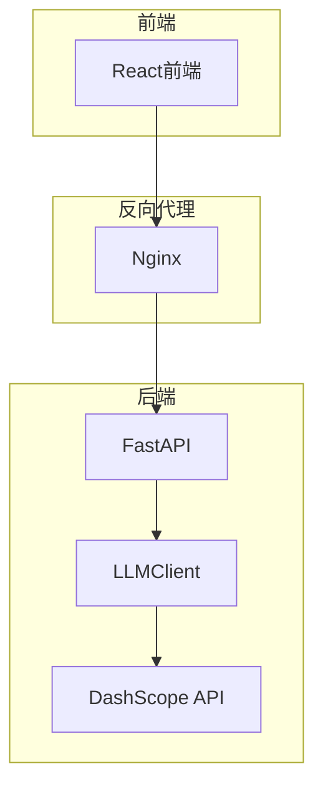
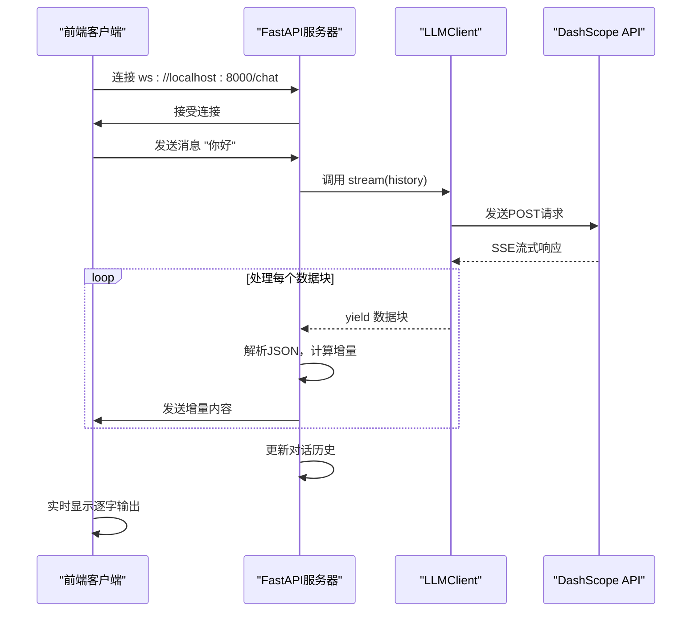
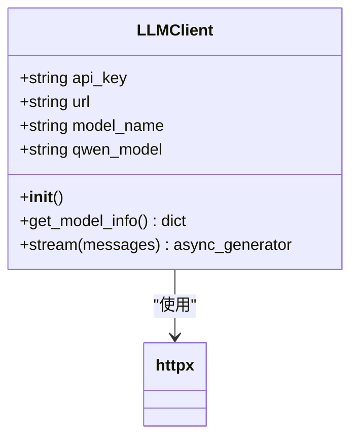
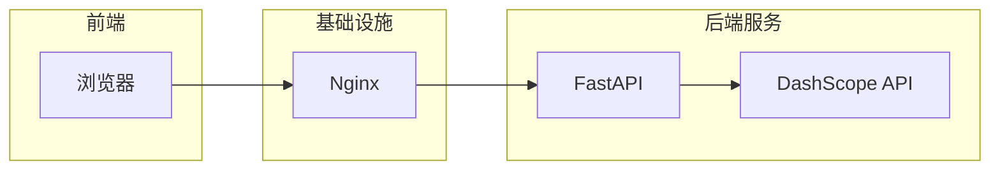

# 后端架构

<cite>
**本文档引用的文件**
- [app.py](file://backend/app.py#L1-L107)
- [llm_client.py](file://backend/llm_client.py#L1-L87)
- [README.md](file://README.md#L1-L117)
- [API_SECURITY_GUIDE.md](file://API_SECURITY_GUIDE.md#L1-L132)
- [nginx.conf](file://nginx/nginx.conf#L1-L26)
</cite>

## 目录
1. [项目结构](#项目结构)
2. [核心组件](#核心组件)
3. [WebSocket服务实现](#websocket服务实现)
4. [LLM客户端实现](#llm客户端实现)
5. [系统架构概览](#系统架构概览)
6. [错误处理策略](#错误处理策略)
7. [并发与性能优化](#并发与性能优化)
8. [安全配置](#安全配置)
9. [日志记录](#日志记录)

## 项目结构
本项目采用前后端分离的微服务架构，通过Docker容器化部署。后端服务基于FastAPI框架，提供WebSocket接口与前端交互，前端使用React构建用户界面，Nginx作为反向代理服务器。



**图示来源**
- [nginx.conf](file://nginx/nginx.conf#L1-L26)
- [app.py](file://backend/app.py#L1-L107)

**本节来源**
- [README.md](file://README.md#L1-L117)

## 核心组件
项目的核心功能由两个主要Python模块构成：`app.py`负责处理WebSocket连接和消息路由，`llm_client.py`封装了与阿里云DashScope API的交互逻辑。

**本节来源**
- [app.py](file://backend/app.py#L1-L107)
- [llm_client.py](file://backend/llm_client.py#L1-L87)

## WebSocket服务实现
`app.py`文件中的`websocket_endpoint`函数实现了WebSocket服务的核心逻辑，处理客户端连接、消息接收和响应推送。

### 连接管理
WebSocket端点通过`@app.websocket("/chat")`装饰器定义，使用`websocket.accept()`方法接受客户端连接请求。服务端维护一个`history`列表来存储对话历史，确保LLM能够基于上下文生成连贯的回复。

```python
@app.websocket("/chat")
async def websocket_endpoint(websocket: WebSocket):
    logger.info("WebSocket connection request received")
    await websocket.accept()
    logger.info("WebSocket connection accepted")
    history = []
```

### 消息接收与处理
服务端在一个无限循环中通过`websocket.receive_text()`接收客户端消息。收到的消息被清理后添加到对话历史中，并作为上下文传递给LLM进行推理。

```python
while True:
    data = await websocket.receive_text()
    cleaned_data = data.rstrip('\n')
    user_message = {"role": "user", "content": cleaned_data}
    history.append(user_message)
```

### 流式响应推送
服务端调用`llm.stream(history)`方法获取LLM的流式响应。对于每个接收到的数据块，服务端计算增量内容（delta_content）并立即通过`websocket.send_text(delta_content)`推送给客户端，实现逐字输出的效果。

```python
full_response = ""
async for chunk in llm.stream(history):
    try:
        parsed = json.loads(chunk)
        if "error" in parsed:
            # 发送错误信息
            await websocket.send_text(f"Error: {error_msg.get('message', 'Unknown error')}")
            break
        
        choices = parsed.get("output", {}).get("choices", [])
        if choices:
            content = choices[0].get("message", {}).get("content", "")
            if content:
                delta_content = content[len(full_response):]
                if delta_content:
                    await websocket.send_text(delta_content)
                full_response = content
    except json.JSONDecodeError:
        # 处理非JSON格式的块
        await websocket.send_text(chunk)
```



**图示来源**
- [app.py](file://backend/app.py#L30-L107)
- [llm_client.py](file://backend/llm_client.py#L54-L86)

**本节来源**
- [app.py](file://backend/app.py#L30-L107)

## LLM客户端实现
`llm_client.py`文件中的`LLMClient`类封装了与阿里云DashScope API的交互，提供了流式推理的核心功能。

### API密钥安全管理
客户端通过`os.getenv("API_KEY")`从环境变量中读取API密钥，避免了密钥硬编码的安全风险。如果环境变量未设置，构造函数会抛出`ValueError`异常。

```python
def __init__(self):
    self.api_key = os.getenv("API_KEY")
    if not self.api_key:
        raise ValueError("API_KEY environment variable is required.")
```

### 请求构造
`stream`方法构造符合DashScope API规范的HTTP请求。请求头中包含`Authorization`令牌和`X-DashScope-SSE: enable`以启用SSE流式输出。

```python
headers = {
    "Authorization": f"Bearer {self.api_key}",
    "Content-Type": "application/json",
    "X-DashScope-SSE": "enable"
}
payload = {
    "model": self.qwen_model,
    "input": {"messages": messages},
    "parameters": {"result_format": "message"}
}
```

### 流式响应处理
客户端使用`httpx.AsyncClient().stream()`发起异步流式请求。通过`response.aiter_lines()`逐行读取SSE格式的响应，解析以`data:`开头的数据行，并通过`yield`关键字将数据块传递给调用者。

```python
async with client.stream("POST", self.url, json=payload, headers=headers) as response:
    async for line in response.aiter_lines():
        line = line.strip()
        if line.startswith("data:"):
            data_content = line[5:].strip()
            if data_content:
                yield data_content
        elif line.startswith("event:error"):
            # 处理错误事件
            yield error_line[5:].strip()
```



**图示来源**
- [llm_client.py](file://backend/llm_client.py#L10-L87)

**本节来源**
- [llm_client.py](file://backend/llm_client.py#L10-L87)
- [API_SECURITY_GUIDE.md](file://API_SECURITY_GUIDE.md#L1-L132)

## 系统架构概览
整个系统由前端、反向代理和后端三个主要部分组成，通过WebSocket协议实现实时通信。



Nginx配置文件中的`location /chat`块专门处理WebSocket连接，通过`proxy_http_version 1.1`和`proxy_set_header Connection "upgrade"`等指令