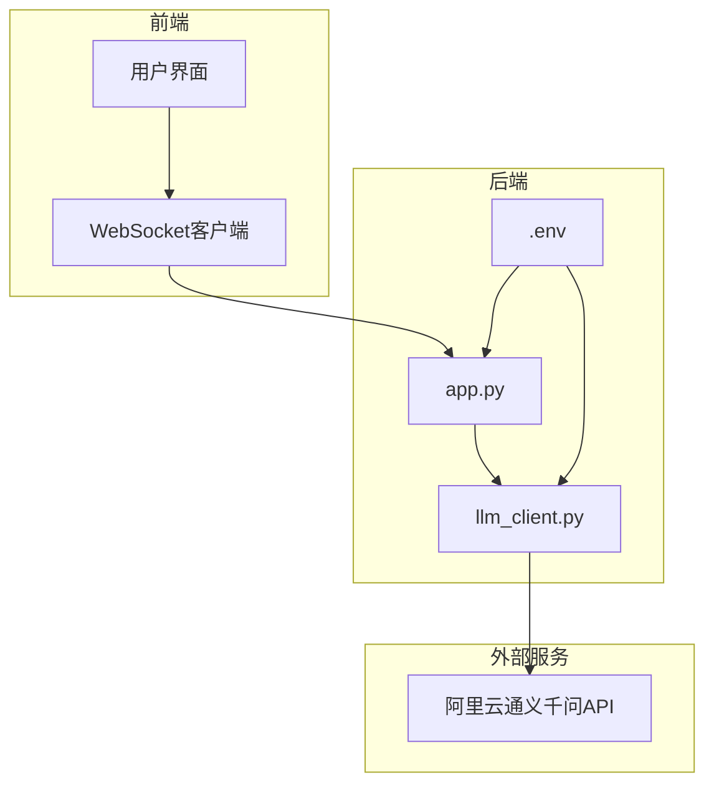
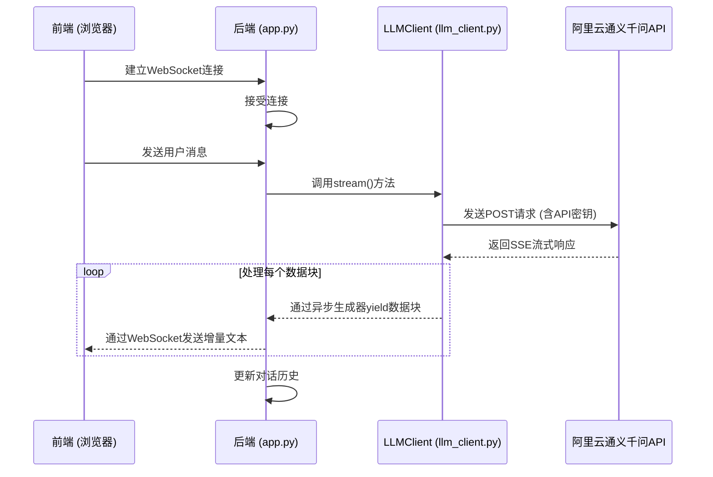
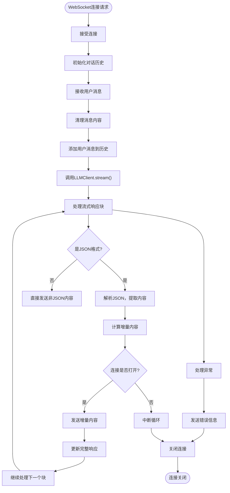
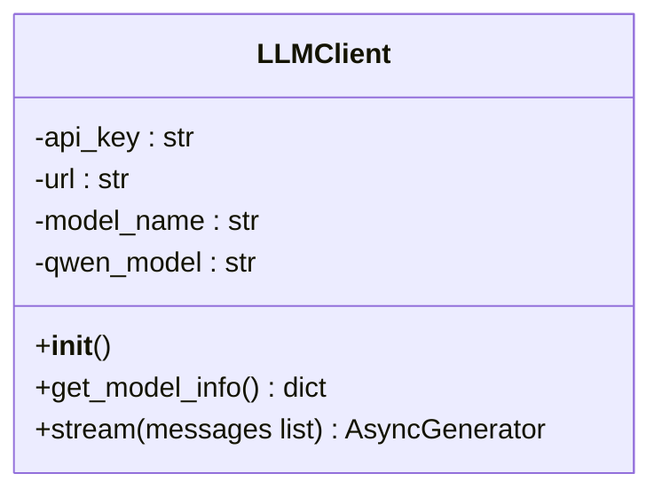
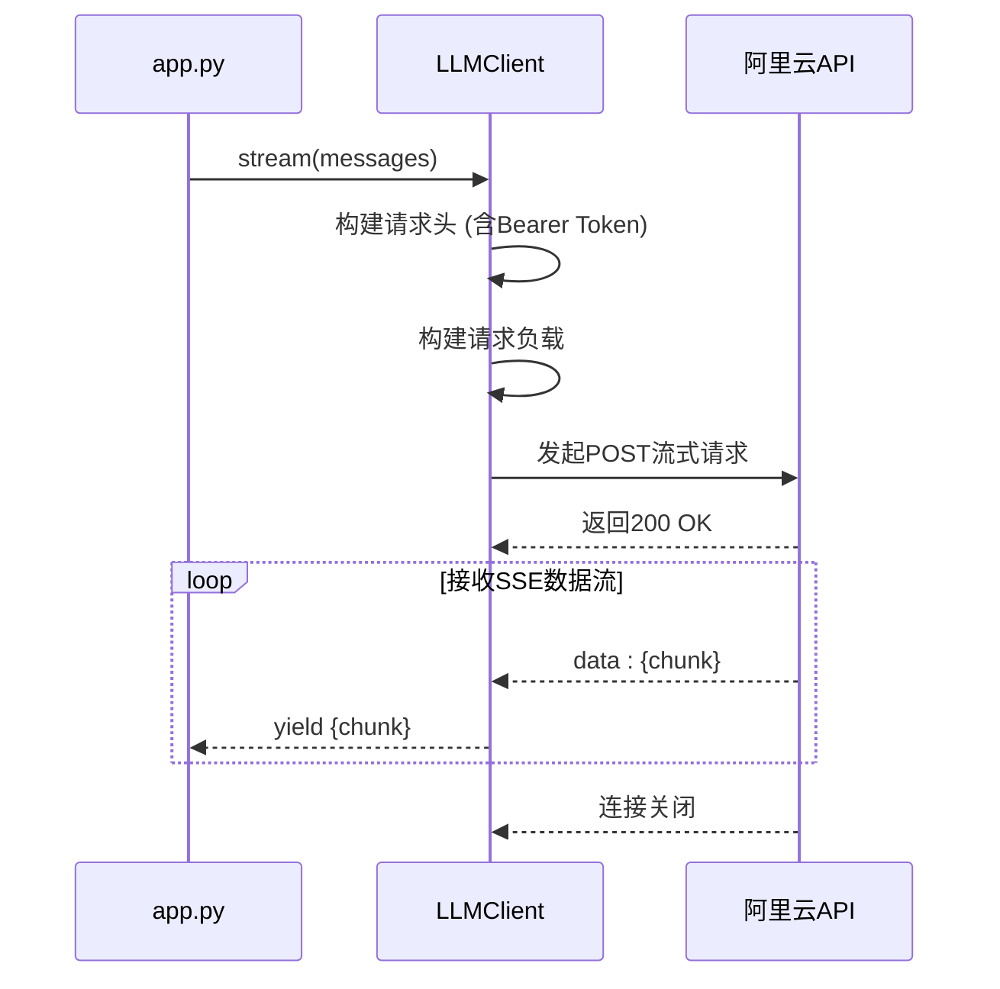
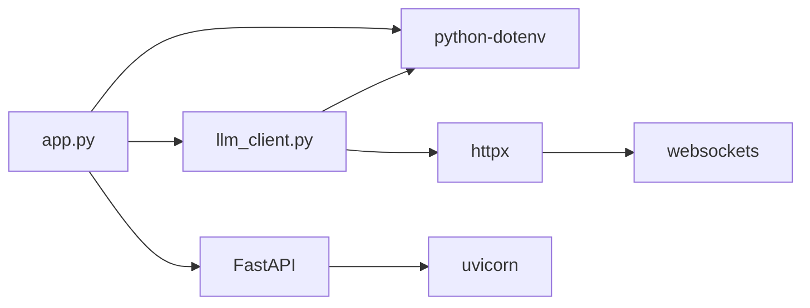

# 后端配置与安全

<cite>
**本文档引用的文件**  
- [app.py](file://backend/app.py#L1-L107)
- [llm_client.py](file://backend/llm_client.py#L1-L87)
- [API_SECURITY_GUIDE.md](file://API_SECURITY_GUIDE.md#L1-L132)
- [requirements.txt](file://backend/requirements.txt#L1-L5)
- [docker-compose.yml](file://docker-compose.yml#L1-L27)
- [Dockerfile](file://backend/Dockerfile#L1-L10)
</cite>

## 目录
1. [简介](#简介)
2. [项目结构](#项目结构)
3. [核心组件](#核心组件)
4. [架构概览](#架构概览)
5. [详细组件分析](#详细组件分析)
6. [依赖分析](#依赖分析)
7. [安全配置与最佳实践](#安全配置与最佳实践)
8. [部署与环境管理](#部署与环境管理)
9. [故障排查指南](#故障排查指南)
10. [结论](#结论)

## 简介
本文档全面阐述了“chat-mvp”项目的后端服务在配置管理与安全方面的设计与实现。重点分析了如何通过环境变量安全地管理敏感信息（如阿里云API密钥），避免硬编码和版本控制泄露风险。文档结合代码实现与安全指南，为开发和部署团队提供了一套完整的安全配置方案和检查清单。

## 项目结构
项目采用前后端分离的微服务架构，后端服务基于FastAPI构建，通过WebSocket提供流式对话接口。配置管理通过`python-dotenv`库实现，确保敏感信息的安全存储与访问。



**图示来源**
- [app.py](file://backend/app.py#L1-L107)
- [llm_client.py](file://backend/llm_client.py#L1-L87)
- [API_SECURITY_GUIDE.md](file://API_SECURITY_GUIDE.md#L1-L132)

**本节来源**
- [app.py](file://backend/app.py#L1-L107)
- [llm_client.py](file://backend/llm_client.py#L1-L87)

## 核心组件
后端核心由两个主要Python模块构成：`app.py`负责处理WebSocket连接和消息路由，`llm_client.py`封装了与阿里云通义千问API的交互逻辑。两者通过环境变量共享API密钥，实现了配置与代码的解耦。

**本节来源**
- [app.py](file://backend/app.py#L1-L107)
- [llm_client.py](file://backend/llm_client.py#L1-L87)

## 架构概览
系统采用分层架构，前端通过WebSocket与后端通信，后端服务作为代理，将用户消息转发至阿里云LLM API，并将流式响应实时推送回前端。



**图示来源**
- [app.py](file://backend/app.py#L1-L107)
- [llm_client.py](file://backend/llm_client.py#L1-L87)

## 详细组件分析

### app.py 分析
`app.py`是FastAPI应用的入口点，负责初始化WebSocket端点和全局LLM客户端实例。

#### 功能流程


**图示来源**
- [app.py](file://backend/app.py#L1-L107)

**本节来源**
- [app.py](file://backend/app.py#L1-L107)

### llm_client.py 分析
`llm_client.py`实现了`LLMClient`类，封装了与阿里云API的安全通信。

#### 类结构


**图示来源**
- [llm_client.py](file://backend/llm_client.py#L1-L87)

#### 流式请求流程


**图示来源**
- [llm_client.py](file://backend/llm_client.py#L1-L87)

**本节来源**
- [llm_client.py](file://backend/llm_client.py#L1-L87)

## 依赖分析
项目依赖清晰，后端主要依赖FastAPI、httpx和python-dotenv等库。



**图示来源**
- [requirements.txt](file://backend/requirements.txt#L1-L5)
- [app.py](file://backend/app.py#L1-L107)
- [llm_client.py](file://backend/llm_client.py#L1-L87)

**本节来源**
- [requirements.txt](file://backend/requirements.txt#L1-L5)

## 安全配置与最佳实践

### 环境变量安全加载
项目严格遵循安全最佳实践，通过`python-dotenv`库加载环境变量，防止API密钥硬编码。

**加载流程：**
1.  **在`app.py`中优先加载**：`load_dotenv()`在导入`LLMClient`之前调用，确保密钥在类初始化前可用。
2.  **在`LLMClient`中获取**：使用`os.getenv("API_KEY")`从环境读取密钥。
3.  **强制验证**：如果`API_KEY`为空，`LLMClient.__init__()`会抛出`ValueError`，阻止应用启动。

```python
# app.py
load_dotenv()  # 必须在导入LLMClient之前

# llm_client.py
self.api_key = os.getenv("API_KEY")
if not self.api_key:
    raise ValueError("API_KEY environment variable is required...")
```

**本节来源**
- [app.py](file://backend/app.py#L8)
- [llm_client.py](file://backend/llm_client.py#L13-L17)

### API密钥安全实践
根据`API_SECURITY_GUIDE.md`，项目实施了以下安全措施：

- **禁止硬编码**：代码中绝不出现明文API密钥。
- **.env文件管理**：使用`.env`文件存储密钥，并通过`.gitignore`确保其不会被提交到Git仓库。
- **Docker集成**：`docker-compose.yml`通过`${API_KEY}`从宿主机环境变量读取密钥，实现容器化部署的安全配置。
- **密钥验证**：代码在启动时强制检查密钥是否存在，提供清晰的错误提示。

**推荐的安全配置清单：**
- [x] ✅ 使用`.env`文件存储开发环境密钥
- [x] ✅ 在`.gitignore`中忽略`.env`
- [x] ✅ 代码中通过`os.getenv()`读取密钥
- [x] ✅ 实现密钥存在性验证
- [ ] ✅ 定期轮换API密钥（需手动执行）
- [ ] ✅ 生产环境使用密钥管理服务（如Hashicorp Vault）

**本节来源**
- [API_SECURITY_GUIDE.md](file://API_SECURITY_GUIDE.md#L1-L132)
- [docker-compose.yml](file://docker-compose.yml#L7)

## 部署与环境管理

### Docker部署配置
`docker-compose.yml`文件定义了多容器应用的部署方式，后端服务的环境变量配置如下：

```yaml
services:
  backend:
    build: ./backend
    environment:
      - API_KEY=${API_KEY}  # 从宿主机环境变量注入
    ports:
      - "8000:8000"
```

**部署步骤：**
1.  在宿主机设置`API_KEY`环境变量（Linux/macOS: `export API_KEY=your_key`）。
2.  运行`docker-compose up`，Docker Compose会自动将宿主机的`API_KEY`传递给容器。

### 后端Dockerfile
后端Dockerfile负责构建应用镜像。

```dockerfile
FROM python:3.10-slim

WORKDIR /app
COPY requirements.txt .
RUN pip install --no-cache-dir -r requirements.txt

COPY . .

CMD ["uvicorn", "app:app", "--host", "0.0.0.0", "--port", "8000"]
```

此文件确保了`python-dotenv`库被正确安装，从而支持`.env`文件的加载。

**本节来源**
- [docker-compose.yml](file://docker-compose.yml#L1-L27)
- [Dockerfile](file://backend/Dockerfile#L1-L10)

## 故障排查指南
当应用无法正常工作时，请按以下步骤检查：

1.  **检查API密钥**：
    *   确认`.env`文件存在且`API_KEY`已正确设置。
    *   或确认宿主机环境变量`API_KEY`已设置。
    *   查看应用日志，若出现`ValueError: API_KEY environment variable is required...`，则说明密钥未设置。

2.  **检查网络连接**：
    *   确保后端服务能访问`https://dashscope.aliyuncs.com`。
    *   查看日志中是否有`Exception during API request`或`API request failed with status`等错误。

3.  **检查Docker配置**：
    *   确保在运行`docker-compose up`前，已在宿主机设置了`API_KEY`环境变量。

**本节来源**
- [app.py](file://backend/app.py#L13-L17)
- [llm_client.py](file://backend/llm_client.py#L13-L17)
- [API_SECURITY_GUIDE.md](file://API_SECURITY_GUIDE.md#L115-L121)

## 结论
本项目在后端配置与安全方面设计良好。通过`python-dotenv`库和环境变量，实现了API密钥的安全管理，有效避免了硬编码风险。代码结构清晰，`app.py`和`llm_client.py`职责分离。结合`API_SECURITY_GUIDE.md`中的指导，项目已具备坚实的安全基础。建议部署团队严格遵循文档中的安全清单，并考虑在生产环境中引入更高级的密钥管理方案。