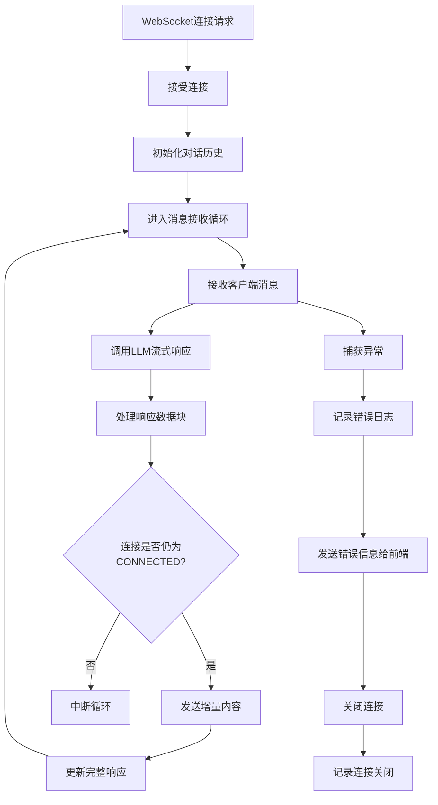
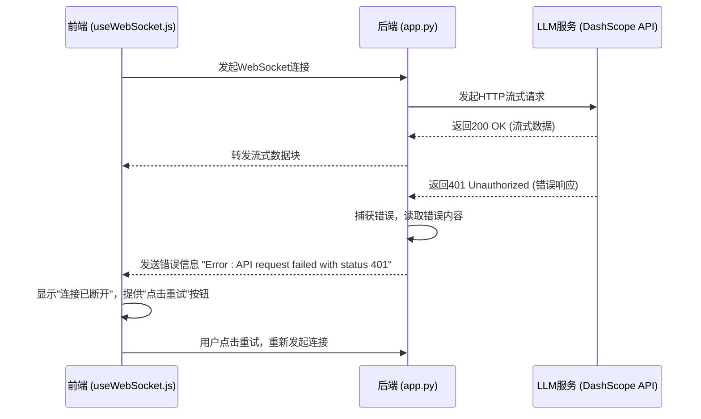

# 后端错误处理与日志记录

<cite>
**本文档中引用的文件**   
- [app.py](file://backend/app.py)
- [llm_client.py](file://backend/llm_client.py)
- [API_SECURITY_GUIDE.md](file://API_SECURITY_GUIDE.md)
</cite>

## 目录
1. [项目结构分析](#项目结构分析)
2. [WebSocket端点错误处理](#websocket端点错误处理)
3. [LLM客户端错误处理](#llm客户端错误处理)
4. [日志记录机制](#日志记录机制)
5. [前端错误与连接状态处理](#前端错误与连接状态处理)
6. [最佳实践与故障排查](#最佳实践与故障排查)

## 项目结构分析

项目采用前后端分离架构，后端服务位于`backend`目录，核心逻辑由`app.py`和`llm_client.py`两个Python文件实现。`app.py`负责提供WebSocket接口，`llm_client.py`封装了与阿里云通义千问API的交互逻辑。前端位于`frontend`目录，通过WebSocket与后端通信。环境变量通过`.env`文件管理，确保API密钥等敏感信息不被提交至版本控制系统。

**Section sources**
- [app.py](file://backend/app.py#L1-L107)
- [llm_client.py](file://backend/llm_client.py#L1-L87)

## WebSocket端点错误处理

`app.py`中的`/chat` WebSocket端点实现了全面的异常捕获机制，确保连接的稳定性和错误的可追溯性。

### 连接生命周期管理


**Diagram sources**
- [app.py](file://backend/app.py#L30-L107)

**Section sources**
- [app.py](file://backend/app.py#L30-L107)

### 异常捕获与处理
WebSocket端点使用了多层`try-except`结构来处理不同类型的异常：

1.  **顶层异常捕获**：最外层的`try-except`块捕获所有未处理的异常，包括WebSocket连接中断、网络故障等。捕获到异常后，会记录详细的错误信息和堆栈跟踪，并确保连接被正确关闭。
    ```python
    except Exception as e:
        logger.error(f"WebSocket error: {e}")
        import traceback
        logger.error(f"Traceback: {traceback.format_exc()}")
    finally:
        logger.info("WebSocket connection closed")
        try:
            if websocket.client_state.name == "CONNECTED":
                await websocket.close()
        except:
            pass
    ```

2.  **消息解析异常**：在处理LLM返回的流式数据时，使用`json.loads()`尝试解析每个数据块。如果解析失败（`json.JSONDecodeError`），则认为该数据块是原始文本，直接发送给前端。
    ```python
    except json.JSONDecodeError:
        # 如果不是JSON格式，直接发送
        if chunk.strip():
            logger.debug(f"Sending non-JSON chunk: {chunk}")
            full_response += chunk
            if websocket.client_state.name != "CONNECTED":
                logger.warning("WebSocket connection is not open, breaking loop")
                break
            await websocket.send_text(chunk)
    ```

3.  **LLM API错误**：在解析JSON数据时，检查响应中是否包含`"error"`字段。如果存在，则记录错误并向前端发送错误信息。
    ```python
    parsed = json.loads(chunk)
    if "error" in parsed:
        error_msg = parsed.get("error", {})
        logger.error(f"LLM API error: {error_msg}")
        if websocket.client_state.name == "CONNECTED":
            await websocket.send_text(f"Error: {error_msg.get('message', 'Unknown error')}")
        break
    ```

4.  **连接状态检查**：在每次向客户端发送消息前，都会检查`websocket.client_state.name`是否为`"CONNECTED"`。如果连接已断开，则中断循环，防止因向已关闭的连接发送数据而引发异常。

## LLM客户端错误处理

`llm_client.py`中的`LLMClient`类负责与外部LLM API进行通信，并实现了针对HTTP请求错误的处理逻辑。

### 初始化错误处理
在`__init__`方法中，从环境变量`API_KEY`读取API密钥。如果密钥未设置，会立即抛出`ValueError`异常，阻止应用启动。这遵循了安全最佳实践，避免了密钥硬编码。
```python
self.api_key = os.getenv("API_KEY")
if not self.api_key:
    raise ValueError(
        "API_KEY environment variable is required. "
        "Please set your API key in environment variables or .env file. "
        "Example: export API_KEY=your_actual_api_key_here"
    )
```

### HTTP请求错误处理
`stream`方法使用`httpx.AsyncClient`发起异步流式请求，并通过`try-except`块捕获所有网络和请求异常。

1.  **HTTP状态码检查**：如果API返回的状态码不是200，会读取错误响应内容，记录日志，并向调用者（`app.py`）返回一个包含错误信息的JSON字符串。
    ```python
    if response.status_code != 200:
        error_content = await response.aread()
        logger.error(f"API error response: {error_content.decode()}")
        yield json.dumps({"error": {"message": f"API request failed with status {response.status_code}"}})
        return
    ```

2.  **SSE流式错误处理**：API使用SSE（Server-Sent Events）协议。代码会检查以`"event:error"`开头的行，这表示服务端发生了错误。此时，会读取后续的数据行作为错误详情并返回。
    ```python
    elif line.startswith("event:error"):
        async for error_line in response.aiter_lines():
            error_line = error_line.strip()
            if error_line.startswith("data:"):
                yield error_line[5:].strip()
                break
    ```

3.  **网络异常处理**：最外层的`except Exception as e`捕获所有其他异常（如网络超时、DNS解析失败、连接被拒绝等）。这些异常会被记录，并返回一个通用的错误信息。
    ```python
    except Exception as e:
        logger.error(f"Exception during API request: {e}")
        yield json.dumps({"error": {"message": f"Exception during API request: {str(e)}"}})
    ```

### 重试策略
根据代码分析，当前实现**没有**内置的自动重试机制。无论是`llm_client.py`还是`app.py`，在遇到错误后都会将错误信息传递给前端，由前端决定是否重试。这将重试逻辑交给了客户端，使其可以根据用户交互或网络状况自行决策。



**Diagram sources**
- [llm_client.py](file://backend/llm_client.py#L54-L86)
- [app.py](file://backend/app.py#L44-L90)

**Section sources**
- [llm_client.py](file://backend/llm_client.py#L54-L86)

## 日志记录机制

项目使用Python内置的`logging`模块进行日志记录，配置了统一的日志格式和级别。

### 日志配置
在`app.py`中，通过`logging.basicConfig()`进行全局配置：
```python
logging.basicConfig(level=logging.INFO, format='%(asctime)s - %(name)s - %(levelname)s - %(message)s')
logger = logging.getLogger(__name__)
```
- **日志级别**：`INFO`。这意味着`INFO`、`WARNING`、`ERROR`和`CRITICAL`级别的日志都会被输出。
- **日志格式**：包含时间戳、日志记录器名称、日志级别和消息内容，便于追踪和分析。

### 日志记录位置
日志被系统地记录在关键操作和错误点：

1.  **连接事件**：记录WebSocket连接的建立和关闭。
    ```python
    logger.info("WebSocket connection request received")
    logger.info("WebSocket connection accepted")
    logger.info("WebSocket connection closed")
    ```

2.  **消息交互**：记录接收到的客户端消息和发送给LLM的请求。
    ```python
    logger.info(f"Received message: {repr(data)}")
    logger.info(f"Request messages: {messages}")
    ```

3.  **HTTP请求**：记录向LLM API发起的请求和收到的响应状态码。
    ```python
    logger.info(f"Sending request to {self.url}")
    logger.info(f"Response status: {response.status_code}")
    ```

4.  **调试信息**：使用`logger.debug()`记录流式数据块的处理过程，有助于调试。
    ```python
    logger.debug(f"Processing chunk: {chunk}")
    logger.debug(f"Received line: {line}")
    ```

5.  **错误信息**：使用`logger.error()`记录所有错误，包括API错误、解析错误和未处理的异常，并包含详细的错误信息和堆栈跟踪。
    ```python
    logger.error(f"LLM API error: {error_msg}")
    logger.error(f"API error response: {error_content.decode()}")
    logger.error(f"WebSocket error: {e}")
    logger.error(f"Traceback: {traceback.format_exc()}")
    ```

### 日志级别最佳实践建议
- **生产环境**：建议将日志级别设置为`WARNING`或`ERROR`，以减少大量`INFO`和`DEBUG`日志对性能和存储的影响，同时确保能捕获所有问题。
- **开发/调试环境**：保持`INFO`或`DEBUG`级别，以便获取最详细的运行信息。
- **结构化日志**：可以考虑使用`structlog`等库输出JSON格式的结构化日志，便于被ELK、Loki等日志系统收集和分析。

## 前端错误与连接状态处理

前端通过`useWebSocket.js` Hook管理WebSocket连接，并提供了用户友好的错误反馈。

### 连接状态管理
前端实现了自动重连机制：
- **定时检查**：每2秒检查一次WebSocket连接状态，如果断开则自动重连。
- **页面可见性检查**：当用户切换回页面时，会检查连接状态并尝试重连。

### 用户界面反馈
`ConnectionStatus`组件根据连接状态向用户显示信息：
- **连接中**：显示“正在连接服务器...”。
- **已断开**：显示“连接已断开，点击重试”，并提供一个重连按钮。

这为用户提供了一个清晰的故障恢复路径。

**Section sources**
- [frontend/src/hooks/useWebSocket.js](file://frontend/src/hooks/useWebSocket.js#L75-L117)
- [frontend/src/components/ConnectionStatus.jsx](file://frontend/src/components/ConnectionStatus.jsx#L1-L34)

## 最佳实践与故障排查

### 最佳实践建议
1.  **增强重试策略**：在`llm_client.py`中引入指数退避（exponential backoff）重试机制，以应对短暂的网络抖动或API限流。
2.  **结构化日志**：将关键日志（如API请求、响应）输出为JSON格式，便于日志分析和监控。
3.  **监控与告警**：设置监控系统，对`ERROR`级别的日志进行告警，特别是`API request failed`和`WebSocket error`。
4.  **API密钥轮换**：定期轮换API密钥，并在生产环境使用密钥管理服务（如AWS KMS、Hashicorp Vault）。

### 常见故障排查路径
1.  **WebSocket连接失败**：
    - **检查后端日志**：查找`"WebSocket connection request received"`但没有`"WebSocket connection accepted"`的日志，可能是CORS或服务器启动问题。
    - **检查前端日志**：查看浏览器控制台是否有`WebSocket 错误:`或`连接已断开`的提示。
    - **验证后端服务**：使用`test-websocket.html`进行测试。

2.  **LLM响应延迟或超时**：
    - **检查后端日志**：查找`"Sending request to ..."`和`"Response status: ..."`之间的时间间隔。如果间隔很长，问题可能出在LLM服务端。
    - **检查网络**：确认服务器到`dashscope.aliyuncs.com`的网络连接正常。

3.  **API请求失败（非200状态码）**：
    - **检查后端日志**：查找`"API error response: ..."`，日志中会包含API返回的详细错误信息，常见原因包括API密钥无效（401）、请求参数错误（400）或API限流（429）。
    - **验证API密钥**：确保`.env`文件中的`API_KEY`正确无误。

4.  **消息解析失败**：
    - **检查后端日志**：查找`"Error parsing chunk"`或`"No choices in response"`的日志，这通常表明LLM服务返回了非预期的格式。