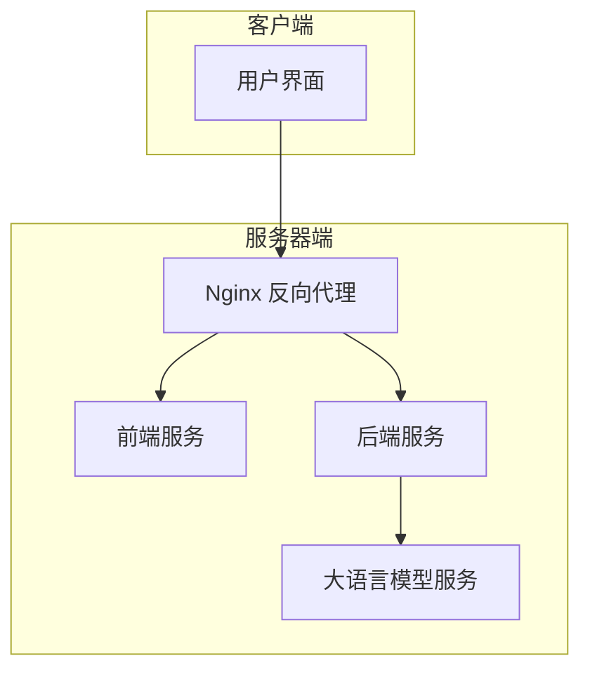
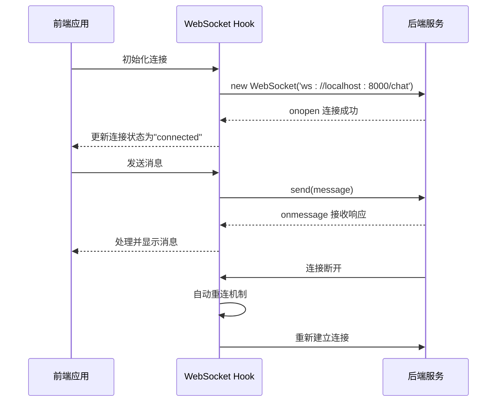
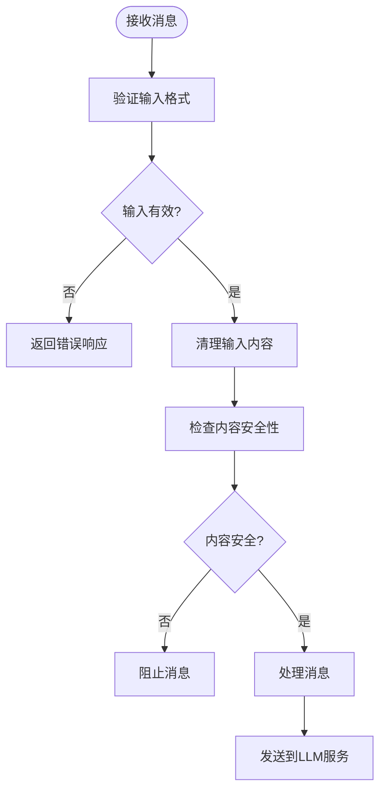
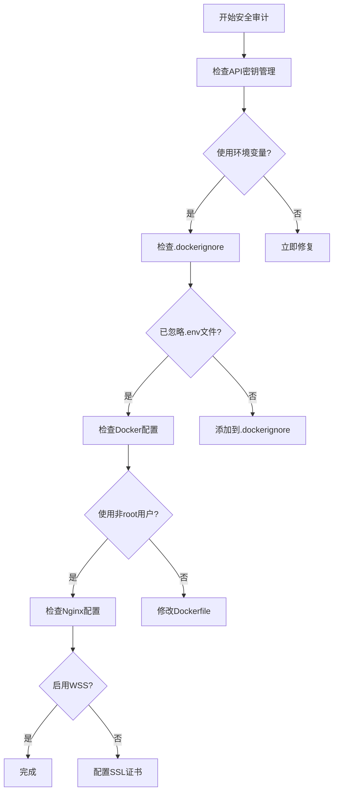

# 安全指南

<cite>
**本文档引用的文件**  
- [API_SECURITY_GUIDE.md](file://API_SECURITY_GUIDE.md)
- [backend/app.py](file://backend/app.py)
- [backend/llm_client.py](file://backend/llm_client.py)
- [backend/Dockerfile](file://backend/Dockerfile)
- [frontend/src/hooks/useWebSocket.js](file://frontend/src/hooks/useWebSocket.js)
- [frontend/src/components/InputBar.jsx](file://frontend/src/components/InputBar.jsx)
- [frontend/src/components/ChatBox.jsx](file://frontend/src/components/ChatBox.jsx)
- [docker-compose.yml](file://docker-compose.yml)
- [nginx/nginx.conf](file://nginx/nginx.conf)
</cite>

## 目录
1. [引言](#引言)
2. [项目结构概述](#项目结构概述)
3. [API密钥安全管理](#api密钥安全管理)
4. [WebSocket通信安全](#websocket通信安全)
5. [输入验证与前端安全](#输入验证与前端安全)
6. [Docker容器化部署安全](#docker容器化部署安全)
7. [系统管理员安全审计清单](#系统管理员安全审计清单)
8. [数据隐私与合规性](#数据隐私与合规性)
9. [结论与建议](#结论与建议)

## 引言
本指南旨在为chat-mvp项目提供全面的安全实践指导，涵盖API密钥管理、WebSocket通信、输入验证、容器化部署和数据隐私等方面。通过系统性地识别和缓解潜在安全风险，确保系统在开发、部署和运行过程中的安全性。本指南基于项目实际代码实现和安全最佳实践，为开发者和系统管理员提供可操作的安全建议。

## 项目结构概述
chat-mvp项目采用前后端分离的微服务架构，包含三个主要服务：后端API服务、前端用户界面和Nginx反向代理。后端使用FastAPI框架处理WebSocket通信和LLM集成，前端使用React构建用户界面，通过Docker Compose进行容器化部署。



**图示来源**  
- [docker-compose.yml](file://docker-compose.yml#L1-L27)
- [nginx/nginx.conf](file://nginx/nginx.conf#L1-L27)

## API密钥安全管理

### 环境变量使用
项目严格遵循安全最佳实践，通过环境变量管理API密钥，避免硬编码。在`backend/llm_client.py`中，API密钥通过`os.getenv("API_KEY")`从环境变量读取，如果未设置则抛出明确的错误信息。

```python
self.api_key = os.getenv("API_KEY")
if not self.api_key:
    raise ValueError(
        "API_KEY environment variable is required. "
        "Please set your API key in environment variables or .env file. "
        "Example: export API_KEY=your_actual_api_key_here"
    )
```

### Docker环境集成
在`docker-compose.yml`中，API密钥通过环境变量传递给后端服务，使用`${API_KEY}`语法从宿主机环境或`.env`文件读取，确保密钥不会直接暴露在配置文件中。

```yaml
services:
  backend:
    build: ./backend
    environment:
      - API_KEY=${API_KEY}
    ports:
      - "8000:8000"
```

### 安全实践建议
- **密钥轮换**：定期轮换API密钥，降低长期暴露风险
- **权限最小化**：为API密钥设置最小必要权限，限制其访问范围
- **监控与告警**：监控API密钥的使用模式，设置异常调用告警
- **密钥管理服务**：在生产环境中使用专业的密钥管理服务（如AWS KMS、Hashicorp Vault）

**本节来源**  
- [API_SECURITY_GUIDE.md](file://API_SECURITY_GUIDE.md#L1-L131)
- [backend/llm_client.py](file://backend/llm_client.py#L15-L25)
- [docker-compose.yml](file://docker-compose.yml#L10-L14)

## WebSocket通信安全

### 当前实现分析
项目当前使用非加密的WebSocket协议（`ws://`），在`frontend/src/hooks/useWebSocket.js`中，WebSocket连接通过`ws://localhost:8000/chat`建立，这在生产环境中存在安全风险。

```javascript
const ws = new WebSocket('ws://localhost:8000/chat');
```

### 安全升级建议
为确保生产环境中的数据传输安全，必须使用WebSocket Secure（WSS）协议，通过TLS加密所有通信内容。

#### Nginx配置支持
当前的Nginx配置已正确设置WebSocket代理，支持升级到WSS。`nginx/nginx.conf`中的配置正确处理了WebSocket的升级头信息。

```nginx
location /chat {
    proxy_pass http://backend/chat;
    proxy_http_version 1.1;
    proxy_set_header Upgrade $http_upgrade;
    proxy_set_header Connection "upgrade";
    proxy_set_header Host $host;
}
```

#### 前端连接升级
前端应修改WebSocket连接URL，使用`wss://`协议。在生产环境中，Nginx应配置SSL证书，将HTTPS请求代理到后端服务。

```javascript
// 生产环境应使用
const ws = new WebSocket('wss://your-domain.com/chat');
```

### 连接状态管理
前端通过`useWebSocket` Hook实现健壮的连接管理，包括自动重连、连接状态检测和错误处理，确保用户体验的连续性。



**图示来源**  
- [frontend/src/hooks/useWebSocket.js](file://frontend/src/hooks/useWebSocket.js#L1-L192)
- [backend/app.py](file://backend/app.py#L25-L106)
- [nginx/nginx.conf](file://nginx/nginx.conf#L15-L26)

**本节来源**  
- [frontend/src/hooks/useWebSocket.js](file://frontend/src/hooks/useWebSocket.js#L35-L45)
- [backend/app.py](file://backend/app.py#L25-L106)
- [nginx/nginx.conf](file://nginx/nginx.conf#L15-L26)

## 输入验证与前端安全

### 前端输入处理
前端组件`InputBar.jsx`实现了基本的输入验证，防止空消息发送，并通过`trim()`方法去除首尾空白字符。

```javascript
const handleSubmit = (e) => {
    e.preventDefault();
    if (input.trim()) {
        onSend(input);
        setInput('');
        resetTextareaHeight();
    }
};
```

### 安全增强建议
尽管当前实现防止了空消息，但缺乏对恶意内容的深度验证。建议实施以下安全措施：

#### 内容过滤
- **XSS防护**：对用户输入进行HTML转义，防止跨站脚本攻击
- **特殊字符检测**：检测并处理可能导致前端渲染异常的特殊字符序列
- **长度限制**：设置合理的输入长度上限，防止拒绝服务攻击

#### 消息渲染安全
`ChatBox.jsx`组件直接渲染消息内容，应确保使用安全的渲染方法，避免直接插入HTML。

```javascript
// 安全的消息渲染
<MessageBubble key={message.id} message={message} />
```

### 后端验证补充
后端应在`app.py`中增加输入验证逻辑，确保所有进入系统的数据都经过安全检查。



**图示来源**  
- [frontend/src/components/InputBar.jsx](file://frontend/src/components/InputBar.jsx#L15-L25)
- [frontend/src/components/ChatBox.jsx](file://frontend/src/components/ChatBox.jsx#L1-L30)
- [backend/app.py](file://backend/app.py#L25-L106)

**本节来源**  
- [frontend/src/components/InputBar.jsx](file://frontend/src/components/InputBar.jsx#L15-L25)
- [frontend/src/components/ChatBox.jsx](file://frontend/src/components/ChatBox.jsx#L1-L30)

## Docker容器化部署安全

### 当前Docker配置分析
项目使用Docker Compose进行多服务编排，但存在一些安全改进空间。

#### 后端Dockerfile
```dockerfile
FROM python:3.11-slim
WORKDIR /app
COPY requirements.txt .
RUN pip install --no-cache-dir -r requirements.txt
COPY . .
CMD ["uvicorn", "app:app", "--host", "0.0.0.0", "--port", "8000"]
```

#### 安全问题
- **特权用户**：容器默认以root用户运行，增加安全风险
- **基础镜像**：使用`python:3.11-slim`，虽然较小但仍包含不必要的组件
- **攻击面**：未限制容器权限和资源使用

### 安全最佳实践

#### 使用非root用户
创建专用用户运行应用，降低权限提升风险。

```dockerfile
FROM python:3.11-slim
WORKDIR /app

# 创建专用用户
RUN adduser --disabled-password --gecos '' appuser
RUN chown -R appuser:appuser /app
USER appuser

COPY requirements.txt .
RUN pip install --no-cache-dir -r requirements.txt
COPY . .

CMD ["uvicorn", "app:app", "--host", "0.0.0.0", "--port", "8000"]
```

#### 最小化镜像
使用更小的基础镜像，如`python:3.11-alpine`，减少攻击面。

#### 容器安全配置
在`docker-compose.yml`中添加安全配置。

```yaml
version: '3.8'
services:
  backend:
    build: ./backend
    environment:
      - API_KEY=${API_KEY}
    ports:
      - "8000:8000"
    user: "1000:1000"  # 指定用户和组
    security_opt:
      - no-new-privileges:true
    read_only: true  # 根文件系统只读
    tmpfs:
      - /tmp  # 临时文件系统
    cap_drop:
      - ALL  # 删除所有能力
    cap_add:
      - CHOWN
      - SETUID
      - SETGID
```

### 定期更新
- **基础镜像更新**：定期更新基础镜像，获取安全补丁
- **依赖更新**：使用工具如Dependabot监控和更新依赖包
- **漏洞扫描**：在CI/CD流程中集成容器漏洞扫描

**本节来源**  
- [backend/Dockerfile](file://backend/Dockerfile#L1-L10)
- [docker-compose.yml](file://docker-compose.yml#L1-L27)

## 系统管理员安全审计清单

### 日志监控
- **检查可疑活动**：定期审查后端日志，查找异常API调用模式
- **错误日志分析**：监控`app.py`中的错误日志，及时发现潜在攻击
- **连接日志**：记录WebSocket连接和断开事件，识别异常连接行为

### 防火墙与网络配置
- **验证防火墙规则**：确保只开放必要的端口（80、443）
- **网络隔离**：使用Docker网络隔离前后端服务
- **访问控制**：限制对后端API的直接访问，仅通过Nginx代理

### 渗透测试
- **定期执行**：每季度进行一次全面的渗透测试
- **WebSocket测试**：专门测试WebSocket端点的安全性
- **API安全测试**：验证API密钥保护机制的有效性

### 安全配置检查


**图示来源**  
- [backend/llm_client.py](file://backend/llm_client.py#L15-L25)
- [backend/Dockerfile](file://backend/Dockerfile#L1-L10)
- [nginx/nginx.conf](file://nginx/nginx.conf#L1-L27)

## 数据隐私与合规性

### 数据处理原则
- **最小化收集**：只收集必要的用户对话数据
- **数据匿名化**：在存储和分析时对用户数据进行匿名化处理
- **数据保留策略**：制定明确的数据保留期限，定期清理过期数据

### 用户同意与透明度
- **隐私政策**：提供清晰的隐私政策，说明数据使用方式
- **用户控制**：允许用户查看、导出和删除其对话历史
- **同意机制**：在收集数据前获得用户的明确同意

### 合规性要求
- **GDPR**：如果涉及欧盟用户，确保符合GDPR要求
- **网络安全法**：遵守中国的网络安全法和数据安全法
- **行业规范**：遵循金融行业的数据保护标准

## 结论与建议
chat-mvp项目在API密钥管理和架构设计上遵循了基本的安全原则，但仍有多项安全改进空间。建议立即实施以下关键措施：

1. **启用WSS**：在生产环境中强制使用WebSocket Secure加密通信
2. **强化容器安全**：修改Docker配置，使用非root用户运行容器
3. **增强输入验证**：在前后端实施深度输入验证和内容过滤
4. **定期安全审计**：建立定期的安全审计和渗透测试流程
5. **密钥轮换机制**：实施自动化的API密钥轮换策略

通过系统性地实施这些安全措施，可以显著提升chat-mvp项目的安全性，保护用户数据和系统资源免受潜在威胁。