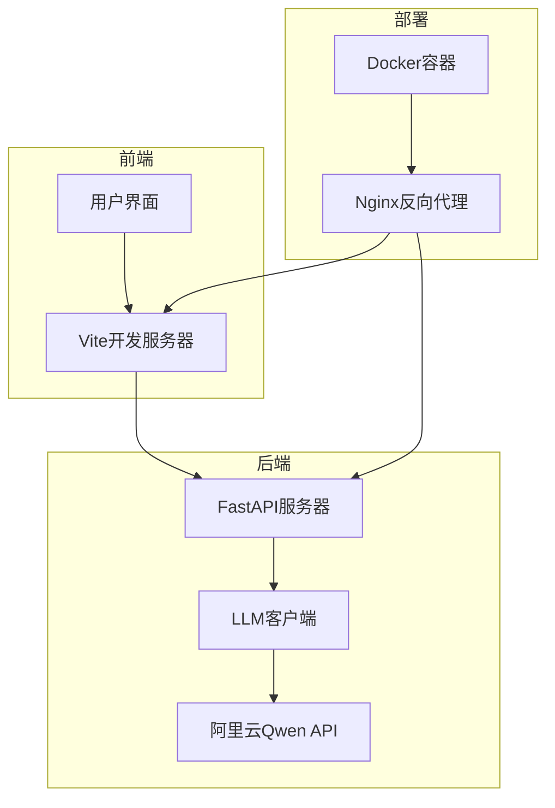
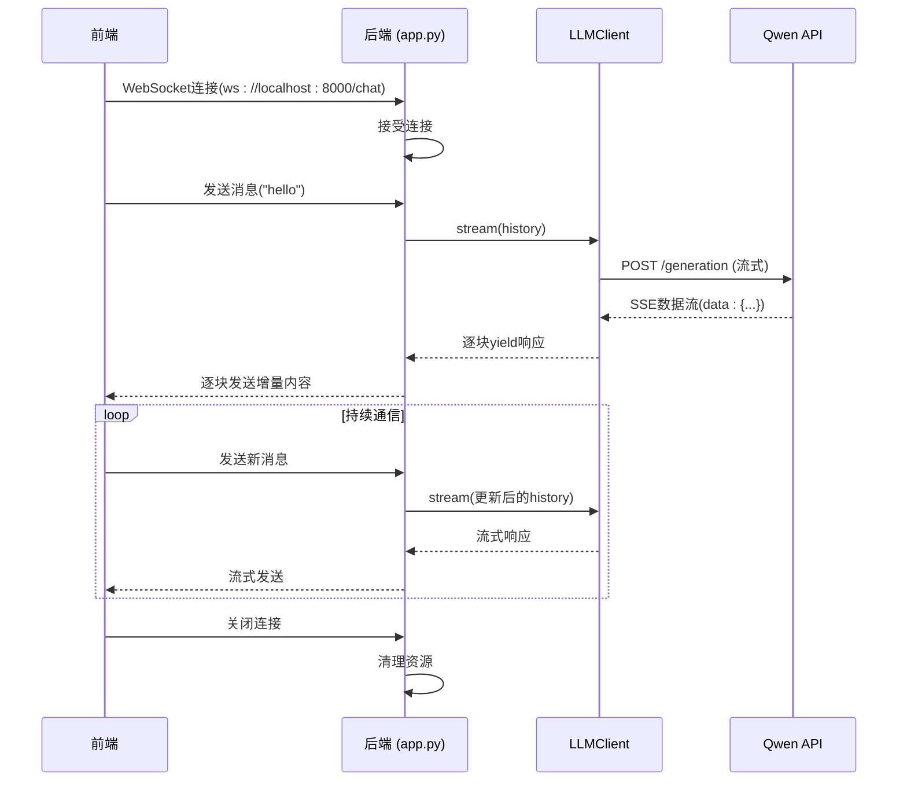

# 开发者指南

<cite>
**本文档中引用的文件**  
- [README.md](file://README.md#L1-L116)
- [backend/app.py](file://backend/app.py#L1-L106)
- [backend/llm_client.py](file://backend/llm_client.py#L1-L86)
- [frontend/package.json](file://frontend/package.json#L1-L34)
- [frontend/vite.config.js](file://frontend/vite.config.js#L1-L16)
- [frontend/src/hooks/useWebSocket.js](file://frontend/src/hooks/useWebSocket.js#L1-L192)
- [frontend/src/components/ChatBox.jsx](file://frontend/src/components/ChatBox.jsx#L1-L29)
- [frontend/src/components/InputBar.jsx](file://frontend/src/components/InputBar.jsx#L1-L86)
- [frontend/src/components/ConnectionStatus.jsx](file://frontend/src/components/ConnectionStatus.jsx#L1-L34)
- [frontend/src/hooks/useConversations.js](file://frontend/src/hooks/useConversations.js#L1-L118)
- [frontend/src/App.jsx](file://frontend/src/App.jsx#L1-L100)
</cite>

## 目录
1. [简介](#简介)
2. [项目结构](#项目结构)
3. [本地开发环境搭建](#本地开发环境搭建)
4. [前后端独立开发模式](#前后端独立开发模式)
5. [核心组件分析](#核心组件分析)
6. [WebSocket通信机制](#websocket通信机制)
7. [调试与测试](#调试与测试)
8. [常见问题排查](#常见问题排查)
9. [贡献指南](#贡献指南)

## 简介
本指南旨在为新加入chat-mvp项目的开发者提供全面的入门指导。该项目是中国银行江西省分行的大语言模型（BOCAI）对话系统，采用Python后端（FastAPI）与React前端（Vite）构建，支持通过WebSocket进行实时流式响应。本文档详细说明了从环境配置到调试测试的完整开发流程，帮助开发者快速上手并高效参与项目开发。

## 项目结构
chat-mvp项目采用前后端分离架构，结合Docker容器化部署。主要目录包括`backend`（Python服务）、`frontend`（React应用）、`nginx`（反向代理）和`docker-compose.yml`（容器编排）。这种结构支持本地独立开发和一体化部署两种模式。



**图示来源**  
- [README.md](file://README.md#L15-L34)
- [project_structure](file://project_structure)

## 本地开发环境搭建
为确保项目顺利运行，需完成以下步骤进行本地环境配置。

### 前提条件
- Python 3.8+
- Node.js 16+
- conda（推荐）
- Docker（可选）

### 克隆仓库
```bash
git clone https://github.com/your-repo/chat-mvp.git
cd chat-mvp
```

### 后端依赖安装与配置
1. **激活conda环境**：
   ```bash
   conda activate bank-rag-mvp
   ```

2. **进入后端目录并安装依赖**：
   ```bash
   cd backend
   pip install -r requirements.txt
   ```

3. **配置API密钥**：
   - 访问 [DashScope](https://dashscope.aliyuncs.com/) 获取Qwen API密钥
   - 在`backend`目录下创建`.env`文件：
     ```
     API_KEY=your_actual_api_key_here
     ```

4. **启动后端服务**：
   ```bash
   uvicorn app:app --host 0.0.0.0 --port 8000
   ```
   成功启动后，控制台将显示`Uvicorn running on http://0.0.0.0:8000`。

### 前端依赖安装与配置
1. **进入前端目录并安装依赖**：
   ```bash
   cd frontend
   npm install
   ```

2. **启动前端开发服务器**：
   ```bash
   npm run dev
   ```
   默认在`http://localhost:3000`启动Vite开发服务器。

**本节来源**  
- [README.md](file://README.md#L45-L90)
- [backend/app.py](file://backend/app.py#L1-L106)
- [frontend/package.json](file://frontend/package.json#L1-L34)

## 前后端独立开发模式
项目支持前后端独立运行，便于并行开发和调试。

### 服务端口分配
- **前端**：`http://localhost:3000`（Vite开发服务器）
- **后端**：`http://localhost:8000`（Uvicorn服务器）

### 跨域问题解决
由于前后端运行在不同端口，存在跨域（CORS）问题。后端已通过`CORSMiddleware`允许所有来源访问：
```python
app.add_middleware(
    CORSMiddleware,
    allow_origins=["*"],
    allow_credentials=True,
    allow_methods=["*"],
    allow_headers=["*"],
)
```

### 开发服务器代理配置
前端Vite服务器通过代理解决WebSocket跨域问题。`vite.config.js`中配置了对`/api`路径的代理：
```javascript
export default defineConfig({
  server: {
    port: 3000,
    proxy: {
      '/api': {
        target: 'http://localhost:8000',
        changeOrigin: true,
        secure: false,
      }
    }
  }
})
```
此配置将前端请求中以`/api`开头的路径代理到后端服务，但WebSocket连接（`ws://localhost:8000/chat`）需在前端代码中直接指定后端地址。

**本节来源**  
- [README.md](file://README.md#L70-L90)
- [backend/app.py](file://backend/app.py#L10-L18)
- [frontend/vite.config.js](file://frontend/vite.config.js#L1-L16)

## 核心组件分析
本节深入分析项目中的关键组件及其交互逻辑。

### 后端核心：LLM客户端
`llm_client.py`实现了与阿里云Qwen API的异步流式通信。



**图示来源**  
- [backend/llm_client.py](file://backend/llm_client.py#L1-L86)
- [backend/app.py](file://backend/app.py#L19-L106)

#### LLMClient类实现
```python
class LLMClient:
    def __init__(self):
        self.api_key = os.getenv("API_KEY")  # 从环境变量读取
        self.url = QWEN_API_URL
        self.qwen_model = "qwen-turbo"

    async def stream(self, messages):
        headers = {
            "Authorization": f"Bearer {self.api_key}",
            "X-DashScope-SSE": "enable"  # 启用SSE流式
        }
        payload = {"model": self.qwen_model, "input": {"messages": messages}}

        async with httpx.AsyncClient() as client:
            async with client.stream("POST", self.url, json=payload, headers=headers) as response:
                async for line in response.aiter_lines():
                    if line.startswith("data:"):
                        yield line[5:].strip()  # 提取数据内容
```

**本节来源**  
- [backend/llm_client.py](file://backend/llm_client.py#L1-L86)

### 前端核心：WebSocket管理
`useWebSocket.js` Hook封装了WebSocket连接的全生命周期管理。

#### 连接与重连机制
- **自动连接**：组件挂载时自动建立WebSocket连接
- **状态监控**：每2秒检查连接状态，断开时自动重连
- **页面可见性**：当页面从后台切回时，检查并恢复连接

```javascript
const connectWebSocket = useCallback(() => {
  if (websocketRef.current?.readyState === WebSocket.OPEN) return;
  const ws = new WebSocket('ws://localhost:8000/chat');
  // ... 设置onopen, onmessage, onclose, onerror回调
});
```

#### 消息处理流程
1. 收到消息块（chunk）后，通过全局函数`window.handleWebSocketMessage`传递给聊天组件
2. 空消息或空字符串表示流式响应结束，触发`window.handleStreamEnd`
3. 使用`activeConversationRef`确保消息发送到正确的会话

**本节来源**  
- [frontend/src/hooks/useWebSocket.js](file://frontend/src/hooks/useWebSocket.js#L1-L192)

## WebSocket通信机制
系统通过WebSocket实现低延迟的双向实时通信。

### 后端WebSocket端点
`app.py`中的`/chat`端点处理WebSocket连接：
- **连接管理**：接受连接，记录日志
- **消息历史**：维护会话上下文`history`
- **流式转发**：将LLM的流式响应逐块发送给前端
- **错误处理**：捕获JSON解析错误、API错误并向前端发送错误信息

```python
@app.websocket("/chat")
async def websocket_endpoint(websocket: WebSocket):
    await websocket.accept()
    history = []
    while True:
        data = await websocket.receive_text()
        history.append({"role": "user", "content": data})
        full_response = ""
        async for chunk in llm.stream(history):
            # 解析chunk，计算增量内容，发送
            delta_content = content[len(full_response):]
            await websocket.send_text(delta_content)
            full_response = content
        history.append({"role": "assistant", "content": full_response})
```

### 前端消息流处理
前端通过`useWebSocket`的`setMessageHandlers`接收消息：
```javascript
setMessageHandlers(
  (chunk, conversationId) => {
    // 将增量内容追加到当前消息
    updateMessage(conversationId, prev => prev + chunk);
  },
  (conversationId) => {
    // 流式结束，标记为非输入状态
    setIsTyping(false);
  }
);
```

**本节来源**  
- [backend/app.py](file://backend/app.py#L19-L106)
- [frontend/src/hooks/useWebSocket.js](file://frontend/src/hooks/useWebSocket.js#L1-L192)

## 调试与测试
提供多种工具和方法帮助开发者验证功能和排查问题。

### 浏览器开发者工具
1. 打开`http://localhost:3000`
2. 按F12打开开发者工具
3. 在Console标签页执行以下代码测试WebSocket连接：
```javascript
const ws = new WebSocket('ws://localhost:8000/chat');
ws.onopen = () => { console.log('✅ Connected'); ws.send('hello world'); };
ws.onmessage = (e) => console.log('📨 Received:', e.data);
ws.onerror = (e) => console.error('❌ Error:', e);
```

### 手动WebSocket测试
使用`frontend/public/test-websocket.html`文件进行端到端测试：
1. 确保后端服务正在运行
2. 在浏览器中直接打开`test-websocket.html`
3. 输入消息并发送，观察响应

### 后端日志调试
`app.py`和`llm_client.py`均配置了详细日志：
- `logging.INFO`：记录连接、请求、响应状态
- `logging.DEBUG`：记录流式传输的每个数据块
- `logging.ERROR`：记录异常和API错误

在代码中添加日志语句以跟踪请求流程：
```python
logger.info(f"Received message: {data}")
logger.debug(f"Processing chunk: {chunk}")
```

**本节来源**  
- [README.md](file://README.md#L80-L88)
- [backend/app.py](file://backend/app.py#L1-L106)
- [backend/llm_client.py](file://backend/llm_client.py#L1-L86)
- [frontend/public/test-websocket.html](file://frontend/public/test-websocket.html)

## 常见问题排查
解决开发过程中可能遇到的典型问题。

### 依赖安装失败
- **Python依赖**：确保使用正确的conda环境，运行`pip install --upgrade pip`后重试
- **Node.js依赖**：删除`node_modules`和`package-lock.json`，重新运行`npm install`

### 端口冲突
- **后端端口8000被占用**：使用`lsof -i :8000`（macOS/Linux）或`netstat -ano | findstr :8000`（Windows）查找并终止占用进程，或修改`uvicorn`启动命令的端口
- **前端端口3000被占用**：修改`vite.config.js`中的`server.port`值

### 环境变量未加载
- 确认`.env`文件位于`backend`目录下
- 检查文件名是否为`.env`（无扩展名）
- 重启Uvicorn服务器以重新加载环境变量
- 在代码中添加`print(os.getenv("API_KEY"))`验证是否读取成功

### WebSocket连接失败
- 检查后端服务是否已启动
- 确认前端连接地址为`ws://localhost:8000/chat`
- 查看浏览器控制台和后端日志中的错误信息

**本节来源**  
- [README.md](file://README.md#L45-L90)
- [backend/app.py](file://backend/app.py#L1-L106)
- [frontend/src/hooks/useWebSocket.js](file://frontend/src/hooks/useWebSocket.js#L1-L192)

## 贡献指南
为确保代码质量和一致性，请遵循以下规范。

### 代码风格
- **Python**：遵循PEP 8，使用`black`和`isort`格式化
- **JavaScript/JSX**：遵循Airbnb风格，使用ESLint（配置在`package.json`中）

### 提交流程
1. 从`main`分支创建新特性分支：`git checkout -b feature/your-feature`
2. 实现功能并编写测试
3. 提交代码：`git commit -m "描述性提交信息"`
4. 推送分支：`git push origin feature/your-feature`
5. 在GitHub上创建Pull Request

### 测试要求
- 修改核心逻辑时，需提供相应的单元测试或集成测试
- 前端组件修改应确保UI功能正常
- 提交前运行`npm run lint`确保代码风格合规

**本节来源**  
- [README.md](file://README.md)
- [frontend/package.json](file://frontend/package.json#L1-L34)