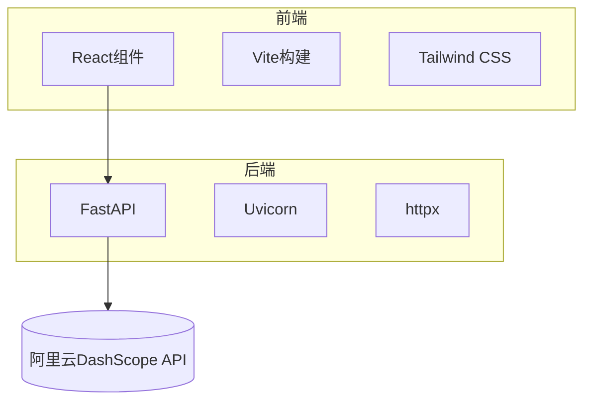
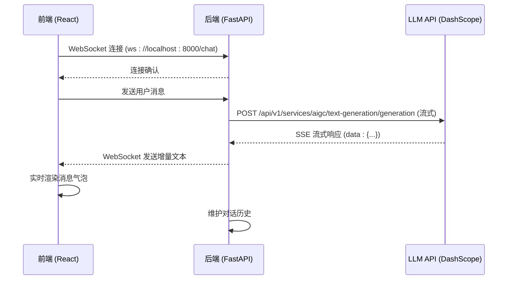

# 技术栈

<cite>
**本文档引用的文件**  
- [app.py](file://backend/app.py#L1-L107)
- [llm_client.py](file://backend/llm_client.py#L1-L87)
- [requirements.txt](file://backend/requirements.txt#L1-L5)
- [useWebSocket.js](file://frontend/src/hooks/useWebSocket.js#L1-L193)
- [useConversations.js](file://frontend/src/hooks/useConversations.js#L1-L119)
- [MessageBubble.jsx](file://frontend/src/components/MessageBubble.jsx#L1-L94)
- [package.json](file://frontend/package.json#L1-L35)
- [vite.config.js](file://frontend/vite.config.js)
- [tailwind.config.js](file://frontend/tailwind.config.js)
- [postcss.config.js](file://frontend/postcss.config.js)
</cite>

## 目录
1. [项目结构概览](#项目结构概览)
2. [后端技术栈分析](#后端技术栈分析)
3. [前端技术栈分析](#前端技术栈分析)
4. [关键技术集成与实现](#关键技术集成与实现)
5. [依赖兼容性与稳定性](#依赖兼容性与稳定性)
6. [最佳实践建议](#最佳实践建议)

## 项目结构概览

本项目采用前后端分离架构，整体结构清晰，职责分明：

- `backend/`：FastAPI 后端服务，处理 WebSocket 通信与 LLM API 调用
- `frontend/`：React 前端应用，基于 Vite 构建，实现用户交互界面
- `nginx/`：Nginx 配置文件，用于生产环境反向代理
- 根目录包含 Docker 和部署相关配置

该结构有利于独立开发、测试和部署前后端服务。



**图示来源**  
- [app.py](file://backend/app.py#L1-L107)
- [llm_client.py](file://backend/llm_client.py#L1-L87)

## 后端技术栈分析

### FastAPI 与 WebSocket 高性能通信

FastAPI 是一个现代、快速（高性能）的 Web 框架，基于 Python 类型提示构建。它使用 Starlette 作为 ASGI 框架，原生支持异步编程，非常适合处理高并发的 WebSocket 连接。

在 `app.py` 中，通过 `@app.websocket("/chat")` 定义了一个 WebSocket 端点，实现了流式对话功能。该端点接收用户消息，维护对话历史，并将大模型的响应以增量方式（chunk）实时推送给前端。

```python
@app.websocket("/chat")
async def websocket_endpoint(websocket: WebSocket):
    await websocket.accept()
    history = []
    try:
        while True:
            data = await websocket.receive_text()
            user_message = {"role": "user", "content": data}
            history.append(user_message)

            full_response = ""
            async for chunk in llm.stream(history):
                # 解析并发送增量内容
                delta_content = content[len(full_response):]
                if delta_content:
                    await websocket.send_text(delta_content)
                full_response = content
            history.append({"role": "assistant", "content": full_response})
    except Exception as e:
        logger.error(f"WebSocket error: {e}")
    finally:
        await websocket.close()
```

此实现利用了 Python 的 `async/await` 语法，确保在等待 LLM 响应时不会阻塞事件循环，从而支持大量并发连接。

**本节来源**  
- [app.py](file://backend/app.py#L1-L107)

### Uvicorn ASGI 服务器配置与优势

Uvicorn 是一个基于 uvloop 和 httptools 的 ASGI（Asynchronous Server Gateway Interface）服务器，为 FastAPI 提供了高性能的运行环境。

在 `requirements.txt` 中指定了 `uvicorn[standard]==0.29.0`，其中 `[standard]` 表示安装了推荐的额外依赖（如 `uvloop` 和 `httptools`），这些依赖显著提升了性能。

Uvicorn 的优势包括：
- **高性能**：基于 uvloop（替代标准 asyncio 事件循环），性能提升 2-4 倍
- **轻量级**：资源占用少，启动快
- **自动重载**：开发模式下支持代码更改自动重启
- **生产就绪**：可直接用于生产环境或与 Gunicorn 配合使用

虽然项目未提供显式的 Uvicorn 启动脚本，但通常通过 `uvicorn app:app --reload` 启动开发服务器。

**本节来源**  
- [requirements.txt](file://backend/requirements.txt#L1-L5)

### httpx 异步调用阿里云 DashScope API

`httpx` 是一个现代的、全功能的 HTTP 客户端，支持同步和异步操作。在 `llm_client.py` 中，使用 `httpx.AsyncClient` 实现了对阿里云 DashScope API 的异步流式调用。

关键实现如下：

```python
async with httpx.AsyncClient() as client:
    async with client.stream("POST", self.url, json=payload, headers=headers) as response:
        async for line in response.aiter_lines():
            if line.startswith("data:"):
                yield data_content
```

- `client.stream()` 支持服务器发送事件（SSE），实现流式响应
- `aiter_lines()` 异步迭代响应行，避免阻塞
- `yield` 关键字使 `stream()` 方法成为异步生成器，可被 FastAPI WebSocket 端点逐块消费

此设计确保了从 LLM 接收数据到向前端推送的整个链路都是异步非阻塞的，极大提升了响应速度和用户体验。

**本节来源**  
- [llm_client.py](file://backend/llm_client.py#L1-L87)

### python-dotenv 环境变量管理实践

`python-dotenv` 用于从 `.env` 文件加载环境变量，避免将敏感信息（如 API 密钥）硬编码在代码中。

在 `app.py` 中，首先调用 `load_dotenv()` 加载环境变量，然后在 `LLMClient` 中通过 `os.getenv("API_KEY")` 获取密钥：

```python
from dotenv import load_dotenv
load_dotenv()

# 在 LLMClient 中
self.api_key = os.getenv("API_KEY")
if not self.api_key:
    raise ValueError("API_KEY environment variable is required.")
```

这种实践提高了应用的安全性和可配置性，不同环境（开发、测试、生产）可通过不同的 `.env` 文件管理配置。

**本节来源**  
- [app.py](file://backend/app.py#L1-L107)
- [llm_client.py](file://backend/llm_client.py#L1-L87)

## 前端技术栈分析

### React 函数组件与自定义 Hooks 状态管理

项目采用 React 函数组件和 Hooks 进行状态管理，实现了组件逻辑的复用和关注点分离。

#### useWebSocket 自定义 Hook

`useWebSocket.js` 封装了 WebSocket 的连接、消息处理、重连等复杂逻辑：

- 使用 `useRef` 存储 WebSocket 实例和活跃会话 ID，避免重复渲染
- 使用 `useCallback` 缓存 `connectWebSocket` 函数，防止在 `useEffect` 中无限循环
- 使用 `useEffect` 在组件挂载时建立连接，并设置定时器和页面可见性监听器实现自动重连
- 提供 `sendMessage`、`getConnectionStatus` 等函数供组件调用

```javascript
const useWebSocket = () => {
  const websocketRef = useRef(null);
  const activeConversationRef = useRef(null);

  const connectWebSocket = useCallback(() => {
    const ws = new WebSocket('ws://localhost:8000/chat');
    websocketRef.current = ws;
    // ... 设置 onopen, onmessage, onclose, onerror
  }, []);

  useEffect(() => {
    connectWebSocket();
    // 设置自动重连定时器
    const connectionChecker = setInterval(() => {
      if (!websocketRef.current || websocketRef.current.readyState === WebSocket.CLOSED) {
        connectWebSocket();
      }
    }, 2000);
    // ... 清理函数
  }, [connectWebSocket]);

  return { sendMessage, getConnectionStatus, /* ... */ };
};
```

#### useConversations 自定义 Hook

`useConversations.js` 管理会话列表和当前会话状态：

- 使用 `useState` 存储会话数据
- 使用 `useEffect` 在组件挂载时从 `localStorage` 加载会话，在会话变化时持久化
- 提供 `handleNewConversation`、`addMessageToCurrentConversation` 等函数更新状态

```javascript
const useConversations = () => {
  const [conversations, setConversations] = useState(initialConversations);
  const [currentConversationId, setCurrentConversationId] = useState('1');

  useEffect(() => {
    const saved = localStorage.getItem('chatConversations');
    if (saved) setConversations(JSON.parse(saved));
  }, []);

  useEffect(() => {
    localStorage.setItem('chatConversations', JSON.stringify(conversations));
  }, [conversations]);

  return { conversations, currentConversation, addMessageToCurrentConversation, /* ... */ };
};
```

**本节来源**  
- [useWebSocket.js](file://frontend/src/hooks/useWebSocket.js#L1-L193)
- [useConversations.js](file://frontend/src/hooks/useConversations.js#L1-L119)

### Vite 构建工具配置分析

Vite 是一个现代化的前端构建工具，利用浏览器原生 ES 模块导入，在开发时提供闪电般的热模块替换（HMR）。

#### 开发服务器配置

虽然未提供 `vite.config.js` 内容，但从 `package.json` 可知开发脚本为 `"dev": "vite"`，表明使用 Vite 默认配置或自定义配置启动开发服务器。典型配置包括：
- 服务器代理：将 `/api` 请求代理到后端，解决跨域问题
- 端口配置：指定开发服务器端口
- 环境变量：支持 `.env` 文件

#### 生产构建配置

构建脚本 `"build": "vite build"` 表明使用 Vite 的生产构建能力：
- 基于 Rollup 进行打包，支持代码分割和 tree-shaking
- 自动生成优化的静态资源（JS、CSS）
- 输出到 `dist` 目录，可直接部署

Vite 的优势在于开发体验极佳，构建速度快，且生产构建输出高效。

**本节来源**  
- [package.json](file://frontend/package.json#L1-L35)

### Tailwind CSS 实现响应式 UI 与主题切换

Tailwind CSS 是一个功能优先的 CSS 框架，通过组合实用类（utility classes）快速构建自定义设计。

#### 响应式 UI 实现

在 `MessageBubble.jsx` 中，使用 `max-w-[70%]`、`w-full` 等类实现消息气泡的宽度控制，结合 `flex` 布局实现左右对齐。

#### 暗黑/浅色主题切换

项目通过 `dark:` 变体实现主题切换：
- `dark:bg-gray-800/80`：暗色模式下背景色
- `dark:text-gray-100`：暗色模式下文字颜色
- `dark:border-gray-700/50`：暗色模式下边框颜色

这要求在根元素（如 `<html>`）上通过 JavaScript 切换 `class`（如添加 `dark`），Tailwind 会自动应用对应的样式。

**本节来源**  
- [MessageBubble.jsx](file://frontend/src/components/MessageBubble.jsx#L1-L94)

### react-markdown 与 react-syntax-highlighter 实现

`MessageBubble.jsx` 组件集成了 `react-markdown` 和 `react-syntax-highlighter`，实现了消息内容的 Markdown 解析与代码高亮。

#### Markdown 解析

使用 `ReactMarkdown` 组件解析 `message.text`：

```jsx
<ReactMarkdown
  remarkPlugins={[remarkGfm]} // 支持GitHub Flavored Markdown
  components={{
    code: CodeBlock,
    a: ({node, ...props}) => <a target="_blank" rel="noopener noreferrer" {...props} />,
    // 自定义其他元素样式
  }}
>
  {message.text}
</ReactMarkdown>
```

- `remarkGfm` 插件支持表格、删除线等扩展语法
- `components` 属性允许自定义渲染逻辑

#### 代码高亮实现

`CodeBlock` 组件处理代码块渲染：
- 检测 `className` 中的语言（如 `language-python`）
- 使用 `react-syntax-highlighter` 的 `Prism` 组件和 `oneDark` 主题进行高亮
- 添加复制按钮功能，提升用户体验

```jsx
<SyntaxHighlighter
  style={oneDark}
  language={match[1]}
  showLineNumbers
  wrapLines
>
  {String(children).replace(/\n$/, '')}
</SyntaxHighlighter>
```

**本节来源**  
- [MessageBubble.jsx](file://frontend/src/components/MessageBubble.jsx#L1-L94)

## 关键技术集成与实现

### WebSocket 全链路通信流程



**图示来源**  
- [app.py](file://backend/app.py#L1-L107)
- [llm_client.py](file://backend/llm_client.py#L1-L87)
- [useWebSocket.js](file://frontend/src/hooks/useWebSocket.js#L1-L193)

### 环境变量与 API 密钥管理流程

```mermaid
flowchart TD
A[.env 文件] --> B[app.py: load_dotenv()]
B --> C[os.getenv("API_KEY")]
C --> D[llm_client.py: LLMClient.__init__()]
D --> E[API 请求头: Authorization: Bearer <API_KEY>]
E --> F[阿里云DashScope API]
```

**图示来源**  
- [app.py](file://backend/app.py#L1-L107)
- [llm_client.py](file://backend/llm_client.py#L1-L87)

## 依赖兼容性与稳定性

### 后端依赖 (requirements.txt)

| 包名 | 版本 | 作用 | 稳定性 |
|------|------|------|--------|
| fastapi | 0.110.0 | Web 框架 | 高 |
| uvicorn[standard] | 0.29.0 | ASGI 服务器 | 高 |
| websockets | 12.0 | WebSocket 协议支持 | 高 |
| httpx | 0.27.0 | HTTP 客户端 | 高 |
| python-dotenv | 1.0.1 | 环境变量加载 | 高 |

所有依赖均为稳定版本，无预发布（alpha/beta）标签，且版本号精确指定，确保了构建的可重现性。

### 前端依赖 (package.json)

| 包名 | 版本 | 作用 | 稳定性 |
|------|------|------|--------|
| react | ^18.2.0 | UI 框架 | 高 |
| react-dom | ^18.2.0 | DOM 渲染 | 高 |
| react-markdown | ^8.0.7 | Markdown 解析 | 高 |
| react-syntax-highlighter | ^15.5.0 | 代码高亮 | 高 |
| vite | ^4.4.5 | 构建工具 | 高 |
| tailwindcss | ^3.3.3 | CSS 框架 | 高 |

使用 `^` 符号允许补丁和次要版本更新，平衡了新功能获取与稳定性。

**本节来源**  
- [requirements.txt](file://backend/requirements.txt#L1-L5)
- [package.json](file://frontend/package.json#L1-L35)

## 最佳实践建议

### Vite 构建配置优化

1. **配置开发服务器代理**：在 `vite.config.js` 中添加代理，解决跨域问题：
   ```js
   export default {
     server: {
       proxy: {
         '/api': 'http://localhost:8000'
       }
     }
   }
   ```
2. **代码分割**：对大型组件或库进行动态导入，减少初始包大小。
3. **环境变量**：使用 `.env.development` 和 `.env.production` 区分环境。

### 提升 FastAPI 并发处理能力

1. **使用 Gunicorn + Uvicorn 工人**：生产环境使用 `gunicorn -k uvicorn.workers.UvicornWorker app:app` 启动多进程服务器。
2. **连接池**：若使用数据库，配置连接池（如 `asyncpg`）。
3. **请求验证**：使用 Pydantic 模型验证请求数据，提高安全性。
4. **日志与监控**：集成 Prometheus 和 Grafana 进行性能监控。

### 前端性能与用户体验优化

1. **消息加载状态**：在 `isTyping` 时显示“正在输入...”动画。
2. **错误处理**：增强 WebSocket 错误处理，提供用户友好的错误提示。
3. **会话持久化**：优化 `localStorage` 序列化，避免大数据导致性能问题。
4. **代码高亮主题**：支持更多主题或允许用户自定义。