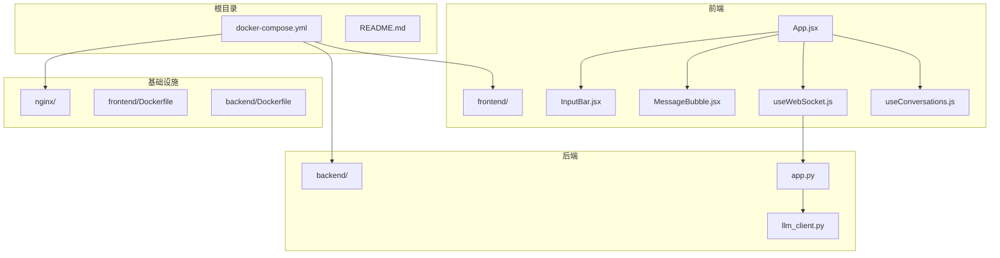
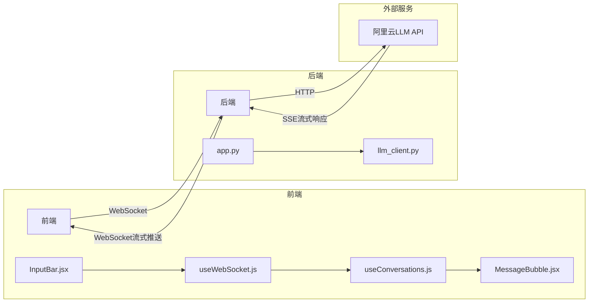
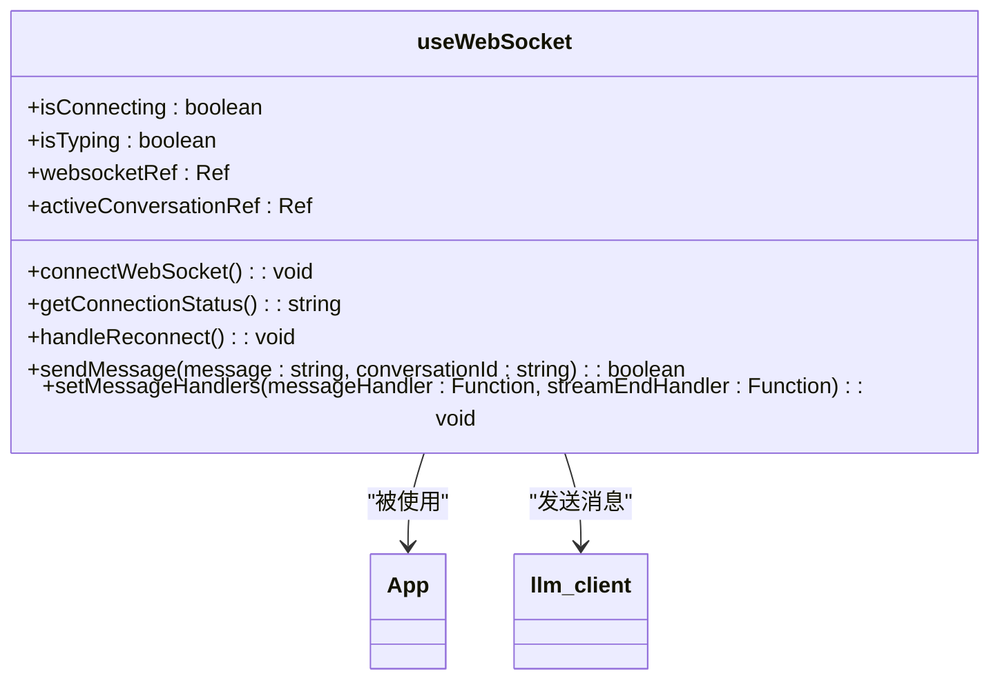
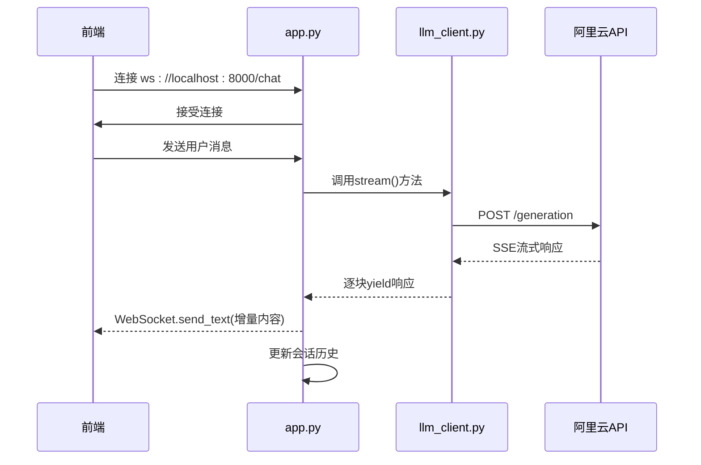
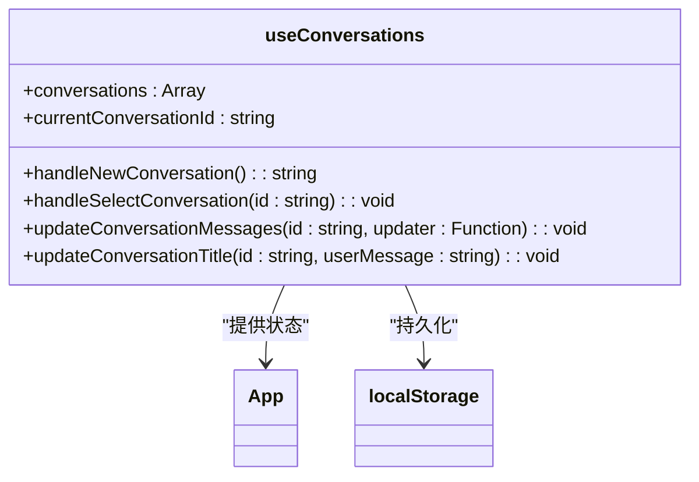
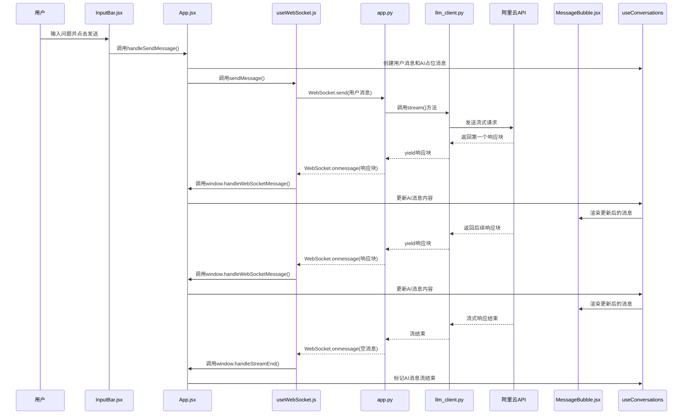
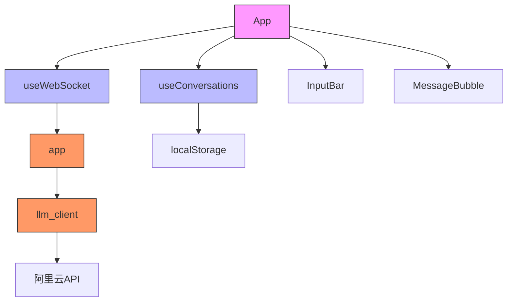

# 数据流与通信

<cite>
**本文档引用的文件**  
- [app.py](file://backend/app.py)
- [llm_client.py](file://backend/llm_client.py)
- [useWebSocket.js](file://frontend/src/hooks/useWebSocket.js)
- [useConversations.js](file://frontend/src/hooks/useConversations.js)
- [App.jsx](file://frontend/src/App.jsx)
- [InputBar.jsx](file://frontend/src/components/InputBar.jsx)
- [MessageBubble.jsx](file://frontend/src/components/MessageBubble.jsx)
</cite>

## 目录
1. [引言](#引言)
2. [项目结构](#项目结构)
3. [核心组件](#核心组件)
4. [架构概览](#架构概览)
5. [详细组件分析](#详细组件分析)
6. [数据流时序分析](#数据流时序分析)
7. [依赖关系分析](#依赖关系分析)
8. [性能与优化建议](#性能与优化建议)
9. [故障排查指南](#故障排查指南)
10. [结论](#结论)

## 引言
本文档全面记录chat-mvp系统的数据流与通信机制，重点描述前后端之间基于WebSocket的实时交互过程。系统实现了从用户输入到AI响应的完整异步流式通信，采用前后端分离架构，通过WebSocket协议实现低延迟、高并发的实时消息传输。文档将深入解析关键数据模型、通信流程、错误处理机制及性能优化策略，为开发者提供完整的系统理解。

## 项目结构
chat-mvp项目采用标准的前后端分离架构，包含独立的前端（frontend）、后端（backend）和Nginx配置目录。前端使用React + Vite构建，后端基于FastAPI框架，通过WebSocket实现与前端的实时通信。

**图示来源**  
- [app.py](file://backend/app.py#L1-L106)
- [useWebSocket.js](file://frontend/src/hooks/useWebSocket.js#L1-L192)
- [App.jsx](file://frontend/src/App.jsx#L1-L172)

**本节来源**  
- [app.py](file://backend/app.py#L1-L106)
- [useWebSocket.js](file://frontend/src/hooks/useWebSocket.js#L1-L192)

## 核心组件
系统核心组件包括前端的`useWebSocket.js`和`useConversations.js`，以及后端的`app.py`和`llm_client.py`。这些组件共同协作，实现从用户输入到AI响应的完整数据流。

- **useWebSocket.js**：管理WebSocket连接、重连、消息收发和状态监控
- **useConversations.js**：管理会话列表、当前会话和本地存储
- **app.py**：FastAPI WebSocket端点，处理客户端连接和消息路由
- **llm_client.py**：封装阿里云通义千问API的客户端，支持流式响应

**本节来源**  
- [useWebSocket.js](file://frontend/src/hooks/useWebSocket.js#L1-L192)
- [useConversations.js](file://frontend/src/hooks/useConversations.js#L1-L118)
- [app.py](file://backend/app.py#L1-L106)
- [llm_client.py](file://backend/llm_client.py#L1-L86)

## 架构概览
系统采用典型的客户端-服务器架构，前端通过WebSocket与后端建立持久连接，后端作为代理将请求转发至阿里云LLM API，并将流式响应实时推送回前端。

**图示来源**  
- [app.py](file://backend/app.py#L1-L106)
- [llm_client.py](file://backend/llm_client.py#L1-L86)
- [useWebSocket.js](file://frontend/src/hooks/useWebSocket.js#L1-L192)

## 详细组件分析

### 前端WebSocket管理分析
`useWebSocket.js`是前端通信的核心，负责管理WebSocket连接的全生命周期，包括连接建立、心跳检测、异常处理和自动重连。

**图示来源**  
- [useWebSocket.js](file://frontend/src/hooks/useWebSocket.js#L6-L192)

**本节来源**  
- [useWebSocket.js](file://frontend/src/hooks/useWebSocket.js#L1-L192)

### 后端WebSocket端点分析
`app.py`中的WebSocket端点处理客户端连接，维护会话历史，并调用LLM客户端进行流式请求。

**图示来源**  
- [app.py](file://backend/app.py#L1-L106)
- [llm_client.py](file://backend/llm_client.py#L1-L86)

**本节来源**  
- [app.py](file://backend/app.py#L1-L106)
- [llm_client.py](file://backend/llm_client.py#L1-L86)

### 会话管理分析
`useConversations.js`管理本地会话状态，包括会话列表、当前会话和消息存储，支持本地持久化。

**图示来源**  
- [useConversations.js](file://frontend/src/hooks/useConversations.js#L1-L118)

**本节来源**  
- [useConversations.js](file://frontend/src/hooks/useConversations.js#L1-L118)

## 数据流时序分析
以下时序图详细描述了从用户输入到AI响应的完整数据路径。

**图示来源**  
- [InputBar.jsx](file://frontend/src/components/InputBar.jsx#L1-L86)
- [App.jsx](file://frontend/src/App.jsx#L1-L172)
- [useWebSocket.js](file://frontend/src/hooks/useWebSocket.js#L1-L192)
- [app.py](file://backend/app.py#L1-L106)
- [llm_client.py](file://backend/llm_client.py#L1-L86)
- [MessageBubble.jsx](file://frontend/src/components/MessageBubble.jsx#L1-L93)

**本节来源**  
- [App.jsx](file://frontend/src/App.jsx#L1-L172)
- [useWebSocket.js](file://frontend/src/hooks/useWebSocket.js#L1-L192)
- [app.py](file://backend/app.py#L1-L106)

## 依赖关系分析
系统各组件之间的依赖关系清晰，遵循单一职责原则，降低了耦合度。

**图示来源**  
- [App.jsx](file://frontend/src/App.jsx#L1-L172)
- [useWebSocket.js](file://frontend/src/hooks/useWebSocket.js#L1-L192)
- [useConversations.js](file://frontend/src/hooks/useConversations.js#L1-L118)
- [app.py](file://backend/app.py#L1-L106)
- [llm_client.py](file://backend/llm_client.py#L1-L86)

**本节来源**  
- [App.jsx](file://frontend/src/App.jsx#L1-L172)
- [useWebSocket.js](file://frontend/src/hooks/useWebSocket.js#L1-L192)

## 性能与优化建议
### 性能监控建议
1. **端到端延迟测量**：在`App.jsx`中添加时间戳，测量从用户发送到收到第一个响应块的延迟
2. **消息序列化开销**：优化JSON序列化，避免不必要的数据转换
3. **连接池管理**：后端可实现WebSocket连接池，减少重复连接开销

### 优化策略
1. **前端**：
   - 实现消息压缩，减少网络传输量
   - 添加防抖机制，避免频繁发送相似请求
   - 优化React组件渲染，使用React.memo减少重渲染

2. **后端**：
   - 实现请求缓存，对相似问题返回缓存结果
   - 优化LLM客户端的HTTP连接复用
   - 添加请求队列，防止突发流量导致服务过载

3. **网络层**：
   - 启用Nginx的WebSocket代理优化
   - 配置合理的超时和心跳间隔
   - 实现负载均衡，支持水平扩展

**本节来源**  
- [app.py](file://backend/app.py#L1-L106)
- [useWebSocket.js](file://frontend/src/hooks/useWebSocket.js#L1-L192)
- [App.jsx](file://frontend/src/App.jsx#L1-L172)

## 故障排查指南
### 常见问题及解决方案
1. **WebSocket连接失败**
   - 检查后端服务是否运行：`docker-compose ps`
   - 验证API密钥是否正确设置：`echo $API_KEY`
   - 查看浏览器控制台错误日志

2. **消息无法发送**
   - 确认连接状态：检查`ConnectionStatus`组件显示
   - 验证输入内容：确保消息不为空
   - 检查网络连接：使用`test-websocket.html`进行测试

3. **AI响应延迟过高**
   - 检查阿里云API状态
   - 查看后端日志：`docker-compose logs backend`
   - 验证网络带宽和延迟

4. **会话数据丢失**
   - 检查浏览器本地存储：`localStorage.getItem('chatConversations')`
   - 验证数据序列化格式是否正确
   - 确认浏览器隐私设置未阻止本地存储

### 调试工具
1. **前端调试**：
   - 使用Chrome开发者工具的Network标签页监控WebSocket通信
   - 在`useWebSocket.js`中添加详细日志
   - 使用`test-websocket.html`进行独立连接测试

2. **后端调试**：
   - 查看FastAPI日志输出
   - 使用curl测试API端点：`curl -i -N -H "Connection: Upgrade" -H "Upgrade: websocket" http://localhost:8000/chat`
   - 监控LLM客户端的HTTP请求

**本节来源**  
- [useWebSocket.js](file://frontend/src/hooks/useWebSocket.js#L1-L192)
- [app.py](file://backend/app.py#L1-L106)
- [frontend/public/test-websocket.html](file://frontend/public/test-websocket.html#L1-L188)

## 结论
chat-mvp系统通过WebSocket实现了高效的实时通信机制，从前端用户输入到后端LLM响应形成了完整的数据闭环。系统架构清晰，组件职责明确，具备良好的可维护性和扩展性。通过深入理解数据流和通信机制，开发者可以有效优化系统性能，提升用户体验。建议持续监控关键性能指标，及时发现和解决潜在问题，确保系统稳定运行。