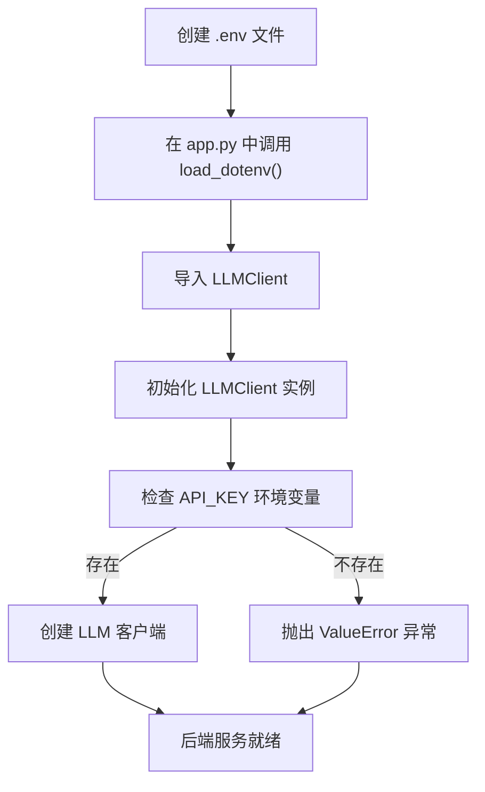
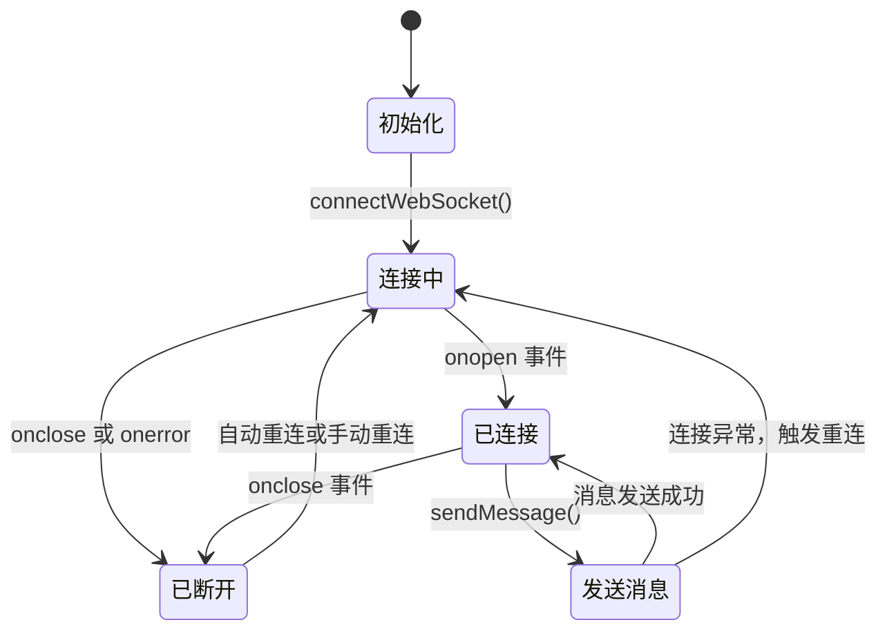
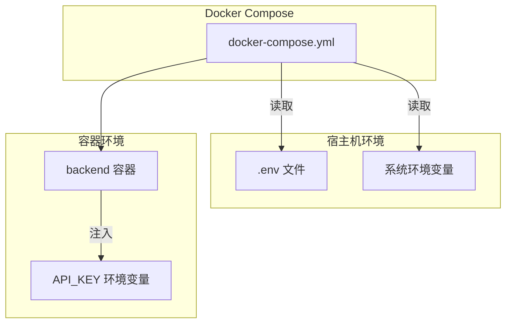
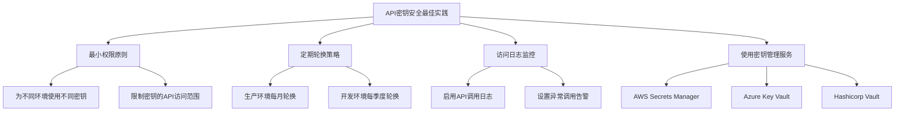

# 环境配置

<cite>
**本文档中引用的文件**  
- [API_SECURITY_GUIDE.md](file://API_SECURITY_GUIDE.md)
- [docker-compose.yml](file://docker-compose.yml)
- [backend/app.py](file://backend/app.py)
- [backend/llm_client.py](file://backend/llm_client.py)
- [frontend/vite.config.js](file://frontend/vite.config.js)
- [frontend/src/hooks/useWebSocket.js](file://frontend/src/hooks/useWebSocket.js)
</cite>

## 目录
1. [项目环境配置概述](#项目环境配置概述)
2. [核心环境变量说明](#核心环境变量说明)
3. [后端环境配置](#后端环境配置)
4. [前端环境配置](#前端环境配置)
5. [Docker容器化部署配置](#docker容器化部署配置)
6. [环境变量安全最佳实践](#环境变量安全最佳实践)
7. [配置验证与故障排查](#配置验证与故障排查)
8. [其他系统配置项](#其他系统配置项)

## 项目环境配置概述

本指南详细说明chat-mvp项目的环境配置方法，涵盖开发、测试和生产环境的设置。项目采用环境变量机制实现配置分离，确保敏感信息（如API密钥）不会硬编码在源代码中。系统通过`.env`文件和Docker Compose实现多环境配置管理，前端和后端分别使用不同的环境变量前缀和注入方式。

**环境配置核心原则**：
- **安全性**：所有敏感信息通过环境变量注入，避免代码中硬编码
- **可移植性**：配置与代码分离，便于在不同环境间迁移
- **易用性**：提供清晰的配置模板和验证机制

**Section sources**
- [API_SECURITY_GUIDE.md](file://API_SECURITY_GUIDE.md#L0-L131)
- [docker-compose.yml](file://docker-compose.yml#L0-L26)

## 核心环境变量说明

### 后端环境变量
| 环境变量 | 用途 | 是否必需 | 默认值 |
|---------|------|---------|-------|
| `API_KEY` | 阿里云DashScope API密钥 | 是 | 无 |
| `LOG_LEVEL` | 日志级别 | 否 | INFO |

### 前端环境变量
前端使用Vite构建工具，环境变量需以`VITE_`前缀开头才能在运行时访问。

| 环境变量 | 用途 | 是否必需 | 默认值 |
|---------|------|---------|-------|
| `VITE_API_BASE_URL` | 后端API基础URL | 否 | http://localhost:8000 |

**Section sources**
- [backend/llm_client.py](file://backend/llm_client.py#L15-L25)
- [frontend/vite.config.js](file://frontend/vite.config.js#L0-L16)

## 后端环境配置

### 环境变量读取实现
后端使用Python的`python-dotenv`库从`.env`文件加载环境变量。`app.py`文件在应用启动时立即调用`load_dotenv()`，确保在导入其他模块前完成环境变量加载。

```python
# backend/app.py
from dotenv import load_dotenv
import os

# 必须在导入LLMClient之前加载环境变量
load_dotenv()

# 现在可以安全地导入LLMClient
from llm_client import LLMClient
```

### API密钥安全管理
`llm_client.py`中的`LLMClient`类在初始化时验证`API_KEY`环境变量的存在性，若未设置则抛出明确的错误信息。

```python
# backend/llm_client.py
class LLMClient:
    def __init__(self):
        self.api_key = os.getenv("API_KEY")
        if not self.api_key:
            raise ValueError(
                "API_KEY environment variable is required. "
                "Please set your API key in environment variables or .env file. "
                "Example: export API_KEY=your_actual_api_key_here"
            )
```

### 后端配置流程图


**Diagram sources**
- [backend/app.py](file://backend/app.py#L8-L12)
- [backend/llm_client.py](file://backend/llm_client.py#L15-L25)

**Section sources**
- [backend/app.py](file://backend/app.py#L8-L12)
- [backend/llm_client.py](file://backend/llm_client.py#L15-L25)

## 前端环境配置

### WebSocket连接配置
前端通过`useWebSocket.js` Hook管理WebSocket连接，连接地址硬编码为`ws://localhost:8000/chat`。在生产环境中，此配置应通过环境变量控制。

```javascript
// frontend/src/hooks/useWebSocket.js
const connectWebSocket = useCallback(() => {
  try {
    const ws = new WebSocket('ws://localhost:8000/chat');
    websocketRef.current = ws;
    // ... 其他连接逻辑
  } catch (error) {
    console.error('创建WebSocket连接失败:', error);
  }
}, []);
```

### Vite环境变量配置
Vite要求前端环境变量以`VITE_`前缀开头才能在客户端代码中访问。虽然当前项目未使用此机制，但建议通过`VITE_API_BASE_URL`环境变量配置后端API地址。

```javascript
// 建议的配置方式
// .env 文件
VITE_API_BASE_URL=http://localhost:8000

// vite.config.js
export default defineConfig({
  server: {
    proxy: {
      '/api': {
        target: process.env.VITE_API_BASE_URL,
        changeOrigin: true,
        secure: false,
      }
    }
  }
})
```

### 前端连接状态管理
前端实现自动重连机制，每2秒检查一次WebSocket连接状态，并在页面可见性变化时尝试重新连接。



**Diagram sources**
- [frontend/src/hooks/useWebSocket.js](file://frontend/src/hooks/useWebSocket.js#L0-L192)

**Section sources**
- [frontend/src/hooks/useWebSocket.js](file://frontend/src/hooks/useWebSocket.js#L0-L192)
- [frontend/vite.config.js](file://frontend/vite.config.js#L0-L16)

## Docker容器化部署配置

### docker-compose.yml配置分析
Docker Compose配置文件定义了三个服务：backend、frontend和nginx，通过`environment`字段将环境变量注入后端容器。

```yaml
version: '3.8'

services:
  backend:
    build: ./backend
    environment:
      - API_KEY=${API_KEY}
    ports:
      - "8000:8000"

  frontend:
    build: ./frontend
    ports:
      - "3000:3000"
    depends_on:
      - backend

  nginx:
    image: nginx:alpine
    ports:
      - "80:80"
    volumes:
      - ./nginx/nginx.conf:/etc/nginx/nginx.conf
      - ./frontend/build:/usr/share/nginx/html
    depends_on:
      - backend
      - frontend
```

### Docker环境变量注入机制
Docker Compose使用`${API_KEY}`语法从宿主机环境变量或`.env`文件中读取值。当执行`docker-compose up`时，Compose会自动查找项目根目录下的`.env`文件。



**Diagram sources**
- [docker-compose.yml](file://docker-compose.yml#L0-L26)

**Section sources**
- [docker-compose.yml](file://docker-compose.yml#L0-L26)

## 环境变量安全最佳实践

### API密钥管理策略
根据`API_SECURITY_GUIDE.md`文档，遵循以下安全最佳实践：



### 安全配置检查清单
- [x] ✅ 创建 `.env.example` 文件作为模板
- [x] ✅ 将 `.env` 添加到 `.gitignore`
- [x] ✅ 在代码中验证环境变量是否存在
- [x] ✅ 在文档中说明如何设置环境变量
- [ ] ✅ 定期轮换 API 密钥
- [ ] ✅ 监控 API 密钥使用情况
- [ ] ✅ 在生产环境使用密钥管理服务

### 密钥泄露应急响应
若API密钥已泄露，立即执行以下步骤：
1. **立即撤销**：登录阿里云DashScope控制台，撤销泄露的密钥
2. **生成新密钥**：创建新的API密钥
3. **更新配置**：在所有环境中更新新密钥
4. **检查使用记录**：查看是否有异常API调用
5. **更新代码**：确保新代码正确使用环境变量

**Section sources**
- [API_SECURITY_GUIDE.md](file://API_SECURITY_GUIDE.md#L0-L131)

## 配置验证与故障排查

### 配置有效性验证方法
#### 后端验证
启动后端服务时，若`API_KEY`未正确设置，将抛出明确的错误信息：

```
ValueError: API_KEY environment variable is required. 
Please set your API key in environment variables or .env file. 
Example: export API_KEY=your_actual_api_key_here
```

#### 前端验证
使用`test-websocket.html`测试页面验证WebSocket连接：
1. 访问 `http://localhost:3000/test-websocket.html`
2. 点击"连接"按钮
3. 观察连接状态和日志输出

### 常见问题及解决方案
| 问题现象 | 可能原因 | 解决方案 |
|---------|---------|---------|
| 后端启动失败，提示API_KEY缺失 | `.env`文件未创建或API_KEY未设置 | 创建`.env`文件并设置正确的API密钥 |
| WebSocket连接失败 | 后端服务未启动或端口冲突 | 确保后端服务在8000端口运行 |
| 前端无法发送消息 | 连接状态非"connected" | 检查后端服务状态并尝试重连 |
| API调用返回401错误 | API密钥无效或过期 | 验证密钥正确性并在阿里云控制台检查密钥状态 |

### 安全审计建议
对于系统管理员，建议定期执行以下安全审计：
- **密钥泄露检测**：使用Git历史记录搜索工具（如`git-secrets`）检查是否有密钥意外提交
- **配置错误检测**：验证`.env`文件权限是否为600，确保只有所有者可读写
- **访问监控**：定期审查API调用日志，识别异常访问模式
- **依赖审查**：检查项目依赖是否存在已知安全漏洞

**Section sources**
- [API_SECURITY_GUIDE.md](file://API_SECURITY_GUIDE.md#L100-L131)
- [backend/llm_client.py](file://backend/llm_client.py#L15-L25)

## 其他系统配置项

### WebSocket连接参数
| 配置项 | 当前值 | 可调整范围 | 说明 |
|-------|-------|----------|------|
| 重试间隔 | 2000ms | 1000-5000ms | 自动重连检查间隔 |
| 连接超时 | 无显式设置 | 建议30秒 | 建议添加连接超时机制 |

### 日志级别配置
后端使用Python标准logging模块，当前配置为INFO级别。可通过设置`LOG_LEVEL`环境变量调整：

```python
# 示例：设置DEBUG级别
LOG_LEVEL=DEBUG
```

可用级别：DEBUG、INFO、WARNING、ERROR、CRITICAL

### 性能相关配置
| 配置项 | 位置 | 说明 |
|-------|------|------|
| 流式响应 | LLMClient.stream() | 启用SSE流式输出，减少用户等待时间 |
| 连接池 | httpx.AsyncClient() | 使用异步HTTP客户端，提高并发性能 |
| 缓存机制 | 无 | 建议为频繁查询添加缓存层 |

**Section sources**
- [backend/app.py](file://backend/app.py#L10-L15)
- [backend/llm_client.py](file://backend/llm_client.py#L50-L80)
- [frontend/src/hooks/useWebSocket.js](file://frontend/src/hooks/useWebSocket.js#L50-L70)