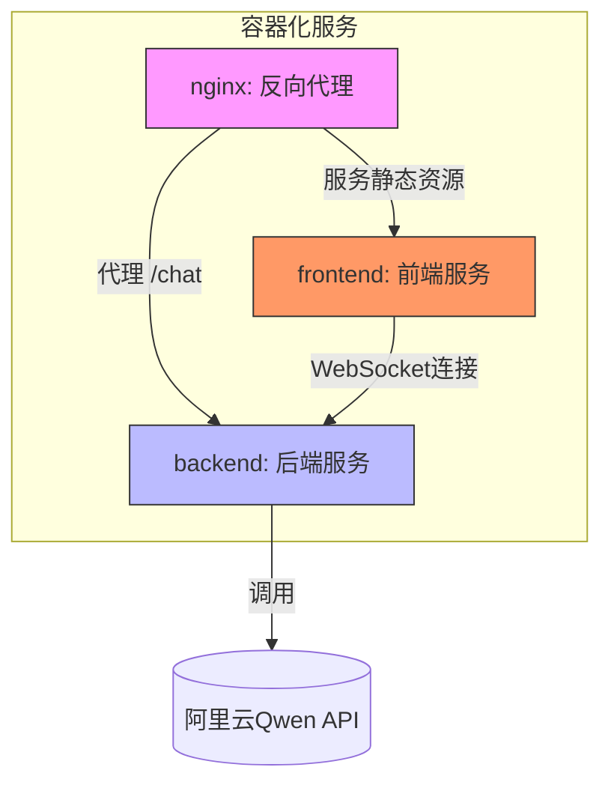
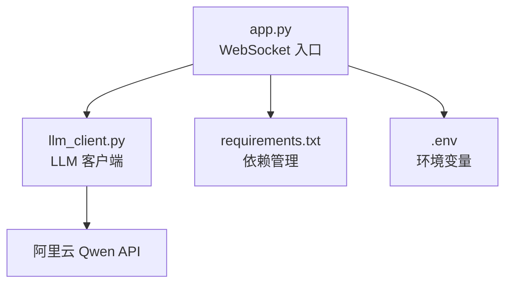
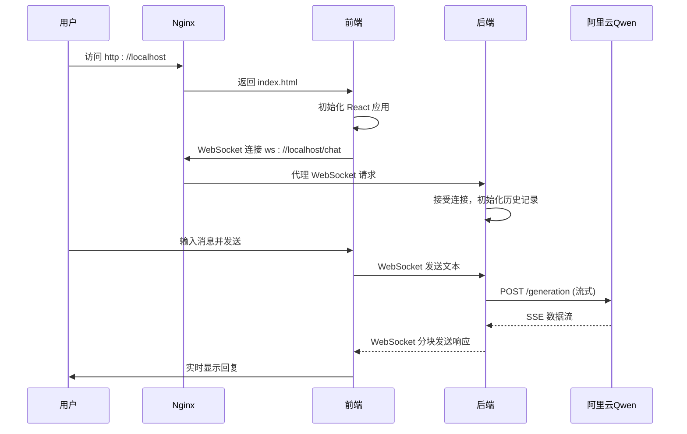

# 目录结构详解

<cite>
**本文档引用的文件**  
- [backend/Dockerfile](file://backend/Dockerfile)
- [backend/app.py](file://backend/app.py)
- [backend/llm_client.py](file://backend/llm_client.py)
- [backend/requirements.txt](file://backend/requirements.txt)
- [frontend/Dockerfile](file://frontend/Dockerfile)
- [frontend/vite.config.js](file://frontend/vite.config.js)
- [frontend/src/hooks/useWebSocket.js](file://frontend/src/hooks/useWebSocket.js)
- [frontend/src/hooks/useConversations.js](file://frontend/src/hooks/useConversations.js)
- [frontend/src/components/ChatBox.jsx](file://frontend/src/components/ChatBox.jsx)
- [frontend/src/utils/localStorageManager.js](file://frontend/src/utils/localStorageManager.js)
- [nginx/nginx.conf](file://nginx/nginx.conf)
- [docker-compose.yml](file://docker-compose.yml)
- [README.md](file://README.md)
- [API_SECURITY_GUIDE.md](file://API_SECURITY_GUIDE.md)
</cite>

## 目录结构

本项目采用模块化设计，将前端、后端和反向代理服务分离，通过 Docker Compose 进行统一编排。整体结构清晰，职责分明。



**图示来源**  
- [docker-compose.yml](file://docker-compose.yml)
- [nginx/nginx.conf](file://nginx/nginx.conf)
- [backend/app.py](file://backend/app.py)
- [frontend/src/hooks/useWebSocket.js](file://frontend/src/hooks/useWebSocket.js)

### 后端服务 (backend/)
后端基于 Python FastAPI 框架，提供 WebSocket 接口与前端通信，并通过 `llm_client.py` 调用阿里云 Qwen 大模型 API。

- **Dockerfile**: 定义了基于 `python:3.11-slim` 的轻量级运行环境，安装依赖并启动 Uvicorn 服务器。
- **app.py**: FastAPI 应用入口，定义 `/chat` WebSocket 端点，处理消息收发与历史记录管理。
- **llm_client.py**: 封装对阿里云 DashScope API 的流式调用逻辑，支持 SSE（Server-Sent Events）。
- **requirements.txt**: 列出 Python 依赖项，包括 `fastapi`, `uvicorn`, `httpx`, `python-dotenv` 等。

**后端组件协作流程：**
1. `app.py` 初始化 `LLMClient()` 实例。
2. 当 WebSocket 连接建立后，接收用户消息并追加到 `history`。
3. 调用 `llm.stream(history)` 获取流式响应。
4. 将增量内容通过 WebSocket 实时发送给前端。

**后端文件依赖关系：**


**图示来源**  
- [backend/app.py](file://backend/app.py#L1-L107)
- [backend/llm_client.py](file://backend/llm_client.py#L1-L87)

### 前端服务 (frontend/)
前端采用 React + Vite 构建，使用 Tailwind CSS 进行样式设计，提供现代化的聊天界面。

- **public/**: 存放静态资源，如 `index.html` 和测试页面 `test-websocket.html`。
- **src/components/**: UI 组件目录，包含聊天气泡、输入栏、侧边栏等。
- **src/hooks/**: 自定义 Hook，管理 WebSocket 连接、会话状态、主题切换等。
- **src/utils/**: 工具函数，如 `localStorageManager.js` 用于持久化聊天记录。
- **vite.config.js**: 配置开发服务器代理，将 `/api` 请求转发至后端。
- **Dockerfile**: 使用多阶段构建，先安装依赖并构建生产包，再使用 Nginx 部署。
- **package.json**: 定义项目依赖和脚本命令。

**关键 Hook 分析：**

#### useWebSocket.js
管理 WebSocket 生命周期，包括连接、重连、消息接收与错误处理。

```javascript
const ws = new WebSocket('ws://localhost:8000/chat');
```

该 Hook 使用 `useRef` 跟踪连接状态，并通过 `window.handleWebSocketMessage` 回调机制与组件通信。

**图示来源**  
- [frontend/src/hooks/useWebSocket.js](file://frontend/src/hooks/useWebSocket.js#L1-L193)

#### useConversations.js
管理多个聊天会话的状态，支持新建、切换和本地持久化。

```javascript
useEffect(() => {
  localStorage.setItem('chatConversations', JSON.stringify(conversations));
}, [conversations]);
```

初始会话包含欢迎消息，标题根据用户首条消息自动生成。

**图示来源**  
- [frontend/src/hooks/useConversations.js](file://frontend/src/hooks/useConversations.js#L1-L119)

#### ChatBox.jsx
聊天内容展示组件，使用 `MessageBubble` 渲染每条消息，并自动滚动到底部。

```jsx
<div ref={messagesEndRef} />
```

通过 `messagesEndRef` 实现平滑滚动定位。

**图示来源**  
- [frontend/src/components/ChatBox.jsx](file://frontend/src/components/ChatBox.jsx#L1-L30)

### Nginx 服务 (nginx/)
Nginx 作为反向代理，统一暴露服务入口，实现前后端聚合访问。

- **nginx.conf**: 配置文件，定义监听端口、静态资源路径和 WebSocket 代理规则。

```nginx
location /chat {
    proxy_pass http://backend:8000/chat;
    proxy_http_version 1.1;
    proxy_set_header Upgrade $http_upgrade;
    proxy_set_header Connection "upgrade";
}
```

此配置确保 WebSocket 协议升级请求被正确转发。

**图示来源**  
- [nginx/nginx.conf](file://nginx/nginx.conf#L1-L27)

### 项目根目录文件
- **docker-compose.yml**: 定义三个服务（backend、frontend、nginx），配置端口映射、依赖关系和卷挂载。
- **README.md**: 项目说明文档，包含启动步骤、API 密钥配置和本地开发指南。
- **API_SECURITY_GUIDE.md**: 强调 API 密钥安全，禁止硬编码，推荐使用环境变量或 `.env` 文件。
- **ui_design.md**: 用户界面设计文档（内容未提供）。

## 系统架构与通信机制

### 服务编排与网络通信
通过 `docker-compose.yml` 定义的服务依赖，确保启动顺序合理：

```yaml
services:
  backend:
    build: ./backend
    ports: "8000:8000"
    environment: API_KEY=${API_KEY}

  frontend:
    build: ./frontend
    ports: "3000:3000"
    depends_on: backend

  nginx:
    image: nginx:alpine
    ports: "80:80"
    volumes:
      - ./nginx/nginx.conf:/etc/nginx/nginx.conf
      - ./frontend/build:/usr/share/nginx/html
    depends_on: [backend, frontend]
```

- **端口映射**：
  - Nginx 监听宿主机 80 端口，提供统一入口。
  - 前端开发服务器运行在 3000 端口（容器内）。
  - 后端 API 服务运行在 8000 端口（容器内）。

- **卷挂载**：
  - Nginx 配置文件挂载至容器内。
  - 前端构建产物挂载为静态资源目录。

### 请求流程分析
1. 用户访问 `http://localhost`（Nginx 80 端口）。
2. Nginx 返回前端 `index.html` 和静态资源。
3. 前端 JavaScript 初始化 WebSocket 连接 `ws://localhost:8000/chat`。
4. Nginx 将 WebSocket 请求代理至 `backend:8000`。
5. 后端 `app.py` 接收消息，调用 `llm_client.py` 流式获取响应。
6. 响应通过 WebSocket 分块返回前端，实时渲染。



**图示来源**  
- [docker-compose.yml](file://docker-compose.yml)
- [nginx/nginx.conf](file://nginx/nginx.conf)
- [backend/app.py](file://backend/app.py)
- [backend/llm_client.py](file://backend/llm_client.py)
- [frontend/src/hooks/useWebSocket.js](file://frontend/src/hooks/useWebSocket.js)

## 架构设计考量

### 为何采用独立 Dockerfile 而非单体镜像？
1. **职责分离**：前端（静态资源）与后端（动态服务）技术栈不同，独立构建更清晰。
2. **部署灵活性**：可单独更新前端或后端，无需重建整个应用。
3. **资源优化**：前端使用 Nginx 镜像，后端使用 Python 镜像，避免冗余依赖。
4. **开发效率**：前端 Vite 支持热重载，后端 FastAPI 支持自动重启，独立容器便于调试。

### 安全实践
- **API 密钥保护**：通过环境变量注入，避免硬编码。
- **CORS 配置**：`app.py` 中允许所有来源，适用于开发环境；生产环境应限制域名。
- **日志脱敏**：`llm_client.py` 记录请求时不输出完整 payload，保护隐私。

### 状态管理策略
- **前端状态**：使用 React Hooks (`useState`, `useRef`) 管理 UI 状态。
- **会话持久化**：通过 `localStorage` 存储 `chatConversations`，刷新页面不丢失历史。
- **WebSocket 状态**：`useWebSocket` Hook 封装连接状态，支持自动重连和页面可见性检测。

## 初学者指南

### 如何启动项目？
1. 设置 API 密钥：
   ```bash
   export API_KEY=your_actual_api_key_here
   ```
2. 构建并启动服务：
   ```bash
   docker-compose up --build
   ```
3. 访问 `http://localhost`。

### 如何修改前端 API 地址？
在 `useWebSocket.js` 中修改 WebSocket URL：
```js
const ws = new WebSocket('ws://your-backend-host:8000/chat');
```

### 如何测试 WebSocket？
打开浏览器控制台，执行：
```javascript
const ws = new WebSocket('ws://localhost:8000/chat');
ws.onopen = () => { console.log('✅ 已连接'); ws.send('你好'); };
ws.onmessage = (e) => console.log('📨 收到:', e.data);
```

## 高级用户说明

### 自定义模型参数
可在 `llm_client.py` 的 `stream` 方法中修改 `parameters`：
```python
"parameters": {
    "result_format": "message",
    "temperature": 0.7,
    "top_p": 0.9
}
```

### 扩展功能建议
- **会话存储**：将 `localStorage` 替换为后端数据库（如 Redis）。
- **用户认证**：添加 JWT 验证，保护 WebSocket 端点。
- **消息加密**：在传输层或应用层实现端到端加密。
- **负载均衡**：Nginx 前置多实例后端，提升并发能力。

## 总结

本项目展示了现代 Web 应用的典型架构：前端 React + 后端 FastAPI + Nginx 反向代理 + Docker 容器化。通过清晰的模块划分和合理的通信机制，实现了高效、可维护的聊天系统。其设计兼顾了开发便捷性与部署灵活性，是学习全栈开发的良好范例。