# 系统概述

<cite>
**本文档引用的文件**   
- [README.md](file://README.md)
- [ui_design.md](file://ui_design.md)
- [backend/app.py](file://backend/app.py)
- [backend/llm_client.py](file://backend/llm_client.py)
- [frontend/src/App.jsx](file://frontend/src/App.jsx)
- [frontend/src/components/ChatBox.jsx](file://frontend/src/components/ChatBox.jsx)
- [frontend/src/components/MessageBubble.jsx](file://frontend/src/components/MessageBubble.jsx)
- [frontend/src/components/InputBar.jsx](file://frontend/src/components/InputBar.jsx)
- [frontend/src/hooks/useConversations.js](file://frontend/src/hooks/useConversations.js)
- [frontend/src/hooks/useWebSocket.js](file://frontend/src/hooks/useWebSocket.js)
- [frontend/src/hooks/useTheme.js](file://frontend/src/hooks/useTheme.js)
</cite>

## 目录
1. [系统概述](#系统概述)
2. [项目结构](#项目结构)
3. [核心功能与架构](#核心功能与架构)
4. [详细组件分析](#详细组件分析)
5. [工作流程详解](#工作流程详解)
6. [会话与状态管理](#会话与状态管理)
7. [主题与用户界面](#主题与用户界面)
8. [部署架构](#部署架构)

## 项目结构

本项目采用前后端分离的微服务架构，主要由三个核心部分组成：后端服务、前端应用和Nginx反向代理。整体项目结构清晰，模块化程度高。

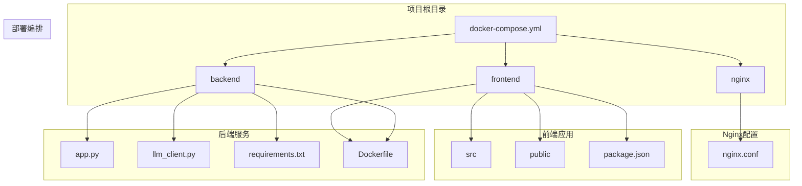

**Diagram sources**
- [README.md](file://README.md#L10-L30)

## 核心功能与架构

chat-mvp项目是中国银行江西省分行的智能对话服务系统，其核心是名为BOCAI的大语言模型。系统通过前后端分离架构实现基于大语言模型的实时AI对话服务，主要服务于客户金融咨询、银行服务支持和内部员工辅助等场景。

系统采用现代化的Web技术栈，前端基于React框架构建用户界面，后端采用Python的FastAPI框架提供WebSocket服务，通过Docker容器化部署，利用Nginx作为反向代理服务器。这种架构设计实现了前后端的完全解耦，提高了系统的可维护性和可扩展性。

**Section sources**
- [README.md](file://README.md#L1-L50)

## 详细组件分析

### 前端组件分析

#### 聊天框组件 (ChatBox.jsx)
聊天框组件负责渲染消息列表，并管理滚动行为。

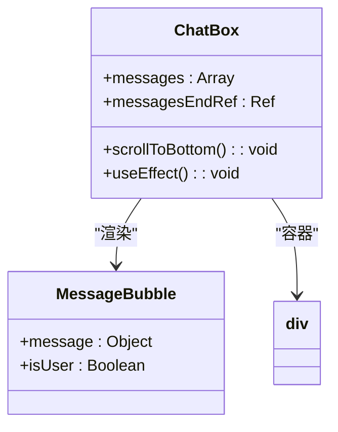

**Diagram sources**
- [frontend/src/components/ChatBox.jsx](file://frontend/src/components/ChatBox.jsx#L1-L30)

#### 消息气泡组件 (MessageBubble.jsx)
消息气泡组件负责渲染单条消息，支持Markdown和代码块的高亮显示。

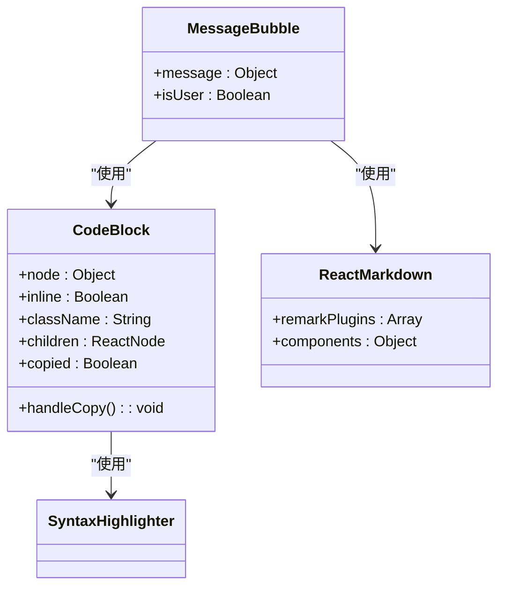

**Diagram sources**
- [frontend/src/components/MessageBubble.jsx](file://frontend/src/components/MessageBubble.jsx#L1-L94)

#### 输入栏组件 (InputBar.jsx)
输入栏组件处理用户输入，支持Enter键发送和Shift+Enter键换行。

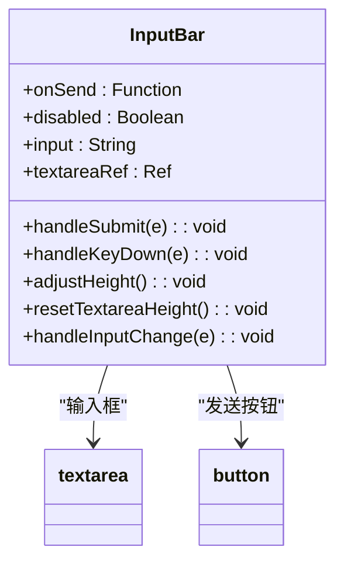

**Diagram sources**
- [frontend/src/components/InputBar.jsx](file://frontend/src/components/InputBar.jsx#L1-L87)

### 后端服务分析

#### WebSocket路由 (app.py)
后端通过FastAPI的WebSocket路由处理实时通信。

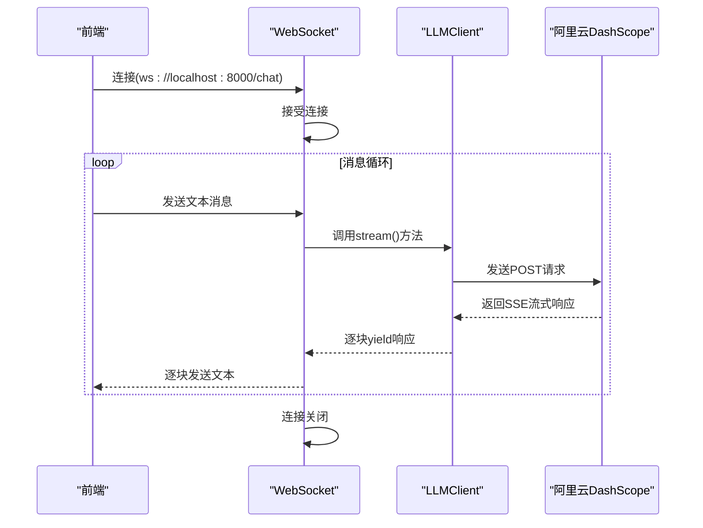

**Diagram sources**
- [backend/app.py](file://backend/app.py#L43-L106)

#### LLM客户端 (llm_client.py)
LLM客户端封装了与阿里云DashScope API的交互逻辑。

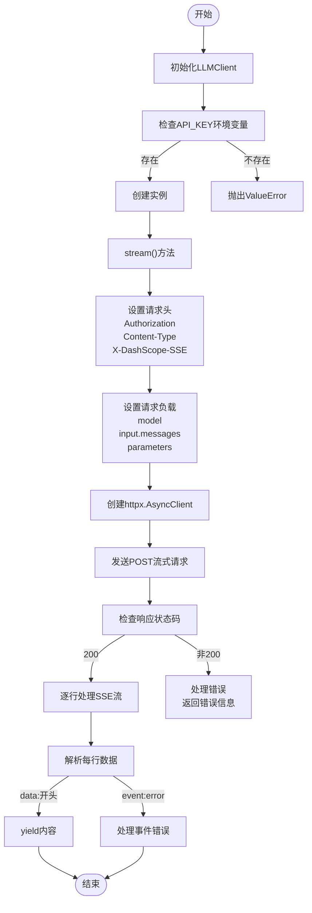

**Diagram sources**
- [backend/llm_client.py](file://backend/llm_client.py#L1-L87)

## 工作流程详解

系统的工作流程从用户在前端输入问题开始，到最终将AI的响应渲染到界面，形成一个完整的闭环。

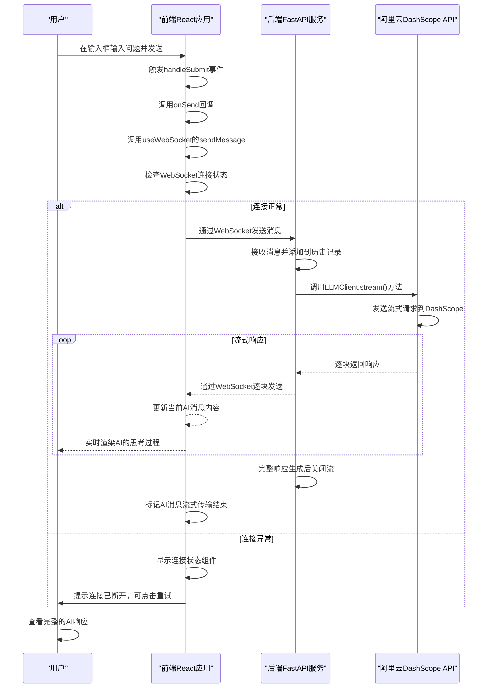

**Diagram sources**
- [frontend/src/hooks/useWebSocket.js](file://frontend/src/hooks/useWebSocket.js#L1-L192)
- [backend/app.py](file://backend/app.py#L43-L106)
- [frontend/src/App.jsx](file://frontend/src/App.jsx#L1-L198)

## 会话与状态管理

系统通过精心设计的状态管理机制来维护用户的会话信息和应用状态。

### 会话管理机制

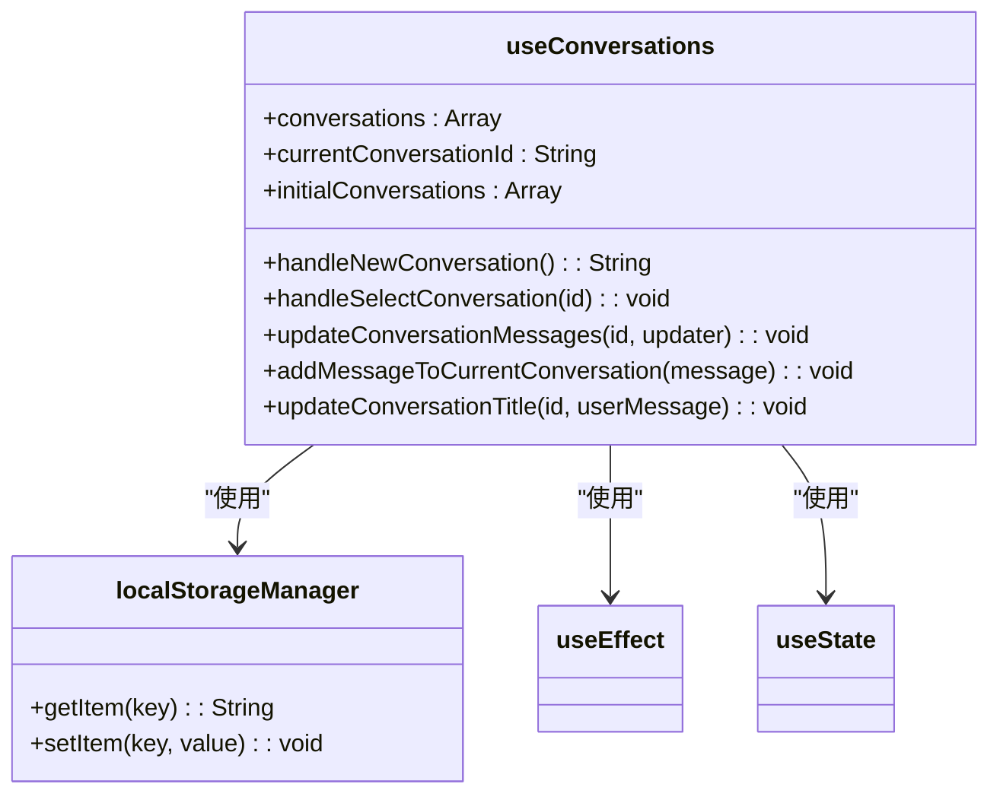

**Diagram sources**
- [frontend/src/hooks/useConversations.js](file://frontend/src/hooks/useConversations.js#L1-L119)

会话管理Hook（useConversations）负责管理所有会话的生命周期。系统初始化时会创建两个示例会话，所有会话数据都通过`localStorage`进行持久化存储。当用户创建新会话时，系统会生成基于时间戳的唯一ID，并自动将第一条AI欢迎消息添加到会话中。会话标题会根据用户的第一条消息内容自动更新，最多显示15个字符。

### WebSocket状态管理

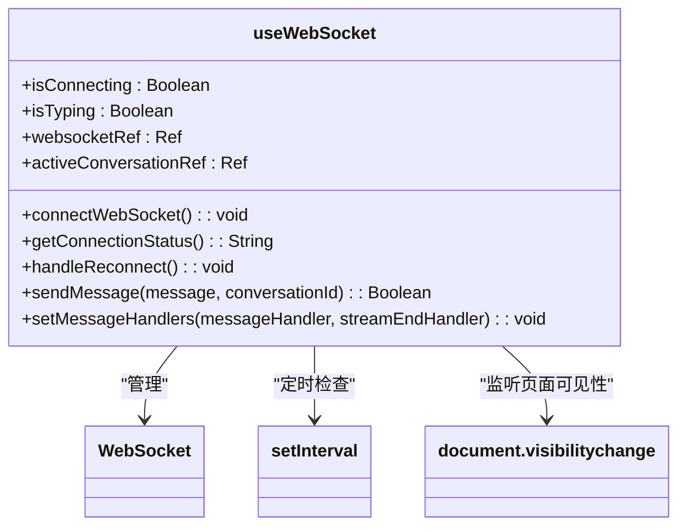

**Diagram sources**
- [frontend/src/hooks/useWebSocket.js](file://frontend/src/hooks/useWebSocket.js#L1-L192)

WebSocket管理Hook（useWebSocket）负责维护WebSocket连接的整个生命周期。它实现了自动重连机制，通过`setInterval`每2秒检查一次连接状态，并在页面从后台切换到前台时重新检查连接。`activeConversationRef`用于跟踪当前活跃的会话，确保AI的响应能正确关联到对应的会话中。`setMessageHandlers`方法允许外部组件注册消息处理函数，实现了组件间的解耦。

## 主题与用户界面

系统提供了完善的用户界面设计，支持暗黑模式切换，为用户提供了良好的交互体验。

### 主题管理机制

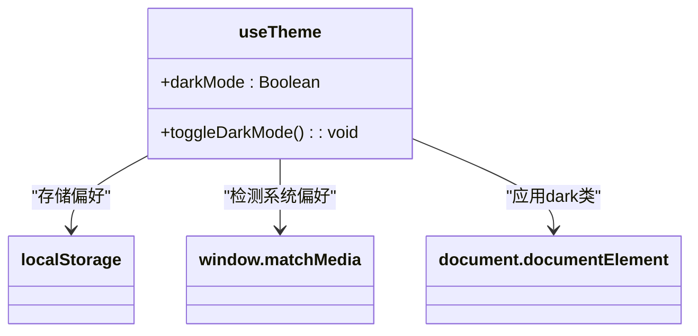

**Diagram sources**
- [frontend/src/hooks/useTheme.js](file://frontend/src/hooks/useTheme.js#L1-L41)

主题管理Hook（useTheme）实现了暗黑模式的切换功能。系统启动时会优先检查`localStorage`中的用户偏好设置，如果没有设置则根据系统偏好（`prefers-color-scheme: dark`）来决定初始主题。当用户切换主题时，不仅会更新`darkMode`状态，还会将偏好保存到`localStorage`，并动态向`document.documentElement`添加或移除`dark`类，从而实现主题的即时切换。

### 用户界面布局

根据ui_design.md文件，系统的用户界面采用经典的三部分布局：

1.  **顶部导航栏**：包含Logo、"AI 助手"标题和用户头像，背景为蓝紫渐变色。
2.  **主体聊天区域**：占据页面主要空间，显示消息气泡。用户消息为右对齐的蓝色渐变气泡，AI消息为左对齐的浅灰色气泡。
3.  **底部输入栏**：包含多行文本输入框和发送按钮。支持Enter键发送消息，Shift+Enter键换行。

界面支持Markdown语法渲染，包括标题、列表、链接等，并特别支持代码块的高亮显示。代码块具有黑色背景和绿色高亮，右上角有"复制"按钮，点击后会短暂显示"已复制!"提示。

**Section sources**
- [ui_design.md](file://ui_design.md#L1-L95)

## 部署架构

系统采用Docker容器化部署，通过docker-compose.yml文件定义了三个服务：backend、frontend和nginx。

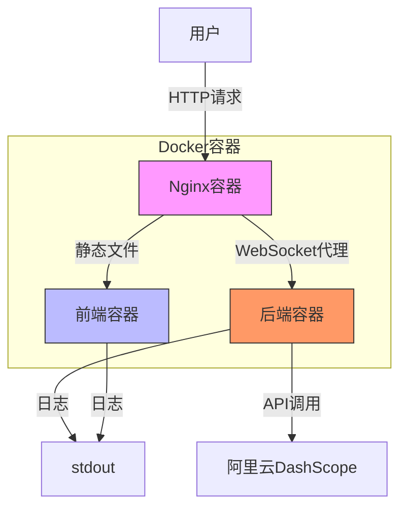

**Diagram sources**
- [README.md](file://README.md#L100-L110)
- [docker-compose.yml](file://docker-compose.yml#L1-L20)

Nginx作为反向代理服务器，负责将外部请求路由到相应的内部服务。它将对根路径（/）的HTTP请求代理到前端容器，提供静态HTML、CSS和JavaScript文件。同时，它将对`/chat`路径的WebSocket请求代理到后端容器的8000端口。这种架构设计使得前端和后端可以独立开发、测试和部署，同时对外只暴露一个统一的端口（通常是80或443），提高了系统的安全性和可维护性。