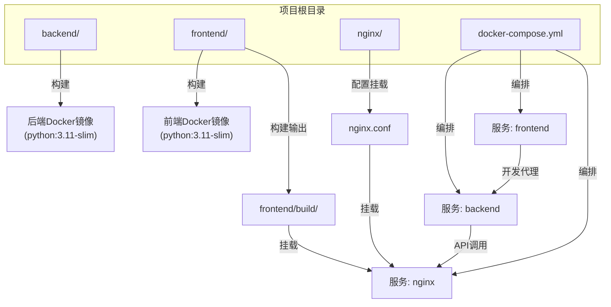
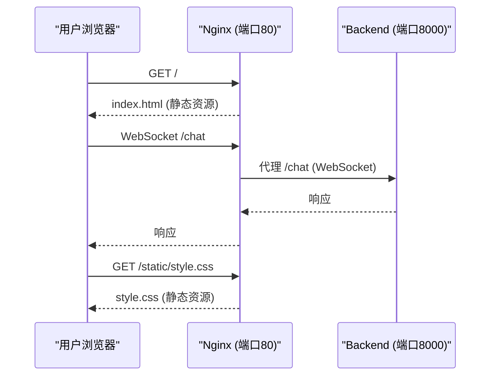

# Docker容器化

<cite>
**本文档引用的文件**  
- [backend/Dockerfile](file://backend/Dockerfile#L1-L10)
- [frontend/Dockerfile](file://frontend/Dockerfile#L1-L10)
- [nginx/nginx.conf](file://nginx/nginx.conf#L1-L27)
- [docker-compose.yml](file://docker-compose.yml#L1-L27)
- [frontend/package.json](file://frontend/package.json#L1-L35)
- [frontend/vite.config.js](file://frontend/vite.config.js#L1-L17)
- [backend/requirements.txt](file://backend/requirements.txt#L1-L5)
- [backend/app.py](file://backend/app.py#L1-L107)
</cite>

## 目录
1. [简介](#简介)
2. [项目结构](#项目结构)
3. [后端Docker镜像构建分析](#后端docker镜像构建分析)
4. [前端Docker镜像构建与Nginx集成](#前端docker镜像构建与nginx集成)
5. [多容器编排与服务协同](#多容器编排与服务协同)
6. [构建最佳实践与优化建议](#构建最佳实践与优化建议)
7. [结论](#结论)

## 简介
本文档深入解析chat-mvp项目的Docker容器化实现，重点分析后端Python服务与前端React应用的镜像构建过程。通过详细解读Dockerfile、Nginx配置和docker-compose编排文件，揭示如何将FastAPI后端与Vite构建的前端整合为高效、安全的容器化应用。文档面向不同技术水平的开发者，既提供Docker指令的逐行解释，也包含高级优化建议，如非root用户运行、健康检查和资源限制。

## 项目结构
chat-mvp项目采用典型的前后端分离架构，结合Nginx作为反向代理和静态资源服务器。项目根目录下包含backend（后端服务）、frontend（前端应用）、nginx（Nginx配置）三个核心目录，以及docker-compose.yml用于服务编排。



**Diagram sources**
- [docker-compose.yml](file://docker-compose.yml#L1-L27)
- [nginx/nginx.conf](file://nginx/nginx.conf#L1-L27)

**Section sources**
- [docker-compose.yml](file://docker-compose.yml#L1-L27)
- [nginx/nginx.conf](file://nginx/nginx.conf#L1-L27)

## 后端Docker镜像构建分析
后端Dockerfile定义了基于`python:3.11-slim`的轻量级Python运行环境，专为FastAPI应用优化。

### Dockerfile指令详解
```dockerfile
FROM python:3.11-slim

WORKDIR /app

COPY requirements.txt .
RUN pip install --no-cache-dir -r requirements.txt

COPY . .

CMD ["uvicorn", "app:app", "--host", "0.0.0.0", "--port", "8000"]
```

- **FROM python:3.11-slim**: 选择官方Python 3.11的精简版基础镜像，体积小且安全更新及时。
- **WORKDIR /app**: 在容器内创建并设置工作目录，后续指令均在此目录下执行。
- **COPY requirements.txt .**: 将依赖文件复制到容器，利用Docker构建缓存机制，仅当requirements.txt变更时才重新安装依赖。
- **RUN pip install --no-cache-dir -r requirements.txt**: 安装Python依赖包，`--no-cache-dir`参数避免在镜像中存储pip缓存，减小镜像体积。
- **COPY . .**: 将项目所有文件复制到容器工作目录。
- **CMD ["uvicorn", "app:app", "--host", "0.0.0.0", "--port", "8000"]**: 定义容器启动命令，使用Uvicorn服务器运行FastAPI应用，监听所有网络接口的8000端口。

### 依赖与应用逻辑
后端依赖定义在`requirements.txt`中，包含：
- `fastapi==0.110.0`: Web框架，提供WebSocket支持。
- `uvicorn[standard]==0.29.0`: ASGI服务器，支持HTTP和WebSocket。
- `websockets==12.0`: WebSocket协议库。
- `httpx==0.27.0`: HTTP客户端，用于调用外部LLM API。
- `python-dotenv==1.0.1`: 环境变量加载。

`app.py`是应用入口，创建FastAPI实例并定义`/chat` WebSocket端点。该端点处理客户端消息，通过`LLMClient`流式获取大模型响应，并实时推送增量内容给前端，实现流畅的聊天体验。

**Section sources**
- [backend/Dockerfile](file://backend/Dockerfile#L1-L10)
- [backend/requirements.txt](file://backend/requirements.txt#L1-L5)
- [backend/app.py](file://backend/app.py#L1-L107)

## 前端Docker镜像构建与Nginx集成
前端构建流程涉及Vite构建、Docker镜像和Nginx服务的协同，但当前Dockerfile存在配置错误。

### 当前问题分析
frontend目录下的Dockerfile错误地使用了`python:3.11-slim`作为基础镜像，其内容与后端Dockerfile完全相同，这表明该文件是误复制或未完成的。正确的前端Dockerfile应使用`nginx:alpine`作为基础镜像，将Vite构建的静态资源复制到Nginx的HTML目录。

### 正确构建流程
1. **Vite构建**: `package.json`中定义了`"build": "vite build"`脚本。Vite配置`vite.config.js`使用默认输出目录`dist`（Vite 4默认为`dist`，Vite 5为`build`，根据`docker-compose.yml`推断此处为`build`）。
2. **Nginx配置**: `nginx.conf`配置了Nginx服务：
   - `listen 80;`: 监听80端口。
   - `location /`: 静态资源服务，使用`try_files $uri $uri/ /index.html;`实现单页应用(SPA)的路由回退。
   - `location /chat`: WebSocket代理，将`/chat`路径的请求转发到后端服务，处理WebSocket升级头。
3. **Docker Compose集成**: `docker-compose.yml`中`nginx`服务通过`volumes`将`./frontend/build`挂载到`/usr/share/nginx/html`，并将`./nginx/nginx.conf`挂载到`/etc/nginx/nginx.conf`。

### 推荐的前端Dockerfile
```dockerfile
FROM nginx:alpine

# 删除默认配置
RUN rm -rf /etc/nginx/conf.d/default.conf

# 复制自定义Nginx配置
COPY nginx.conf /etc/nginx/nginx.conf

# 复制构建好的前端资源
COPY dist /usr/share/nginx/html

# 暴露80端口
EXPOSE 80

# 启动Nginx（前台运行）
CMD ["nginx", "-g", "daemon off;"]
```

**Section sources**
- [frontend/Dockerfile](file://frontend/Dockerfile#L1-L10)
- [frontend/package.json](file://frontend/package.json#L1-L35)
- [frontend/vite.config.js](file://frontend/vite.config.js#L1-L17)
- [nginx/nginx.conf](file://nginx/nginx.conf#L1-L27)
- [docker-compose.yml](file://docker-compose.yml#L1-L27)

## 多容器编排与服务协同
`docker-compose.yml`文件定义了三个服务的协同工作，实现完整的应用部署。

### 服务定义与依赖
```yaml
version: '3.8'

services:
  backend:
    build: ./backend
    environment:
      - API_KEY=${API_KEY}
    ports:
      - "8000:8000"

  frontend:
    build: ./frontend
    ports:
      - "3000:3000"
    depends_on:
      - backend

  nginx:
    image: nginx:alpine
    ports:
      - "80:80"
    volumes:
      - ./nginx/nginx.conf:/etc/nginx/nginx.conf
      - ./frontend/build:/usr/share/nginx/html
    depends_on:
      - backend
      - frontend
```

- **backend服务**: 从`./backend`目录构建镜像，通过环境变量`API_KEY`注入API密钥，将容器8000端口映射到主机8000端口。
- **frontend服务**: 从`./frontend`目录构建镜像，将容器3000端口映射到主机3000端口，依赖`backend`服务确保后端先启动。
- **nginx服务**: 使用预构建的`nginx:alpine`镜像，将容器80端口映射到主机80端口。通过`volumes`挂载Nginx配置和前端构建资源，并依赖`backend`和`frontend`服务。

### 流量路由与访问
- **开发模式**: 访问`http://localhost:3000`，前端开发服务器通过`vite.config.js`中的proxy配置将`/api`请求代理到`http://localhost:8000`。
- **生产模式**: 访问`http://localhost`（端口80），Nginx作为入口，静态资源直接由Nginx提供，`/chat`路径的WebSocket请求被代理到`backend:8000`。



**Diagram sources**
- [docker-compose.yml](file://docker-compose.yml#L1-L27)
- [nginx/nginx.conf](file://nginx/nginx.conf#L1-L27)

**Section sources**
- [docker-compose.yml](file://docker-compose.yml#L1-L27)

## 构建最佳实践与优化建议
为提升Docker镜像的安全性、性能和可维护性，建议采用以下最佳实践。

### 镜像构建优化
- **多阶段构建**: 对于前端，可使用多阶段构建，在构建阶段使用Node.js镜像安装依赖并执行`npm run build`，然后在最终阶段使用`nginx:alpine`镜像复制构建产物，避免将Node.js和npm工具链包含在生产镜像中。
- **构建缓存**: 后端Dockerfile已通过先复制`requirements.txt`再安装依赖来优化缓存。前端构建也应确保`package.json`和`package-lock.json`在代码之前复制，以利用缓存。
- **最小化镜像**: 使用`alpine`或`slim`等精简基础镜像，并在安装包后清理不必要的文件（如`apt`缓存）。

### 安全性增强
- **非root用户运行**: 在Dockerfile中创建非特权用户并以该用户身份运行应用，避免容器内进程拥有过高权限。
  ```dockerfile
  # 后端示例
  RUN adduser --disabled-password --gecos '' appuser
  USER appuser
  WORKDIR /home/appuser/app
  ```
- **环境变量注入**: 使用`docker-compose.yml`的`environment`或`env_file`从外部注入敏感信息（如`API_KEY`），避免硬编码。
- **健康检查**: 为服务添加健康检查，让Docker能监控服务状态。
  ```yaml
  # docker-compose.yml 示例
  backend:
    # ...
    healthcheck:
      test: ["CMD", "curl", "-f", "http://localhost:8000/health"]
      interval: 30s
      timeout: 10s
      retries: 3
  ```

### 资源与稳定性
- **资源限制**: 在`docker-compose.yml`中为服务设置资源限制，防止某个服务耗尽主机资源。
  ```yaml
  backend:
    # ...
    deploy:
      resources:
        limits:
          cpus: '0.5'
          memory: 512M
  ```
- **日志管理**: 确保应用日志输出到stdout/stderr，以便Docker能收集和管理日志。

**Section sources**
- [backend/Dockerfile](file://backend/Dockerfile#L1-L10)
- [docker-compose.yml](file://docker-compose.yml#L1-L27)

## 结论
chat-mvp项目的容器化架构设计合理，通过`docker-compose`实现了后端、前端和Nginx的高效协同。后端Dockerfile遵循了轻量级和缓存优化的最佳实践。前端构建流程存在Dockerfile配置错误，应修正为使用`nginx:alpine`镜像并正确复制构建产物。通过实施多阶段构建、非root用户运行、健康检查和资源限制等高级实践，可以进一步提升应用的安全性、稳定性和可维护性。开发者应优先修复前端Dockerfile，并考虑将Nginx服务也通过Dockerfile构建，以实现完全的声明式配置管理。