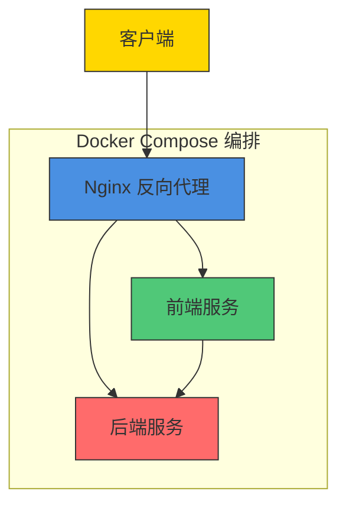
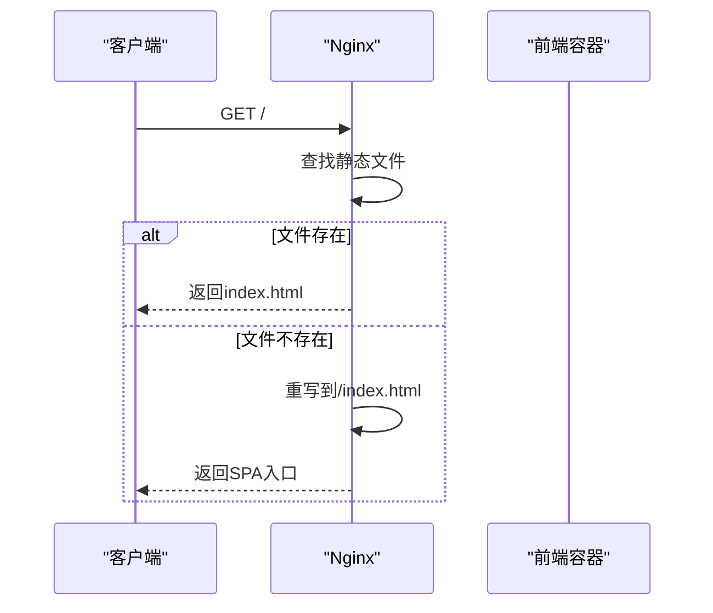
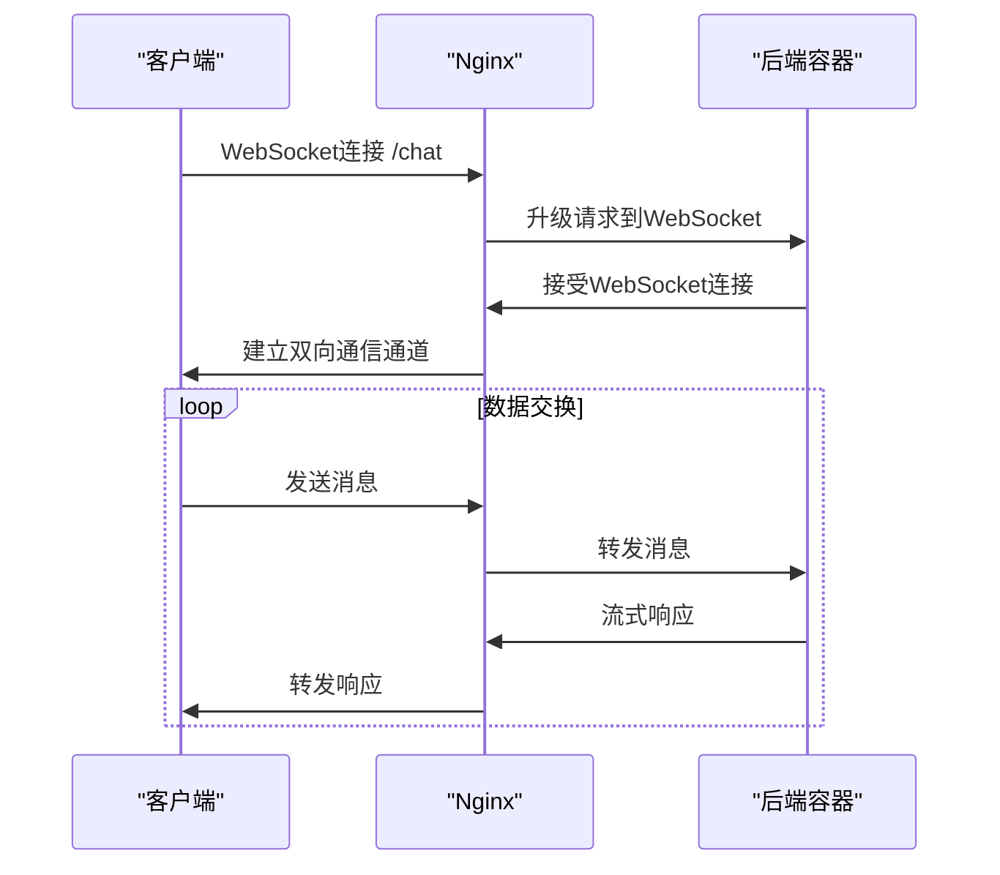
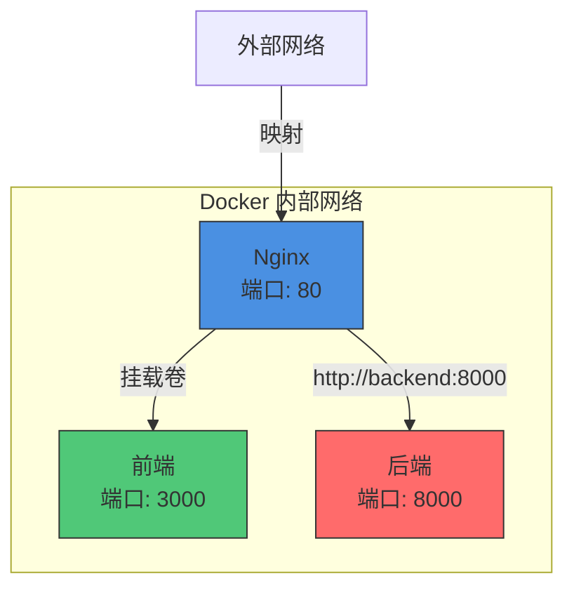
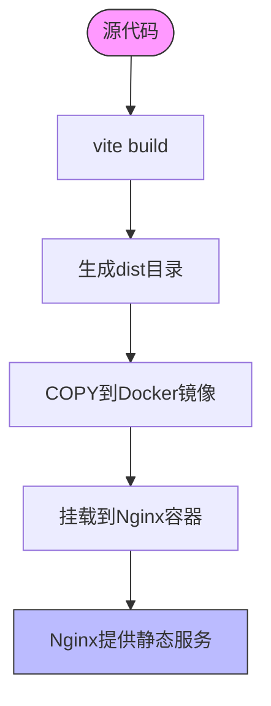
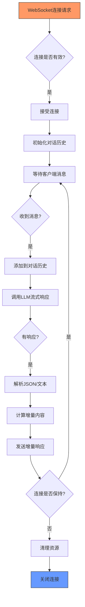
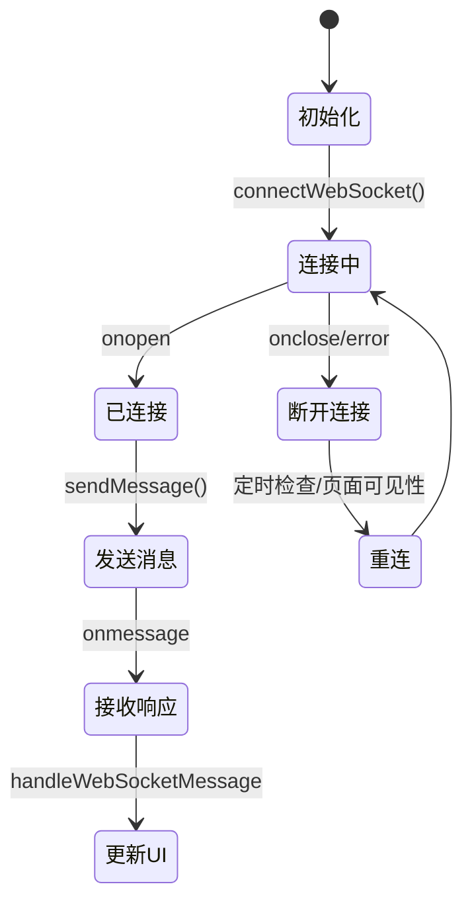
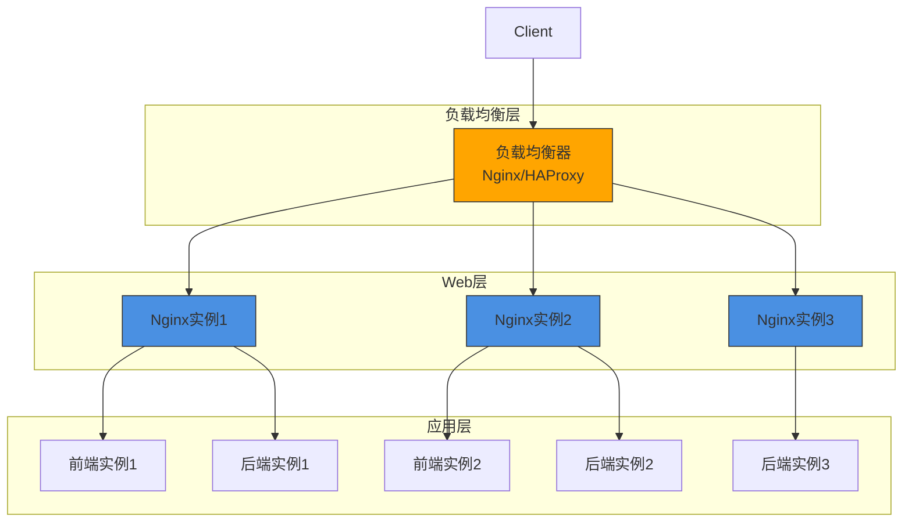

# Nginx反向代理配置

<cite>
**本文档引用的文件**  
- [nginx.conf](file://nginx/nginx.conf#L1-L26)
- [docker-compose.yml](file://docker-compose.yml#L1-L26)
- [app.py](file://backend/app.py#L1-L106)
- [useWebSocket.js](file://frontend/src/hooks/useWebSocket.js#L1-L192)
- [App.jsx](file://frontend/src/App.jsx#L1-L171)
- [Dockerfile](file://frontend/Dockerfile#L1-L9)
- [Dockerfile](file://backend/Dockerfile#L1-L9)
- [vite.config.js](file://frontend/vite.config.js#L1-L16)
</cite>

## 目录
1. [项目结构分析](#项目结构分析)
2. [Nginx核心配置解析](#nginx核心配置解析)
3. [反向代理与WebSocket支持](#反向代理与websocket支持)
4. [Docker容器通信机制](#docker容器通信机制)
5. [前端构建与静态资源处理](#前端构建与静态资源处理)
6. [后端WebSocket服务实现](#后端websocket服务实现)
7. [前端WebSocket连接管理](#前端websocket连接管理)
8. [运维配置建议](#运维配置建议)
9. [初学者指南](#初学者指南)
10. [专家级扩展方案](#专家级扩展方案)

## 项目结构分析

本项目采用典型的微服务架构，包含前端、后端和Nginx反向代理三个核心组件，通过Docker Compose进行容器编排。



**图示来源**  
- [docker-compose.yml](file://docker-compose.yml#L1-L26)

**本节来源**  
- [docker-compose.yml](file://docker-compose.yml#L1-L26)

## Nginx核心配置解析

Nginx配置文件定义了HTTP服务器的核心行为，包括上游服务器定义、端口监听和请求路由规则。

```nginx
events {}

http {
    upstream backend {
        server backend:8000;
    }

    server {
        listen 80;

        location / {
            root /usr/share/nginx/html;
            try_files $uri $uri/ /index.html;
        }

        location /chat {
            proxy_pass http://backend/chat;
            proxy_http_version 1.1;
            proxy_set_header Upgrade $http_upgrade;
            proxy_set_header Connection "upgrade";
            proxy_set_header Host $host;
            proxy_set_header X-Real-IP $remote_addr;
            proxy_set_header X-Forwarded-For $proxy_add_x_forwarded_for;
            proxy_set_header X-Forwarded-Proto $scheme;
        }
    }
}
```

**配置说明**：
- **upstream backend**: 定义名为"backend"的上游服务器组，指向Docker服务名为backend的容器的8000端口
- **server块**: 配置HTTP服务器实例
- **listen 80**: 监听80端口，处理HTTP请求
- **location /**: 处理根路径请求，提供前端静态资源
- **location /chat**: 处理/chat路径请求，代理到后端服务

**本节来源**  
- [nginx.conf](file://nginx/nginx.conf#L1-L26)

## 反向代理与WebSocket支持

Nginx在chat-mvp架构中扮演着关键的反向代理角色，负责请求路由和协议转换。

### 前端静态资源代理



**图示来源**  
- [nginx.conf](file://nginx/nginx.conf#L1-L26)

### WebSocket连接代理



**图示来源**  
- [nginx.conf](file://nginx/nginx.conf#L1-L26)
- [app.py](file://backend/app.py#L1-L106)

**本节来源**  
- [nginx.conf](file://nginx/nginx.conf#L1-L26)
- [app.py](file://backend/app.py#L1-L106)

## Docker容器通信机制

Docker Compose创建了一个内部网络，使各个服务能够通过服务名称相互通信。



**服务通信细节**：
- **Nginx到Backend**: 通过`backend:8000`直接访问，利用Docker DNS解析
- **Nginx到Frontend**: 通过挂载卷`./frontend/build:/usr/share/nginx/html`共享静态文件
- **外部访问**: 通过`80:80`端口映射，外部请求访问宿主机80端口

**本节来源**  
- [docker-compose.yml](file://docker-compose.yml#L1-L26)

## 前端构建与静态资源处理

前端应用使用Vite构建工具，通过Docker容器化部署。

### 构建流程分析



**关键配置**：
```javascript
// vite.config.js
export default defineConfig({
  plugins: [react()],
  server: {
    port: 3000,
    proxy: {
      '/api': {
        target: 'http://localhost:8000',
        changeOrigin: true,
        secure: false,
      }
    }
  }
})
```

**开发环境代理**：Vite开发服务器将/api请求代理到后端，避免CORS问题

**本节来源**  
- [vite.config.js](file://frontend/vite.config.js#L1-L16)
- [Dockerfile](file://frontend/Dockerfile#L1-L9)

## 后端WebSocket服务实现

后端使用FastAPI实现WebSocket服务，处理实时聊天请求。

### WebSocket端点逻辑



**代码关键点**：
```python
@app.websocket("/chat")
async def websocket_endpoint(websocket: WebSocket):
    await websocket.accept()
    history = []
    try:
        while True:
            data = await websocket.receive_text()
            # 处理用户消息
            user_message = {"role": "user", "content": data}
            history.append(user_message)
            
            # 流式响应
            full_response = ""
            async for chunk in llm.stream(history):
                delta_content = content[len(full_response):]
                if delta_content:
                    await websocket.send_text(delta_content)
                full_response = content
            history.append({"role": "assistant", "content": full_response})
    except Exception as e:
        logger.error(f"WebSocket error: {e}")
    finally:
        await websocket.close()
```

**本节来源**  
- [app.py](file://backend/app.py#L1-L106)

## 前端WebSocket连接管理

前端使用自定义Hook管理WebSocket连接，确保稳定可靠的实时通信。

### 连接管理逻辑



**关键功能**：
- **自动重连**: 每2秒检查连接状态，断线自动重连
- **页面可见性检测**: 页面从后台切换到前台时检查并重连
- **活跃会话管理**: 确保消息发送到正确的会话
- **错误处理**: 捕获并处理各种连接异常

**本节来源**  
- [useWebSocket.js](file://frontend/src/hooks/useWebSocket.js#L1-L192)

## 运维配置建议

为提升系统性能和安全性，建议进行以下配置优化。

### 性能优化配置

```nginx
# 启用Gzip压缩
gzip on;
gzip_vary on;
gzip_min_length 1024;
gzip_types text/plain text/css text/xml text/javascript application/javascript application/xml+rss application/json;

# 设置缓存策略
location ~* \.(js|css|png|jpg|jpeg|gif|ico|svg)$ {
    expires 1y;
    add_header Cache-Control "public, immutable";
}

# 限制请求速率
limit_req_zone $binary_remote_addr zone=api:10m rate=10r/s;
location /chat {
    limit_req zone=api burst=20 nodelay;
    proxy_pass http://backend/chat;
    # ... 其他代理配置
}
```

### SSL/TLS配置

```nginx
server {
    listen 443 ssl http2;
    server_name chat-mvp.example.com;
    
    ssl_certificate /etc/nginx/ssl/chat-mvp.crt;
    ssl_certificate_key /etc/nginx/ssl/chat-mvp.key;
    
    ssl_protocols TLSv1.2 TLSv1.3;
    ssl_ciphers ECDHE-RSA-AES256-GCM-SHA512:DHE-RSA-AES256-GCM-SHA512;
    ssl_prefer_server_ciphers off;
    
    # ... 其他配置
}
```

**本节来源**  
- [nginx.conf](file://nginx/nginx.conf#L1-L26)

## 初学者指南

### 反向代理基本概念

**反向代理**是一种服务器架构模式，位于客户端和后端服务器之间，接收客户端请求并将其转发到适当的后端服务器。

**工作原理**：
1. 客户端发送请求到反向代理服务器
2. 反向代理根据配置规则决定将请求转发到哪个后端服务器
3. 后端服务器处理请求并返回响应
4. 反向代理将响应返回给客户端

**主要优势**：
- **统一入口**: 所有请求通过单一入口点
- **负载均衡**: 可将请求分发到多个后端实例
- **安全隔离**: 隐藏后端服务器真实地址
- **协议转换**: 支持HTTP/HTTPS、WebSocket等协议转换

### WebSocket协议简介

**WebSocket**是一种在单个TCP连接上进行全双工通信的协议，特别适合实时应用。

**与HTTP对比**：
- **HTTP**: 请求-响应模式，每次通信需要建立新连接
- **WebSocket**: 持久连接，客户端和服务器可随时发送数据

**握手过程**：
1. 客户端发送HTTP升级请求
2. 服务器响应101状态码，协议升级为WebSocket
3. 建立双向通信通道

**本节来源**  
- [nginx.conf](file://nginx/nginx.conf#L1-L26)
- [app.py](file://backend/app.py#L1-L106)

## 专家级扩展方案

### 高可用性部署



### 负载均衡配置

```nginx
upstream backend_cluster {
    least_conn;
    server backend1:8000 weight=3;
    server backend2:8000 weight=2;
    server backend3:8000;
    keepalive 32;
}

upstream frontend_cluster {
    ip_hash;
    server frontend1:3000;
    server frontend2:3000;
}

server {
    listen 80;
    
    location / {
        proxy_pass http://frontend_cluster;
        # ... 其他配置
    }
    
    location /chat {
        proxy_pass http://backend_cluster/chat;
        proxy_http_version 1.1;
        proxy_set_header Upgrade $http_upgrade;
        proxy_set_header Connection "upgrade";
        # ... 其他头部
    }
}
```

**扩展策略**：
- **水平扩展**: 增加后端实例数量
- **会话保持**: 使用ip_hash确保WebSocket连接稳定性
- **健康检查**: 定期检查后端实例健康状态
- **自动伸缩**: 根据负载自动调整实例数量

**本节来源**  
- [nginx.conf](file://nginx/nginx.conf#L1-L26)
- [docker-compose.yml](file://docker-compose.yml#L1-L26)