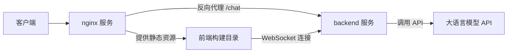
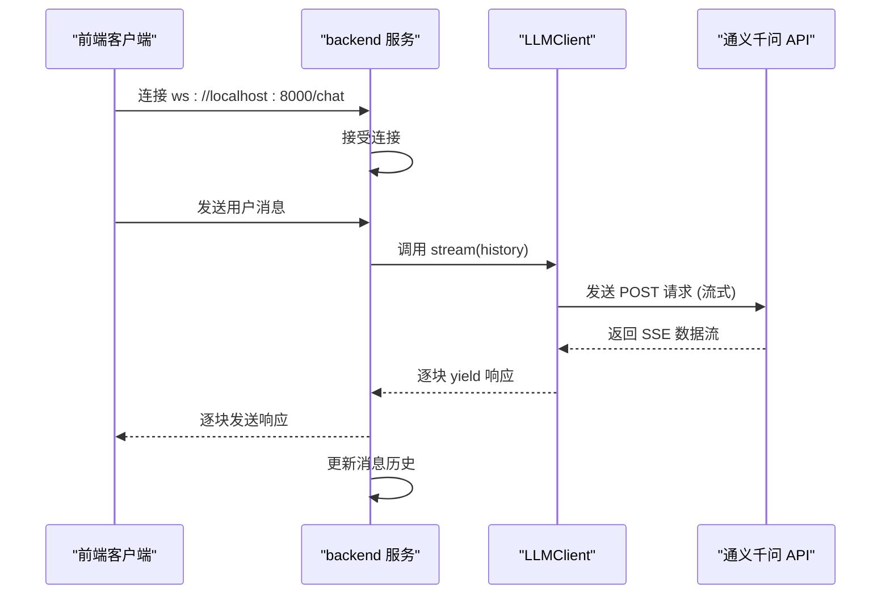
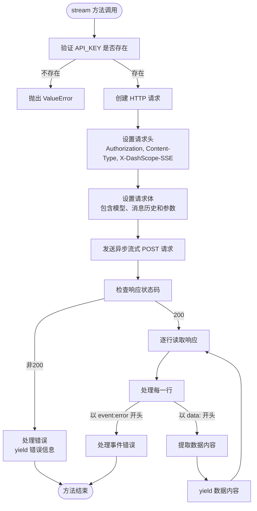
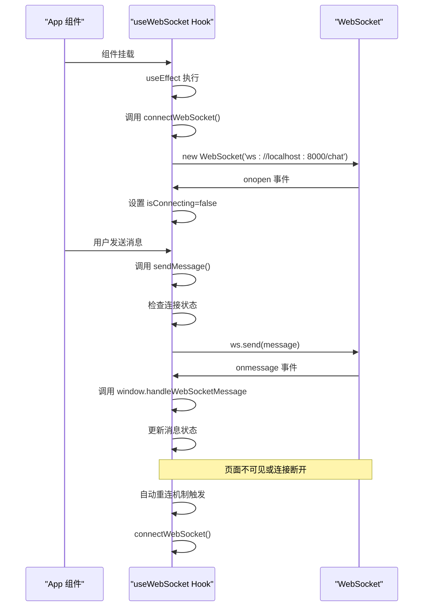
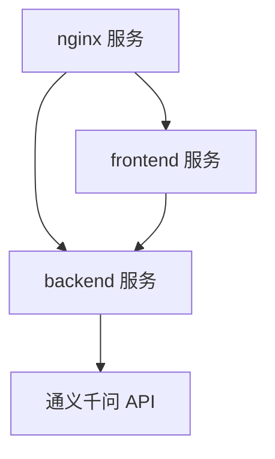

# 服务编排与依赖管理

<cite>
**本文档中引用的文件**   
- [docker-compose.yml](file://docker-compose.yml#L1-L26)
- [nginx.conf](file://nginx/nginx.conf#L1-L26)
- [app.py](file://backend/app.py#L1-L106)
- [llm_client.py](file://backend/llm_client.py#L1-L86)
- [App.jsx](file://frontend/src/App.jsx#L1-L171)
- [useWebSocket.js](file://frontend/src/hooks/useWebSocket.js#L1-L192)
- [API_SECURITY_GUIDE.md](file://API_SECURITY_GUIDE.md#L1-L127)
</cite>

## 目录
1. [项目结构](#项目结构)
2. [核心组件](#核心组件)
3. [架构概述](#架构概述)
4. [详细组件分析](#详细组件分析)
5. [依赖分析](#依赖分析)
6. [性能考虑](#性能考虑)
7. [故障排除指南](#故障排除指南)
8. [结论](#结论)

## 项目结构

本项目采用微服务架构，由三个主要服务组成：backend、frontend 和 nginx。backend 服务是基于 Python FastAPI 的后端应用，负责处理业务逻辑并与大语言模型 API 交互。frontend 服务是基于 React 的前端应用，提供用户界面。nginx 服务作为反向代理服务器，将前端和后端服务统一暴露给外部访问。

```mermaid
graph TB
subgraph "Docker Compose 编排"
Backend[backend 服务]
Frontend[frontend 服务]
Nginx[nginx 服务]
end
Nginx --> Backend
Nginx --> Frontend
Frontend --> Backend
Backend -.-> "Qwen API"
```

**图示来源**
- [docker-compose.yml](file://docker-compose.yml#L1-L26)

**本节来源**
- [docker-compose.yml](file://docker-compose.yml#L1-L26)

## 核心组件

项目的核心组件包括 backend 服务中的 WebSocket 服务器、LLM 客户端，以及 frontend 服务中的 WebSocket 管理 Hook 和主应用组件。backend 服务通过 FastAPI 实现了一个 WebSocket 端点 `/chat`，用于与前端进行实时双向通信。LLM 客户端封装了与阿里云通义千问 API 的交互逻辑，支持流式响应。frontend 服务使用自定义 Hook `useWebSocket` 管理 WebSocket 连接、重连和消息处理，确保了连接的稳定性和用户体验。

**本节来源**
- [app.py](file://backend/app.py#L1-L106)
- [llm_client.py](file://backend/llm_client.py#L1-L86)
- [useWebSocket.js](file://frontend/src/hooks/useWebSocket.js#L1-L192)

## 架构概述

系统采用前后端分离的微服务架构，通过 Docker Compose 进行服务编排。nginx 服务作为入口网关，监听 80 端口，将静态资源请求代理到前端构建目录，将 `/chat` 路径的 WebSocket 请求反向代理到 backend 服务。backend 服务在 8000 端口暴露 API，frontend 服务在 3000 端口提供开发服务器。服务间通过 `depends_on` 指令确保启动顺序，避免因服务未就绪导致的 502 错误。



**图示来源**
- [docker-compose.yml](file://docker-compose.yml#L1-L26)
- [nginx.conf](file://nginx/nginx.conf#L1-L26)

## 详细组件分析

### 后端服务分析

#### WebSocket 服务器实现
backend 服务使用 FastAPI 的 `@app.websocket` 装饰器定义了 `/chat` 端点。当客户端连接时，服务器接受连接并维护一个消息历史记录。服务器持续监听客户端消息，将用户消息添加到历史记录中，然后调用 LLM 客户端的流式方法获取响应。响应以增量方式通过 WebSocket 发送回客户端，实现流式输出效果。



**图示来源**
- [app.py](file://backend/app.py#L1-L106)
- [llm_client.py](file://backend/llm_client.py#L1-L86)

#### LLM 客户端实现
LLM 客户端封装了与阿里云通义千问 API 的交互。它在初始化时从环境变量 `API_KEY` 读取密钥，确保了密钥的安全性。`stream` 方法使用 `httpx.AsyncClient` 发起异步流式请求，设置 `X-DashScope-SSE: enable` 头以启用服务器发送事件（SSE）流式输出。该方法逐行读取响应，解析 SSE 格式的数据，并将内容块 `yield` 回调用者。



**图示来源**
- [llm_client.py](file://backend/llm_client.py#L1-L86)

**本节来源**
- [llm_client.py](file://backend/llm_client.py#L1-L86)

### 前端服务分析

#### WebSocket 管理 Hook
`useWebSocket` Hook 是前端与后端通信的核心。它使用 `useRef` 保存 WebSocket 实例和当前活跃会话 ID，使用 `useState` 管理连接和打字状态。`connectWebSocket` 函数负责创建和管理 WebSocket 连接，包含防重复连接和错误处理。`useEffect` 在组件挂载时启动连接，并设置定时器和页面可见性监听器来自动重连。



**图示来源**
- [useWebSocket.js](file://frontend/src/hooks/useWebSocket.js#L1-L192)

#### 主应用组件
`App` 组件是前端的入口点，它组合了 `Sidebar`、`Header`、`ChatBox` 和 `InputBar` 等 UI 组件。它通过 `useConversations` Hook 管理会话数据，通过 `useWebSocket` Hook 管理 WebSocket 连接。`useEffect` 钩子设置了 WebSocket 消息处理函数 `handleWebSocketMessage` 和 `handleStreamEnd`，这些函数被注册到全局 `window` 对象上，以便 `useWebSocket` Hook 能够调用它们来更新 UI。

**本节来源**
- [App.jsx](file://frontend/src/App.jsx#L1-L171)
- [useWebSocket.js](file://frontend/src/hooks/useWebSocket.js#L1-L192)

## 依赖分析

服务间的依赖关系通过 Docker Compose 的 `depends_on` 指令明确声明。`frontend` 服务依赖于 `backend`，确保前端在后端启动后再启动。`nginx` 服务依赖于 `backend` 和 `frontend`，确保反向代理在所有后端服务就绪后才启动。这种依赖关系避免了因服务启动顺序不当导致的 502 Bad Gateway 错误。此外，backend 服务依赖于外部的通义千问 API，通过环境变量 `API_KEY` 注入密钥。



**图示来源**
- [docker-compose.yml](file://docker-compose.yml#L1-L26)

**本节来源**
- [docker-compose.yml](file://docker-compose.yml#L1-L26)
- [API_SECURITY_GUIDE.md](file://API_SECURITY_GUIDE.md#L1-L127)

## 性能考虑

系统在设计上考虑了性能和用户体验。后端采用流式响应，避免了长时间等待完整响应，提升了用户感知速度。前端通过 `useWebSocket` Hook 实现了自动重连机制，增强了连接的鲁棒性。nginx 作为反向代理，可以缓存静态资源，减轻后端压力。然而，`allow_origins=["*"]` 的 CORS 配置在生产环境中可能存在安全风险，建议限制为特定域名。

## 故障排除指南

常见问题包括 API 密钥错误、WebSocket 连接失败和 502 错误。对于 API 密钥错误，检查 `API_KEY` 环境变量是否正确设置，参考 `API_SECURITY_GUIDE.md` 文档。对于 WebSocket 连接失败，检查 backend 服务是否正常运行，并确认 `useWebSocket.js` 中的连接地址是否正确。对于 502 错误，通常是由于 nginx 无法连接到 backend 服务，检查 `depends_on` 依赖关系和 backend 服务的日志。

**本节来源**
- [API_SECURITY_GUIDE.md](file://API_SECURITY_GUIDE.md#L1-L127)
- [useWebSocket.js](file://frontend/src/hooks/useWebSocket.js#L1-L192)

## 结论

本项目通过 Docker Compose 成功编排了 backend、frontend 和 nginx 三个服务，实现了清晰的职责分离和高效的通信机制。通过 `depends_on` 指令确保了正确的启动顺序，通过 nginx 实现了统一的入口和反向代理。后端的流式 WebSocket 服务器和前端的自动重连机制共同提供了流畅的用户体验。环境变量的使用保证了 API 密钥的安全性。整体架构清晰、可维护性强，为后续功能扩展奠定了良好基础。