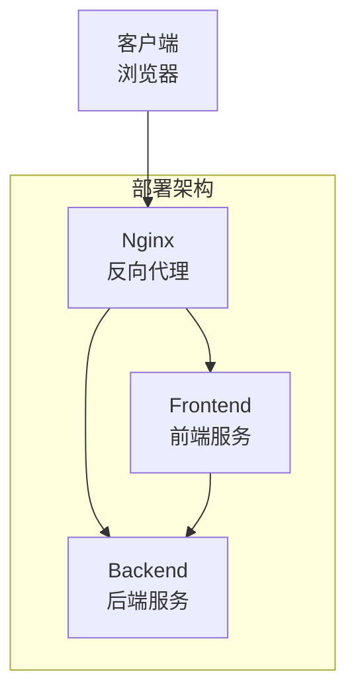
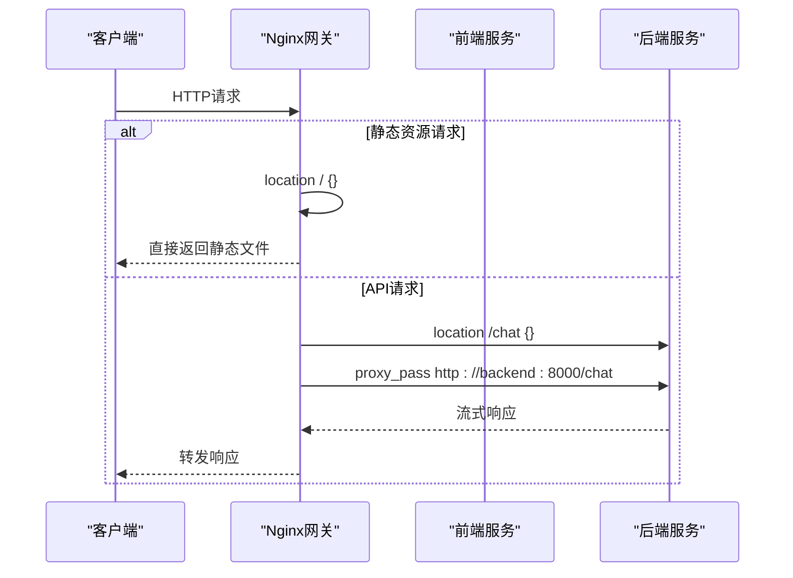
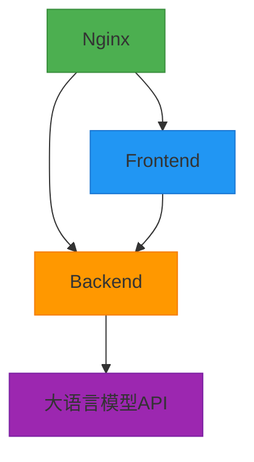
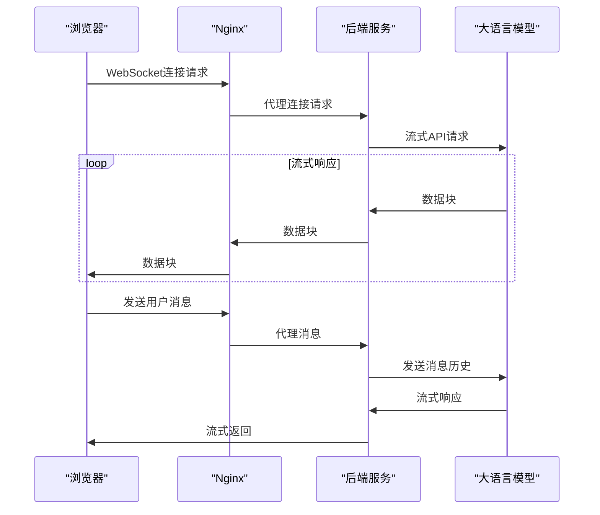
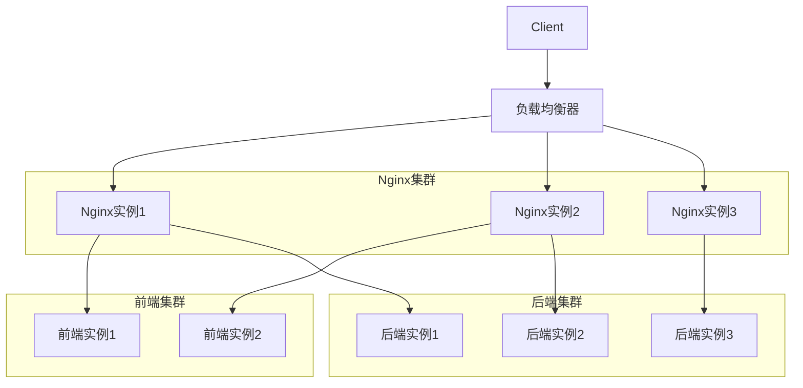

# 部署架构

<cite>
**本文档引用的文件**  
- [docker-compose.yml](file://docker-compose.yml#L1-L26)
- [backend/Dockerfile](file://backend/Dockerfile#L1-L9)
- [frontend/Dockerfile](file://frontend/Dockerfile#L1-L9)
- [nginx/nginx.conf](file://nginx/nginx.conf#L1-L26)
- [backend/app.py](file://backend/app.py#L1-L106)
- [backend/llm_client.py](file://backend/llm_client.py#L1-L86)
- [frontend/src/hooks/useWebSocket.js](file://frontend/src/hooks/useWebSocket.js#L1-L192)
- [frontend/src/App.jsx](file://frontend/src/App.jsx#L1-L171)
</cite>

## 目录
1. [项目结构](#项目结构)
2. [部署架构概述](#部署架构概述)
3. [服务配置分析](#服务配置分析)
4. [Nginx反向代理机制](#nginx反向代理机制)
5. [Docker镜像构建详解](#docker镜像构建详解)
6. [服务间通信与依赖](#服务间通信与依赖)
7. [WebSocket通信流程](#websocket通信流程)
8. [运维操作指南](#运维操作指南)
9. [架构可扩展性与优化建议](#架构可扩展性与优化建议)

## 项目结构

本项目采用模块化分层架构，主要由后端服务、前端应用和Nginx网关三大部分组成，通过Docker容器化部署实现环境隔离与快速部署。



**Diagram sources**  
- [docker-compose.yml](file://docker-compose.yml#L1-L26)

**Section sources**  
- [docker-compose.yml](file://docker-compose.yml#L1-L26)

## 部署架构概述

本项目采用基于Docker和Nginx的生产环境部署方案，构建了一个三层架构系统：

1. **接入层**：由Nginx容器担任反向代理服务器，监听80端口，统一对外提供服务
2. **应用层**：包含两个核心服务
   - 后端服务：基于FastAPI的Python应用，提供/chat WebSocket API
   - 前端服务：React应用，提供用户界面
3. **依赖管理**：通过docker-compose.yml定义服务依赖关系，确保启动顺序正确

该架构实现了静态资源与动态API的分离处理，提升了系统性能和安全性。

**Section sources**  
- [docker-compose.yml](file://docker-compose.yml#L1-L26)

## 服务配置分析

### 后端服务 (backend)

后端服务配置定义了FastAPI应用的容器化部署参数：

```yaml
backend:
  build: ./backend
  environment:
    - API_KEY=${API_KEY}
  ports:
    - "8000:8000"
```

- **构建指令**：从`./backend`目录构建镜像
- **环境变量**：通过`API_KEY`环境变量注入大模型API密钥
- **端口映射**：容器内8000端口映射到主机8000端口

### 前端服务 (frontend)

前端服务配置定义了React应用的容器化参数：

```yaml
frontend:
  build: ./frontend
  ports:
    - "3000:3000"
  depends_on:
    - backend
```

- **构建指令**：从`./frontend`目录构建镜像
- **端口映射**：容器内3000端口映射到主机3000端口
- **依赖关系**：依赖后端服务，确保后端先启动

### Nginx服务 (nginx)

Nginx服务配置定义了反向代理网关：

```yaml
nginx:
  image: nginx:alpine
  ports:
    - "80:80"
  volumes:
    - ./nginx/nginx.conf:/etc/nginx/nginx.conf
    - ./frontend/build:/usr/share/nginx/html
  depends_on:
    - backend
    - frontend
```

- **基础镜像**：使用轻量级`nginx:alpine`
- **端口映射**：80端口对外提供服务
- **卷挂载**：挂载自定义Nginx配置和前端构建产物
- **依赖关系**：依赖前后端服务

**Section sources**  
- [docker-compose.yml](file://docker-compose.yml#L1-L26)

## Nginx反向代理机制

Nginx配置文件实现了智能请求路由，将不同类型的请求分发到相应的后端服务。



**Diagram sources**  
- [nginx/nginx.conf](file://nginx/nginx.conf#L1-L26)

**Section sources**  
- [nginx/nginx.conf](file://nginx/nginx.conf#L1-L26)

### 静态资源处理

Nginx直接提供前端静态资源，提高访问效率：

```nginx
location / {
    root /usr/share/nginx/html;
    try_files $uri $uri/ /index.html;
}
```

- 根目录指向前端构建产物
- `try_files`指令实现前端路由的history模式支持

### API请求代理

Nginx将/chat请求代理到后端服务：

```nginx
location /chat {
    proxy_pass http://backend/chat;
    proxy_http_version 1.1;
    proxy_set_header Upgrade $http_upgrade;
    proxy_set_header Connection "upgrade";
    proxy_set_header Host $host;
    proxy_set_header X-Real-IP $remote_addr;
    proxy_set_header X-Forwarded-For $proxy_add_x_forwarded_for;
    proxy_set_header X-Forwarded-Proto $scheme;
}
```

- 支持WebSocket协议升级
- 传递客户端真实IP和协议信息
- 保持HTTP/1.1连接

## Docker镜像构建详解

### 后端Dockerfile

后端服务基于`python:3.11-slim`构建轻量级镜像：

```dockerfile
FROM python:3.11-slim

WORKDIR /app

COPY requirements.txt .
RUN pip install --no-cache-dir -r requirements.txt

COPY . .

CMD ["uvicorn", "app:app", "--host", "0.0.0.0", "--port", "8000"]
```

- 使用精简版Python基础镜像
- 分层构建优化缓存
- 无缓存安装Python依赖
- 暴露8000端口供外部访问

**Section sources**  
- [backend/Dockerfile](file://backend/Dockerfile#L1-L9)

### 前端Dockerfile

前端服务同样基于Python镜像构建，但实际应使用Nginx镜像：

```dockerfile
FROM python:3.11-slim

WORKDIR /app

COPY requirements.txt .
RUN pip install --no-cache-dir -r requirements.txt

COPY . .

CMD ["uvicorn", "app:app", "--host", "0.0.0.0", "--port", "8000"]
```

> **注意**：当前前端Dockerfile配置有误，应改为基于`nginx:alpine`的静态文件服务配置。

**Section sources**  
- [frontend/Dockerfile](file://frontend/Dockerfile#L1-L9)

## 服务间通信与依赖

### 依赖关系图



**Diagram sources**  
- [docker-compose.yml](file://docker-compose.yml#L1-L26)
- [backend/llm_client.py](file://backend/llm_client.py#L1-L86)

**Section sources**  
- [docker-compose.yml](file://docker-compose.yml#L1-L26)

### 依赖配置

通过`depends_on`确保服务启动顺序：

```yaml
frontend:
  depends_on:
    - backend

nginx:
  depends_on:
    - backend
    - frontend
```

- 前端服务等待后端启动完成
- Nginx等待前后端都启动完成
- 避免服务启动时的连接拒绝错误

## WebSocket通信流程

### 通信架构



**Diagram sources**  
- [backend/app.py](file://backend/app.py#L1-L106)
- [frontend/src/hooks/useWebSocket.js](file://frontend/src/hooks/useWebSocket.js#L1-L192)

**Section sources**  
- [backend/app.py](file://backend/app.py#L1-L106)
- [frontend/src/hooks/useWebSocket.js](file://frontend/src/hooks/useWebSocket.js#L1-L192)

### 后端WebSocket处理

后端使用FastAPI的WebSocket功能处理实时通信：

```python
@app.websocket("/chat")
async def websocket_endpoint(websocket: WebSocket):
    await websocket.accept()
    history = []
    try:
        while True:
            data = await websocket.receive_text()
            # 处理用户消息
            user_message = {"role": "user", "content": data}
            history.append(user_message)

            # 流式调用LLM
            full_response = ""
            async for chunk in llm.stream(history):
                # 增量发送响应
                delta_content = content[len(full_response):]
                if delta_content:
                    await websocket.send_text(delta_content)
                full_response = content
            history.append({"role": "assistant", "content": full_response})
    except Exception as e:
        logger.error(f"WebSocket error: {e}")
    finally:
        await websocket.close()
```

### 前端WebSocket管理

前端使用自定义Hook管理WebSocket连接：

```javascript
const useWebSocket = () => {
  const websocketRef = useRef(null);
  const activeConversationRef = useRef(null);

  const connectWebSocket = useCallback(() => {
    const ws = new WebSocket('ws://localhost:8000/chat');
    websocketRef.current = ws;
    
    ws.onmessage = (event) => {
      const chunk = event.data;
      // 通过全局函数处理消息
      if (window.handleWebSocketMessage) {
        window.handleWebSocketMessage(chunk, currentActiveId);
      }
    };
  }, []);

  const sendMessage = (message, conversationId) => {
    activeConversationRef.current = conversationId;
    websocketRef.current.send(message);
  };

  return {
    sendMessage,
    setMessageHandlers,
    getConnectionStatus
  };
};
```

## 运维操作指南

### 部署命令

```bash
# 启动服务（后台运行）
docker-compose up -d

# 查看服务状态
docker-compose ps

# 查看日志
docker-compose logs -f

# 停止服务
docker-compose down

# 重建并启动服务
docker-compose up -d --build
```

### 故障排查

```bash
# 检查容器状态
docker-compose ps

# 查看特定服务日志
docker-compose logs backend
docker-compose logs nginx

# 进入容器调试
docker-compose exec backend sh
docker-compose exec nginx sh

# 检查网络连接
docker-compose exec nginx ping backend
docker-compose exec nginx ping frontend
```

### 环境变量配置

创建`.env`文件配置API密钥：

```env
API_KEY=your_actual_api_key_here
```

**Section sources**  
- [docker-compose.yml](file://docker-compose.yml#L1-L26)
- [backend/app.py](file://backend/app.py#L1-L106)

## 架构可扩展性与优化建议

### 可扩展性设计



**Diagram sources**  
- [docker-compose.yml](file://docker-compose.yml#L1-L26)

### 优化建议

#### 初学者：容器化优势
- **环境一致性**：开发、测试、生产环境完全一致
- **依赖隔离**：各服务依赖独立，避免冲突
- **快速部署**：一键启动整个应用栈
- **易于扩展**：可通过docker-compose scale快速扩展实例

#### 高级用户：生产级优化
- **资源限制**：为容器设置CPU和内存限制
```yaml
services:
  backend:
    deploy:
      resources:
        limits:
          cpus: '0.5'
          memory: 512M
```

- **健康检查**：添加健康检查确保服务可用性
```yaml
services:
  backend:
    healthcheck:
      test: ["CMD", "curl", "-f", "http://localhost:8000/health"]
      interval: 30s
      timeout: 10s
      retries: 3
```

- **安全加固**：
  - 使用非root用户运行容器
  - 最小化基础镜像
  - 定期更新基础镜像
  - 配置HTTPS和WAF

- **CI/CD集成**：
  - 使用GitHub Actions或GitLab CI自动化构建
  - 镜像推送到私有仓库
  - 自动化部署到生产环境

**Section sources**  
- [docker-compose.yml](file://docker-compose.yml#L1-L26)